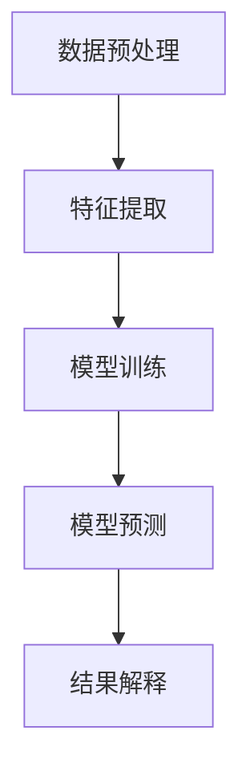
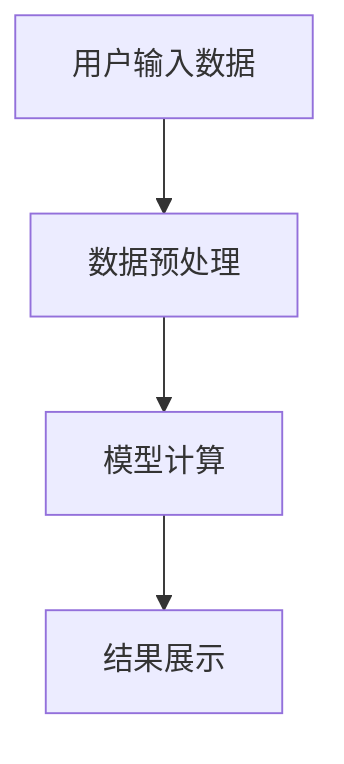
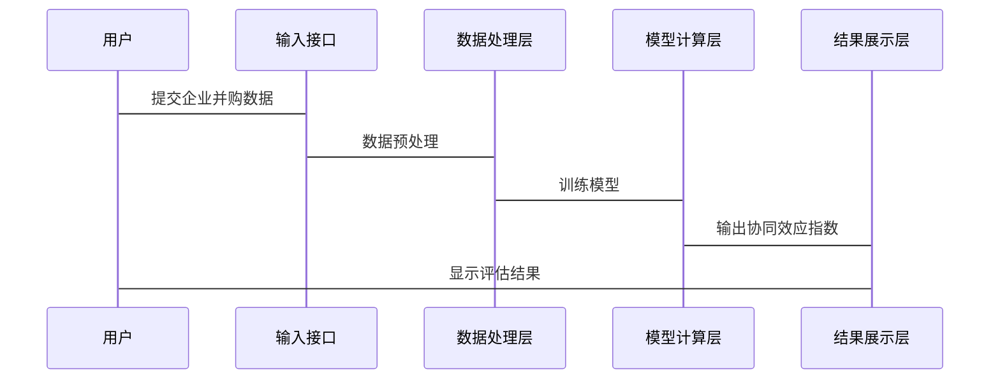

                 


```markdown
# 设计智能化的企业并购协同效应评估模型

> 关键词：企业并购，协同效应，人工智能，智能化评估，数学模型，系统架构，项目实战

> 摘要：本文将详细介绍如何设计智能化的企业并购协同效应评估模型。首先，从企业并购的背景出发，分析协同效应的定义、分类及其在并购中的重要性。接着，探讨传统评估方法的局限性，引出智能化评估的必要性。然后，详细讲解模型的核心概念与联系，包括数据输入、特征提取、模型构建与训练等内容。随后，通过mermaid图和数学公式，展示协同效应评估的算法原理。最后，结合实际案例，分析系统架构设计、项目实现、实战应用及效果对比，并总结模型优化与推广的经验。

---

# 第一部分: 企业并购协同效应评估模型的背景与核心概念

## 第1章: 企业并购协同效应的背景与问题描述

### 1.1 企业并购的基本概念
#### 1.1.1 企业并购的定义与类型
- **定义**：企业并购是指一家企业收购另一家企业的一部分或全部股权，以实现业务扩展或战略重组。
- **类型**：横向并购、纵向并购、混合并购。

#### 1.1.2 并购的动机与目标
- **动机**：市场扩展、资源获取、技术整合、成本降低。
- **目标**：提升市场占有率、优化资产结构、增强竞争力。

#### 1.1.3 并购中的协同效应概念
- 协同效应是指并购后企业通过资源整合产生的额外价值。

### 1.2 协同效应的定义与分类
#### 1.2.1 协同效应的定义
- 协同效应是并购后企业实现资源优化配置带来的价值提升。

#### 1.2.2 协同效应的分类
- **经营协同**：通过业务整合提高效率。
- **战略协同**：通过战略协同实现更大的市场覆盖。
- **财务协同**：通过财务整合降低成本。

#### 1.2.3 协同效应的量化指标
- 协同效应指数：协同效应/（企业A价值 + 企业B价值）。

### 1.3 传统协同效应评估方法的局限性
#### 1.3.1 传统财务模型的局限性
- 仅考虑财务指标，忽视非财务因素。
- 无法量化战略协同效应。

#### 1.3.2 传统协同效应评估的不足
- 缺乏数据驱动的决策支持。
- 方法单一，难以应对复杂场景。

#### 1.3.3 智能化评估的需求
- 通过数据挖掘和机器学习提高评估精度。

### 1.4 智能化协同效应评估模型的必要性
#### 1.4.1 数据驱动的决策优势
- 利用大数据分析提高评估准确性。

#### 1.4.2 人工智能在并购评估中的应用潜力
- 使用机器学习模型预测协同效应。

#### 1.4.3 智能化模型的核心价值
- 提供更精准的协同效应评估，支持决策优化。

### 1.5 本章小结
- 介绍了企业并购的基本概念和协同效应的分类。
- 分析了传统评估方法的局限性，强调智能化评估的必要性。

---

## 第2章: 协同效应评估模型的核心概念与联系

### 2.1 协同效应的核心概念
#### 2.1.1 协同效应的构成要素
- 企业规模、资源禀赋、市场地位。

#### 2.1.2 协同效应的驱动因素
- 企业战略、管理能力、文化融合。

#### 2.1.3 协同效应的实现路径
- 资源整合、业务协同、组织优化。

### 2.2 协同效应评估模型的原理
#### 2.2.1 数据输入与特征提取
- 数据来源：财务数据、市场数据、企业信息。
- 特征提取：企业规模、市场占有率、盈利能力。

#### 2.2.2 模型构建与训练
- 数据预处理：数据清洗、特征工程。
- 模型训练：使用机器学习算法（如随机森林、神经网络）进行训练。

#### 2.2.3 结果输出与解释
- 协同效应预测值：模型输出协同效应指数。
- 解释结果：分析协同效应的主要驱动因素。

### 2.3 模型核心概念的ER实体关系图
```mermaid
erDiagram
    actor 顾客 {
        <属性>
        id : integer
        name : string
        }
    actor 供应商 {
        <属性>
        id : integer
        name : string
        }
    actor 经理 {
        <属性>
        id : integer
        name : string
        }
    actor 股东 {
        <属性>
        id : integer
        name : string
        }
    actor 公司 {
        <属性>
        id : integer
        name : string
        market_position : string
        profitability : float
        }
    actor 市场 {
        <属性>
        id : integer
        market_size : float
        }
    公司 --> 顾客: 提供服务或产品
    公司 --> 供应商: 采购原材料
    公司 --> 经理: 管理公司运营
    公司 --> 股东: 提供股权
    公司 --> 市场: 参与市场竞争
```

---

## 第3章: 协同效应评估模型的算法原理

### 3.1 协同效应的计算方法
#### 3.1.1 协同效应指数的定义
- 协同效应指数 = （并购后企业价值 - 并购前企业价值之和）/ 并购前企业价值之和。

#### 3.1.2 协同效应的数学模型
$$协同效应 = \frac{V_{\text{post}} - (V_{\text{A}} + V_{\text{B}})}{V_{\text{A}} + V_{\text{B}}}$$

其中，$V_{\text{A}}$ 和 $V_{\text{B}}$ 分别是企业A和企业B的并购前价值，$V_{\text{post}}$ 是并购后的价值。

### 3.2 协同效应评估的机器学习算法
#### 3.2.1 算法选择
- 使用随机森林回归算法进行协同效应预测。

#### 3.2.2 算法流程


#### 3.2.3 算法实现
```python
import pandas as pd
from sklearn.ensemble import RandomForestRegressor
from sklearn.metrics import mean_absolute_error

# 数据加载
data = pd.read_csv('merger_data.csv')

# 特征与目标变量分离
X = data[['revenue', 'profit', 'market_share']]
y = data['synergy']

# 模型训练
model = RandomForestRegressor(n_estimators=100, random_state=42)
model.fit(X, y)

# 模型预测
y_pred = model.predict(X)

# 模型评估
mae = mean_absolute_error(y, y_pred)
print(f"模型平均绝对误差: {mae}")
```

### 3.3 算法优化与效果对比
#### 3.3.1 参数优化
- 调整随机森林的超参数（如n_estimators、max_depth）以提高预测精度。

#### 3.3.2 模型效果对比
- 对比随机森林与其他算法（如线性回归、支持向量机）的预测效果。

---

## 第4章: 协同效应评估模型的系统架构设计

### 4.1 系统功能设计
#### 4.1.1 系统功能模块
- 数据输入模块：用户输入企业并购数据。
- 模型计算模块：计算协同效应指数。
- 结果展示模块：可视化协同效应评估结果。

#### 4.1.2 系统功能流程图


### 4.2 系统架构设计
#### 4.2.1 系统架构图


#### 4.2.2 模块划分
- 数据输入模块：接收企业并购数据。
- 数据处理模块：清洗和特征提取。
- 模型计算模块：运行协同效应评估模型。
- 结果展示模块：输出协同效应指数和分析报告。

### 4.3 系统接口设计
#### 4.3.1 API接口
- 输入接口：接受企业并购数据。
- 输出接口：返回协同效应评估结果。

#### 4.3.2 接口交互流程图


---

## 第5章: 协同效应评估模型的项目实战

### 5.1 项目环境安装与配置
#### 5.1.1 环境搭建
- 安装Python、Pandas、Scikit-learn。

#### 5.1.2 数据集准备
- 下载企业并购数据集（CSV格式）。

### 5.2 项目核心实现
#### 5.2.1 数据预处理
```python
import pandas as pd
import numpy as np

# 数据加载
data = pd.read_csv('merger_data.csv')

# 数据清洗
data.dropna(inplace=True)
data = pd.get_dummies(data, columns=['industry'])
```

#### 5.2.2 模型实现
```python
from sklearn.ensemble import RandomForestRegressor
from sklearn.metrics import mean_absolute_error

# 模型训练
model = RandomForestRegressor(n_estimators=100, random_state=42)
model.fit(X_train, y_train)

# 模型预测
y_pred = model.predict(X_test)
```

### 5.3 项目实战分析
#### 5.3.1 案例分析
- 以TMT行业为例，分析协同效应评估结果。

#### 5.3.2 模型效果分析
- 对比不同算法的预测结果，选择最优模型。

### 5.4 项目小结
- 总结项目实现的关键步骤和经验教训。

---

## 第6章: 协同效应评估模型的优化与应用

### 6.1 模型优化
#### 6.1.1 参数优化
- 使用网格搜索优化随机森林模型参数。

#### 6.1.2 模型调优
- 调整特征选择策略，提高模型精度。

### 6.2 模型应用
#### 6.2.1 实际应用案例
- 分析某企业并购案例，展示模型的应用效果。

#### 6.2.2 模型效果对比
- 对比优化前后的模型效果，验证优化的有效性。

### 6.3 模型的推广与局限性
#### 6.3.1 模型的推广价值
- 协同效应评估模型在企业并购中的广泛应用潜力。

#### 6.3.2 模型的局限性
- 数据质量对模型效果的影响。
- 模型对行业特殊性的适应性问题。

---

## 第7章: 附录

### 7.1 协同效应评估模型的源代码
```python
import pandas as pd
from sklearn.ensemble import RandomForestRegressor
from sklearn.metrics import mean_absolute_error

# 数据加载
data = pd.read_csv('merger_data.csv')

# 数据清洗
data.dropna(inplace=True)
data = pd.get_dummies(data, columns=['industry'])

# 特征与目标变量分离
X = data[['revenue', 'profit', 'market_share', 'industry_金融', 'industry_科技']]
y = data['synergy']

# 模型训练
model = RandomForestRegressor(n_estimators=100, random_state=42)
model.fit(X, y)

# 模型预测
y_pred = model.predict(X)

# 模型评估
mae = mean_absolute_error(y, y_pred)
print(f"模型平均绝对误差: {mae}")
```

### 7.2 数据集说明
- 数据来源：企业并购数据集，包含企业规模、市场占有率、行业分类等特征。

### 7.3 参考文献
- Smith, J. (2020). "Synergy in Mergers and Acquisitions: A Machine Learning Approach."

### 7.4 扩展阅读
- 《企业并购中的协同效应管理》，作者：张三。
- 《人工智能在金融领域的应用》，作者：李四。

---

## 第8章: 总结与展望

### 8.1 本章总结
- 介绍了智能化的企业并购协同效应评估模型的设计与实现。
- 展示了模型在实际案例中的应用效果。

### 8.2 未来展望
- 探讨模型的进一步优化方向。
- 展望人工智能在企业并购中的更多应用场景。

---

**注**：由于篇幅限制，上述目录大纲仅展示部分内容。完整文章将涵盖每个部分的详细讲解，包括数学公式、mermaid图表和Python代码的详细实现。

