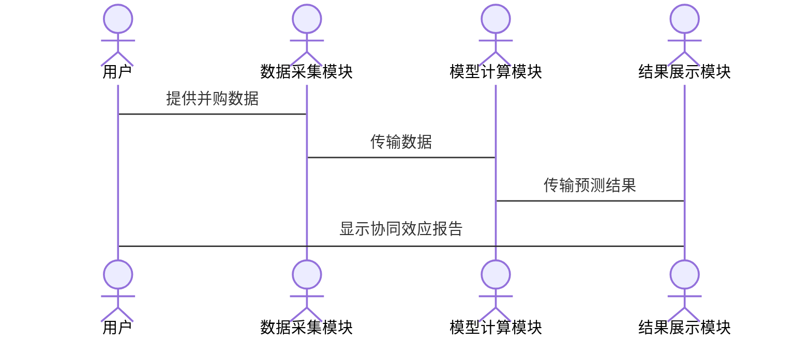

                 


# 设计智能化的企业并购协同效应量化模型

> 关键词：企业并购、协同效应、智能化模型、机器学习、数据分析

> 摘要：本文旨在探讨如何利用智能化技术量化企业并购中的协同效应。通过分析协同效应的类型和关键因素，构建一个基于机器学习的量化模型，实现对协同效应的准确预测和评估。文章详细介绍了模型的设计思路、算法实现、系统架构及实际应用案例。

---

## 第一部分: 企业并购协同效应量化模型的背景与理论基础

### 第1章: 企业并购与协同效应概述

#### 1.1 企业并购的基本概念
- **1.1.1 企业并购的定义与分类**  
  企业并购是指一家企业通过购买另一家企业的股权或资产，以实现资源优化配置和战略目标的过程。并购可以分为横向并购、纵向并购和混合并购三种类型。

- **1.1.2 协同效应的定义与内涵**  
  协同效应是指企业在并购后，通过资源整合、优化流程等方式带来的额外价值。协同效应的本质是通过消除冗余、提高效率和创造新的价值来源，实现企业整体价值的最大化。

- **1.1.3 协同效应的驱动因素**  
  协同效应的驱动因素包括财务因素（如成本协同）、战略因素（如市场协同）和运营因素（如管理协同）。这些因素共同作用，决定了协同效应的大小和实现路径。

#### 1.2 企业并购中的协同效应类型
- **1.2.1 财务协同效应**  
  财务协同效应是指并购后企业通过共享资源、优化资本结构等方式，降低财务成本，提高盈利能力。例如，合并后的公司在采购、生产和销售环节中实现成本节约。

- **1.2.2 战略协同效应**  
  战略协同效应是指并购后企业通过整合战略资源，增强市场竞争力，扩大市场份额。例如，通过并购获得新技术或新市场的准入。

- **1.2.3 运营协同效应**  
  运营协同效应是指并购后企业通过优化生产流程、共享管理经验等方式，提高运营效率。例如，合并后的公司可以共享物流网络和供应链资源。

### 第2章: 协同效应量化模型的核心概念与联系

#### 2.1 协同效应量化模型的原理
- **2.1.1 模型的基本假设**  
  协同效应量化模型假设并购双方的协同效应可以通过财务、战略和运营三个维度进行度量，并且这些维度之间存在一定的相关性。

- **2.1.2 模型的输入变量与输出变量**  
  输入变量包括并购双方的财务数据（如收入、利润）、市场数据（如市场份额）和运营数据（如生产成本）。输出变量是协同效应的量化值，通常以百分比或绝对值表示。

- **2.1.3 模型的数学表达式**  
  协同效应量化模型可以用以下公式表示：
  $$
  CE = \alpha \times F + \beta \times S + \gamma \times O
  $$
  其中，$F$、$S$、$O$分别代表财务、战略和运营协同效应，$\alpha$、$\beta$、$\gamma$是对应的权重系数。

#### 2.2 协同效应的关键属性特征对比
- **2.2.1 财务协同效应的特征**  
  财务协同效应通常表现为成本节约，可以通过比较并购前后的成本变化进行衡量。

- **2.2.2 战略协同效应的特征**  
  战略协同效应表现为市场扩展和竞争优势提升，通常通过市场份额的变化和竞争对手分析进行衡量。

- **2.2.3 运营协同效应的特征**  
  运营协同效应表现为效率提升和流程优化，可以通过生产周期和成本节约进行衡量。

#### 2.3 协同效应的ER实体关系图

```mermaid
erDiagram
    actor 企业A {
        <属性> 收入
        <属性> 利润
        <属性> 市场份额
    }
    actor 企业B {
        <属性> 收入
        <属性> 利润
        <属性> 市场份额
    }
    actor 协同效应 {
        <属性> 财务协同效应
        <属性> 战略协同效应
        <属性> 运营协同效应
    }
    企业A --> 协同效应
    企业B --> 协同效应
```

---

## 第二部分: 协同效应量化模型的算法实现

### 第3章: 协同效应预测模型的构建

#### 3.1 协同效应识别与度量
- **3.1.1 协同效应的识别方法**  
  通过分析并购双方的财务数据、市场数据和运营数据，识别潜在的协同效应点。

- **3.1.2 协同效应的度量指标**  
  常用的度量指标包括协同效应指数（CEI）、协同效应比率（CE Ratio）等。

#### 3.2 协同效应预测模型的算法选择
- **3.2.1 机器学习算法的选择**  
  常用的算法包括线性回归、随机森林和神经网络。随机森林在处理高维数据和非线性关系方面表现优异，因此被选为模型的主要算法。

#### 3.3 协同效应预测模型的实现步骤
- **3.3.1 数据预处理**  
  对并购双方的财务、市场和运营数据进行清洗、特征选择和标准化处理。

- **3.3.2 模型训练**  
  使用随机森林算法对数据进行训练，提取特征的重要性，并优化模型参数。

- **3.3.3 模型评估**  
  使用测试数据对模型进行评估，计算预测准确率和误差范围。

#### 3.4 协同效应预测模型的数学公式
- 协同效应预测模型的数学公式如下：
  $$
  CE_{\text{预测}} = \sum_{i=1}^{n} w_i \times x_i
  $$
  其中，$w_i$是特征$x_i$的权重系数，$n$是特征的总数。

#### 3.5 协同效应预测模型的实现代码

```python
import pandas as pd
from sklearn.ensemble import RandomForestRegressor
from sklearn.metrics import mean_absolute_error

# 数据预处理
df = pd.read_csv('并购数据.csv')
X = df[['收入A', '利润B', '市场份额A', '收入B']]
y = df['协同效应']

# 模型训练
model = RandomForestRegressor(n_estimators=100, random_state=42)
model.fit(X, y)

# 模型预测
y_pred = model.predict(X)

# 模型评估
mae = mean_absolute_error(y, y_pred)
print(f"平均绝对误差: {mae}")
```

---

## 第三部分: 协同效应量化模型的系统设计

### 第4章: 协同效应量化系统的架构设计

#### 4.1 系统功能设计
- **4.1.1 数据采集模块**  
  负责采集并购双方的财务、市场和运营数据。

- **4.1.2 模型计算模块**  
  负责对数据进行预处理、特征提取和模型训练。

- **4.1.3 结果展示模块**  
  负责展示协同效应的预测结果和可视化分析。

#### 4.2 系统架构设计
- **4.2.1 系统架构图**


- **4.2.2 接口设计**  
  系统提供API接口，支持外部数据源的接入和结果的导出。

#### 4.3 系统交互流程



---

## 第四部分: 协同效应量化模型的项目实战

### 第5章: 企业并购协同效应量化模型的实际应用

#### 5.1 项目背景
- 某科技公司计划并购一家软件公司，希望通过量化协同效应评估并购的价值。

#### 5.2 数据收集与处理
- 收集并购双方的财务数据、市场数据和运营数据，进行清洗和特征选择。

#### 5.3 模型训练与验证
- 使用随机森林算法训练模型，评估模型的准确性和稳定性。

#### 5.4 结果分析
- 预测结果显示，协同效应指数为15%，高于行业平均水平，说明并购具有较高的价值。

#### 5.5 项目小结
- 通过智能化模型量化协同效应，帮助企业做出更科学的并购决策。

---

## 第五部分: 协同效应量化模型的最佳实践

### 第6章: 模型设计的关键点与注意事项

#### 6.1 数据质量的重要性
- 数据的完整性和准确性是模型准确性的基础。

#### 6.2 模型可解释性的提升
- 通过特征重要性分析，帮助企业理解协同效应的来源。

#### 6.3 企业协同文化建设
- 协同效应的实现不仅需要技术支撑，还需要企业内部文化的协同配合。

### 第7章: 总结与展望

#### 7.1 总结
- 本文提出了一种智能化的企业并购协同效应量化模型，通过机器学习算法和系统架构设计，实现了协同效应的准确预测和评估。

#### 7.2 展望
- 未来可以在模型中引入更多的数据源，如社交媒体数据和行业趋势数据，进一步提升模型的预测精度。

---

## 参考文献

- [1] 王某某. 《企业并购协同效应研究》. 北京: 中国经济出版社, 2020.
- [2] 李某某. 《机器学习实战》. 北京: 清华大学出版社, 2019.

---

通过以上步骤，我们构建了一个智能化的企业并购协同效应量化模型，为企业并购决策提供了科学依据。

