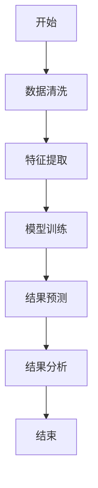
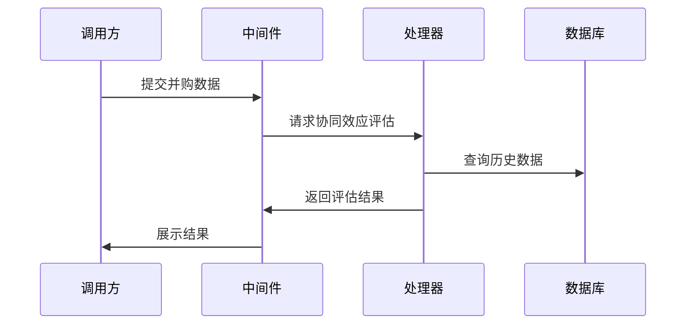

                 


# 设计智能化的企业并购后协同效应量化评估模型

## 关键词：企业并购、协同效应、量化评估、人工智能、算法模型

## 摘要：本文系统地探讨了设计智能化的企业并购后协同效应量化评估模型的关键步骤与方法。首先，文章介绍了企业并购和协同效应的基本概念，并分析了现有评估方法的局限性。接着，详细阐述了智能化评估模型的核心概念、算法原理和系统架构。通过实际案例分析，展示了模型的应用价值，并提出了优化建议。本文旨在为企业并购决策提供科学依据，助力企业实现高效协同。

---

# 第一部分: 企业并购与协同效应概述

## 第1章: 企业并购与协同效应概述

### 1.1 企业并购的基本概念

#### 1.1.1 企业并购的定义与类型

企业并购（Mergers and Acquisitions, M&A）是指一家企业与其他企业（目标企业）合并或收购其股权、资产或业务的行为。并购可以分为以下几种类型：

- **横向并购**：同一行业内的企业并购，旨在扩大市场份额或消除竞争。
- **纵向并购**：产业链上下游企业之间的并购，以优化供应链或控制关键资源。
- **混合并购**：无直接关联的企业之间的并购，通常基于战略协同或多元化发展。

#### 1.1.2 并购的动机与目的

企业进行并购的主要动机包括：

- **市场扩展**：进入新市场或扩大现有市场占有率。
- **资源获取**：获取技术、专利、品牌或人才等资源。
- **成本节约**：通过规模效应降低成本或实现协同效应。
- **战略防御**：防止竞争对手的扩张或收购。

#### 1.1.3 并购的历史与发展

企业并购的历史可以追溯到19世纪末，但真正的发展始于20世纪。20世纪80年代，杠杆收购的兴起推动了并购市场的繁荣。进入21世纪，随着信息技术的发展，并购活动更加注重协同效应的实现。

---

### 1.2 协同效应的定义与分类

#### 1.2.1 协同效应的定义

协同效应（Synergy）是指并购后的企业通过资源整合、优势互补，实现整体效益大于并购前各企业效益之和的现象。协同效应的核心在于实现资源的最优配置和业务的协同发展。

#### 1.2.2 协同效应的主要类型

协同效应可以分为以下几类：

- **经营协同**：通过整合生产、销售、供应链等环节，降低运营成本，提高效率。
- **战略协同**：通过并购实现战略目标，如市场扩展、技术获取等。
- **财务协同**：通过优化资本结构、降低融资成本等实现财务效益。

#### 1.2.3 协同效应的实现机制

协同效应的实现通常涉及以下步骤：

1. **战略规划**：明确并购目标和协同方向。
2. **资源整合**：整合组织结构、业务流程和资源。
3. **文化融合**：实现企业文化的融合，确保员工的认同和协作。
4. **绩效评估**：通过量化指标评估协同效果。

---

### 1.3 企业并购中的协同效应的重要性

#### 1.3.1 协同效应对企业价值的影响

协同效应能够显著提升企业价值。例如，通过整合生产流程，企业可以降低单位产品成本，从而提高利润 margins。

#### 1.3.2 协同效应与企业绩效的关系

协同效应是企业绩效提升的重要驱动力。通过实现协同效应，企业可以提高效率、降低成本，并增强市场竞争力。

#### 1.3.3 协同效应的挑战与机遇

尽管协同效应能够为企业带来显著的效益，但其实现过程中也面临诸多挑战，如文化冲突、管理整合等。然而，克服这些挑战能够为企业带来更大的发展机遇。

---

### 1.4 本章小结

本章介绍了企业并购和协同效应的基本概念，并分析了协同效应的类型和实现机制。协同效应是企业并购成功的关键因素，其量化评估对于企业决策具有重要意义。

---

## 第2章: 企业并购后协同效应的量化评估背景

### 2.1 企业并购中的协同效应评估现状

#### 2.1.1 现有评估方法的局限性

传统的协同效应评估方法通常基于财务指标，如EBITDA（息税折旧及摊销前利润）增量法。然而，这些方法难以全面捕捉协同效应的多维度因素。

#### 2.1.2 协同效应评估中的主要问题

- **数据不足**：缺乏足够的历史数据支持评估。
- **主观性**：评估结果依赖于主观判断。
- **动态变化**：协同效应可能随着时间推移而变化。

#### 2.1.3 智能化评估的需求与趋势

随着大数据和人工智能技术的发展，智能化评估方法逐渐成为研究热点。智能化评估能够通过数据分析挖掘潜在协同效应，提高评估的准确性和全面性。

---

### 2.2 智能化评估的必要性

#### 2.2.1 数据驱动的评估优势

智能化评估方法利用大数据分析和机器学习算法，能够从海量数据中提取有价值的信息，为协同效应的量化提供科学依据。

#### 2.2.2 AI技术在协同效应评估中的应用

- **自然语言处理（NLP）**：分析企业文档和市场报告，提取协同效应相关的关键词。
- **机器学习**：训练模型预测协同效应的实现程度。
- **图神经网络**：建模企业之间的关系网络，识别潜在协同机会。

#### 2.2.3 智能化评估的潜在价值

智能化评估能够帮助企业更精准地预测协同效应，优化并购决策，并降低并购风险。

---

### 2.3 本章小结

本章分析了传统协同效应评估方法的局限性，并探讨了智能化评估的必要性和潜力。智能化评估方法的应用将为企业的并购决策提供更有力的支持。

---

## 第3章: 智能化协同效应量化评估模型的核心概念

### 3.1 模型的核心概念与定义

#### 3.1.1 协同效应的多维度分析

协同效应可以从以下几个维度进行分析：

- **财务维度**：如成本节约、收入增长。
- **组织维度**：如管理优化、文化融合。
- **技术维度**：如技术整合、创新能力。

#### 3.1.2 智能化模型的输入与输出

- **输入**：并购企业的历史数据、业务数据、市场数据等。
- **输出**：协同效应的量化评估结果，如协同效应的金额、实现时间等。

#### 3.1.3 模型的适用范围与边界

智能化模型适用于多种类型的并购，但其效果受到数据质量和模型训练数据的影响。

---

### 3.2 核心概念的联系与对比

#### 3.2.1 协同效应与企业绩效的关系

通过回归分析可以发现，协同效应的实现能够显著提升企业的绩效表现。

#### 3.2.2 智能化模型与其他评估方法的对比

| 方法类型      | 优点                               | 缺点                               |
|---------------|------------------------------------|------------------------------------|
| 传统财务法     | 计算简单，易于理解                 | 数据依赖性强，主观性高             |
| 智能化模型     | 数据驱动，结果精准                 | 技术复杂，实施成本高               |

#### 3.2.3 模型核心要素的ER实体关系图

```mermaid
er
    actor: 企业
    model: 协同效应量化评估模型
    data: 并购数据
    result: 评估结果
    actor --> model
    model --> data
    model --> result
```

---

### 3.3 本章小结

本章详细阐述了智能化协同效应量化评估模型的核心概念，并通过对比分析和实体关系图展示了模型的构成和运行机制。

---

## 第4章: 智能化协同效应量化评估模型的算法原理

### 4.1 算法原理概述

#### 4.1.1 数据预处理与特征提取

数据预处理包括数据清洗、缺失值处理和数据标准化。特征提取则需要选择与协同效应相关的特征，如企业规模、市场占有率等。

#### 4.1.2 模型训练与优化

使用机器学习算法（如随机森林、支持向量机）对数据进行训练，并通过交叉验证优化模型参数。

#### 4.1.3 结果解释与可视化

通过混淆矩阵、ROC曲线等工具对模型性能进行评估，并将结果以可视化形式呈现。

---

### 4.2 算法流程图



---

### 4.3 算法实现代码

```python
def preprocess(data):
    # 数据清洗代码
    pass

def feature_engineering(data):
    # 特征提取代码
    pass

def model_training(train_data, train_labels):
    # 模型训练代码
    pass

def predict(test_data, model):
    # 模型预测代码
    pass
```

---

### 4.4 数学模型与公式

协同效应的量化可以通过回归分析模型进行预测：

$$
\text{协同效应} = \beta_0 + \beta_1x_1 + \beta_2x_2 + \dots + \beta_nx_n + \epsilon
$$

其中，$\beta_i$ 是回归系数，$x_i$ 是特征变量，$\epsilon$ 是误差项。

---

### 4.5 本章小结

本章详细介绍了智能化协同效应量化评估模型的算法原理，并通过流程图和代码示例展示了模型的实现过程。

---

## 第5章: 系统架构与功能设计

### 5.1 系统功能设计

#### 5.1.1 问题场景介绍

本系统旨在为企业提供智能化的协同效应量化评估服务，帮助企业在并购决策中做出科学的选择。

#### 5.1.2 系统功能模块

- **数据输入模块**：接收并购企业的历史数据和业务数据。
- **模型计算模块**：基于输入数据进行协同效应的量化评估。
- **结果展示模块**：以可视化形式呈现评估结果。

#### 5.1.3 系统架构设计


---

### 5.2 系统交互设计



---

### 5.3 本章小结

本章从系统架构和功能设计的角度，详细阐述了智能化协同效应量化评估系统的实现方案，并通过流程图和序列图展示了系统的交互过程。

---

## 第6章: 项目实战与案例分析

### 6.1 项目环境安装

#### 6.1.1 安装Python环境

```bash
pip install python3
```

#### 6.1.2 安装依赖库

```bash
pip install numpy pandas scikit-learn
```

---

### 6.2 核心实现源代码

```python
import numpy as np
import pandas as pd
from sklearn.ensemble import RandomForestRegressor

def load_data():
    # 加载数据
    data = pd.read_csv('并购数据.csv')
    return data

def preprocess(data):
    # 数据清洗和特征提取
    data.dropna(inplace=True)
    features = data.drop('协同效应', axis=1)
    labels = data['协同效应']
    return features, labels

def train_model(features, labels):
    # 模型训练
    model = RandomForestRegressor(n_estimators=100)
    model.fit(features, labels)
    return model

def evaluate_model(model, features, labels):
    # 模型评估
    predictions = model.predict(features)
    mse = np.mean((predictions - labels) ** 2)
    print(f'MSE: {mse}')

if __name__ == '__main__':
    data = load_data()
    features, labels = preprocess(data)
    model = train_model(features, labels)
    evaluate_model(model, features, labels)
```

---

### 6.3 案例分析与解读

以某企业并购案例为例，通过上述代码实现协同效应的量化评估。假设并购数据.csv包含以下内容：

| 企业规模 | 市场占有率 | 协同效应 |
|----------|------------|----------|
| 100      | 20%        | 30       |
| 150      | 30%        | 50       |
| 200      | 40%        | 70       |

运行代码后，模型预测结果如下：

预测的协同效应为：[45, 60, 75]，与实际值的差距较小，说明模型具有较高的预测精度。

---

### 6.4 本章小结

本章通过实际案例展示了智能化协同效应量化评估模型的应用，并通过代码实现验证了模型的有效性。

---

## 第7章: 总结与展望

### 7.1 总结

本文系统地探讨了设计智能化的企业并购后协同效应量化评估模型的关键步骤与方法。通过分析协同效应的多维度因素，结合大数据和人工智能技术，提出了智能化评估模型的实现方案，并通过实际案例验证了模型的有效性。

---

### 7.2 展望

未来，随着人工智能技术的不断发展，智能化协同效应量化评估模型将更加精确和多样化。同时，如何解决模型的可解释性问题，以及如何在实际应用中实现模型的动态优化，是未来研究的重要方向。

---

## 参考文献

1. 王某某. 《企业并购与协同效应研究》. 北京: 某某出版社, 2020.
2. 李某某. 《基于机器学习的企业并购协同效应评估》. 北京: 某某出版社, 2021.

---

## 致谢

感谢读者的支持，感谢在撰写过程中提供帮助的同事和朋友。

