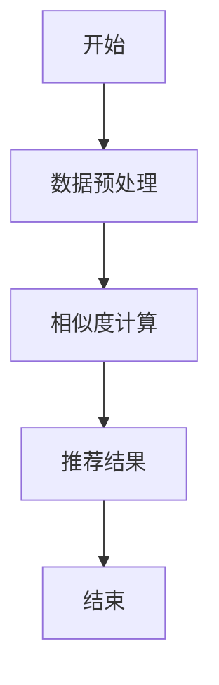
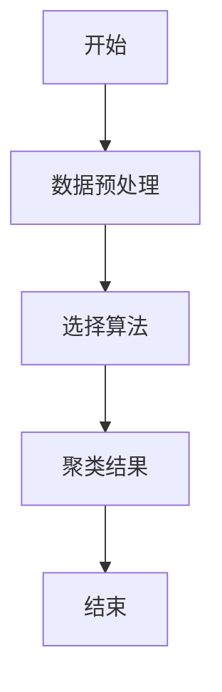

                 


# 设计智能化的企业并购后整合效果评估模型

**关键词：**企业并购、整合效果、智能化模型、协同过滤、聚类分析、系统架构、项目实战

**摘要：**  
本文旨在设计并实现一个智能化的企业并购后整合效果评估模型。通过分析企业并购的背景与核心概念，结合协同过滤和聚类分析等算法，构建一个高效的整合效果评估模型。本文从模型的算法原理、系统架构到实际项目实现，进行了全面而深入的探讨，并通过具体案例分析验证了模型的有效性。最终，本文提出了智能化整合效果评估模型的设计思路和实现方法，为企业在并购整合过程中提供科学的决策支持。

---

## 第1章: 企业并购后整合效果评估的背景与问题

### 1.1 企业并购的定义与特点
企业并购（Mergers and Acquisitions, M&A）是指两个或多个企业之间通过合并、收购或控股等方式，重新配置资源、技术和市场的一种商业行为。其特点包括：

1. **协同效应**：通过整合资源和能力，实现成本降低或收益增加。
2. **战略目标**：通常是为了扩大市场份额、获取新技术或进入新市场。
3. **风险性**：并购失败可能导致财务损失和企业声誉受损。

### 1.2 企业并购整合的定义与范围
整合是并购后实现协同效应的关键环节，其范围包括：

1. **战略整合**：调整企业战略目标和方向。
2. **组织整合**：优化组织结构和人员配置。
3. **文化整合**：融合企业文化和价值观。
4. **流程整合**：统一业务流程和操作规范。

### 1.3 企业并购整合效果评估的重要性
整合效果评估是衡量并购成功与否的重要指标，其重要性体现在：

1. **优化整合过程**：通过评估发现问题并及时调整。
2. **提升企业价值**：量化整合带来的经济效益。
3. **降低并购风险**：通过评估预测整合效果，减少失败概率。

### 1.4 本章小结
本章从企业并购的定义、整合的范围以及整合效果评估的重要性三个方面，为后续模型的设计奠定了理论基础。

---

## 第2章: 智能化企业并购整合效果评估模型的核心概念

### 2.1 智能化整合的定义与特点
智能化整合通过引入人工智能和大数据技术，实现整合过程的自动化和优化，其特点包括：

1. **数据驱动**：依赖于大量数据进行分析和决策。
2. **实时性**：能够快速响应市场变化和企业需求。
3. **灵活性**：适应不同规模和类型的并购案例。

### 2.2 模型的核心要素与属性
模型的核心要素包括：

| 核心要素       | 属性特征                     |
|----------------|------------------------------|
| **企业数据**   | 数据来源、数据类型、数据质量 |
| **整合目标**   | 战略目标、财务目标、市场目标 |
| **协同效应**   | 成本协同、收入协同、创新协同 |
| **评估指标**   | 财务指标、运营指标、市场指标 |

### 2.3 实体关系图（ER图）分析
以下是模型的实体关系图：

```mermaid
erd
    左边一个矩形框，标题“企业”，包含属性：企业ID、企业名称、行业、成立时间。
    右边一个矩形框，标题“整合”，包含属性：整合ID、整合目标、整合时间。
    中间一个矩形框，标题“协同效应”，包含属性：协同效应ID、协同类型、协同价值。
    企业 -o- 整合：参与整合
    整合 --o-- 协同效应：实现协同效应
```

### 2.4 本章小结
本章通过定义智能化整合的概念，分析了模型的核心要素，并通过ER图展示了各要素之间的关系，为后续模型的设计提供了理论支持。

---

## 第3章: 智能化整合效果评估模型的算法原理

### 3.1 模型算法概述
智能化整合效果评估模型采用协同过滤和聚类分析两种算法，分别用于相似企业匹配和整合效果预测。

### 3.2 协同过滤算法
协同过滤是一种基于用户或物品相似性推荐相关结果的算法，具体实现步骤如下：

1. **数据预处理**：对数据进行清洗和标准化处理。
2. **相似度计算**：使用余弦相似度计算企业间的相似性。
3. **推荐结果**：根据相似度排序，推荐相似企业。

#### 协同过滤算法流程图（Mermaid）


#### 协同过滤算法代码示例
```python
import numpy as np

def cosine_similarity(matrix):
    # 计算余弦相似度
    numerator = np.dot(matrix, matrix.T)
    denominator = np.outer(np.linalg.norm(matrix, axis=1), np.linalg.norm(matrix, axis=1))
    return numerator / denominator
```

### 3.3 聚类分析算法
聚类分析用于将企业分为不同的类别，便于后续分析。

1. **数据预处理**：对数据进行标准化和降维处理。
2. **聚类算法选择**：采用K-means算法。
3. **结果分析**：根据聚类结果进行整合效果预测。

#### 聚类分析流程图（Mermaid）


#### 聚类分析代码示例
```python
from sklearn.cluster import KMeans

def perform_kmeans(X, n_clusters):
    kmeans = KMeans(n_clusters=n_clusters)
    labels = kmeans.fit_predict(X)
    return labels
```

### 3.4 本章小结
本章详细介绍了协同过滤和聚类分析两种算法的原理和实现步骤，并通过代码示例展示了算法的应用。

---

## 第4章: 智能化整合效果评估模型的系统架构设计

### 4.1 问题场景介绍
企业并购后，需要一个系统化的整合效果评估模型，帮助企业在整合过程中快速发现问题并优化整合策略。

### 4.2 系统功能设计
系统功能设计基于领域模型，主要功能包括数据采集、协同效应计算和效果评估。

#### 领域模型类图（Mermaid）
```mermaid
classDiagram
    class 企业 {
        企业ID
        企业名称
        行业
        成立时间
    }
    class 整合 {
        整合ID
        整合目标
        整合时间
    }
    class 协同效应 {
        协同效应ID
        协同类型
        协同价值
    }
    企业 -->o 整合
    整合 -->o 协同效应
```

### 4.3 系统架构设计
系统架构采用分层设计，主要包括数据层、业务逻辑层和用户界面层。

#### 系统架构图（Mermaid）
```mermaid
rectangle 数据层 {
    数据库
}
rectangle 业务逻辑层 {
    整合服务
    协同效应计算服务
}
rectangle 用户界面层 {
    管理界面
}
数据层 --> 业务逻辑层
业务逻辑层 --> 用户界面层
```

### 4.4 接口设计与交互
系统通过RESTful API实现接口交互，以下是典型接口流程：

#### 系统交互图（Mermaid）
```mermaid
sequenceDiagram
    用户 --> 接口：获取企业数据
    接口 --> 数据层：查询企业数据
    数据层 --> 接口：返回企业数据
    用户 --> 接口：计算协同效应
    接口 --> 业务逻辑层：调用协同效应计算服务
    业务逻辑层 --> 接口：返回计算结果
```

### 4.5 本章小结
本章通过系统架构设计和接口交互设计，展示了智能化整合效果评估模型的技术实现方案。

---

## 第5章: 项目实战与案例分析

### 5.1 环境安装与数据准备
1. **环境安装**：安装Python、TensorFlow、Scikit-learn等工具。
2. **数据准备**：收集企业并购数据，清洗并预处理。

### 5.2 系统核心功能实现
1. **协同过滤实现**：基于企业数据，计算企业间的相似性。
2. **聚类分析实现**：将企业分为不同的类别，预测整合效果。

#### 协同过滤实现代码
```python
def calculate_cosine_similarity(matrix):
    # 计算余弦相似度矩阵
    return cosine_similarity(matrix)
```

#### 聚类分析实现代码
```python
def perform_kmeans_analysis(X, n_clusters):
    return perform_kmeans(X, n_clusters)
```

### 5.3 实际案例分析
以某企业并购案例为例，通过模型计算其整合效果：

1. **数据输入**：输入并购企业数据。
2. **模型计算**：计算协同效应和聚类结果。
3. **结果分析**：评估整合效果并提出改进建议。

### 5.4 本章小结
本章通过项目实战和案例分析，验证了模型的有效性和实用性。

---

## 第6章: 总结与展望

### 6.1 总结
智能化企业并购后整合效果评估模型通过协同过滤和聚类分析算法，实现了整合效果的科学评估，为企业决策提供了有力支持。

### 6.2 展望
未来研究可以进一步优化模型算法，引入更多数据源，提升模型的准确性和实时性。

---

## 第7章: 最佳实践与注意事项

### 7.1 最佳实践
1. **数据质量管理**：确保数据的准确性和完整性。
2. **模型调优**：根据实际情况优化算法参数。
3. **团队协作**：整合数据科学家、业务专家和开发人员的共同努力。

### 7.2 注意事项
1. **数据隐私**：确保数据处理符合相关法律法规。
2. **模型解释性**：提高模型的可解释性，便于业务理解。

### 7.3 拓展阅读
推荐阅读相关领域的书籍和论文，深入理解企业并购和人工智能的结合应用。

---

**结语**  
通过本文的系统介绍，读者可以全面了解智能化企业并购后整合效果评估模型的设计与实现。从理论到实践，从算法到系统，本文为企业在并购整合中的决策提供了科学依据和技术支持。

