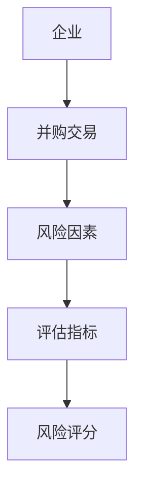
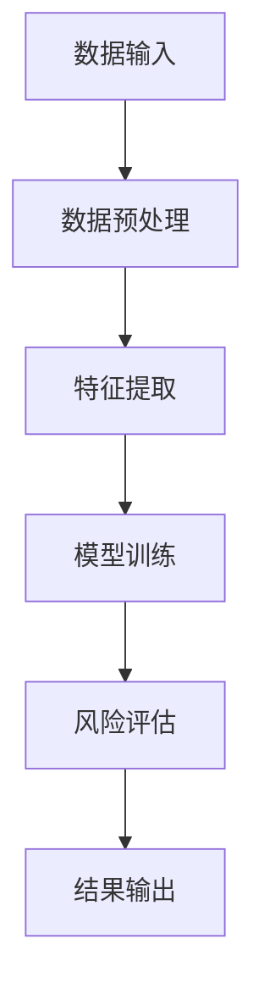
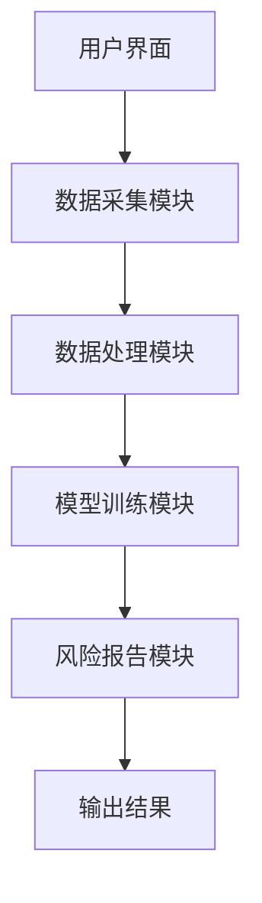
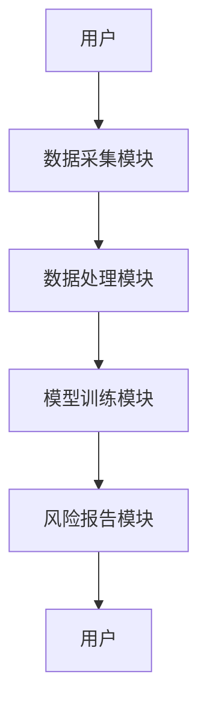

                 


# 设计智能化的企业并购整合风险评估模型

## 关键词：企业并购、风险评估、人工智能、机器学习、大数据、智能化整合

## 摘要：  
本文旨在探讨如何设计一种智能化的企业并购整合风险评估模型。通过结合人工智能、大数据和机器学习技术，该模型能够帮助企业识别和量化并购整合中的潜在风险，从而为决策者提供科学依据。文章从背景介绍、核心概念、算法原理、系统架构到项目实战，全面解析了该模型的设计与实现过程。

---

## 第1章: 企业并购整合风险评估概述

### 1.1 企业并购整合的背景与意义

企业并购是企业扩张和增长的重要手段之一。然而，并购整合过程中常常面临诸多风险，包括财务风险、市场风险、经营风险、法律风险和文化整合风险等。这些风险可能导致并购失败或整合效果不佳。因此，如何通过智能化的方法对并购整合风险进行评估，成为企业并购成功的关键。

智能化企业并购整合风险评估模型通过结合机器学习、大数据分析和自然语言处理技术，能够快速、准确地识别和量化风险，从而帮助企业在并购决策中做出更明智的选择。

### 1.2 企业并购整合风险的分类

企业并购整合风险可以分为以下几类：

1. **财务风险**：包括目标企业的财务状况、债务水平和盈利能力等。
2. **市场风险**：目标企业所在行业的市场环境和竞争状况。
3. **经营风险**：目标企业的经营效率、管理团队和供应链稳定性等。
4. **法律风险**：并购涉及的法律问题，如合同纠纷、知识产权等。
5. **文化整合风险**：企业文化和管理风格的差异可能导致整合失败。

### 1.3 智能化评估的核心概念与目标

智能化企业并购整合风险评估的核心概念包括：

1. **数据驱动**：利用大数据技术，从多维度获取和分析数据。
2. **机器学习**：通过训练模型，识别潜在风险并预测风险概率。
3. **实时监测**：对并购后的整合过程进行实时监控，及时发现和应对风险。

智能化评估的目标是通过模型量化风险，为决策者提供科学依据，降低并购失败的概率。

---

## 第2章: 企业并购整合风险评估模型的核心概念与联系

### 2.1 模型的核心概念

1. **数据来源**：包括财务数据、市场数据、文本数据（如新闻、报告）等。
2. **评估指标**：如财务指标（ROE、净利润率）、市场指标（市场份额、竞争对手分析）等。
3. **算法选择**：如支持向量机、随机森林、神经网络等。
4. **输出结果**：如风险评分、风险等级、风险建议等。

### 2.2 核心概念的属性特征对比表

| 概念       | 属性       | 特征                                   |
|------------|------------|----------------------------------------|
| 数据来源   | 类型       | 财务数据、市场数据、文本数据等         |
| 评估指标   | 属性       | 财务指标、市场指标、管理指标等         |
| 算法选择   | 类型       | 机器学习、统计分析、规则引擎等         |
| 输出结果   | 类型       | 风险评分、风险等级、风险建议等         |

### 2.3 ER实体关系图



### 2.4 本章小结

本章详细介绍了企业并购整合风险评估模型的核心概念，并通过对比表和实体关系图展示了各概念之间的联系。

---

## 第3章: 企业并购整合风险评估模型的算法原理

### 3.1 算法原理概述

1. **机器学习算法在风险评估中的应用**：如支持向量机、随机森林等。
2. **统计分析方法的适用场景**：如回归分析、聚类分析等。
3. **规则引擎的优缺点**：如基于规则的简单模型适用于特定场景。

### 3.2 算法流程图



### 3.3 算法数学模型

#### 3.3.1 线性回归模型

$$ y = \beta_0 + \beta_1x + \epsilon $$

其中，$y$ 是目标变量，$x$ 是自变量，$\beta_0$ 和 $\beta_1$ 是回归系数，$\epsilon$ 是误差项。

#### 3.3.2 支持向量机模型

$$ \text{最大化} \quad \frac{1}{2}\|w\|^2 $$
$$ \text{约束} \quad y_i(w \cdot x_i + b) \geq 1 $$

其中，$w$ 是权重向量，$b$ 是偏置项，$y_i$ 是标签。

#### 3.3.3 随机森林模型

随机森林通过集成多个决策树的预测结果，提高模型的准确性和稳定性。

### 3.4 算法实现代码示例

```python
import pandas as pd
from sklearn.ensemble import RandomForestClassifier
from sklearn.metrics import accuracy_score

# 数据加载与预处理
data = pd.read_csv('merger_risk.csv')
X = data.drop('risk_score', axis=1)
y = data['risk_score']

# 模型训练
model = RandomForestClassifier()
model.fit(X, y)

# 模型评估
predicted = model.predict(X)
print("Accuracy:", accuracy_score(y, predicted))
```

### 3.5 本章小结

本章详细介绍了企业并购整合风险评估模型的算法原理，并通过流程图和代码示例展示了模型的实现过程。

---

## 第4章: 企业并购整合风险评估模型的系统分析与架构设计

### 4.1 问题场景介绍

企业并购整合过程中，需要实时监控和评估风险，确保整合顺利进行。系统需要支持多维度数据的采集、处理和分析，并能够生成风险报告。

### 4.2 系统功能设计

系统功能包括：

1. **数据采集模块**：从财务、市场和文本数据源获取数据。
2. **数据处理模块**：对数据进行清洗和特征提取。
3. **模型训练模块**：训练机器学习模型并进行风险评估。
4. **风险报告模块**：生成风险报告并提供风险建议。

### 4.3 系统架构设计



### 4.4 系统接口设计

系统接口包括：

1. 数据采集接口：从数据库或API获取数据。
2. 模型训练接口：接收特征数据并返回模型参数。
3. 风险报告接口：生成并输出风险报告。

### 4.5 系统交互流程图



### 4.6 本章小结

本章详细介绍了企业并购整合风险评估模型的系统架构设计，包括功能设计、架构图和接口设计。

---

## 第5章: 企业并购整合风险评估模型的项目实战

### 5.1 项目介绍

本项目旨在设计一个智能化的企业并购整合风险评估模型，帮助企业在并购过程中降低风险。

### 5.2 系统核心实现源代码

```python
import pandas as pd
from sklearn.ensemble import RandomForestClassifier
from sklearn.metrics import accuracy_score

# 数据加载与预处理
data = pd.read_csv('merger_risk.csv')
X = data.drop('risk_score', axis=1)
y = data['risk_score']

# 模型训练
model = RandomForestClassifier()
model.fit(X, y)

# 模型评估
predicted = model.predict(X)
print("Accuracy:", accuracy_score(y, predicted))
```

### 5.3 代码应用解读与分析

1. 数据加载与预处理：从CSV文件中读取数据，并提取特征和标签。
2. 模型训练：使用随机森林算法训练模型。
3. 模型评估：计算模型的准确率。

### 5.4 实际案例分析

以某公司并购案例为例，分析模型的预测结果，并提出风险建议。

### 5.5 本章小结

本章通过实际案例展示了模型的实现过程和应用效果。

---

## 第6章: 总结与展望

### 6.1 总结

本文详细介绍了企业并购整合风险评估模型的设计与实现过程，包括背景、核心概念、算法原理、系统架构和项目实战。通过智能化的方法，模型能够有效识别和量化并购整合中的风险，为决策者提供科学依据。

### 6.2 展望

未来，随着人工智能和大数据技术的不断发展，企业并购整合风险评估模型将更加智能化和精准化。可以通过引入更多数据源和优化算法，进一步提高模型的预测能力和实用性。

---

## 参考文献

1. 刘军. 《企业并购整合风险管理》. 北京: 中国经济出版社, 2018.
2. 张伟. 《机器学习实战》. 北京: 清华大学出版社, 2020.
3. 李明. 《大数据分析与应用》. 北京: 人民邮电出版社, 2019.

---

## 注意事项

1. 本文中的代码和案例仅为示例，实际应用中需根据具体需求进行调整。
2. 模型的准确率受数据质量和算法选择的影响，需结合实际场景进行优化。
3. 数据隐私和安全问题需在实际应用中予以重视。

---

## 未来拓展

1. 引入自然语言处理技术，分析企业文本数据。
2. 结合实时数据流，实现动态风险评估。
3. 开发用户友好的可视化界面，方便用户操作。

--- 

通过以上步骤，您可以系统地设计和实现一个智能化的企业并购整合风险评估模型。希望本文对您有所帮助！

