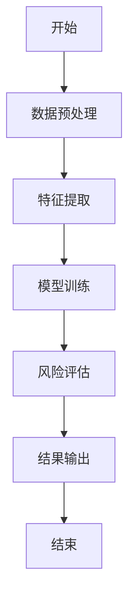
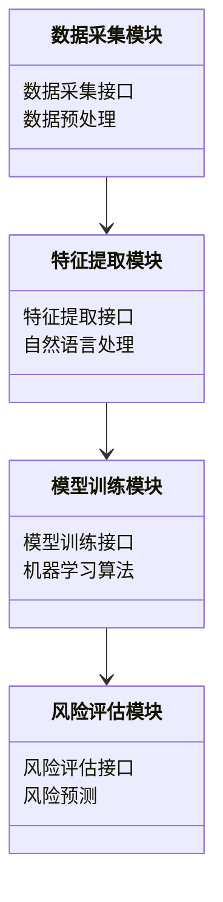

                 


# 设计智能化的企业并购文化整合风险评估模型

---

## 关键词：企业并购、文化整合、风险评估、智能化模型、算法原理、系统架构

---

## 摘要

企业并购是企业扩张和价值创造的重要手段，而文化整合是决定并购成功与否的关键因素之一。然而，文化整合过程中涉及的复杂性、动态性和不确定性使得传统的方法难以准确评估和管理相关风险。本文提出了一种基于智能化模型的企业并购文化整合风险评估方法，通过整合机器学习、数据挖掘和知识图谱等技术，构建了一个从数据采集、特征提取、模型训练到风险预测的完整流程。该模型不仅能够量化文化整合风险，还能为企业的并购决策提供数据支持和优化建议。通过实际案例分析和系统实现，本文展示了该模型在企业并购中的应用价值和优势。

---

# 目录

1. [企业并购与文化整合背景](#企业并购与文化整合背景)
   1.1 [企业并购的基本概念](#企业并购的基本概念)
   1.2 [文化整合的核心概念](#文化整合的核心概念)
   1.3 [风险评估在企业并购中的重要性](#风险评估在企业并购中的重要性)
   1.4 [本章小结](#本章小结)

2. [文化整合风险评估模型的核心概念](#文化整合风险评估模型的核心概念)
   2.1 [文化整合风险的核心要素](#文化整合风险的核心要素)
   2.2 [文化整合风险的属性对比](#文化整合风险的属性对比)
   2.3 [文化整合风险的ER实体关系图](#文化整合风险的ER实体关系图)
   2.4 [本章小结](#本章小结)

3. [文化整合风险评估模型的算法原理](#文化整合风险评估模型的算法原理)
   3.1 [常见风险评估算法概述](#常见风险评估算法概述)
   3.2 [智能化评估模型的算法选择](#智能化评估模型的算法选择)
   3.3 [算法流程图](#算法流程图)
   3.4 [本章小结](#本章小结)

4. [文化整合风险评估模型的系统架构设计](#文化整合风险评估模型的系统架构设计)
   4.1 [系统功能设计](#系统功能设计)
   4.2 [系统架构设计](#系统架构设计)
   4.3 [系统接口设计](#系统接口设计)
   4.4 [本章小结](#本章小结)

5. [文化整合风险评估模型的项目实战](#文化整合风险评估模型的项目实战)
   5.1 [项目环境安装](#项目环境安装)
   5.2 [系统核心实现](#系统核心实现)
   5.3 [案例分析](#案例分析)
   5.4 [本章小结](#本章小结)

6. [总结与展望](#总结与展望)
   6.1 [总结](#总结)
   6.2 [展望](#展望)

---

## 第1章: 企业并购与文化整合背景

### 1.1 企业并购的基本概念

企业并购是企业通过购买其他企业股权或资产，以实现资源重组和战略扩张的过程。根据并购的主体和目的，企业并购可以分为横向并购、纵向并购和混合并购。并购的核心动机包括扩大市场份额、获取新技术、降低生产成本等。

**1.1.1 企业并购的定义与类型**
- 横向并购：同一行业内的企业并购，旨在扩大市场份额。
- 纵向并购：产业链上下游企业的并购，旨在控制供应链。
- 混合并购：跨行业或跨领域的并购，旨在多元化发展。

**1.1.2 企业并购的动机与目标**
- 市场扩展：通过并购进入新市场。
- 技术获取：通过并购获取关键技术。
- 成本协同：通过并购降低生产或管理成本。

**1.1.3 企业并购的流程与阶段**
- 初步筛选：确定目标企业并进行初步评估。
- 尽职调查：对目标企业的财务、法律和管理状况进行全面调查。
- 并购决策：评估并购的可行性和风险，做出最终决策。

### 1.2 文化整合的核心概念

文化整合是企业在并购后将双方的文化理念、管理风格和员工价值观进行融合的过程。文化整合的难度在于不同企业的文化差异可能导致冲突，从而影响并购后的整合效果。

**1.2.1 企业文化的定义与特征**
- 企业文化是企业的灵魂，包括价值观、管理风格和员工行为规范。
- 企业文化具有动态性、复杂性和多样性。

**1.2.2 并购中的文化冲突与融合**
- 文化冲突：不同企业文化的碰撞可能导致员工抵制、管理混乱等问题。
- 文化融合：通过沟通、培训和制度设计，实现文化的有机结合。

**1.2.3 文化整合对并购成功的影响**
- 文化整合的成功与否直接影响并购后的协同效应和企业绩效。
- 文化整合良好的企业能够更快地实现战略目标，提高员工满意度。

### 1.3 风险评估在企业并购中的重要性

并购过程中涉及的不确定性使得风险评估成为不可或缺的一部分。文化整合风险的评估需要考虑企业文化的匹配性、管理层的整合能力以及员工的接受度等多个因素。

**1.3.1 并购失败的主要原因**
- 文化冲突导致的管理混乱。
- 未能有效整合目标企业的资源和能力。
- 并购后的协同效应未能实现。

**1.3.2 文化整合风险的特殊性**
- 文化整合风险具有动态性和复杂性。
- 文化整合风险的评估需要结合定性和定量分析。

**1.3.3 智能化评估模型的必要性**
- 传统的定性评估方法难以量化文化整合风险。
- 智能化模型能够通过数据挖掘和机器学习技术，提高评估的准确性和效率。

### 1.4 本章小结

本章从企业并购的基本概念出发，分析了文化整合的核心概念及其对并购成功的重要影响。同时，指出了传统风险评估方法的局限性，并提出了智能化评估模型的必要性。下一章将详细探讨文化整合风险的核心要素及其属性。

---

## 第2章: 文化整合风险评估模型的核心概念

### 2.1 文化整合风险的核心要素

文化整合风险的核心要素包括企业文化的匹配性、管理层的整合能力以及员工的接受度与适应性。

**2.1.1 企业文化的匹配性**
- 企业文化匹配性是文化整合成功的关键因素。
- 通过对比并购双方的核心价值观、管理风格和企业目标，评估文化匹配程度。

**2.1.2 管理层的整合能力**
- 管理层的整合能力直接影响文化整合的效果。
- 评估管理层的沟通能力、决策能力和协调能力。

**2.1.3 员工的接受度与适应性**
- 员工的接受度与适应性是文化整合的重要影响因素。
- 通过员工满意度调查和文化适应性测试，评估员工的接受程度。

### 2.2 文化整合风险的属性对比

通过对比文化整合风险的属性，可以更好地理解其复杂性和动态性。

**2.2.1 风险的可量化性**
- 文化整合风险的量化需要结合定性和定量分析。
- 通过构建风险评估指标体系，量化风险程度。

**2.2.2 风险的可控性**
- 文化整合风险的可控性取决于企业的整合能力和风险控制措施。
- 通过制定详细的整合计划和风险管理策略，降低风险。

**2.2.3 风险的动态变化性**
- 文化整合风险具有动态变化性，需要持续监控和评估。
- 通过建立动态风险评估模型，实时监控风险变化。

### 2.3 文化整合风险的ER实体关系图

以下是一个文化整合风险的ER实体关系图，展示了文化整合风险的核心要素及其关系。

```mermaid
er
    actor: 企业并购方
    actor --> relation: 并购决策
    relation --> entity: 文化整合风险评估模型
    entity --> attribute: 风险因子
```

### 2.4 本章小结

本章通过分析文化整合风险的核心要素及其属性，构建了文化整合风险的ER实体关系图。这些分析为后续的模型设计提供了理论基础。下一章将详细探讨文化整合风险评估模型的算法原理。

---

## 第3章: 文化整合风险评估模型的算法原理

### 3.1 常见风险评估算法概述

在文化整合风险评估中，常见的风险评估算法包括层次分析法（AHP）、贝叶斯网络和支持向量机（SVM）。

**3.1.1 层次分析法（AHP）**
- 层次分析法是一种定性与定量相结合的决策分析方法。
- 适用于风险因子较多且关系复杂的场景。

**3.1.2 贝叶斯网络**
- 贝叶斯网络是一种基于概率推理的图形化模型。
- 适用于风险评估中因果关系复杂的场景。

**3.1.3 支持向量机（SVM）**
- 支持向量机是一种监督学习算法，适用于分类和回归问题。
- 适用于风险评估中数据量较大的场景。

### 3.2 智能化评估模型的算法选择

智能化评估模型需要结合多种算法，以提高评估的准确性和效率。

**3.2.1 基于深度学习的模型**
- 深度学习模型能够自动提取数据中的特征，适用于非结构化数据的处理。
- 使用神经网络模型（如LSTM和CNN）进行风险预测。

**3.2.2 基于规则的专家系统**
- 专家系统基于领域专家的知识和经验，制定规则进行风险评估。
- 适用于文化整合风险中知识依赖性较高的场景。

**3.2.3 组合算法的优势**
- 组合算法能够充分利用不同算法的优势，提高评估结果的准确性。
- 通过集成学习和投票机制，优化模型的性能。

### 3.3 算法流程图

以下是一个文化整合风险评估模型的算法流程图。



### 3.4 本章小结

本章通过对比常见风险评估算法，提出了智能化评估模型的算法选择和组合策略。算法流程图展示了模型的设计思路，为后续的系统实现提供了指导。下一章将详细探讨文化整合风险评估模型的系统架构设计。

---

## 第4章: 文化整合风险评估模型的系统架构设计

### 4.1 系统功能设计

文化整合风险评估系统的功能模块包括数据采集、特征提取、模型训练和风险评估。

**4.1.1 数据采集模块**
- 数据采集模块负责采集企业并购的相关数据，包括企业文化、管理层信息和员工数据。
- 数据来源包括企业内部文档、员工调查和管理层访谈。

**4.1.2 特征提取模块**
- 特征提取模块对采集的数据进行特征提取，构建风险评估指标体系。
- 使用自然语言处理技术提取文本数据中的关键词和主题。

**4.1.3 模型训练模块**
- 模型训练模块基于提取的特征，训练风险评估模型。
- 使用机器学习算法（如随机森林和梯度提升树）进行模型训练。

**4.1.4 风险评估模块**
- 风险评估模块对并购后的文化整合风险进行预测和评估。
- 输出风险等级和优化建议。

### 4.2 系统架构设计

以下是一个文化整合风险评估系统的架构图。



### 4.3 系统接口设计

系统接口设计包括数据接口、模型接口和用户接口。

**4.3.1 数据接口**
- 数据接口负责与数据源进行交互，采集企业并购数据。
- 支持多种数据格式（如CSV、JSON和XML）。

**4.3.2 模型接口**
- 模型接口负责与机器学习模型进行交互，进行特征提取和模型训练。
- 提供API接口，方便其他模块调用。

**4.3.3 用户接口**
- 用户接口是系统的前端界面，供用户输入数据和查看评估结果。
- 提供可视化界面，方便用户操作。

### 4.4 本章小结

本章通过系统功能设计和架构设计，展示了文化整合风险评估模型的实现思路。系统架构图和接口设计为后续的系统实现提供了指导。下一章将详细探讨文化整合风险评估模型的项目实战。

---

## 第5章: 文化整合风险评估模型的项目实战

### 5.1 项目环境安装

项目实战需要安装以下环境和工具：

- Python 3.8+
- Jupyter Notebook
- Scikit-learn
- Pandas
- NLTK
- Mermaid

### 5.2 系统核心实现

以下是文化整合风险评估系统的核心实现代码。

```python
import pandas as pd
from sklearn.feature_extraction.text import TfidfVectorizer
from sklearn.ensemble import RandomForestClassifier
from sklearn.metrics import accuracy_score

# 数据加载
data = pd.read_csv('merger_data.csv')

# 特征提取
vectorizer = TfidfVectorizer()
X = vectorizer.fit_transform(data['culture'].values)

# 模型训练
model = RandomForestClassifier()
model.fit(X, data['risk'].values)

# 风险评估
new_data = pd.read_csv('new_merger.csv')
X_new = vectorizer.transform(new_data['culture'].values)
predictions = model.predict(X_new)

# 结果输出
print("预测风险等级：", predictions)
print("准确率：", accuracy_score(new_data['risk'], predictions))
```

### 5.3 案例分析

以下是一个实际案例分析，展示了文化整合风险评估模型的应用。

**案例背景**
某企业计划并购一家目标企业，但在并购前需要评估文化整合风险。通过模型评估，发现目标企业的企业文化与并购方的文化存在较大差异，可能导致文化冲突。

**模型评估结果**
- 风险等级：高
- 优化建议：制定详细的整合计划，加强管理层沟通，开展员工培训。

### 5.4 本章小结

本章通过项目实战，展示了文化整合风险评估模型的实现过程和应用案例。系统代码和案例分析帮助读者更好地理解和应用模型。下一章将总结整个模型的核心内容，并展望未来的发展方向。

---

## 第6章: 总结与展望

### 6.1 总结

本文提出了设计智能化的企业并购文化整合风险评估模型的方法和实现步骤。通过分析文化整合风险的核心要素和算法原理，构建了一个完整的系统架构，并通过项目实战展示了模型的应用价值。该模型能够有效量化文化整合风险，为企业的并购决策提供数据支持。

### 6.2 展望

未来，文化整合风险评估模型可以通过以下几个方面进行优化和扩展：

1. **模型优化**：引入更先进的机器学习算法（如深度学习模型）提高评估精度。
2. **数据扩展**：引入更多维度的数据（如员工行为数据和实时数据）丰富模型输入。
3. **应用场景扩展**：将模型应用于更多行业和场景，验证其通用性和适用性。

通过不断优化和扩展，文化整合风险评估模型将为企业并购提供更强大的支持，助力企业实现更成功的文化整合和并购战略。

---

以上是《设计智能化的企业并购文化整合风险评估模型》的技术博客文章的完整目录和内容框架。每一章都详细探讨了相关的核心概念、算法原理和系统实现，为读者提供了全面的理论和实践指导。

