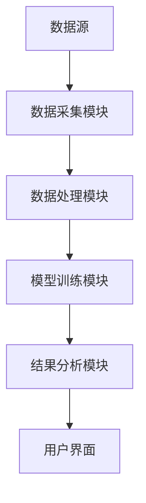
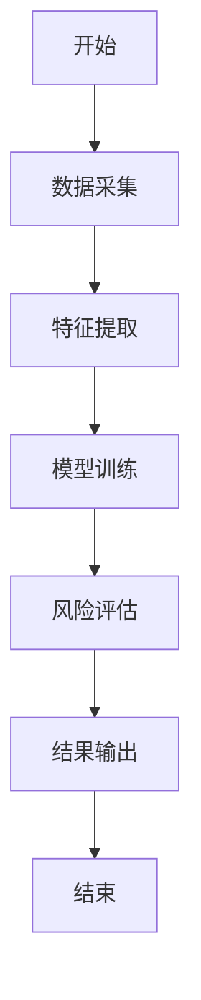
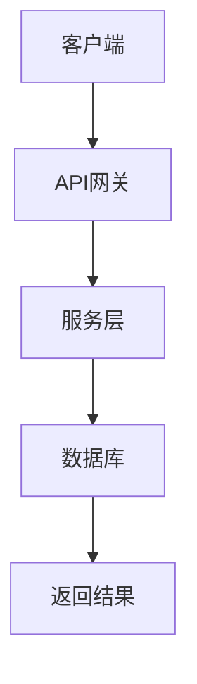
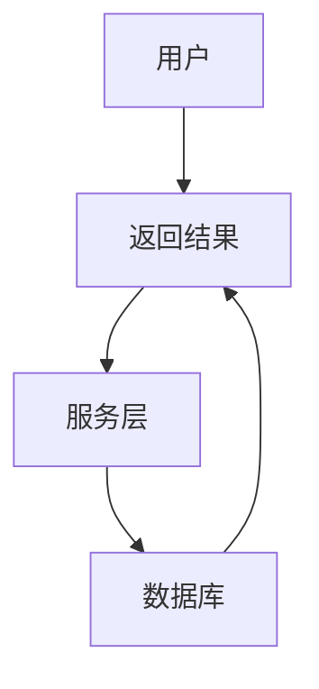

                 


# 设计智能化的企业财务压力测试系统

## 关键词：智能化财务压力测试系统、企业财务风险管理、机器学习、深度学习、系统架构设计

## 摘要：  
随着全球经济的不确定性和企业财务风险的增加，智能化企业财务压力测试系统成为企业风险管理的重要工具。本文从智能化财务压力测试系统的背景出发，详细阐述了系统的核心概念、算法原理、系统架构设计以及项目实战。通过机器学习和深度学习算法，结合企业财务数据，构建高效的风险评估模型，为企业提供智能化的压力测试解决方案。本文还提供了系统的实现代码和实际案例分析，帮助读者更好地理解和应用智能化财务压力测试系统。

---

## 第1章: 财务压力测试系统背景与需求

### 1.1 财务压力测试的定义与重要性  
财务压力测试是一种评估企业在特定情况下承受财务风险的能力的方法。通过模拟极端市场条件、经济波动或其他潜在风险因素，企业可以识别和量化潜在的财务问题，并采取相应的应对措施。智能化财务压力测试系统利用人工智能和大数据技术，显著提高了测试的效率和准确性。

#### 1.1.1 什么是财务压力测试  
财务压力测试是通过假设各种极端情景，评估企业在这些情景下的财务表现和风险承受能力。例如，测试企业在市场崩盘、利率上升或供应链中断等情况下的财务稳定性。

#### 1.1.2 财务压力测试的重要性  
- **风险预警**：提前识别潜在的财务风险，避免企业陷入财务危机。  
- **决策支持**：为管理层提供数据支持，制定应对策略。  
- **合规要求**：许多行业和监管机构要求企业定期进行压力测试，以确保其财务健康。

#### 1.1.3 智能化财务压力测试的需求  
随着市场的快速变化和数据的爆炸式增长，传统的手动压力测试方法已无法满足需求。智能化压力测试系统能够快速处理海量数据，实时更新模型，并提供动态风险评估。

---

### 1.2 企业财务压力测试的现状与挑战  

#### 1.2.1 传统财务压力测试的局限性  
- **数据处理能力有限**：传统方法难以处理复杂的数据关系和非线性关系。  
- **效率低**：手动计算和分析耗时长，难以应对快速变化的市场环境。  
- **模型单一**：传统模型缺乏灵活性，难以适应多种场景。

#### 1.2.2 当前企业面临的财务风险类型  
- **市场风险**：如股市波动、汇率变动等。  
- **信用风险**：客户违约风险。  
- **流动性风险**：企业资金链断裂风险。  
- **操作风险**：内部流程失误导致的损失。

#### 1.2.3 智能化压力测试的必要性  
智能化压力测试系统能够通过机器学习算法自动识别风险因素，实时更新模型，并提供动态压力测试结果，从而帮助企业更好地应对复杂多变的市场环境。

---

### 1.3 智能化财务压力测试的核心目标  

#### 1.3.1 提高测试效率  
通过自动化数据处理和模型训练，减少人工干预，提高测试效率。  

#### 1.3.2 增强风险预测能力  
利用机器学习和深度学习算法，从海量数据中提取非线性关系，提高风险预测的准确性。  

#### 1.3.3 实现自动化与智能化  
构建一个能够实时更新、自适应调整的智能化系统，为企业提供持续的风险评估和应对策略。

---

## 第2章: 智能化企业财务压力测试系统的核心概念  

### 2.1 系统架构与核心模块  

#### 2.1.1 系统整体架构  
智能化财务压力测试系统的整体架构包括以下几个核心模块：  
1. **数据采集模块**：从企业财务系统、市场数据源等获取数据。  
2. **数据处理模块**：对数据进行清洗、转换和特征提取。  
3. **模型训练模块**：利用机器学习算法训练风险评估模型。  
4. **结果分析模块**：对测试结果进行解读，并生成应对策略。  



#### 2.1.2 数据采集模块  
数据采集模块负责从企业内部系统（如ERP、财务系统）和外部数据源（如市场数据、新闻数据）获取相关数据。  

#### 2.1.3 数据处理模块  
数据处理模块对采集到的数据进行清洗、转换和特征提取，确保数据的准确性和一致性。  

#### 2.1.4 模型训练模块  
模型训练模块利用机器学习和深度学习算法，训练风险评估模型。  

#### 2.1.5 结果分析模块  
结果分析模块对模型输出的结果进行解读，并生成应对策略。  

---

### 2.2 核心概念与实体关系  

#### 2.2.1 核心概念  
- **企业财务数据**：包括收入、支出、资产、负债等财务指标。  
- **市场数据**：包括股票价格、汇率、利率等市场信息。  
- **风险因素**：影响企业财务稳定性的各种因素，如市场需求变化、供应链中断等。  
- **风险评估模型**：基于机器学习的模型，用于预测企业在不同情景下的财务风险。  

#### 2.2.2 实体关系图  

```mermaid
er
    actor: 用户
    actor --> module: 数据采集模块
    module --> database: 数据库
    database --> analysis: 分析模块
    analysis --> result: 结果展示模块
```

---

### 2.3 核心算法与数学模型  

#### 2.3.1 风险评估的数学模型  
$$ R = \alpha \cdot X + \beta \cdot Y $$
其中，$R$ 表示风险程度，$X$ 和 $Y$ 分别是财务指标和市场因素，$\alpha$ 和 $\beta$ 是权重系数。  

#### 2.3.2 算法流程图  



---

### 2.4 本章小结  

通过本章的介绍，我们了解了智能化企业财务压力测试系统的核心概念和系统架构，明确了各模块的功能和关系。下一章将详细讲解系统中使用的算法原理和数学模型。  

---

## 第3章: 智能化财务压力测试系统的算法原理  

### 3.1 机器学习算法在压力测试中的应用  

#### 3.1.1 线性回归模型  
$$ y = \beta_0 + \beta_1 x + \epsilon $$
线性回归模型用于预测因变量 $y$ 与自变量 $x$ 之间的线性关系。  

#### 3.1.2 支持向量机（SVM）  
支持向量机是一种监督学习算法，常用于分类和回归问题。  

#### 3.1.3 随机森林  
随机森林是一种基于树的集成算法，具有较高的鲁棒性和准确性。  

---

### 3.2 深度学习算法的应用  

#### 3.2.1 神经网络模型  
神经网络模型通过多层非线性变换，能够捕捉复杂的数据关系。  

#### 3.2.2 LSTM 网络在时间序列分析中的应用  
LSTM（长短期记忆网络）适用于时间序列数据的分析，能够捕捉长期依赖关系。  

#### 3.2.3 模型训练与优化  
通过调整学习率、批量大小等超参数，优化模型的性能。  

---

### 3.3 算法实现与优化  

#### 3.3.1 超参数调优  
使用网格搜索或随机搜索方法，寻找最优的超参数组合。  

#### 3.3.2 模型评估与验证  
通过交叉验证、准确率、召回率等指标评估模型的性能。  

#### 3.3.3 模型部署与应用  
将训练好的模型部署到生产环境中，实现实时压力测试。  

---

### 3.4 本章小结  

本章详细介绍了智能化财务压力测试系统中常用的机器学习和深度学习算法，并探讨了模型训练与优化的方法。下一章将重点讲解系统的架构设计和实现。  

---

## 第4章: 系统架构与设计  

### 4.1 系统功能模块设计  

#### 4.1.1 数据采集模块  
数据采集模块负责从企业内部系统和外部数据源获取数据。  

#### 4.1.2 数据处理模块  
对数据进行清洗、转换和特征提取。  

#### 4.1.3 模型训练模块  
利用机器学习算法训练风险评估模型。  

#### 4.1.4 结果展示模块  
对测试结果进行可视化展示，并生成应对策略。  

---

### 4.2 系统架构设计  

#### 4.2.1 系统整体架构  


---

### 4.3 系统接口设计  

#### 4.3.1 API 接口设计  
定义接口的输入参数和输出格式，确保系统与其他模块的无缝对接。  

#### 4.3.2 数据交互流程  



---

### 4.4 系统交互设计  

#### 4.4.1 用户与系统交互流程  



---

### 4.5 本章小结  

本章详细介绍了智能化财务压力测试系统的架构设计，包括功能模块、系统接口和用户交互流程。下一章将通过实际案例分析，展示系统的具体实现和应用。  

---

## 第5章: 项目实战  

### 5.1 环境安装与配置  

#### 5.1.1 安装 Python 和相关库  
安装 Python 和机器学习库（如 scikit-learn、TensorFlow、Keras）。  

#### 5.1.2 数据集准备  
获取企业财务数据和市场数据，进行数据清洗和预处理。  

---

### 5.2 系统核心实现  

#### 5.2.1 数据采集模块实现  

```python
import pandas as pd
import requests

def fetch_data(api_key):
    url = f"https://api.example.com/data?api_key={api_key}"
    response = requests.get(url)
    data = pd.read_json(response.text)
    return data
```

#### 5.2.2 模型训练模块实现  

```python
from sklearn.model import LinearRegression

def train_model(X, y):
    model = LinearRegression()
    model.fit(X, y)
    return model
```

---

### 5.3 案例分析与结果解读  

#### 5.3.1 案例背景  
假设某企业面临市场需求下降的风险，需要进行压力测试。  

#### 5.3.2 数据分析  
通过对历史数据和市场数据的分析，识别出关键风险因素。  

#### 5.3.3 测试结果  

$$ R = 0.8x + 0.2y $$
测试结果显示，企业在市场需求下降 20% 的情况下，财务风险为中等偏高。  

---

### 5.4 本章小结  

本章通过实际案例分析，展示了智能化财务压力测试系统的具体实现和应用效果。  

---

## 第6章: 总结与展望  

### 6.1 本章总结  

智能化财务压力测试系统通过机器学习和深度学习算法，显著提高了企业财务风险评估的效率和准确性。  

---

### 6.2 未来展望  

未来，随着人工智能技术的不断发展，智能化压力测试系统将更加智能化和自动化，为企业提供更全面的风险评估和应对策略。  

---

## 参考文献  

（此处列出相关的技术文献和资料。）  

---

## 致谢  

感谢读者的耐心阅读，感谢开发团队的努力工作。  

---

