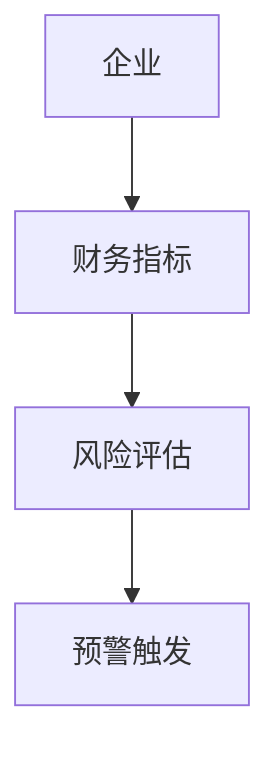
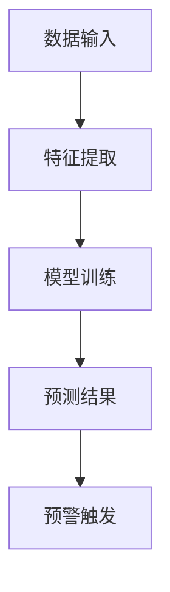
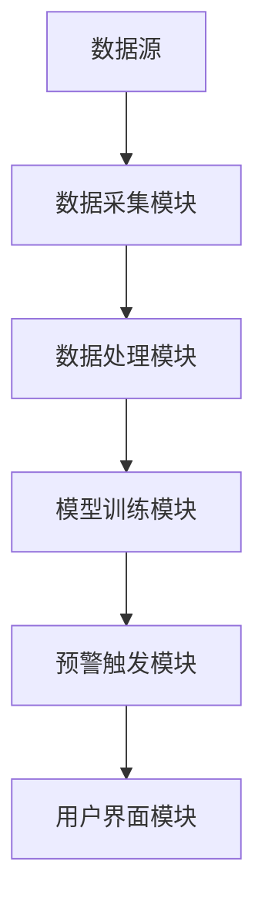
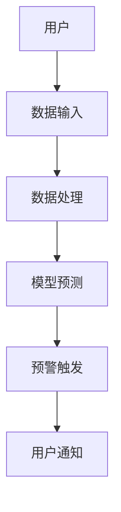
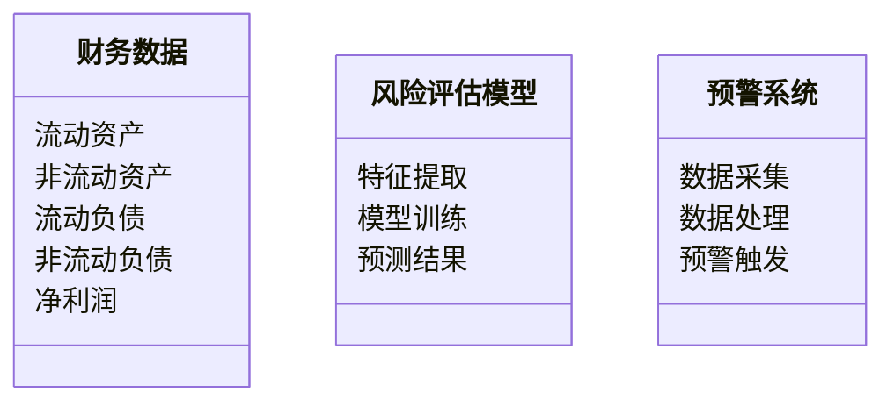

                 


# 设计智能化的企业财务压力预警系统

## 关键词：
智能化、财务压力、预警系统、机器学习、数据分析

## 摘要：
本文详细探讨了如何设计一个智能化的企业财务压力预警系统。通过结合机器学习和数据分析技术，该系统能够实时监控企业的财务状况，识别潜在风险，并提供预警。文章首先介绍了系统的设计背景和目标，然后深入分析了核心概念、算法原理、系统架构，并通过实际案例展示了系统的实现过程。

---

# 第一部分: 企业财务压力预警系统背景与概念

## 第1章: 企业财务压力预警系统概述

### 1.1 问题背景与定义
#### 1.1.1 企业财务压力的概念
企业的财务压力是指企业在经营过程中由于内外部因素导致的财务状况恶化，可能影响企业正常运营甚至引发破产的风险。财务压力的表现形式多样，包括现金流不足、应收账款回收困难、利润率下降等。

#### 1.1.2 财务压力对企业的影响
财务压力可能导致企业无法按时偿还债务、供应链中断、员工薪资拖欠等问题，严重时甚至会导致企业倒闭。因此，及时发现和预警财务压力对企业的生存和发展至关重要。

#### 1.1.3 财务压力预警系统的定义与目标
财务压力预警系统是一种基于数据分析和机器学习技术的智能化系统，旨在通过实时监控企业的财务指标，识别潜在的财务风险，并提前发出预警信号，帮助企业采取措施缓解财务压力。

### 1.2 智能化预警的核心要素
#### 1.2.1 数据来源与特征
- 数据来源：企业内部财务报表、销售数据、成本数据、银行流水等；外部市场数据、行业趋势、宏观经济指标等。
- 数据特征：多维性（如时间、部门、产品）、连续性（实时更新）、相关性（不同指标之间的关联性）。

#### 1.2.2 预警模型的构建逻辑
- 数据采集：从多个数据源获取财务相关数据，清洗和预处理后进行特征提取。
- 模型训练：利用机器学习算法（如随机森林、XGBoost）训练分类模型，将企业分为高风险和低风险两类。
- 预警触发：当模型预测企业财务压力超过阈值时，触发预警机制。

#### 1.2.3 系统架构的组成与功能
- 数据采集模块：负责收集和处理财务数据。
- 数据分析模块：进行特征提取和模型训练。
- 预警触发模块：根据模型预测结果发出预警信号。
- 用户界面模块：展示预警信息和相关分析结果。

---

# 第二部分: 财务压力预警系统的核心概念与联系

## 第2章: 财务压力预警的核心概念

### 2.1 财务压力指标体系
#### 2.1.1 财务健康指数的定义
财务健康指数是衡量企业财务状况健康程度的综合指标，通常基于多个财务指标（如流动比率、速动比率、净利润率等）加权计算得出。

#### 2.1.2 多维度压力指标分析
- 流动比率：衡量企业短期偿债能力。
- 速动比率：进一步衡量企业短期偿债能力，排除存货的影响。
- 净利润率：反映企业的盈利能力。
- 应收账款周转率：衡量企业回收账款的能力。

#### 2.1.3 指标权重的确定方法
指标权重可以通过层次分析法（AHP）或主成分分析（PCA）等方法确定。例如，使用层次分析法构建指标权重矩阵，计算各指标的权重值。

### 2.2 风险评估模型构建
#### 2.2.1 风险因子的选取
- 现金流稳定性：企业是否能够维持正常的现金流。
- 债务偿还能力：企业是否有足够的资产和现金流偿还债务。
- 盈利能力：企业是否能够持续盈利以支持运营和偿还债务。

#### 2.2.2 风险评估的层次分析法
层次分析法是一种用于多准则决策的定性分析方法，适合在多个风险因子中确定其重要性。通过构建层次结构模型，计算各因子的权重，最终确定企业的风险等级。

#### 2.2.3 模型的适用性分析
- 确保模型具有较高的准确性和召回率，避免漏报和误报。
- 定期更新模型，以适应市场变化和企业财务状况的变化。

### 2.3 数据预处理与特征工程
#### 2.3.1 数据清洗与标准化
- 数据清洗：处理缺失值、异常值和重复数据。
- 数据标准化：将不同量纲的指标进行标准化处理，使其具有可比性。

#### 2.3.2 特征选择与降维
- 特征选择：通过相关性分析或Lasso回归等方法筛选重要特征。
- 降维：使用主成分分析（PCA）减少特征维度，提高模型训练效率。

#### 2.3.3 时间序列数据的处理方法
时间序列数据具有自相关性和趋势性，需要使用专门的时间序列分析方法（如ARIMA、LSTM）进行建模和预测。

### 2.4 概念属性对比表
#### 表2-1: 财务压力预警系统核心概念属性对比

| 概念       | 属性             | 描述                                   |
|------------|------------------|--------------------------------------|
| 财务健康指数 | 计算方法         | 基于多个财务指标加权计算            |
| 风险因子    | 重要性           | 通过层次分析法确定                   |
| 数据预处理  | 方法             | 清洗、标准化、特征选择               |

### 2.5 ER实体关系图
#### 图2-1: 财务压力预警系统实体关系图



### 2.6 本章小结
本章介绍了财务压力预警系统的核心概念，包括财务健康指数、风险评估模型和数据预处理方法。通过层次分析法和时间序列分析方法，构建了系统的理论基础，并通过ER图展示了系统的实体关系。

---

# 第三部分: 预警系统算法原理与数学模型

## 第3章: 预警算法原理

### 3.1 基于机器学习的分类算法
#### 3.1.1 XGBoost算法原理
XGBoost是一种基于梯度提升的算法，通过多次迭代优化模型，具有高准确性和抗过拟合的特点。其数学模型如下：

$$
\text{目标函数} = \sum_{i=1}^{n} \left( y_i - \hat{y}_i \right)^2
$$

其中，$y_i$ 是真实值，$\hat{y}_i$ 是预测值。

#### 3.1.2 随机森林的应用
随机森林是一种基于决策树的集成算法，通过随机采样和特征选择提高模型的泛化能力。其核心思想是将多个决策树的结果进行投票或平均，降低模型的方差。

#### 3.1.3 支持向量机的适用场景
支持向量机（SVM）适用于小样本数据和高维数据的分类问题。通过构建最大-margin分类器，将数据映射到高维空间，实现线性可分。

### 3.2 时间序列分析方法
#### 3.2.1 ARIMA模型原理
ARIMA模型是一种常用的时间序列分析模型，适用于具有趋势性和季节性的数据。其数学表达式为：

$$
\phi(B)Z_t = \theta(B)\epsilon_t
$$

其中，$\phi(B)$ 和 $\theta(B)$ 是多项式系数，$Z_t$ 是平稳时间序列，$\epsilon_t$ 是白噪声。

#### 3.2.2 LSTM网络的应用
长短时记忆网络（LSTM）是一种特殊的循环神经网络，适合处理时间序列数据。其核心思想是通过记忆单元（cell）和门控机制（遗忘门、输入门、输出门）捕捉时间序列中的长期依赖关系。

#### 3.2.3 异常检测算法
异常检测算法用于识别数据中的异常值，常用的方法包括Isolation Forest和One-Class SVM。这些算法可以帮助发现数据中的异常点，从而提前预警潜在风险。

### 3.3 预警模型的数学公式
#### 图3-1: 机器学习分类算法流程图



### 3.4 本章小结
本章详细介绍了几种常用的机器学习算法，包括XGBoost、随机森林、SVM和LSTM网络，并通过数学公式和流程图展示了它们的工作原理。这些算法可以根据不同的数据特性和需求选择使用，以提高预警系统的准确性和实时性。

---

# 第四部分: 系统架构与设计

## 第4章: 系统架构设计方案

### 4.1 问题场景介绍
#### 4.1.1 企业财务数据的多样性
企业的财务数据通常来自多个部门和系统，具有多样性和复杂性，需要进行整合和处理。

#### 4.1.2 预警系统的实时性要求
财务压力预警需要实时监控，及时发现潜在风险，因此系统必须具备高实时性。

#### 4.1.3 系统的可扩展性需求
随着企业业务的发展，系统需要能够扩展功能和处理更大的数据量。

### 4.2 项目介绍与功能需求
#### 4.2.1 系统功能模块
- 数据采集模块：从企业财务系统中获取数据。
- 数据处理模块：清洗、标准化和特征提取。
- 模型训练模块：基于机器学习算法训练预警模型。
- 预警触发模块：根据模型预测结果触发预警。
- 用户界面模块：展示预警信息和分析结果。

#### 4.2.2 系统架构图
#### 图4-1: 系统架构图



### 4.3 系统交互流程图
#### 图4-2: 系统交互流程图



### 4.4 系统功能设计
#### 4.4.1 领域模型
#### 图4-3: 领域模型类图



### 4.5 本章小结
本章介绍了系统的架构设计，包括功能模块划分、系统架构图和交互流程图。通过合理的系统设计，确保了预警系统的高效性和可扩展性。

---

# 第五部分: 项目实战与案例分析

## 第5章: 项目实战

### 5.1 环境安装与配置
- 安装Python环境（如Anaconda）。
- 安装必要的库（如pandas、numpy、scikit-learn、xgboost）。

### 5.2 核心代码实现
#### 5.2.1 数据采集与处理
```python
import pandas as pd

# 数据采集
df = pd.read_csv('financial_data.csv')

# 数据清洗
df.dropna(inplace=True)
df = pd.get_dummies(df)
```

#### 5.2.2 模型训练
```python
from xgboost import XGBClassifier

# 特征选择
features = df.drop('label', axis=1)
label = df['label']

# 模型训练
model = XGBClassifier()
model.fit(features, label)
```

#### 5.2.3 预警触发
```python
# 预测结果
 predictions = model.predict(features)

# 预警触发
threshold = 0.8
预警结果 = predictions[predictions > threshold]
```

### 5.3 案例分析与解读
通过实际案例分析，验证系统的预警效果。例如，假设某企业财务数据经过模型训练后，预测其财务压力指数超过阈值，系统会立即触发预警，提醒企业采取措施。

### 5.4 项目小结
本章通过实际项目展示了系统的实现过程，包括数据采集、特征工程、模型训练和预警触发等步骤。通过案例分析，验证了系统的有效性和实用性。

---

# 第六部分: 总结与扩展

## 第6章: 总结与扩展

### 6.1 最佳实践 tips
- 数据质量是预警系统的基础，确保数据的准确性和完整性。
- 定期更新模型，适应市场变化和企业财务状况的变化。
- 结合企业实际情况，灵活调整预警阈值和模型参数。

### 6.2 小结
本文详细介绍了智能化企业财务压力预警系统的构建过程，从背景分析到系统设计，再到项目实现，全面展示了系统的理论基础和实践应用。

### 6.3 注意事项
- 数据隐私和安全问题需要高度重视，确保数据不被泄露或滥用。
- 系统的实时性和稳定性是关键，需要采用高效的计算和可靠的架构设计。

### 6.4 拓展阅读
- 《机器学习实战》：深入理解机器学习算法及其应用。
- 《数据挖掘导论》：学习数据挖掘技术在企业预警系统中的应用。

---

通过以上设计，您可以根据需要逐步实现一个智能化的企业财务压力预警系统，帮助企业在复杂多变的商业环境中保持财务健康，防范风险。

