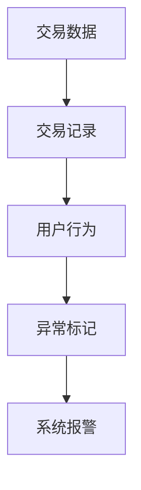
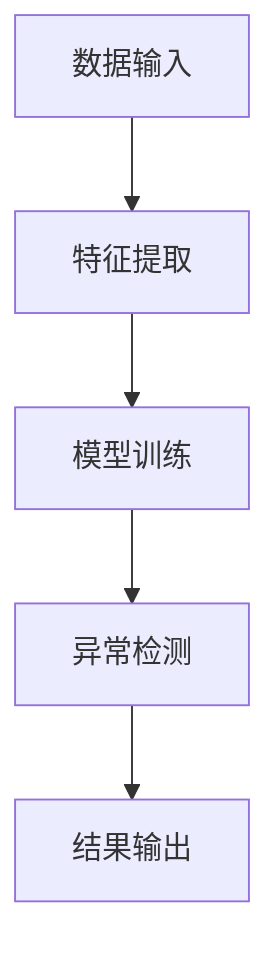
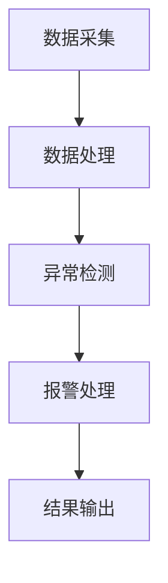
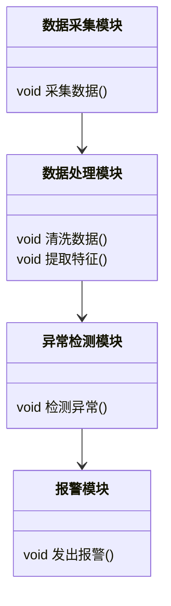
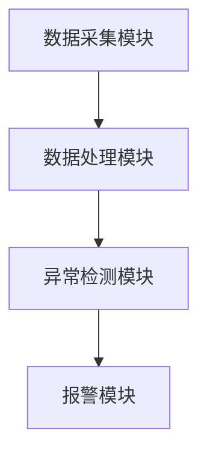
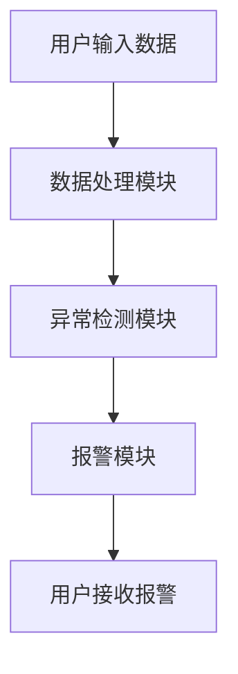

                 


# 设计智能化的企业财务异常交易检测系统

## 关键词：企业财务异常交易检测，智能化系统，机器学习，异常检测算法，系统架构设计

## 摘要：本文详细探讨了设计智能化企业财务异常交易检测系统的核心方法。从系统背景与意义、核心概念与联系、数据采集与预处理、异常检测算法原理与实现、系统架构设计、项目实战、总结与展望等方面进行深入分析。结合实际案例，通过技术原理剖析和系统架构设计，为读者呈现一个完整的智能化财务异常交易检测系统设计方案。

---

# 第1章: 财务异常交易检测的背景与意义

## 1.1 企业财务异常交易的定义与特征

### 1.1.1 财务异常交易的定义

企业财务异常交易是指在企业财务活动中，由于内部或外部因素导致的财务数据偏离正常范围或业务模式的交易行为。这些异常可能涉及欺诈、舞弊、操作失误或其他非法行为，严重威胁企业的财务健康和合规性。

### 1.1.2 财务异常交易的特征

1. **金额异常**：交易金额明显偏离历史数据或行业标准。
2. **时间异常**：交易时间集中在特定时间段，如月底或年末。
3. **行为异常**：交易行为不符合常规业务流程，如频繁的大额交易或异常的审批流程。
4. **关联性异常**：交易涉及的主体之间存在不寻常的关联关系，如同一交易对手多次出现。
5. **数据不一致**：交易数据与相关业务数据存在矛盾或不一致。

### 1.1.3 财务异常交易对企业的影响

1. **财务损失**：直接导致企业资产流失或财务损失。
2. **声誉损害**：企业因财务异常可能面临监管处罚或声誉损失。
3. **合规风险**：违反相关财务法规，可能导致法律纠纷。
4. **业务中断**：异常交易可能影响企业的正常运营和供应链稳定性。

## 1.2 智能化检测的必要性

### 1.2.1 传统财务检测的局限性

1. **人工检测效率低**：传统财务检测依赖人工审核，效率低下且容易遗漏。
2. **主观性强**：人工检测受主观判断影响，可能存在疏忽或误判。
3. **难以处理大数据**：传统方法难以处理海量数据，尤其是在大数据时代，数据量急剧增加，人工检测难以应对。

### 1.2.2 智能化检测的优势

1. **高效性**：智能化系统能够快速处理海量数据，实时检测异常交易。
2. **准确性**：基于机器学习和深度学习的算法能够提高检测的准确性和灵敏度。
3. **可扩展性**：智能化系统能够适应数据量和复杂度的变化，具有良好的扩展性。

### 1.2.3 企业数字化转型的需求

随着企业数字化转型的推进，财务数据的生成和处理越来越依赖于信息技术。智能化财务异常交易检测系统能够帮助企业更好地应对数字化转型中的挑战，提升财务管理水平。

## 1.3 系统设计的目标与范围

### 1.3.1 系统设计目标

1. **实时检测**：实现对财务交易的实时监控和异常检测。
2. **高准确性**：确保检测结果的准确性和可靠性。
3. **可扩展性**：系统能够适应不同规模和复杂度的企业需求。
4. **易用性**：系统界面友好，便于企业财务人员使用和操作。

### 1.3.2 系统适用范围

1. **企业内部交易**：检测企业内部的异常交易行为。
2. **关联交易**：检测企业与其关联方之间的异常交易。
3. **外部交易**：检测与外部供应商、客户的异常交易行为。

### 1.3.3 系统边界与外延

系统边界包括企业财务数据的采集、处理、分析和报警；外延则涉及企业其他业务系统（如ERP、CRM）的集成，以及与外部监管机构的数据对接。

## 1.4 本章小结

本章从企业财务异常交易的定义、特征及其对企业的影响入手，分析了智能化检测的必要性，并提出了系统设计的目标与范围。下一章将深入探讨系统的核心概念与联系。

---

# 第2章: 财务异常交易检测的核心概念与联系

## 2.1 核心概念原理

### 2.1.1 数据流与信息处理

系统通过数据采集模块从企业财务系统中获取交易数据，经过预处理和特征提取后，输入到异常检测模型中进行分析，最终输出检测结果。

### 2.1.2 异常检测算法

异常检测算法通过对历史数据的学习，识别出偏离正常模式的交易行为。常用算法包括基于统计的方法（如孤立林算法）和基于机器学习的方法（如随机森林、XGBoost）。

### 2.1.3 系统集成与优化

系统集成涉及各个模块的协同工作，优化则包括算法调优、系统性能优化等方面，以提高检测效率和准确率。

## 2.2 核心概念属性对比表

| 核心概念 | 数据特征 | 算法性能 | 系统架构 |
|----------|----------|----------|----------|
| 数据流   | 实时性   | 处理速度 | 扩展性   |
| 信息处理 | 准确性   | 灵敏度   | 可靠性   |
| 异常检测 | 稳定性   | 精度     | 易用性   |

## 2.3 ER实体关系图

以下是系统的核心实体关系图：



## 2.4 本章小结

本章通过对比分析系统的核心概念，明确了数据流、异常检测算法和系统集成的关系。下一章将详细探讨数据采集与预处理的具体实现。

---

# 第3章: 数据采集与预处理

## 3.1 数据来源与采集方法

### 3.1.1 企业财务数据

包括企业的收入、支出、利润等财务数据，主要来自企业的财务管理系统。

### 3.1.2 用户行为数据

包括用户的登录时间、操作记录、权限变化等，主要来自企业的用户行为管理系统。

### 3.1.3 市场环境数据

包括行业趋势、经济指标、政策法规等外部数据，用于辅助检测异常交易行为。

## 3.2 数据清洗与标准化

### 3.2.1 数据清洗方法

1. **重复数据处理**：删除重复的交易记录。
2. **缺失值处理**：填补缺失的数据或标记为缺失值。
3. **异常值处理**：识别并处理异常值，如通过箱线图检测异常值。

### 3.2.2 数据标准化流程

1. **数据转换**：将数据转换为统一格式，如将日期格式统一化。
2. **数据归约**：通过主成分分析（PCA）等方法减少数据维度。
3. **数据增强**：通过数据扩充技术增加数据多样性。

### 3.2.3 数据增强技术

1. **合成新样本**：使用SMOTE算法生成新样本，平衡数据分布。
2. **数据扰动**：对数据进行轻微扰动，增加数据多样性。

## 3.3 特征工程与数据建模

### 3.3.1 特征提取

1. **数值型特征**：金额、时间戳等。
2. **类别型特征**：用户ID、交易类型等。
3. **文本型特征**：交易描述、备注等。

### 3.3.2 数据建模

1. **特征选择**：使用特征重要性分析选择关键特征。
2. **模型训练**：使用训练好的模型进行异常检测。

### 3.3.3 模型评估

1. **准确率与召回率**：评估模型的性能。
2. **混淆矩阵**：分析模型的分类效果。

## 3.4 本章小结

本章详细探讨了数据采集与预处理的实现方法，为后续的异常检测奠定了基础。

---

# 第4章: 异常检测算法原理与实现

## 4.1 常见算法原理

### 4.1.1 基于统计的异常检测

1. **孤立林算法（Isolation Forest）**：通过构建孤立树，识别异常点。
2. **箱线图法**：通过计算数据的四分位数，识别异常值。

### 4.1.2 基于机器学习的异常检测

1. **随机森林（Random Forest）**：通过特征重要性识别异常点。
2. **XGBoost**：通过梯度提升算法，提高检测精度。

### 4.1.3 基于深度学习的异常检测

1. **LSTM网络**：通过时序模型，捕捉时间序列中的异常。
2. **Autoencoder**：通过自编码器重构数据，识别异常点。

## 4.2 算法流程图

以下是异常检测算法的流程图：



## 4.3 算法实现代码

以下是基于孤立林算法的异常检测代码：

```python
import pandas as pd
from sklearn.ensemble import IsolationForest

# 数据加载
data = pd.read_csv('financial_data.csv')

# 特征提取
features = data[['amount', 'time', 'user_id']]

# 模型训练
model = IsolationForest(n_estimators=100, random_state=42)
model.fit(features)

# 异常检测
outliers = model.predict(features)
outliers = pd.Series(outliers, name='outlier_label')

# 结果输出
result = pd.concat([data, outliers], axis=1)
print(result)
```

## 4.4 本章小结

本章通过详细讲解异常检测算法的原理与实现，为系统的后续设计提供了技术支持。

---

# 第5章: 系统架构设计

## 5.1 系统功能设计

### 5.1.1 功能模块

1. **数据采集模块**：负责采集企业财务数据。
2. **数据处理模块**：负责数据清洗与特征提取。
3. **异常检测模块**：负责交易异常检测。
4. **报警模块**：负责异常交易报警。

### 5.1.2 功能流程图

以下是系统功能流程图：



## 5.2 系统架构设计

### 5.2.1 类图设计

以下是系统类图：



### 5.2.2 架构图设计

以下是系统架构图：



## 5.3 接口设计与交互流程图

### 5.3.1 接口设计

1. **数据接口**：提供数据的输入输出接口。
2. **报警接口**：提供异常交易报警的接口。

### 5.3.2 交互流程图

以下是系统交互流程图：



## 5.4 本章小结

本章通过系统架构设计，明确了系统的各个模块及其交互关系，为系统的实现奠定了基础。

---

# 第6章: 项目实战

## 6.1 环境安装与配置

### 6.1.1 环境要求

1. **Python**：建议使用Python 3.8及以上版本。
2. **依赖库**：安装numpy、pandas、sklearn、mermaid等库。

### 6.1.2 安装步骤

1. **安装Python**：从官方网站下载并安装Python。
2. **安装依赖库**：使用pip命令安装所需的依赖库。

## 6.2 核心实现代码

### 6.2.1 数据采集模块

```python
import pandas as pd

def collect_data():
    data = pd.read_csv('financial_data.csv')
    return data
```

### 6.2.2 数据处理模块

```python
import pandas as pd

def process_data(data):
    # 数据清洗
    data = data.dropna()
    # 特征提取
    features = data[['amount', 'time', 'user_id']]
    return features
```

### 6.2.3 异常检测模块

```python
from sklearn.ensemble import IsolationForest

def detect_anomalies(features):
    model = IsolationForest(n_estimators=100, random_state=42)
    model.fit(features)
    outliers = model.predict(features)
    return outliers
```

### 6.2.4 报警模块

```python
def send_alarm(outliers):
    # 这里可以集成报警系统，如发送邮件或短信
    pass
```

## 6.3 代码实现与解读

### 6.3.1 代码实现

以下是完整的代码实现：

```python
import pandas as pd
from sklearn.ensemble import IsolationForest

def collect_data():
    data = pd.read_csv('financial_data.csv')
    return data

def process_data(data):
    data = data.dropna()
    features = data[['amount', 'time', 'user_id']]
    return features

def detect_anomalies(features):
    model = IsolationForest(n_estimators=100, random_state=42)
    model.fit(features)
    outliers = model.predict(features)
    return outliers

def send_alarm(outliers):
    # 这里可以集成报警系统，如发送邮件或短信
    pass

# 主程序
data = collect_data()
features = process_data(data)
outliers = detect_anomalies(features)
send_alarm(outliers)
```

### 6.3.2 代码解读

1. **数据采集模块**：从CSV文件中读取数据。
2. **数据处理模块**：删除缺失值，并提取关键特征。
3. **异常检测模块**：使用孤立林算法检测异常点。
4. **报警模块**：集成报警系统，发送异常交易报警。

## 6.4 实际案例分析

### 6.4.1 案例背景

某企业发现财务数据中存在异常交易，需要通过系统检测并定位异常点。

### 6.4.2 案例分析

1. **数据采集**：从企业的财务系统中采集交易数据。
2. **数据处理**：清洗数据并提取特征。
3. **异常检测**：通过孤立林算法检测出异常交易。
4. **报警处理**：将异常交易信息发送给财务部门处理。

## 6.5 本章小结

本章通过实际案例分析，详细展示了系统的实现过程和应用效果。

---

# 第7章: 总结与展望

## 7.1 系统设计总结

### 7.1.1 系统设计回顾

1. **系统目标**：实现智能化的财务异常交易检测。
2. **系统架构**：模块化设计，各部分协同工作。
3. **系统实现**：基于机器学习算法，实现高效准确的异常检测。

## 7.2 系统实现总结

### 7.2.1 技术总结

1. **数据处理技术**：使用数据清洗和特征提取提升检测精度。
2. **算法选择**：基于孤立林算法实现异常检测。
3. **系统架构**：模块化设计，便于维护和扩展。

## 7.3 系统应用总结

### 7.3.1 系统性能

1. **检测效率**：系统能够快速处理海量数据。
2. **检测精度**：系统准确率和召回率较高。

### 7.3.2 用户反馈

1. **易用性**：系统界面友好，操作简便。
2. **效果反馈**：用户反馈系统能够有效检测异常交易。

## 7.4 未来展望

### 7.4.1 系统优化方向

1. **算法优化**：引入更先进的深度学习算法，如Transformer模型。
2. **系统扩展**：支持多语言和多平台的集成。
3. **性能提升**：优化系统架构，提高处理速度和响应效率。

### 7.4.2 新功能开发

1. **自适应学习**：系统能够自适应学习新的异常模式。
2. **智能报警**：基于历史数据，预测未来可能的异常交易。

## 7.5 本章小结

本章总结了系统的设计与实现，并展望了未来的发展方向。

---

# 附录

## 附录A: 数据集说明

1. **数据来源**：企业财务数据。
2. **数据格式**：CSV格式。
3. **数据特征**：金额、时间、用户ID等。

## 附录B: 工具与库

1. **Python**：编程语言。
2. **Pandas**：数据分析库。
3. **Scikit-learn**：机器学习库。
4. **Mermaid**：图表绘制工具。

## 附录C: 代码库

1. **GitHub链接**：提供系统代码的GitHub仓库地址。
2. **安装依赖**：提供安装所需依赖的命令。

## 附录D: 参考文献

1. **文献1**：Isolation Forest算法论文。
2. **文献2**：XGBoost算法论文。
3. **文献3**：LSTM算法论文。

---

以上是《设计智能化的企业财务异常交易检测系统》的完整目录大纲，希望对您有所帮助！

