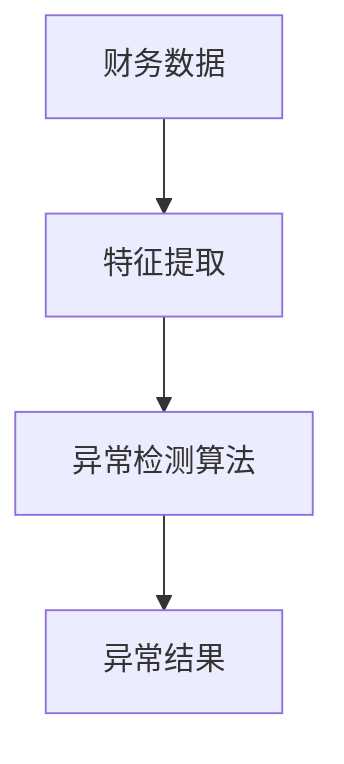
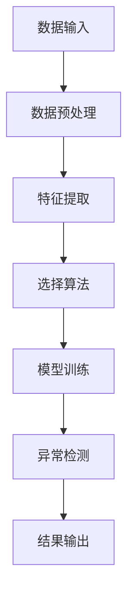
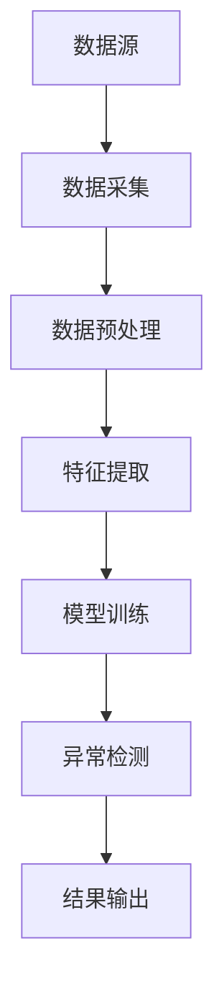
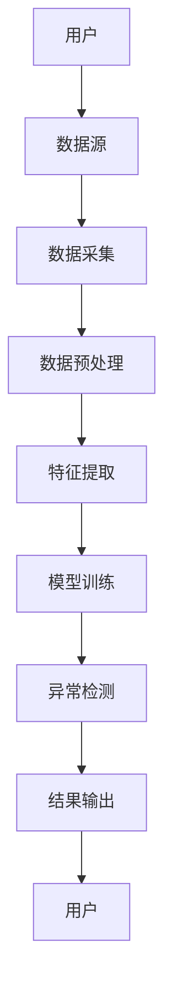

                 


# 设计智能化的企业财务异常检测模型

## 关键词
企业财务异常检测, 智能化检测, 异常检测算法, 数据特征分析, 系统架构设计

## 摘要
本文详细探讨了设计智能化企业财务异常检测模型的全过程，从背景分析到系统实现，结合实际案例，深入讲解了财务异常检测的核心概念、算法原理及系统架构设计。文章内容涵盖数据预处理、特征提取、算法选择、模型训练及结果解释等多个环节，并通过具体代码实现和图表分析，展示了智能化财务异常检测的实际应用价值和未来发展方向。

---

# 第一部分: 企业财务异常检测的背景与核心概念

## 第1章: 财务异常检测的背景与问题描述

### 1.1 财务异常检测的背景
#### 1.1.1 企业财务风险的现状与挑战
随着全球经济的快速发展，企业财务风险问题日益突出。企业财务异常现象，如财务造假、资金链断裂等，不仅影响企业的健康发展，还可能导致严重的经济损失和社会信任危机。传统的财务分析方法往往依赖人工判断，效率低下且容易受到主观因素的影响。因此，如何利用智能化技术提升财务异常检测的准确性和效率，成为当前企业财务管理的重要课题。

#### 1.1.2 财务异常检测的重要性
财务异常检测是企业风险管理的核心环节，其目的是通过及时发现和预警潜在的财务问题，帮助企业采取有效措施规避风险。例如，通过检测财务报表中的异常数据，企业可以及时发现潜在的财务舞弊行为，从而避免重大经济损失。此外，财务异常检测还能帮助企业管理层优化资源配置，提高财务决策的科学性。

#### 1.1.3 智能化财务异常检测的必要性
传统财务异常检测方法主要依赖人工分析，存在效率低、成本高、覆盖面有限等问题。随着大数据和人工智能技术的快速发展，智能化财务异常检测成为可能。通过利用机器学习、深度学习等技术，企业可以实现对海量财务数据的自动化分析，快速识别异常模式和潜在风险，从而显著提升财务风险管理的效率和准确性。

### 1.2 财务异常检测的问题描述
#### 1.2.1 财务异常的定义与分类
财务异常是指企业财务数据偏离正常状态的异常情况。常见的财务异常类型包括：
- 数据异常：如销售额突然下降、成本比例异常增加等。
- 结构异常：如应收账款占收入比例显著提高、存货周转率骤降等。
- 行为异常：如频繁的大额交易、资金流向异常等。

#### 1.2.2 财务异常检测的目标与范围
财务异常检测的目标是通过分析财务数据，识别潜在的异常情况，并提供预警信息。其范围涵盖企业的各个财务维度，包括收入、成本、利润、现金流、资产负债表等。此外，还需要考虑时间维度，即分析财务数据的变化趋势，以判断异常情况的持续性和严重性。

#### 1.2.3 财务异常检测的边界与外延
财务异常检测的边界主要在于数据的范围和模型的应用场景。例如，模型可能仅针对特定行业的财务数据进行分析，或者仅适用于特定类型的异常检测。外延方面，财务异常检测可以与其他管理系统（如ERP、CRM）集成，实现更全面的企业风险管理。

### 1.3 财务异常检测的核心要素
#### 1.3.1 数据特征分析
数据特征分析是财务异常检测的基础，主要包括：
- 数据的分布特征：如均值、方差、偏度等。
- 数据的时间序列特征：如趋势、周期性、突变点等。
- 数据的关联性特征：如变量间的相关性、因果关系等。

#### 1.3.2 模型特征提取
模型特征提取是将原始数据转化为适合算法处理的特征向量。常见的特征提取方法包括：
- 主成分分析（PCA）：用于降维和提取主要特征。
- 线性判别分析（LDA）：用于分类问题的特征提取。
- Word2Vec：用于文本数据的特征表示。

#### 1.3.3 异常检测算法选择
异常检测算法的选择需要考虑数据类型、异常比例、计算效率等因素。常见的算法包括：
- 基于统计的异常检测：如Z-score、Mahalanobis距离。
- 基于机器学习的异常检测：如Isolation Forest、LOF（局部 outlier factor）。
- 基于深度学习的异常检测：如Autoencoder、VAE（变分自编码器）。

---

## 第2章: 财务异常检测的核心概念与联系

### 2.1 财务异常检测的核心原理
#### 2.1.1 数据预处理与特征提取
数据预处理是异常检测的关键步骤，主要包括数据清洗、标准化、特征工程等。例如，对于财务数据中的缺失值，可以通过均值、中位数或插值法进行填充；对于异常值，可以通过箱线图或Z-score方法进行剔除。

#### 2.1.2 异常检测算法原理
异常检测算法的核心在于通过学习正常数据的分布，识别偏离正常模式的数据点。例如，LOF算法通过计算数据点的局部密度来判断其是否为异常点。

#### 2.1.3 结果解释与反馈机制
异常检测的结果需要通过可视化工具（如热图、分箱图）进行展示，并结合业务背景进行解释。例如，发现某个月份的销售收入异常下降，可能需要进一步调查是否存在市场需求下降或销售策略调整等问题。

### 2.2 财务异常检测的核心概念对比
#### 2.2.1 数据特征对比分析
通过对比不同算法的数据特征要求，选择最适合的算法。例如，LOF算法适用于高维数据，而Isolation Forest算法适用于大规模数据。

#### 2.2.2 模型特征对比分析
不同算法的模型特征包括训练时间、计算复杂度、异常检测效果等。例如，基于统计的异常检测算法计算速度快，但检测精度较低；基于深度学习的异常检测算法计算复杂度高，但检测精度较高。

#### 2.2.3 异常检测算法对比分析
通过对比不同算法的优缺点，选择最适合企业需求的算法。例如，对于小样本数据，Isolation Forest算法表现优于LOF算法；对于高维数据，LOF算法表现优于基于统计的方法。

### 2.3 财务异常检测的实体关系图


---

## 第3章: 异常检测算法原理

### 3.1 异常检测算法概述
#### 3.1.1 基于统计的异常检测
基于统计的异常检测方法通过计算数据的统计量（如均值、标准差）来判断异常点。例如，使用Z-score方法：
$$Z = \frac{X - \mu}{\sigma}$$
其中，$\mu$是均值，$\sigma$是标准差。通常，$|Z| > 3$时，数据点被认为是异常的。

#### 3.1.2 基于机器学习的异常检测
基于机器学习的异常检测方法通过训练模型来学习正常数据的分布，识别异常点。例如，Isolation Forest算法通过构建随机森林，将数据点隔离到叶子节点，计算每个点的异常分数：
$$score = \frac{1}{(h(x) + 1)}$$
其中，$h(x)$是数据点$x$所在的叶子节点深度。

#### 3.1.3 基于深度学习的异常检测
基于深度学习的异常检测方法通过构建神经网络模型，学习数据的潜在特征，识别异常点。例如，Autoencoder算法通过重构损失来判断异常点：
$$L = ||x - \hat{x}||
$$
其中，$\hat{x}$是模型重构后的数据，$L$是重构损失。通常，$L > \theta$时，数据点被认为是异常的。

### 3.2 常见异常检测算法
#### 3.2.1 LOF算法
LOF算法通过计算数据点的局部密度来判断其是否为异常点。其核心公式为：
$$LOF(i) = \frac{density(i)}{density_{k}(i)}$$
其中，$density(i)$是数据点$i$的密度，$density_{k}(i)$是数据点$i$的$k$近邻密度。

#### 3.2.2 Isolation Forest算法
Isolation Forest算法通过构建随机树，将数据点隔离到叶子节点，计算每个点的异常分数：
$$score = \frac{1}{(h(x) + 1)}$$
其中，$h(x)$是数据点$x$所在的叶子节点深度。

#### 3.2.3 Autoencoder算法
Autoencoder算法通过构建编码器和解码器，学习数据的潜在特征，识别异常点。其核心公式为：
$$z = \sigma(Wx + b)$$
$$\hat{x} = \sigma(W^T z + b)$$
$$L = ||x - \hat{x}||
$$
其中，$W$和$b$是模型参数，$\sigma$是激活函数，$L$是重构损失。

### 3.3 异常检测算法流程图


---

## 第4章: 异常检测算法的数学模型与公式

### 4.1 LOF算法的数学模型
LOF算法通过计算数据点的局部密度来判断其是否为异常点。其核心公式为：
$$LOF(i) = \frac{density(i)}{density_{k}(i)}$$
其中，$density(i)$是数据点$i$的密度，$density_{k}(i)$是数据点$i$的$k$近邻密度。

### 4.2 Isolation Forest算法的数学模型
Isolation Forest算法通过构建随机树，将数据点隔离到叶子节点，计算每个点的异常分数：
$$score = \frac{1}{(h(x) + 1)}$$
其中，$h(x)$是数据点$x$所在的叶子节点深度。

### 4.3 Autoencoder算法的数学模型
Autoencoder算法通过构建编码器和解码器，学习数据的潜在特征，识别异常点。其核心公式为：
$$z = \sigma(Wx + b)$$
$$\hat{x} = \sigma(W^T z + b)$$
$$L = ||x - \hat{x}||
$$
其中，$W$和$b$是模型参数，$\sigma$是激活函数，$L$是重构损失。

---

## 第5章: 系统分析与架构设计

### 5.1 系统分析
#### 5.1.1 问题场景
财务异常检测系统需要处理大量的财务数据，包括收入、成本、利润、现金流等。常见的问题场景包括：
- 财务数据中的异常值检测。
- 财务数据的时间序列分析。
- 财务数据的分类与预测。

#### 5.1.2 系统功能设计
财务异常检测系统需要实现以下功能：
- 数据采集与预处理。
- 特征提取与模型训练。
- 异常检测与结果解释。
- 结果可视化与报告生成。

### 5.2 系统架构设计
#### 5.2.1 系统架构图


#### 5.2.2 接口与交互设计
系统需要提供以下接口：
- 数据接口：用于数据的采集和导入。
- 模型接口：用于模型的训练和部署。
- 结果接口：用于结果的输出和可视化。

#### 5.2.3 系统交互图


---

## 第6章: 项目实战

### 6.1 环境安装
项目需要以下环境：
- Python 3.6+
- Scikit-learn、XGBoost、Keras等机器学习库。
- Pandas、NumPy等数据处理库。
- Matplotlib、Seaborn等可视化库。

### 6.2 核心代码实现
#### 6.2.1 数据预处理
```python
import pandas as pd
import numpy as np

# 加载数据
data = pd.read_csv('financial_data.csv')

# 数据清洗
data.dropna(inplace=True)

# 标准化处理
from sklearn.preprocessing import StandardScaler
scaler = StandardScaler()
data_scaled = scaler.fit_transform(data)
```

#### 6.2.2 特征提取
```python
from sklearn.decomposition import PCA

pca = PCA(n_components=10)
principal_components = pca.fit_transform(data_scaled)
```

#### 6.2.3 模型训练与异常检测
```python
from sklearn.ensemble import IsolationForest

# 训练模型
model = IsolationForest(n_estimators=100, random_state=42)
model.fit(principal_components)

# 预测异常点
outlier_scores = model.predict(principal_components)
```

#### 6.2.4 结果可视化
```python
import matplotlib.pyplot as plt

# 绘制异常点分布图
plt.scatter(principal_components[outlier_scores == 1, 0], principal_components[outlier_scores == 1, 1], c='blue', label='正常点')
plt.scatter(principal_components[outlier_scores == -1, 0], principal_components[outlier_scores == -1, 1], c='red', label='异常点')
plt.xlabel('主成分1')
plt.ylabel('主成分2')
plt.legend()
plt.show()
```

### 6.3 案例分析
假设我们有一个企业的财务数据集，包含收入、成本、利润、现金流等指标。通过上述代码实现，我们可以训练一个Isolation Forest模型，并识别出异常的财务数据点。例如，发现某个月份的收入突然下降，可能是由于市场需求下降或销售策略调整等原因。

### 6.4 项目总结
通过本项目，我们可以看到智能化财务异常检测模型的优势。首先，模型可以快速处理大量数据，显著提高检测效率；其次，模型可以通过学习正常数据的分布，识别潜在的异常模式，从而提高检测的准确性；最后，模型可以通过可视化工具，将检测结果以直观的方式展示出来，方便企业进行后续分析和决策。

---

## 第7章: 最佳实践与未来展望

### 7.1 最佳实践
- 数据预处理是关键：确保数据的完整性和准确性，避免噪声数据对模型的影响。
- 特征工程不可忽视：选择合适的特征可以显著提高模型的检测效果。
- 模型选择要灵活：根据数据特点和业务需求，选择最适合的算法。
- 结果解释要清晰：通过可视化工具和业务背景，帮助用户理解模型的检测结果。

### 7.2 小结
智能化财务异常检测模型通过结合大数据和人工智能技术，显著提升了财务风险管理的效率和准确性。随着技术的不断发展，未来还可以在以下几个方面进行优化：
- 异常检测算法的优化：如基于深度学习的异常检测算法。
- 多模态数据的融合：如结合文本数据和财务数据，进行综合分析。
- 实时检测与预警：通过流数据处理技术，实现财务异常的实时检测和预警。

### 7.3 注意事项
- 数据隐私与安全：在处理财务数据时，需要注意数据的隐私保护，防止数据泄露。
- 模型的可解释性：财务异常检测需要模型具有较高的可解释性，以便用户理解检测结果。
- 模型的可扩展性：随着数据量的增加，模型需要具备良好的扩展性，能够处理更大规模的数据。

### 7.4 拓展阅读
- 《Anomaly Detection: A Survey》
- 《Isolation Forest: A New Algorithm for Outlier Detection》
- 《Autoencoder-based Anomaly Detection: A Review》

---

## 结语
设计智能化的企业财务异常检测模型是一个复杂的系统工程，需要结合数据预处理、特征提取、算法选择、模型训练和结果解释等多个环节。通过本文的详细讲解，读者可以掌握财务异常检测的核心概念和算法原理，并能够实际操作，设计出适合自己企业需求的智能化财务异常检测系统。未来，随着人工智能技术的不断发展，财务异常检测将更加智能化、自动化，为企业财务管理提供更加强有力的支持。

