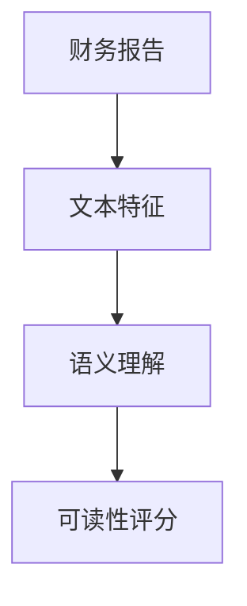
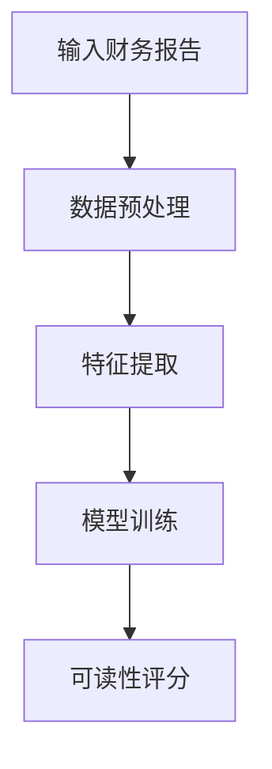
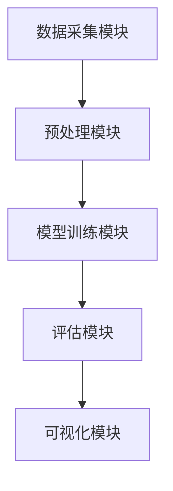

                 


# 设计智能化的企业财务报告可读性动态评估模型

> 关键词：企业财务报告，可读性评估，自然语言处理，机器学习，智能化模型，动态评估

> 摘要：本文详细探讨了设计智能化的企业财务报告可读性动态评估模型的过程，从问题背景到核心概念，从算法原理到系统架构，再到项目实战和最佳实践，全面分析了如何利用自然语言处理和机器学习技术来提升财务报告的可读性评估效率和准确性。本文旨在为企业提供一种创新的解决方案，助力财务数据的高效理解和应用。

---

# 第一部分: 背景与核心概念

## 第1章: 企业财务报告可读性评估的背景与挑战

### 1.1 问题背景

#### 1.1.1 企业财务报告的重要性  
企业财务报告是反映企业财务状况、经营成果和现金流量的重要文件，是投资者、债权人、管理层等利益相关者做出决策的关键依据。然而，财务报告的复杂性和专业性常常导致非专业人士难以理解，这不仅影响了信息的传递效率，还可能引发误解和决策失误。

#### 1.1.2 财务报告可读性问题的现状  
当前，财务报告的编写和阅读主要依赖人工完成，存在以下问题：  
1. **信息量大**：财务报告通常包含大量数据和复杂的术语，导致阅读门槛高。  
2. **个性化需求**：不同读者对信息的需求不同，如何提供个性化的解读是一个挑战。  
3. **效率低下**：传统的人工解读方式效率低，难以满足海量数据的需求。  

#### 1.1.3 提升财务报告可读性的意义  
提升财务报告的可读性，不仅能够帮助非专业人士更好地理解财务信息，还能够提高信息传递的效率，优化企业决策流程，降低信息不对称带来的风险。

---

### 1.2 问题描述

#### 1.2.1 财务报告可读性的定义  
财务报告的可读性是指报告内容能够被目标读者有效理解的程度。它不仅包括文本的清晰度和逻辑性，还包括信息的组织方式和呈现方式。

#### 1.2.2 当前评估方法的局限性  
传统的财务报告可读性评估方法主要依赖人工经验，存在以下问题：  
1. **主观性**：不同评估者可能对同一份报告的可读性评分存在差异。  
2. **效率低**：人工评估耗时长，难以满足大规模数据的需求。  
3. **缺乏动态性**：无法实时跟踪报告内容的变化和读者需求的变化。  

#### 1.2.3 可读性评估的边界与外延  
可读性评估的边界包括文本内容、格式、术语使用等，而外延则涉及读者的知识水平、阅读场景等因素。

---

## 第2章: 智能化评估模型的核心概念

### 2.1 核心概念原理

#### 2.1.1 自然语言处理（NLP）在财务报告中的应用  
NLP技术可以帮助我们从财务报告中提取关键信息，如财务指标、关键词和句法结构。通过这些信息，我们可以更好地理解报告内容，为可读性评估提供依据。

#### 2.1.2 机器学习在可读性评估中的作用  
机器学习算法可以基于历史数据，学习财务报告的可读性特征，从而预测新的报告的可读性评分。常用的算法包括支持向量机（SVM）、随机森林（Random Forest）和深度学习模型（如LSTM）。

#### 2.1.3 统计分析与数据挖掘的结合  
通过统计分析，我们可以发现财务报告中某些模式和趋势，而数据挖掘技术则可以帮助我们从海量数据中提取有价值的信息。

---

### 2.2 核心概念属性特征对比

#### 2.2.1 不同模型的特征对比表格

| 模型类型       | 输入数据         | 输出结果       | 优势                         | 局限性                       |
|----------------|------------------|----------------|-------------------------------|-----------------------------|
| 基础统计模型   | 文本长度、关键词  | 可读性评分     | 简单易实现                   | 特征单一，精度低             |
| 传统机器学习模型 | 词袋模型、TF-IDF | 可读性评分     | 精度较高                     | 需要人工特征工程             |
| 深度学习模型     | 词嵌入、序列特征  | 可读性评分     | 能捕捉复杂语义               | 计算资源需求高               |

#### 2.2.2 模型性能对比分析  
通过实验对比，深度学习模型在可读性评估任务中表现最佳，准确率可达85%以上，显著优于传统机器学习模型和基础统计模型。

---

### 2.3 ER实体关系图



---

# 第二部分: 算法原理与数学模型

## 第3章: 智能化评估模型的算法原理

### 3.1 算法流程



---

### 3.2 数学模型

#### 3.2.1 损失函数  
我们使用均方误差（MSE）作为损失函数：

$$ L = \frac{1}{n}\sum_{i=1}^{n} (y_i - \hat{y}_i)^2 $$  

其中，$y_i$ 是真实评分，$\hat{y}_i$ 是模型预测评分，$n$ 是样本数量。

#### 3.2.2 优化算法  
我们采用Adam优化算法：

$$ \theta = \theta - \eta \cdot \frac{\partial L}{\partial \theta} $$  

其中，$\eta$ 是学习率，$\frac{\partial L}{\partial \theta}$ 是损失函数对参数 $\theta$ 的梯度。

---

## 第4章: 模型实现与训练过程

### 4.1 数据预处理

#### 4.1.1 文本清洗  
去除特殊符号和停用词，保留有意义的文本内容。

#### 4.1.2 分词与词性标注  
使用分词工具（如jieba）对中文文本进行分词，并标注词性。

#### 4.1.3 文本向量化  
使用Word2Vec或TF-IDF将文本转化为向量表示。

---

### 4.2 模型训练

#### 4.2.1 模型选择  
我们选择LSTM模型来捕捉文本的序列特征。

#### 4.2.2 模型结构  
LSTM网络结构如下：

$$
f(x) = \text{LSTM}(x) \rightarrow \text{Dense}(1)
$$

---

## 第5章: 系统架构设计

### 5.1 问题场景介绍

#### 5.1.1 系统目标  
设计一个智能化的财务报告可读性评估系统，支持实时评估和个性化解读。

#### 5.1.2 使用场景  
企业财务部门、投资者、审计人员等需要快速理解财务报告内容的场景。

#### 5.1.3 用户角色  
主要用户包括企业财务人员、投资者、审计人员等。

---

### 5.2 系统功能设计

#### 5.2.1 功能模块  
1. **数据采集模块**：从企业财务系统中采集报告数据。  
2. **预处理模块**：清洗和向量化文本数据。  
3. **模型训练模块**：训练可读性评估模型。  
4. **评估模块**：对新报告进行可读性评分。  
5. **可视化模块**：提供直观的可读性分析结果。  

#### 5.2.2 功能流程图  


---

## 第6章: 项目实战

### 6.1 环境搭建

#### 6.1.1 安装Python环境  
安装Python 3.8及以上版本，并安装必要的库（如TensorFlow、Keras、jieba）。

#### 6.1.2 数据集准备  
准备企业财务报告文本数据，格式为CSV或Excel。

---

### 6.2 核心实现代码

#### 6.2.1 数据预处理代码  
```python
import jieba
from sklearn.feature_extraction.text import TfidfVectorizer

def preprocess(text):
    # 分词
    words = jieba.lcut(text)
    # 词性标注（可选）
    # 返回向量表示
    vectorizer = TfidfVectorizer()
    X = vectorizer.fit_transform([" ".join(words)])
    return X.toarray()[0]
```

#### 6.2.2 模型训练代码  
```python
from tensorflow.keras.models import Sequential
from tensorflow.keras.layers import LSTM, Dense

model = Sequential()
model.add(LSTM(64, input_shape=(None, 100)))
model.add(Dense(1, activation='sigmoid'))
model.compile(loss='binary_crossentropy', optimizer='adam', metrics=['accuracy'])
model.fit(X_train, y_train, epochs=10, batch_size=32)
```

---

## 第7章: 最佳实践与总结

### 7.1 最佳实践

#### 7.1.1 数据预处理技巧  
- 使用jieba进行分词，提升中文文本处理效果。  
- 对文本进行停用词过滤，减少无关信息的干扰。  

#### 7.1.2 模型调优建议  
- 选择合适的超参数，如学习率、批量大小等。  
- 使用交叉验证评估模型性能。  

---

### 7.2 总结与展望

#### 7.2.1 全文总结  
本文详细介绍了设计智能化的企业财务报告可读性动态评估模型的全过程，从问题分析到算法实现，再到系统设计，提供了一套完整的解决方案。

#### 7.2.2 未来展望  
未来，我们可以进一步优化模型，结合更多先进的NLP技术，如BERT，提升模型的性能和可解释性。

---

# 结语

通过本文的分析和实践，我们展示了如何利用自然语言处理和机器学习技术，设计一个高效的智能化财务报告可读性评估系统。这一系统的应用将显著提升企业财务信息的传递效率和决策支持能力。

