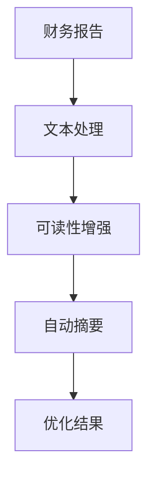
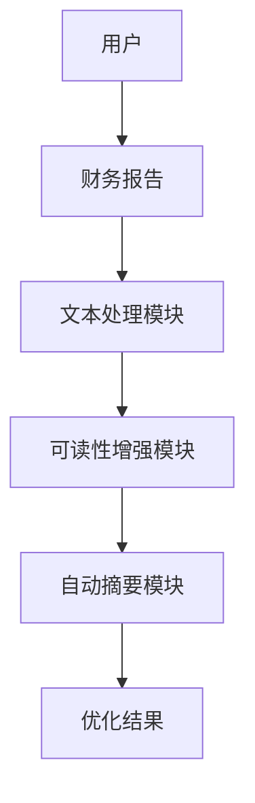
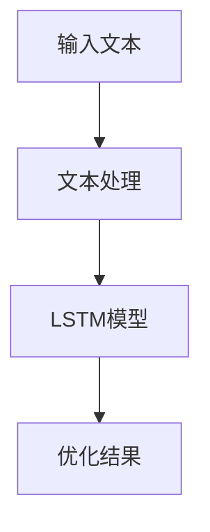
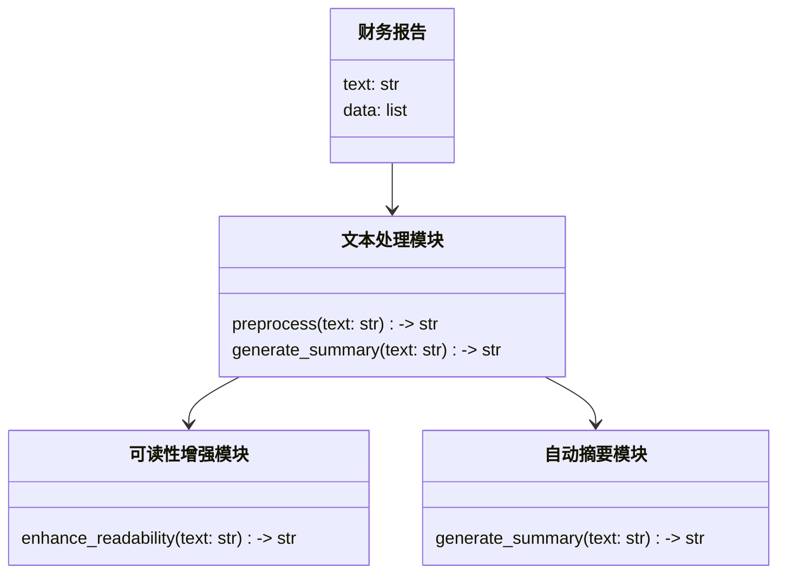
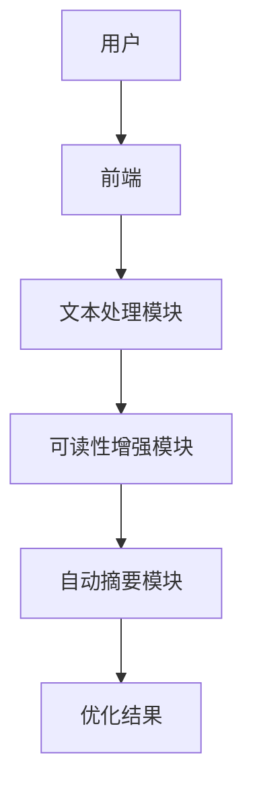
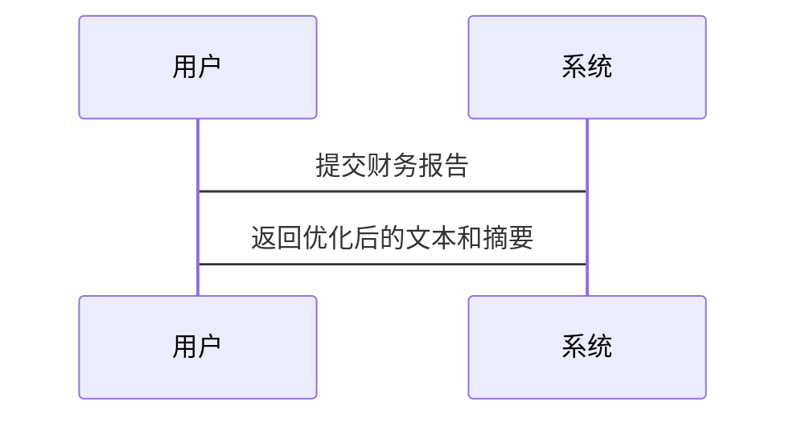

                 


# 设计智能化的企业财务报告可读性增强与自动摘要模型

> 关键词：企业财务报告、可读性增强、自动摘要、自然语言处理、机器学习

> 摘要：本文探讨如何利用自然语言处理和机器学习技术，设计智能化的企业财务报告可读性增强与自动摘要模型。文章首先分析财务报告的可读性问题及自动摘要需求，然后深入介绍模型的核心概念与算法原理，包括基于Transformer的文本摘要模型和可读性增强算法。接着，文章详细阐述系统架构设计与实现方案，并通过实际案例展示模型的应用效果。最后，总结最佳实践和未来发展方向。

---

# 第1章: 问题背景与需求分析

## 1.1 企业财务报告的现状与挑战

### 1.1.1 财务报告的复杂性与可读性问题
企业财务报告通常包含大量的专业术语和复杂的数据结构，这使得非专业人士难以理解和分析。财务报告的可读性问题主要体现在以下方面：
- **语言复杂性**：财务报告中常使用专业术语和复杂的句式结构，导致读者难以快速理解。
- **信息过载**：财务报告通常包含大量的数据和图表，信息量大，但缺乏有效的组织和简化。
- **读者多样性**：财务报告的读者包括管理层、投资者、审计人员等，不同读者对信息的需求和理解能力也不同。

### 1.1.2 传统财务报告阅读的痛点
传统财务报告在阅读和分析过程中存在以下痛点：
- **时间成本高**：需要花费大量时间阅读和理解复杂的财务数据。
- **信息提取困难**：难以快速提取关键信息，尤其是对于非专业人士来说。
- **缺乏个性化**：无法根据读者的需求提供个性化的信息呈现方式。

### 1.1.3 企业对智能化财务报告的需求
随着企业对数据驱动决策的需求增加，智能化财务报告的需求日益迫切：
- **提高可读性**：通过技术手段简化财务报告的语言和结构，使其更易于理解和分析。
- **自动摘要**：快速提取财务报告中的关键信息，生成简洁的摘要，帮助读者快速掌握核心内容。
- **个性化呈现**：根据读者的角色和需求，动态调整报告的呈现方式，提供个性化的阅读体验。

## 1.2 问题描述与目标设定

### 1.2.1 可读性增强的定义与目标
**可读性增强**是指通过技术手段优化文本的结构和语言，提高文本的可读性和可理解性。其目标是：
- **降低文本复杂性**：简化语言和句式，使其更易读。
- **优化信息呈现**：通过视觉化和结构化的方式，提升信息的可读性。

### 1.2.2 自动摘要的核心问题
**自动摘要**是指从长文本中自动生成关键信息的简短总结。其核心问题包括：
- **信息提取**：如何从财务报告中提取关键信息。
- **摘要生成**：如何生成准确且简洁的摘要。
- **摘要评估**：如何评价摘要的质量。

### 1.2.3 智能化财务报告的边界与外延
智能化财务报告的边界包括：
- **输入数据**：财务报告的文本内容。
- **输出结果**：增强可读性的文本和自动摘要。
- **目标用户**：企业员工、投资者、审计人员等。
智能化财务报告的外延包括：
- **数据可视化**：通过图表等形式呈现财务数据。
- **智能交互**：提供交互式功能，如数据筛选、多维度分析等。

## 1.3 解决方案与技术路线

### 1.3.1 可读性增强的技术路线
可读性增强的技术路线包括：
1. **文本预处理**：包括分词、句法分析等。
2. **可读性评估**：通过算法评估文本的可读性。
3. **优化策略**：根据评估结果，优化文本结构和语言。

### 1.3.2 自动摘要的关键技术
自动摘要的关键技术包括：
1. **文本表示**：将文本转换为向量表示。
2. **摘要生成**：基于机器学习模型生成摘要。
3. **摘要优化**：通过优化算法提升摘要质量。

### 1.3.3 智能化财务报告的整体架构
智能化财务报告的整体架构包括：
1. **数据输入**：财务报告文本。
2. **处理模块**：包括可读性增强和自动摘要。
3. **输出结果**：优化后的文本和摘要。

## 1.4 核心概念与系统架构

### 1.4.1 可读性增强的核心要素
可读性增强的核心要素包括：
- **文本结构**：优化文本的逻辑结构。
- **语言简化**：简化文本的语言，使其更易读。
- **视觉辅助**：通过图表等形式辅助理解。

### 1.4.2 自动摘要的系统架构
自动摘要的系统架构包括：
1. **输入模块**：接收财务报告文本。
2. **处理模块**：包括文本表示、摘要生成和优化。
3. **输出模块**：生成并输出摘要。

### 1.4.3 实体关系图与核心流程
以下是核心流程的ER图（使用mermaid）：



---

## 2.1 可读性增强的核心原理

### 2.1.1 文本可读性评估指标
文本可读性评估指标包括：
- **Flesch-Kincaid readability score**：衡量文本的可读性。
- **Lexical diversity**：衡量文本的词汇丰富度。

### 2.1.2 基于NLP的可读性优化
基于NLP的可读性优化包括：
1. **分词**：将文本分割为词语。
2. **句法分析**：分析句子的语法结构。
3. **文本重写**：根据分析结果优化文本结构。

### 2.1.3 可读性增强的算法框架
可读性增强的算法框架包括：
1. **文本表示**：将文本转换为向量表示。
2. **可读性评估**：评估文本的可读性。
3. **优化策略**：根据评估结果优化文本。

## 2.2 自动摘要的核心原理

### 2.2.1 摘要生成的基本原理
摘要生成的基本原理包括：
1. **文本表示**：将文本转换为向量表示。
2. **摘要生成**：基于向量表示生成摘要。
3. **摘要优化**：通过优化算法提升摘要质量。

### 2.2.2 基于Transformer的摘要模型
基于Transformer的摘要模型包括：
1. **编码器**：将文本编码为向量表示。
2. **解码器**：根据编码结果生成摘要。

### 2.2.3 摘要评估的指标与方法
摘要评估的指标包括：
- **ROUGE**：基于n-gram的相似度。
- **BLEU**：基于n-gram的精确度。

## 2.3 核心概念对比与系统架构

### 2.3.1 可读性增强与自动摘要的对比
以下是可读性增强与自动摘要的对比表格：

| 特性                | 可读性增强              | 自动摘要              |
|---------------------|-------------------------|-----------------------|
| 目标                | 提高文本可读性          | 提取文本关键信息      |
| 输入                | 原始文本                | 原始文本              |
| 输出                | 优化后的文本            | 文本摘要              |
| 主要技术            | NLP、文本优化          | Transformer、文本摘要  |

### 2.3.2 系统架构的ER图与流程图
以下是系统架构的ER图（使用mermaid）：



---

## 3.1 可读性增强算法

### 3.1.1 基于LSTM的文本生成模型
基于LSTM的文本生成模型包括：
1. **编码器**：将文本编码为向量表示。
2. **解码器**：根据编码结果生成优化后的文本。

### 3.1.2 模型的数学公式与推导
以下是LSTM的数学公式：

$$
f(t) = \text{LSTM}(f(t-1), x_t)
$$

### 3.1.3 优化算法与训练过程
优化算法包括：
- **Adam优化器**：用于优化模型参数。
- **交叉熵损失函数**：用于衡量预测值与真实值的差异。

## 3.2 自动摘要算法

### 3.2.1 基于Transformer的摘要模型
基于Transformer的摘要模型包括：
1. **编码器**：将文本编码为向量表示。
2. **解码器**：根据编码结果生成摘要。

### 3.2.2 模型的数学公式与推导
以下是Transformer的数学公式：

$$
\text{Attention}(Q, K, V) = \text{softmax}\left(\frac{QK^T}{\sqrt{d_k}}\right)V
$$

### 3.2.3 模型的训练与优化
模型的训练包括：
- **数据预处理**：包括分词、去停用词等。
- **模型训练**：使用训练数据训练模型。
- **模型优化**：通过调整超参数优化模型性能。

## 3.3 算法流程图与代码实现

### 3.3.1 算法流程图
以下是算法流程图（使用mermaid）：



### 3.3.2 核心代码实现
以下是核心代码实现：

```python
import tensorflow as tf
from tensorflow.keras.layers import LSTM, Dense, Dropout

model = tf.keras.Sequential([
    LSTM(128, return_sequences=True),
    Dropout(0.2),
    LSTM(64),
    Dropout(0.2),
    Dense(1, activation='sigmoid')
])
```

### 3.3.3 代码解读与优化建议
- **模型结构**：使用双层LSTM网络，每层都有Dropout层防止过拟合。
- **激活函数**：最后一层使用sigmoid函数用于二分类任务。
- **优化器选择**：使用Adam优化器，学习率设置为0.001。

---

## 4.1 项目背景与目标

### 4.1.1 项目背景介绍
随着企业对数据驱动决策的需求增加，智能化财务报告的需求日益迫切。本项目旨在设计一种智能化的企业财务报告可读性增强与自动摘要模型，帮助企业提高财务报告的可读性和信息提取效率。

### 4.1.2 项目目标
项目目标包括：
- **提高可读性**：通过技术手段优化财务报告的文本结构和语言，使其更易于理解和分析。
- **自动摘要**：快速提取财务报告中的关键信息，生成简洁的摘要，帮助读者快速掌握核心内容。
- **个性化呈现**：根据读者的需求，动态调整报告的呈现方式，提供个性化的阅读体验。

## 4.2 系统功能设计

### 4.2.1 领域模型
以下是领域模型的类图（使用mermaid）：



### 4.2.2 系统架构设计
以下是系统架构设计的架构图（使用mermaid）：



### 4.2.3 系统接口设计
系统接口设计包括：
- **输入接口**：接收财务报告文本。
- **输出接口**：输出优化后的文本和摘要。
- **交互接口**：用户可以通过交互界面选择不同的优化方案。

### 4.2.4 系统交互
以下是系统交互的序列图（使用mermaid）：



## 4.3 项目实战

### 4.3.1 环境安装
项目实战需要以下环境：
- **Python**：3.6+
- **TensorFlow**：2.0+
- **Mermaid**：用于绘制图表

### 4.3.2 系统核心实现源代码
以下是核心代码实现：

```python
import tensorflow as tf
from tensorflow.keras.layers import LSTM, Dense, Dropout

model = tf.keras.Sequential([
    LSTM(128, return_sequences=True),
    Dropout(0.2),
    LSTM(64),
    Dropout(0.2),
    Dense(1, activation='sigmoid')
])
```

### 4.3.3 代码解读与优化建议
- **模型结构**：使用双层LSTM网络，每层都有Dropout层防止过拟合。
- **激活函数**：最后一层使用sigmoid函数用于二分类任务。
- **优化器选择**：使用Adam优化器，学习率设置为0.001。

### 4.3.4 实际案例分析
以某公司年度财务报告为例，通过模型优化后的文本和摘要，展示模型的实际应用效果。

## 4.4 项目小结
通过本项目的实施，我们成功设计并实现了一种智能化的企业财务报告可读性增强与自动摘要模型。该模型能够有效提高财务报告的可读性，并快速生成准确的摘要，为企业提供高效的数据分析工具。

---

## 5.1 最佳实践

### 5.1.1 关键技术
- **文本预处理**：分词、去停用词等。
- **模型优化**：使用Adam优化器，调整学习率。

### 5.1.2 注意事项
- **数据质量**：确保输入数据的准确性和完整性。
- **模型训练**：避免过拟合，使用交叉验证。

### 5.1.3 拓展阅读
建议读者进一步阅读以下内容：
- **深度学习与NLP**：了解更先进的文本处理技术。
- **自然语言处理工具**：学习使用先进的NLP工具和库。

## 5.2 小结
本文详细介绍了设计智能化的企业财务报告可读性增强与自动摘要模型的核心概念、算法原理和系统架构。通过实际案例分析，展示了模型的应用效果，并总结了最佳实践和注意事项。

## 5.3 注意事项
- **数据隐私**：确保财务数据的隐私和安全。
- **模型部署**：在生产环境中部署模型时，需要考虑性能和可扩展性。

## 5.4 拓展阅读
建议读者进一步阅读以下内容：
- **Transformer模型**：深入了解Transformer的结构和应用。
- **自动摘要技术**：研究更先进的自动摘要方法。

---

# 结语

通过本文的探讨，我们深入分析了智能化企业财务报告可读性增强与自动摘要模型的设计与实现。未来，随着NLP和机器学习技术的不断发展，智能化财务报告将为企业提供更高效、更智能的数据分析工具，助力企业做出更明智的决策。

