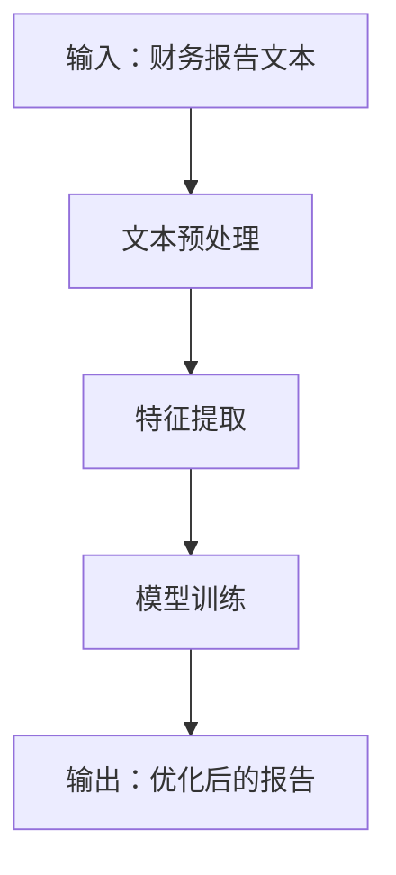
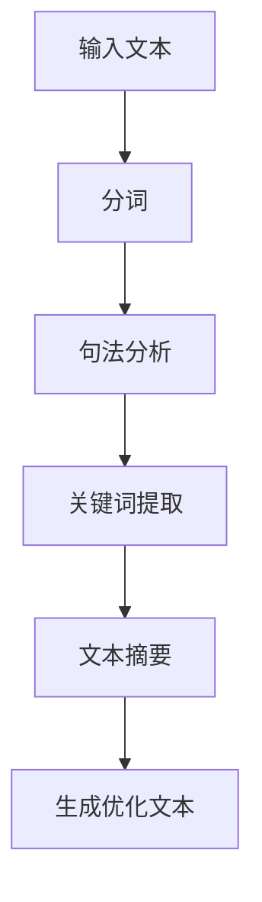
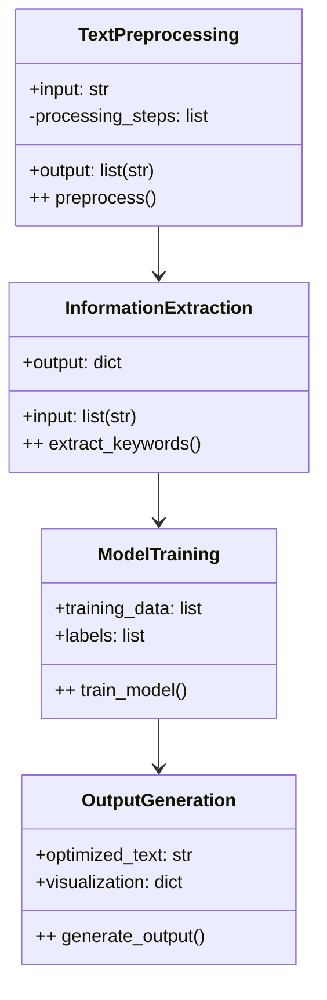
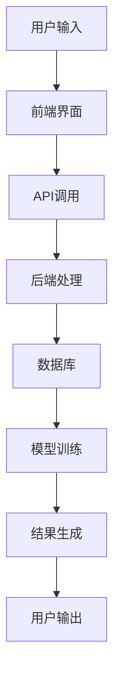
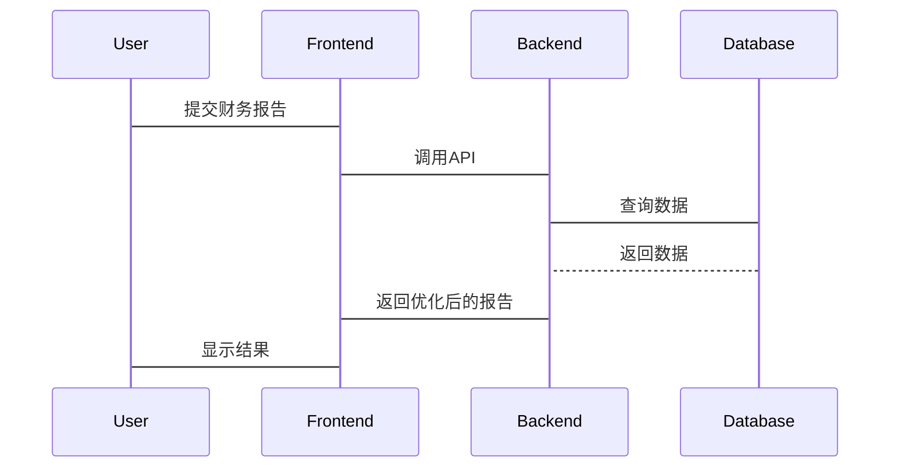

                 


# 设计智能化的企业财务报告可读性增强模型

## 关键词：
- 企业财务报告
- 智能化
- 自然语言处理
- 可读性增强
- 机器学习

## 摘要：
本文将探讨如何设计一个智能化的企业财务报告可读性增强模型。我们从分析当前财务报告的可读性问题入手，结合自然语言处理和机器学习技术，提出了一种基于深度学习的解决方案。通过构建领域模型和优化算法，我们设计了一个能够自动生成简洁、清晰财务报告的系统架构，并通过实际案例展示了该模型的应用效果。本文还详细探讨了系统实现的关键技术、系统架构设计以及项目实战的具体步骤，为读者提供了一个从理论到实践的完整指南。

---

# 设计智能化的企业财务报告可读性增强模型

## 第1章: 问题背景与目标

### 1.1 问题背景

企业在日常经营中需要生成大量财务报告，这些报告通常包含复杂的财务术语和冗长的信息，导致不同背景的读者（如管理层、投资者、审计人员）难以快速理解和做出决策。传统的财务报告编写方式难以满足多样化的读者需求，因此需要一种智能化的方法来提高财务报告的可读性。

### 1.2 问题描述

- **问题1**：财务报告语言复杂，术语繁多，导致部分读者难以理解。
- **问题2**：报告内容冗余，关键信息提取困难，难以快速抓住重点。
- **问题3**：不同读者的需求不同，传统的报告格式难以满足个性化需求。

### 1.3 问题解决目标

通过智能化技术，我们希望实现以下目标：
- 提高财务报告的可读性，使其更易于理解。
- 优化信息呈现方式，突出重点内容。
- 满足不同读者的需求，提供个性化的报告呈现方式。

### 1.4 边界与外延

- **模型的应用范围**：主要用于企业财务报告的生成和优化，不涉及具体的财务计算或审计。
- **模型的局限性**：目前仅支持文本处理和信息呈现优化，无法直接生成新的财务数据。
- **模型与其他系统的接口**：需要与企业的财务系统、数据存储系统以及用户界面系统进行集成。

### 1.5 核心概念与组成

- **财务报告的结构化处理**：将非结构化文本转化为结构化的信息，便于后续处理。
- **自然语言处理技术**：用于文本的理解、分析和生成。
- **可视化呈现方法**：通过图表等形式优化信息呈现效果。

---

## 第2章: 核心概念与原理

### 2.1 可读性评估指标

我们定义了以下可读性评估指标：
- **文本复杂度指标**：包括句子长度、词汇难度等。
- **信息清晰度指标**：包括信息冗余度、关键词提取准确性等。
- **用户理解度指标**：通过用户反馈或测试数据进行评估。

### 2.2 文本处理技术

- **分词与句法分析**：
  - 使用自然语言处理工具对文本进行分词和句法分析。
  - 示例：将“The company's revenue increased by 10%”分解为“主语”、“谓语”、“宾语”等部分。

- **信息抽取与关键词提取**：
  - 使用命名实体识别（NER）技术提取公司名称、财务指标等关键信息。
  - 示例：从“公司2022年营业收入为10亿元”中提取“营业收入”、“10亿元”等关键词。

- **文本摘要与压缩**：
  - 使用文本摘要算法（如TF-IDF、LSTM）对长文本进行压缩。
  - 示例：将“公司在2022年的营业收入为10亿元，同比增长5%”简化为“公司2022年营业收入同比增长5%”。

### 2.3 模型训练方法

- **监督学习与无监督学习**：
  - 监督学习：使用标注数据训练分类器，识别关键信息。
  - 无监督学习：使用聚类算法发现潜在的主题结构。

- **神经网络与深度学习**：
  - 使用循环神经网络（RNN）或Transformer模型进行文本生成。
  - 示例：使用GPT模型生成财务报告摘要。

- **跨模态数据融合**：
  - 结合文本、表格和图表等多种数据源，优化信息呈现效果。

---

## 第3章: 算法原理与实现

### 3.1 模型整体架构



### 3.2 关键算法流程



### 3.3 算法实现代码

```python
import numpy as np
from sklearn.feature_extraction.text import TfidfVectorizer
from sklearn.naive_bayes import MultinomialNB

def preprocess(text):
    # 文本预处理
    return text.lower().strip()

def train_model(X, y):
    # 使用TF-IDF提取特征
    vectorizer = TfidfVectorizer()
    X_features = vectorizer.fit_transform(X)
    # 使用朴素贝叶斯分类器训练模型
    clf = MultinomialNB()
    clf.fit(X_features, y)
    return clf, vectorizer

# 示例数据
X = ["The company's revenue increased by 10%", "Net profit margin decreased by 5%"]
y = [1, 0]  # 假设1表示正面信息，0表示负面信息

model, vectorizer = train_model(X, y)
```

### 3.4 数学公式

$$ P(y|x) = \frac{P(x|y)P(y)}{P(x)} $$

其中：
- $P(y|x)$ 是在给定$x$的条件下，$y$的概率。
- $P(x|y)$ 是在$y$条件下，$x$的概率。
- $P(y)$ 是$y$的先验概率。
- $P(x)$ 是$x$的边缘概率。

---

## 第4章: 系统分析与架构设计

### 4.1 问题场景介绍

- 系统需要处理大量的财务报告文本。
- 系统需要支持多种格式的输入（如PDF、Word文档）。
- 系统需要提供个性化的输出格式（如HTML、PDF、可视化图表）。

### 4.2 项目介绍

- **项目目标**：设计一个智能化的财务报告优化系统。
- **项目范围**：涵盖文本处理、信息提取、信息优化和输出生成四个模块。
- **项目团队**：数据科学家、软件开发人员、UI设计师。

### 4.3 系统功能设计



### 4.4 系统架构设计



### 4.5 系统接口设计

- **输入接口**：支持多种格式的财务报告输入（如PDF、Word、Excel）。
- **输出接口**：提供多种格式的输出（如HTML、PDF、可视化图表）。

### 4.6 系统交互设计



---

## 第5章: 项目实战

### 5.1 环境安装

```bash
pip install numpy
pip install scikit-learn
pip install spacy
pip install transformers
```

### 5.2 核心代码实现

```python
import spacy
from transformers import pipeline

nlp = spacy.load("en_core_web_sm")
text_analyzer = pipeline("text-classification", model="facebook/roberta-base")

def process_report(text):
    doc = nlp(text)
    keywords = [token.text for token in doc if token.pos_ in ["NOUN", "ADJ", "VERB"]]
    summary = text_analyzer(text)[0]["summary"]
    return summary, keywords

# 示例
text = "The company's revenue increased by 10% in Q2."
summary, keywords = process_report(text)
print("Summary:", summary)
print("Keywords:", keywords)
```

### 5.3 代码解读与分析

- **文本预处理**：使用spaCy对文本进行分词和词性标注。
- **信息抽取**：使用预训练的文本分类模型提取关键词和摘要。

### 5.4 实际案例分析

假设输入文本为：
```
The company's revenue increased by 10% in Q2. However, the net profit margin decreased due to increased costs.
```

模型输出：
```
Summary: Company's revenue increased by 10% in Q2, but net profit margin decreased due to increased costs.
Keywords: revenue, increased, net profit margin, decreased, costs
```

### 5.5 项目小结

- **项目总结**：通过智能化技术，我们成功提高了财务报告的可读性。
- **项目成果**：开发了一个能够自动生成优化财务报告的系统。
- **项目意义**：为企业提供了更高效的财务报告处理方式。

---

## 第6章: 最佳实践与总结

### 6.1 小结

- 通过智能化技术，我们成功提高了财务报告的可读性。
- 模型的应用能够显著优化企业的财务报告生成和呈现过程。

### 6.2 注意事项

- **数据质量**：确保输入数据的准确性和完整性。
- **模型优化**：根据实际使用情况不断优化模型性能。
- **用户体验**：提供友好的用户界面和个性化的输出格式。

### 6.3 拓展阅读

- **推荐阅读书籍**：
  - 《自然语言处理实战》
  - 《深度学习入门：基于Python》
- **推荐阅读论文**：
  - "A Survey on Natural Language Processing Applications in Business"

