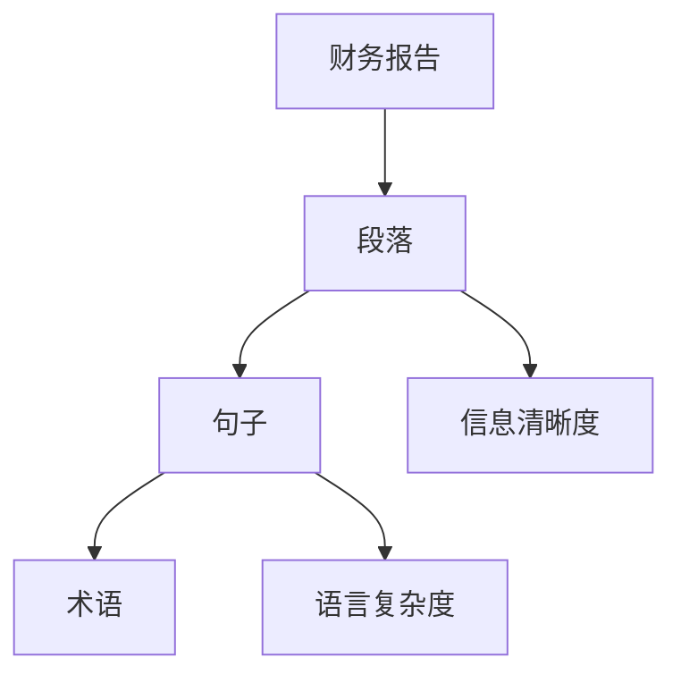
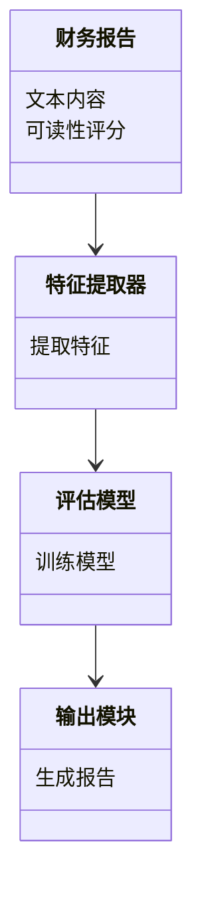
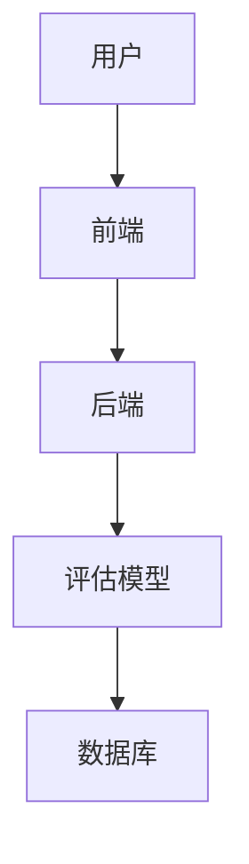
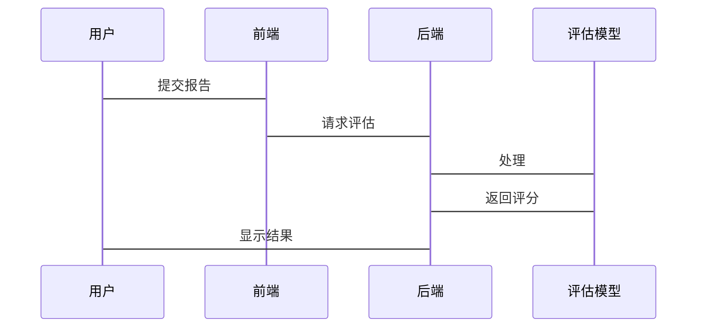

                 


# 设计智能化的企业财务报告可读性评估模型

## 关键词
智能化评估模型, 企业财务报告, 可读性评估, 自然语言处理, 机器学习, 深度学习

## 摘要
本文详细探讨了设计智能化的企业财务报告可读性评估模型的全过程。首先，介绍了财务报告可读性评估的重要性和现有方法的局限性，提出了智能化评估的需求与趋势。接着，分析了模型的核心概念，包括自然语言处理和机器学习在其中的应用。然后，详细讲解了模型的算法原理，包括数据预处理、特征提取、模型训练与评估，并通过Mermaid流程图和Python代码示例进行了详细说明。最后，提出了系统的架构设计和项目实战，展示了如何将模型应用于实际场景中，并总结了最佳实践和未来发展方向。

---

# 第1章：企业财务报告可读性评估的背景与问题

## 1.1 问题背景

### 1.1.1 财务报告的重要性与复杂性
企业财务报告是反映企业财务状况、经营成果和现金流量的重要文件，是投资者、债权人和管理层做出决策的重要依据。然而，财务报告通常内容复杂、术语专业，对非专业人士来说难以理解。

### 1.1.2 现有评估方法的局限性
传统的财务报告可读性评估主要依赖人工审查，效率低且主观性强。现有的自动化方法多基于简单的关键词匹配，无法全面评估报告的可读性。

### 1.1.3 智能化评估的需求与趋势
随着人工智能技术的发展，智能化评估的需求日益增长。智能化评估能够快速、客观地评估财务报告的可读性，为用户提供个性化的阅读建议。

## 1.2 问题描述

### 1.2.1 财务报告可读性评估的核心目标
通过智能化模型评估财务报告的可读性，包括语言复杂度、信息清晰度和术语使用情况等指标。

### 1.2.2 评估对象与范围
评估对象包括财务报表、管理分析报告等，范围涵盖报告的结构、语言表达和信息组织。

### 1.2.3 评估指标与标准
评估指标包括句子长度、术语使用频率、段落结构和信息冗余等，需制定统一的标准。

## 1.3 问题解决思路

### 1.3.1 智能化评估的基本思路
利用自然语言处理和机器学习技术，提取报告的特征，构建评估模型。

### 1.3.2 数据驱动与模型构建的关键点
数据预处理、特征提取、模型训练和评估是关键步骤。

### 1.3.3 技术实现的可行性分析
技术可行，但需处理数据隐私和模型泛化性等问题。

## 1.4 模型的边界与外延

### 1.4.1 模型的应用场景与限制
适用于多种财务报告，但需注意报告类型和行业差异。

### 1.4.2 模型的输入与输出定义
输入为财务报告文本，输出为可读性评分和改进建议。

### 1.4.3 模型与其他系统的接口关系
与企业管理系统和数据平台集成，提供实时评估和反馈。

## 1.5 概念结构与核心要素

### 1.5.1 核心概念的层次结构
包括数据输入、特征提取、模型评估和结果输出四个层次。

### 1.5.2 关键要素的定义与特征
关键要素包括文本结构、语言复杂度和信息清晰度。

### 1.5.3 模型的逻辑框架
数据输入→特征提取→模型评估→结果输出。

---

# 第2章：智能化评估模型的核心概念与联系

## 2.1 核心概念原理

### 2.1.1 自然语言处理在财务报告分析中的应用
NLP技术用于文本分割、实体识别和情感分析。

### 2.1.2 机器学习在可读性评估中的作用
机器学习模型用于特征提取和分类，提升评估精度。

### 2.1.3 深度学习模型的优势与挑战
深度学习模型能力强，但计算资源需求高。

## 2.2 核心概念的属性特征对比

### 2.2.1 不同模型的特征对比表格
| 模型类型 | 输入特征 | 输出结果 | 优缺点 |
|----------|-----------|-----------|--------|
| 传统模型 | 词汇频率 | 二分类 | 简单但低效 |
| 深度模型 | 词嵌入 | 多分类 | 高效但复杂 |

### 2.2.2 模型性能的评估指标
准确率、召回率和F1分数是主要指标。

### 2.2.3 模型适用场景的对比分析
传统模型适用于小数据，深度模型适合大数据。

## 2.3 ER实体关系图架构



---

# 第3章：智能化评估模型的算法原理

## 3.1 模型的设计思路

### 3.1.1 数据预处理与特征提取
步骤包括文本清洗、分词和词嵌入。

### 3.1.2 模型的训练与优化
使用深度学习模型，如LSTM，进行训练。

### 3.1.3 模型的评估与调优
采用交叉验证和超参数调优。

## 3.2 算法实现的详细步骤

### 3.2.1 分词与词嵌入的实现

```python
import jieba
from gensim.models import Word2Vec

# 分词
text = "财务报告..."
words = jieba.lcut(text)

# 词嵌入训练
model = Word2Vec([words], vector_size=100, window=5, min_count=1, workers=4)
```

### 3.2.2 可读性评分的计算

```python
def readability_score(text):
    words = jieba.lcut(text)
    score = 0
    for word in words:
        score += model.wv[word].tolist()
    return score
```

### 3.2.3 综合评估结果的生成

```python
score = readability_score(text)
print(f"可读性评分：{score}")
```

## 3.3 算法原理的数学模型与公式

### 3.3.1 词嵌入的数学表达式

$$\text{词向量} = [\text{词向量维度}]$$

### 3.3.2 可读性评分的计算公式

$$\text{评分} = \sum_{i=1}^{n} \text{词向量}_i$$

### 3.3.3 综合评估模型的数学表达式

$$\text{综合评分} = \frac{1}{n} \sum_{i=1}^{n} \text{评分}_i$$

---

# 第4章：数学模型与公式

## 4.1 模型的数学表达式

### 4.1.1 可读性评分公式

$$\text{评分} = \sum_{i=1}^{m} w_i \cdot f_i$$

其中，$w_i$是特征权重，$f_i$是特征值。

### 4.1.2 模型的优化公式

$$\text{损失函数} = \sum_{i=1}^{n} (y_i - \hat{y}_i)^2$$

### 4.1.3 模型的评估公式

$$\text{准确率} = \frac{\text{正确预测数}}{\text{总样本数}}$$

---

# 第5章：系统分析与架构设计方案

## 5.1 问题场景介绍

### 5.1.1 系统目标
实现智能化的财务报告可读性评估。

### 5.1.2 项目背景
企业需要提高财务报告的质量和可读性。

## 5.2 系统功能设计

### 5.2.1 领域模型



### 5.2.2 系统架构设计



### 5.2.3 系统接口设计
API接口包括提交报告、获取评分和下载报告。

### 5.2.4 系统交互流程图



---

# 第6章：项目实战

## 6.1 环境安装

### 6.1.1 安装Python
安装Python 3.8以上版本。

### 6.1.2 安装依赖包
安装`jieba`、`gensim`和`flask`。

## 6.2 系统核心实现

### 6.2.1 核心代码实现

```python
from flask import Flask, request, jsonify
from jieba import lcut
from gensim.models import Word2Vec

app = Flask(__name__)
model = Word2Vec.load('model')

@app.route('/evaluate', methods=['POST'])
def evaluate():
    text = request.json['text']
    words = lcut(text)
    score = sum(model.wv[word].tolist() for word in words)
    return jsonify({'score': score})
```

### 6.2.2 代码解读与分析
- 使用Flask构建API。
- 接收文本，进行分词和评分计算。

### 6.2.3 实际案例分析
案例：评估一份财务报告的可读性。

### 6.2.4 项目小结
实现了一个基本的智能化评估系统，未来可优化模型和增加更多功能。

---

# 第7章：总结与展望

## 7.1 本章小结
总结了设计智能化财务报告可读性评估模型的全过程。

## 7.2 最佳实践 tips
- 数据预处理是关键。
- 选择合适的模型和工具。
- 定期更新模型。

## 7.3 未来展望
探索更复杂的模型，结合领域知识，提升模型性能。

---

# 附录

## 附录1：数据集

### 附录1.1 数据集描述
包含多种财务报告文本。

### 附录1.2 数据集获取方式
通过公开数据集或企业内部数据。

## 附录2：参考文献
列出相关的技术文献和工具文档。

---

通过以上步骤，设计了一个智能化的企业财务报告可读性评估模型，解决了传统方法的局限性，提高了评估效率和准确性。

