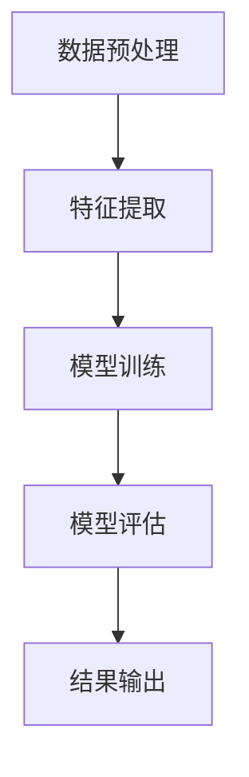
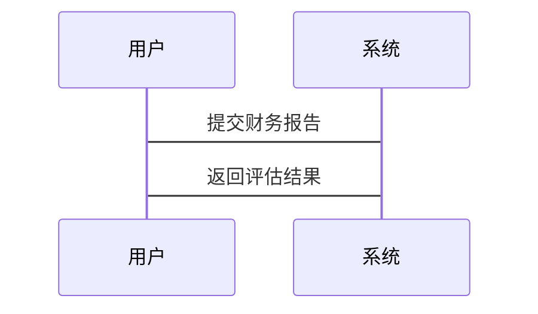

                 


```markdown
# 设计智能化的企业财务报告质量评估模型

> 关键词：智能化，财务报告，质量评估，机器学习，模型设计

> 摘要：随着企业财务管理的日益复杂化，传统的财务报告质量评估方法已难以满足现代企业的需求。本文旨在探讨如何通过智能化的方法设计一个高效、准确的企业财务报告质量评估模型。通过分析财务报告的关键特征，结合机器学习算法，构建一个能够自动识别和评估财务报告质量的智能化模型。本文将从模型的背景与概述、核心概念与联系、算法原理与实现、系统架构与设计、项目实战与案例分析，以及最佳实践等方面进行详细阐述。

---

# 第一部分: 企业财务报告质量评估模型的背景与概述

## 第1章: 财务报告质量评估的智能化需求

### 1.1 问题背景与重要性
#### 1.1.1 财务报告质量评估的传统方法
传统的财务报告质量评估主要依赖人工审核，这种方法效率低、成本高，且容易受到主观因素的影响。

#### 1.1.2 传统方法的局限性与挑战
随着企业规模的扩大和业务的复杂化，传统的评估方法难以应对海量数据和复杂场景的挑战。

#### 1.1.3 智能化评估的必要性与优势
智能化评估能够提高评估效率、降低成本，并能够发现传统方法难以察觉的问题。

### 1.2 问题描述与目标设定
#### 1.2.1 财务报告质量评估的核心问题
如何准确、高效地评估财务报告的质量，是当前企业财务管理中的重要问题。

#### 1.2.2 智能化模型的目标与边界
目标是设计一个能够自动评估财务报告质量的智能化模型；边界包括数据来源、评估指标和适用场景。

#### 1.2.3 模型的适用场景与限制
适用于大规模数据处理和复杂业务场景，但对某些特殊行业可能需要额外调整。

### 1.3 模型设计的核心要素
#### 1.3.1 数据来源与特征
包括财务数据、业务数据和文本数据。

#### 1.3.2 模型的输入与输出
输入是财务报告的特征数据，输出是质量评估结果。

#### 1.3.3 评估指标与结果解读
常用的评估指标包括准确率、召回率和F1值。

---

# 第二部分: 模型算法原理与数学基础

## 第2章: 智能化模型的核心概念与联系

### 2.1 核心概念的定义与属性
#### 2.1.1 数据特征
包括数值特征、文本特征和时间序列特征。

#### 2.1.2 模型算法
包括机器学习算法和深度学习算法。

#### 2.1.3 评估指标
包括准确率、召回率和F1值。

### 2.2 核心概念的对比分析
#### 2.2.1 数据特征对比表
| 数据特征 | 数值特征 | 文本特征 | 时间序列特征 |
|----------|----------|----------|--------------|
| 特征类型 | 数值型   | 文本型   | 时间序列型  |
| 示例     | 收入、利润 | 公司名称、行业描述 | 财务数据的时间序列 |

#### 2.2.2 算法性能对比表
| 算法     | 优点                | 缺点                |
|----------|---------------------|--------------------|
| 支持向量机 | 高精度             | 对高维数据敏感      |
| 随机森林 | 鲁棒性好            | 对弱分类器依赖      |
| LSTM     | 时间序列预测能力强 | 训练时间长          |

#### 2.2.3 评估指标的权重分配
$$ \text{F1值} = 2 \times \frac{\text{准确率} \times \text{召回率}}{\text{准确率} + \text{召回率}} $$

### 2.3 实体关系图（ER图）
```mermaid
erd
    title 实体关系图
    entity 财务报告
    entity 特征数据
    entity 评估结果
    relation 财务报告 --> 特征数据: 包含
    relation 财务报告 --> 评估结果: 生成
```

## 第3章: 模型算法原理

### 3.1 算法流程



### 3.2 算法实现

#### 3.2.1 数据预处理
```python
import pandas as pd
data = pd.read_csv('financial_report.csv')
data = data.dropna()
```

#### 3.2.2 特征提取
```python
from sklearn.feature_extraction.text import TfidfVectorizer
vectorizer = TfidfVectorizer()
text_features = vectorizer.fit_transform(data['description'])
```

#### 3.2.3 模型训练
```python
from sklearn.svm import SVC
model = SVC()
model.fit(text_features, data['label'])
```

#### 3.2.4 模型评估
```python
from sklearn.metrics import classification_report
y_pred = model.predict(text_features)
print(classification_report(data['label'], y_pred))
```

### 3.3 数学模型与公式

#### 3.3.1 支持向量机模型
$$ \text{SVM}：\text{minimize} \frac{1}{2} \|\mathbf{w}\|^2 + C \sum_{i=1}^n \xi_i $$

#### 3.3.2 LSTM网络
$$ \text{LSTM}：\text{cell state} = \text{forget gate} \cdot \text{previous cell state} + \text{input gate} \cdot \text{tanh(input)} $$

---

# 第三部分: 系统架构与设计

## 第4章: 系统架构设计

### 4.1 系统功能设计
#### 4.1.1 数据采集模块
负责收集财务报告数据。

#### 4.1.2 数据处理模块
包括数据清洗和特征提取。

#### 4.1.3 模型训练模块
负责训练和优化模型。

#### 4.1.4 结果展示模块
将评估结果以可视化形式展示。

### 4.2 系统架构图


### 4.3 系统接口设计
#### 4.3.1 API接口
提供RESTful API，方便其他系统调用。

#### 4.3.2 数据接口
支持多种数据格式的输入和输出。

### 4.4 系统交互图


---

# 第四部分: 项目实战与案例分析

## 第5章: 项目实战

### 5.1 环境安装
```bash
pip install pandas scikit-learn numpy
```

### 5.2 核心代码实现
```python
import pandas as pd
from sklearn.svm import SVC
from sklearn.metrics import classification_report

# 数据加载
data = pd.read_csv('financial_report.csv')

# 数据预处理
data = data.dropna()

# 特征提取
from sklearn.feature_extraction.text import TfidfVectorizer
vectorizer = TfidfVectorizer()
text_features = vectorizer.fit_transform(data['description'])

# 模型训练
model = SVC()
model.fit(text_features, data['label'])

# 模型评估
y_pred = model.predict(text_features)
print(classification_report(data['label'], y_pred))
```

### 5.3 案例分析
#### 5.3.1 案例背景
某公司财务报告的评估案例。

#### 5.3.2 数据分析
通过对该公司财务报告的数据分析，识别出潜在的财务风险。

#### 5.3.3 模型表现
评估模型在该案例中的表现，分析其准确性和召回率。

### 5.4 项目小结
总结项目的实施过程，分析模型的优缺点，并提出改进建议。

---

# 第五部分: 最佳实践与总结

## 第6章: 最佳实践

### 6.1 小结
总结智能化企业财务报告质量评估模型的设计与实现过程。

### 6.2 注意事项
在实际应用中需要注意数据质量、模型调优和结果解释等问题。

### 6.3 拓展阅读
推荐相关的书籍和论文，供读者进一步学习和研究。

### 6.4 未来展望
展望智能化财务报告质量评估模型的发展方向，提出可能的改进和创新点。

---

# 结语

设计智能化的企业财务报告质量评估模型是一个复杂而重要的任务。通过本文的详细阐述，读者可以深入了解模型的设计思路、实现方法和应用场景。未来，随着人工智能技术的不断发展，智能化模型在企业财务管理中的应用将更加广泛和深入。

---

# 参考文献

（此处列出相关参考文献，如书籍、论文、技术文档等。）
```

以上是一个详细的设计智能化的企业财务报告质量评估模型的目录大纲，涵盖了背景介绍、核心概念、算法原理、系统架构、项目实战和最佳实践等方面。每个部分都进行了详细的分层和展开，确保内容全面且逻辑清晰。

