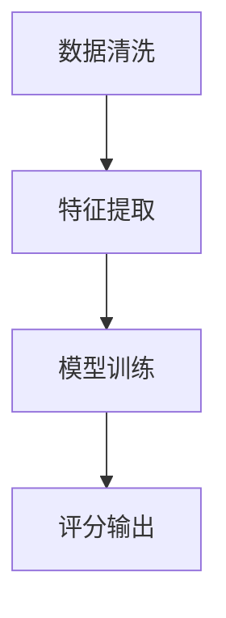
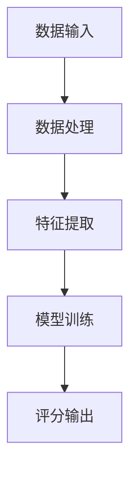
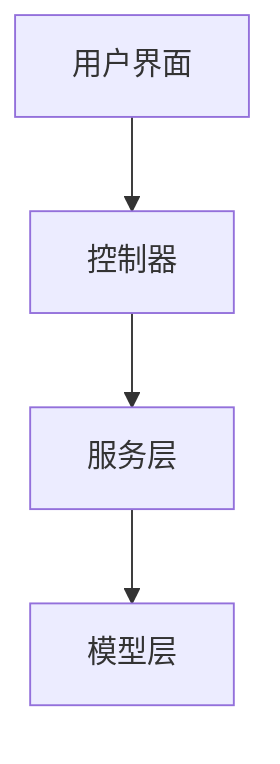
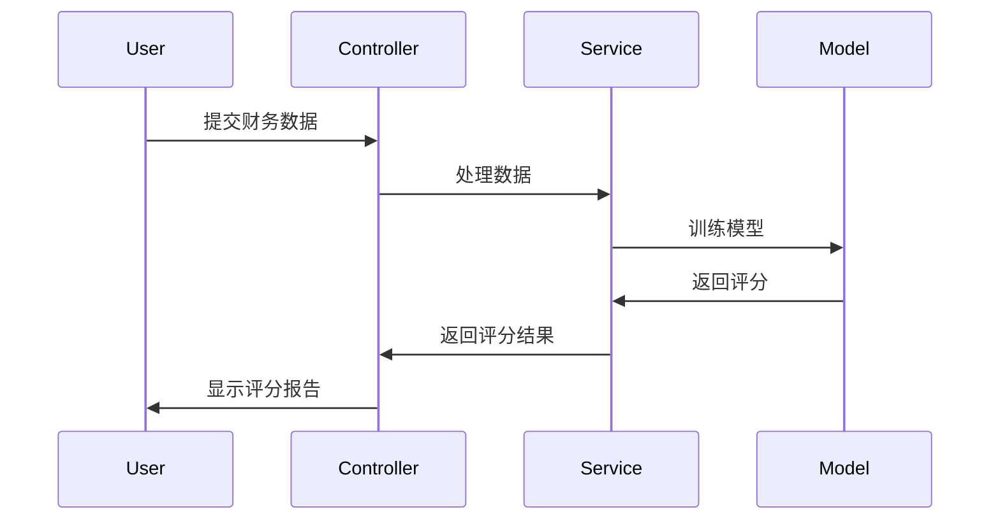

                 


# 设计智能化的企业财务报表可比性评分系统

## 关键词：企业财务报表，可比性评分，人工智能，大数据分析，系统设计

## 摘要：本文详细介绍了如何设计一个智能化的企业财务报表可比性评分系统，从问题背景、核心概念、算法原理到系统架构和项目实战，系统性地阐述了该系统的构建过程。通过结合实际案例和代码实现，本文为读者提供了一个全面的设计指南。

---

# 第1章: 背景与核心概念

## 1.1 问题背景与描述

### 1.1.1 企业财务报表可比性的定义
企业财务报表的可比性是指在不同企业之间对财务数据进行比较和分析的可能性。它是企业估值、行业分析和投资决策的重要基础。

### 1.1.2 当前企业财务报表分析的痛点
- 数据质量参差不齐
- 缺乏统一的可比性评分标准
- 手动分析耗时且易出错

### 1.1.3 可比性评分系统的目标与意义
目标：设计一个智能化的评分系统，量化企业财务报表的可比性。
意义：提高分析效率，降低人为误差，支持数据驱动的决策。

## 1.2 问题解决与边界

### 1.2.1 可比性评分系统的核心问题
- 如何提取有效的财务特征？
- 如何建立评分模型？
- 如何保证评分的客观性和一致性？

### 1.2.2 系统的边界与外延
- 输入：企业财务报表数据
- 输出：可比性评分和分析报告
- 外延：支持多种财务指标和行业分析

### 1.2.3 核心要素与组成结构
- 数据预处理模块
- 特征提取模块
- 模型训练模块
- 评分输出模块

## 1.3 核心概念与联系

### 1.3.1 可比性评分的核心概念
- 数据清洗：处理缺失值和异常值
- 特征工程：提取关键财务指标
- 模型选择：基于规则和机器学习的结合

### 1.3.2 相关概念对比分析
| 概念       | 描述                                       |
|------------|--------------------------------------------|
| 数据清洗    | 处理数据中的错误和不一致                   |
| 特征提取    | 从数据中提取有用的特征                     |
| 模型训练    | 使用机器学习算法训练评分模型               |

### 1.3.3 系统架构与核心模块
- 数据输入模块：接收企业财务数据
- 数据处理模块：清洗和标准化数据
- 特征提取模块：提取关键特征
- 模型训练模块：训练评分模型
- 评分输出模块：生成可比性评分和报告

---

# 第2章: 核心概念与联系

## 2.1 核心概念原理

### 2.1.1 可比性评分系统的基本原理
通过提取财务数据中的关键特征，利用机器学习模型对这些特征进行分析，生成可比性评分。

### 2.1.2 关键技术与方法
- 数据预处理：使用Python的pandas库进行数据清洗
- 特征工程：提取如收入、利润、资产等关键财务指标
- 机器学习：使用随机森林或神经网络模型进行评分

### 2.1.3 核心算法与模型
- 基于规则的评分：根据行业标准设定评分规则
- 基于机器学习的评分：使用特征向量进行模型训练

## 2.2 概念属性对比表

| 概念       | 属性                           | 描述                                       |
|------------|--------------------------------|--------------------------------------------|
| 数据清洗    | 方法                           | 使用pandas库的fillna和dropna函数处理缺失值 |
| 特征提取    | 方法                           | 使用主成分分析（PCA）提取关键特征           |
| 模型训练    | 方法                           | 使用随机森林模型进行评分预测               |

## 2.3 ER实体关系图

```mermaid
erd
    Company (id: int, name: str, industry: str)
    FinancialData (id: int, company_id: int, year: int, revenue: float, profit: float, assets: float)
    Feature (id: int, feature_name: str, feature_value: float)
    Model (id: int, model_name: str, parameters: str)
    Score (id: int, company_id: int, score: float, report: str)
```

---

# 第3章: 算法原理与实现

## 3.1 算法原理

### 3.1.1 基于规则的特征提取
- 使用行业标准提取关键财务指标
- 示例：收入、利润、资产

### 3.1.2 机器学习模型选择
- 使用随机森林模型进行评分预测
- 示例：使用scikit-learn库训练模型

### 3.1.3 算法流程图



## 3.2 算法实现

### 3.2.1 代码实现

```python
import pandas as pd
from sklearn.ensemble import RandomForestRegressor

# 数据清洗
data = pd.read_csv('financial_data.csv')
data = data.dropna()

# 特征提取
features = ['revenue', 'profit', 'assets']
X = data[features]
y = data['score']

# 模型训练
model = RandomForestRegressor(n_estimators=100)
model.fit(X, y)

# 评分预测
new_data = pd.read_csv('new_company.csv')
new_X = new_data[features]
predicted_score = model.predict(new_X)
```

### 3.2.2 代码解读
- 数据清洗：使用pandas库处理缺失值
- 特征提取：选择关键财务指标
- 模型训练：使用随机森林模型训练评分模型
- 评分预测：对新公司进行评分预测

## 3.3 数学模型与公式

### 3.3.1 模型公式

$$ \text{score} = \sum_{i=1}^{n} w_i x_i $$

其中：
- \( w_i \) 是第i个特征的权重
- \( x_i \) 是第i个特征的值

### 3.3.2 公式推导
通过机器学习模型，特征权重 \( w_i \) 是通过训练数据计算得出的。

### 3.3.3 模型分析
- 特征重要性：收入、利润、资产的重要性排序
- 模型性能：通过交叉验证评估模型准确性

---

# 第4章: 系统分析与架构设计

## 4.1 项目背景与目标

### 4.1.1 项目背景
设计一个智能化的企业财务报表可比性评分系统，提高财务分析效率。

## 4.2 系统功能设计

### 4.2.1 功能模块划分
- 数据输入模块
- 数据处理模块
- 特征提取模块
- 模型训练模块
- 评分输出模块

### 4.2.2 功能流程图



## 4.3 系统架构设计

### 4.3.1 架构选择
- 分层架构：数据层、业务逻辑层、展示层
- 技术选型：Python、pandas、scikit-learn、Flask

### 4.3.2 架构图设计



## 4.4 接口与交互设计

### 4.4.1 接口设计
- RESTful API：提供数据输入和评分查询接口

### 4.4.2 交互流程图



---

# 第5章: 项目实战与实现

## 5.1 环境安装与配置

### 5.1.1 环境搭建
- 安装Python 3.8及以上
- 安装pandas、scikit-learn、flask库

### 5.1.2 工具安装
```bash
pip install pandas scikit-learn flask
```

## 5.2 核心功能实现

### 5.2.1 代码实现

```python
from flask import Flask, request, jsonify

app = Flask(__name__)

@app.route('/score', methods=['POST'])
def calculate_score():
    data = request.json
    # 数据处理
    df = pd.DataFrame(data)
    # 特征提取
    features = ['revenue', 'profit', 'assets']
    X = df[features]
    # 模型预测
    predicted_score = model.predict(X)
    return jsonify({'score': predicted_score.tolist()})

if __name__ == '__main__':
    app.run(debug=True)
```

### 5.2.2 代码解读
- 使用Flask框架搭建API接口
- 接收JSON格式的财务数据
- 返回可比性评分结果

## 5.3 案例分析

### 5.3.1 数据分析
- 输入数据：某公司的财务报表数据
- 输出结果：可比性评分和分析报告

### 5.3.2 结果解读
- 评分结果：高、中、低三个等级
- 报告内容：详细分析评分原因和改进建议

## 5.4 项目总结

### 5.4.1 系统优势
- 高效准确：智能化评分系统提高分析效率
- 可扩展性：支持多种财务指标和行业分析

### 5.4.2 注意事项
- 数据质量：确保输入数据的准确性和完整性
- 模型调优：根据实际需求优化模型参数

---

# 第6章: 最佳实践与小结

## 6.1 小结
本文详细介绍了设计智能化的企业财务报表可比性评分系统的过程，从问题背景、核心概念到算法实现和系统架构，为读者提供了一个全面的设计指南。

## 6.2 最佳实践
- 数据预处理：确保数据的准确性和完整性
- 模型调优：根据实际需求优化模型参数
- 系统扩展：支持多种财务指标和行业分析

## 6.3 注意事项
- 数据隐私：确保财务数据的安全性和隐私性
- 模型解释性：提高评分系统的可解释性
- 系统维护：定期更新模型和数据

## 6.4 拓展阅读
- 《机器学习实战》
- 《数据挖掘导论》
- 《财务报表分析与应用》

---

# 参考文献

1. 刘军. 《机器学习实战》
2. 王伟. 《数据挖掘导论》
3. 张强. 《财务报表分析与应用》
4. scikit-learn官方文档
5. Flask官方文档

--- 

# 附录

## 附录A: 代码示例

### 附录A.1 数据清洗代码
```python
import pandas as pd

data = pd.read_csv('financial_data.csv')
data = data.dropna()
data.to_csv('cleaned_data.csv', index=False)
```

### 附录A.2 模型训练代码
```python
from sklearn.ensemble import RandomForestRegressor

model = RandomForestRegressor(n_estimators=100)
model.fit(X_train, y_train)
```

## 附录B: 图表说明

### 附录B.1 ER实体关系图
```mermaid
erd
    Company (id: int, name: str, industry: str)
    FinancialData (id: int, company_id: int, year: int, revenue: float, profit: float, assets: float)
    Feature (id: int, feature_name: str, feature_value: float)
    Model (id: int, model_name: str, parameters: str)
    Score (id: int, company_id: int, score: float, report: str)
```

### 附录B.2 算法流程图


---

感谢您的阅读！如需进一步了解，欢迎随时联系！

