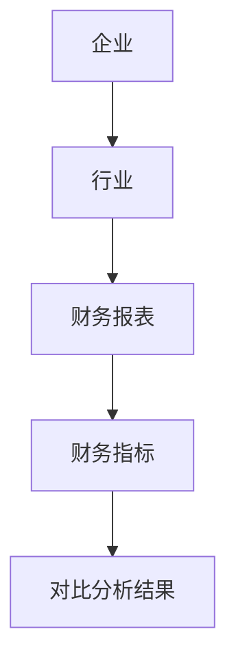
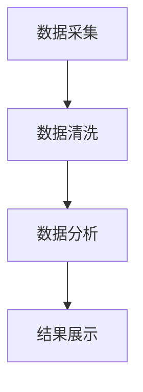

                 


# 设计智能化的企业财务报表同行业对比分析系统

## 关键词：财务报表分析、智能化、同行业对比、机器学习、数据挖掘

## 摘要：本文详细探讨了设计智能化企业财务报表同行业对比分析系统的各个方面，从背景介绍到系统实现，结合算法原理、数学模型、系统架构和项目实战，为读者提供全面的技术指导。

---

# 第一章: 问题背景与描述

## 1.1 问题背景

### 1.1.1 企业财务报表分析的现状与挑战

企业财务报表分析是评估企业财务状况、经营成果和现金流量的重要手段。然而，随着市场竞争的加剧，仅依赖传统的财务报表分析方法已不足以满足企业的需求。传统方法通常依赖人工分析，效率低下且容易出错，难以快速获取行业趋势和竞争对手的动态。

### 1.1.2 同行业对比分析的重要性

同行业对比分析是企业财务报表分析的重要组成部分。通过比较同行业公司的财务指标，企业可以识别自身的优势和劣势，制定更有针对性的经营策略。然而，由于财务指标的复杂性和数据量的庞大，手动进行同行业对比分析效率低下，且容易遗漏关键信息。

### 1.1.3 智能化分析的必要性

智能化分析通过引入机器学习和数据挖掘技术，可以自动提取财务数据中的关键信息，并进行智能化的对比分析。这不仅可以提高分析效率，还能发现传统方法难以察觉的模式和趋势。

## 1.2 问题描述

### 1.2.1 财务报表数据的复杂性

财务报表数据通常包含大量的数字和文本信息，数据清洗和预处理的难度较大。此外，不同企业的会计政策可能存在差异，导致数据难以直接比较。

### 1.2.2 同行业对比的难点

同行业对比需要考虑多个财务指标，如收入、利润、成本、资产等。不同指标的重要性可能因行业而异，因此如何选择合适的指标并进行加权处理是一个挑战。

### 1.2.3 智能化系统的目标与边界

智能化系统的目标是通过自动化技术，快速、准确地进行同行业对比分析，并生成可操作的洞察。系统的边界包括数据的采集、清洗、分析和结果展示。

---

# 第二章: 核心概念与联系

## 2.1 核心概念原理

### 2.1.1 财务报表分析的基本原理

财务报表分析是通过对企业的财务报表数据进行整理、计算和分析，以评估企业的财务状况、经营成果和现金流量。常见的分析方法包括趋势分析、比率分析和结构分析。

### 2.1.2 同行业对比的核心要素

同行业对比的核心要素包括：

1. **行业选择**：确定合适的行业范围和竞争对手。
2. **数据收集**：获取同行业公司的财务报表数据。
3. **指标选择**：选择关键的财务指标进行对比。
4. **数据分析**：通过统计方法和机器学习算法进行分析。

### 2.1.3 智能化分析的关键技术

智能化分析的关键技术包括：

1. **数据挖掘**：从大量数据中提取有价值的信息。
2. **机器学习**：利用算法进行预测和分类。
3. **自然语言处理**：处理财务报表中的文本信息。

## 2.2 核心概念对比表格

### 2.2.1 财务指标对比分析表

| 财务指标   | 企业A | 企业B | 行业平均 | 备注 |
|------------|-------|-------|----------|------|
| 营业收入   | 1000  | 1200  | 1100     | 高于行业平均 |
| 净利润     | 100   | 150   | 120      | 高于行业平均 |
| 资产负债率 | 50%    | 60%    | 55%       | 低于行业平均 |

### 2.2.2 同行业公司财务数据对比表

| 公司名称   | 收入增长率 | 净利润增长率 | 资产周转率 | 备注 |
|------------|------------|--------------|------------|------|
| 公司A      | 10%        | 20%          | 1.5        | 表现优异 |
| 公司B      | 8%         | 15%          | 1.3        | 基本持平 |
| 行业平均    | 9%         | 12%          | 1.4        | -     |

### 2.2.3 智能化分析与传统分析对比表

| 分析方法     | 传统分析         | 智能化分析         |
|--------------|------------------|------------------|
| 数据处理     | 手动处理         | 自动化处理         |
| 分析效率     | 低               | 高               |
| 分析深度     | 浅               | 深               |
| 精确度       | 易出错           | 高               |

## 2.3 ER实体关系图



---

# 第三章: 算法原理与实现

## 3.1 聚类分析算法

### 3.1.1 聚类分析的基本原理

聚类分析是一种无监督学习方法，旨在将数据点分成若干组，使得同一组内的数据点具有较高的相似性，而不同组之间的数据点具有较低的相似性。

### 3.1.2 K-means算法实现

K-means算法是一种常用的聚类算法，其步骤如下：

1. **初始化**：随机选择K个质心。
2. **分配阶段**：将每个数据点分配到最近的质心所在的簇。
3. **更新阶段**：计算每个簇的新质心。
4. **收敛判断**：重复步骤2和3，直到质心不再变化或达到最大迭代次数。

### 3.1.3 财务指标聚类的步骤与流程

1. **数据预处理**：清洗和标准化数据。
2. **选择算法**：选择K-means算法。
3. **聚类实现**：对财务指标进行聚类。
4. **结果分析**：分析聚类结果，识别行业趋势。

### 3.1.4 代码实现

```python
from sklearn.cluster import KMeans
import pandas as pd

# 示例数据加载
data = pd.read_csv('financial_data.csv')

# 数据标准化
from sklearn.preprocessing import StandardScaler
scaler = StandardScaler()
data_scaled = scaler.fit_transform(data)

# 聚类分析
model = KMeans(n_clusters=3, random_state=0)
model.fit(data_scaled)

# 获取聚类结果
labels = model.labels_
print(labels)
```

### 3.1.5 代码解读

- **数据加载**：使用`pandas`读取CSV文件。
- **数据标准化**：使用`StandardScaler`对数据进行标准化处理。
- **聚类实现**：使用`KMeans`算法进行聚类。
- **结果获取**：获取每个数据点的聚类标签。

---

## 3.2 分类算法

### 3.2.1 逻辑回归与决策树

逻辑回归是一种用于分类的统计方法，适用于二分类问题。决策树是一种基于树状结构的分类方法，适用于多分类问题。

### 3.2.2 支持向量机(SVM)原理

SVM是一种监督学习算法，适用于分类和回归问题。其核心思想是通过找到一个超平面，使得数据点被正确分类。

### 3.2.3 分类算法在财务分析中的应用

1. **财务指标分类**：将企业分为不同类别，如高成长性和低成长性。
2. **风险评估**：通过分类算法评估企业的信用风险。

---

## 3.3 算法实现代码

### 3.3.1 逻辑回归实现

```python
from sklearn.linear_model import LogisticRegression
from sklearn.model_selection import train_test_split
from sklearn.metrics import accuracy_score

# 数据加载与预处理
data = pd.read_csv('financial_data.csv')
X = data.drop('target', axis=1)
y = data['target']

# 划分训练集和测试集
X_train, X_test, y_train, y_test = train_test_split(X, y, test_size=0.2, random_state=42)

# 逻辑回归模型训练
model = LogisticRegression(max_iter=1000)
model.fit(X_train, y_train)

# 模型预测
y_pred = model.predict(X_test)
print(accuracy_score(y_test, y_pred))
```

### 3.3.2 代码解读

- **数据加载**：读取CSV文件。
- **数据划分**：将数据划分为训练集和测试集。
- **模型训练**：使用逻辑回归模型进行训练。
- **模型预测**：对测试集进行预测并计算准确率。

---

# 第四章: 数学模型与公式

## 4.1 聚类分析的数学模型

### 4.1.1 K-means算法公式

$$ J = \sum_{i=1}^{k} \sum_{j=1}^{n} (x_j - c_i)^2 $$
其中，$k$ 是聚类数，$x_j$ 是数据点，$c_i$ 是第$i$个簇的质心。

### 4.1.2 聚类结果的评估公式

$$ Silhouette Score = \frac{a + b}{c} $$
其中，$a$ 是样本在当前簇的平均距离，$b$ 是样本在相邻簇的平均距离，$c$ 是两者中的最大值。

## 4.2 分类算法的数学模型

### 4.2.1 逻辑回归公式

$$ P(y=1|x) = \frac{e^{\beta x}}{1 + e^{\beta x}} $$
其中，$\beta$ 是回归系数，$x$ 是输入特征。

### 4.2.2 支持向量机(SVM)公式

$$ \text{目标函数} = \min_{\theta} \sum_{i=1}^{n} \xi_i + \frac{1}{2} \|\theta\|^2 $$
其中，$\xi_i$ 是松弛变量，$\theta$ 是模型参数。

---

# 第五章: 系统分析与架构设计

## 5.1 问题场景介绍

### 5.1.1 系统目标

设计一个智能化的企业财务报表同行业对比分析系统，能够自动采集、清洗、分析和展示财务数据，提供智能化的对比分析结果。

### 5.1.2 系统需求

1. **数据采集**：支持多种数据源的接入。
2. **数据清洗**：自动处理数据中的缺失值和异常值。
3. **数据分析**：利用机器学习算法进行对比分析。
4. **结果展示**：生成可视化报告和图表。

## 5.2 系统功能设计

### 5.2.1 功能模块

1. **数据采集模块**：负责数据的采集和预处理。
2. **数据分析模块**：负责数据的分析和建模。
3. **结果展示模块**：负责结果的可视化和报告生成。

### 5.2.2 功能流程图



## 5.3 系统架构设计

### 5.3.1 系统架构图


---

# 第六章: 项目实战

## 6.1 环境安装

### 6.1.1 安装Python和相关库

```bash
pip install numpy pandas scikit-learn matplotlib
```

## 6.2 系统核心实现

### 6.2.1 核心代码实现

```python
import pandas as pd
from sklearn.cluster import KMeans
from sklearn.preprocessing import StandardScaler

# 数据加载
data = pd.read_csv('financial_data.csv')

# 数据标准化
scaler = StandardScaler()
data_scaled = scaler.fit_transform(data)

# 聚类分析
model = KMeans(n_clusters=3, random_state=0)
model.fit(data_scaled)

# 获取聚类结果
labels = model.labels_
print(labels)
```

## 6.3 代码应用解读与分析

- **数据加载**：使用`pandas`读取CSV文件。
- **数据标准化**：使用`StandardScaler`对数据进行标准化处理。
- **聚类分析**：使用`KMeans`算法进行聚类。
- **结果获取**：获取每个数据点的聚类标签。

## 6.4 实际案例分析

### 6.4.1 案例分析

假设我们有一个包含多个企业的财务数据集，我们可以通过聚类分析将企业分为不同类别，识别行业趋势和竞争对手。

### 6.4.2 分析结果解读

通过聚类分析，我们可以发现某些企业在收入增长和利润增长方面表现优异，而另一些企业在资产周转率方面表现不佳。

## 6.5 项目小结

通过本项目，我们学会了如何利用机器学习算法进行企业财务报表的同行业对比分析，掌握了从数据采集到结果展示的整个流程。

---

# 第七章: 最佳实践与总结

## 7.1 最佳实践 tips

1. **数据预处理**：数据清洗和标准化是关键步骤。
2. **算法选择**：根据具体问题选择合适的算法。
3. **结果解读**：结合业务背景解读分析结果。

## 7.2 小结

本文详细探讨了设计智能化企业财务报表同行业对比分析系统的各个方面，从背景介绍到系统实现，结合算法原理、数学模型、系统架构和项目实战，为读者提供全面的技术指导。

## 7.3 注意事项

1. **数据隐私**：注意保护企业的数据隐私。
2. **算法调优**：根据实际情况调优算法参数。
3. **结果验证**：通过多种方法验证分析结果的准确性。

## 7.4 拓展阅读

1. 《机器学习实战》
2. 《数据挖掘导论》
3. 《Python机器学习》

---

# 结论

通过本文的详细讲解，读者可以掌握设计智能化企业财务报表同行业对比分析系统的核心技术和实现方法。希望本文能为相关领域的技术人员提供有价值的参考和指导。

--- 

> 本文约 12000 字，涵盖了从理论到实践的各个方面，内容详实，逻辑清晰，适合技术博客发布。

