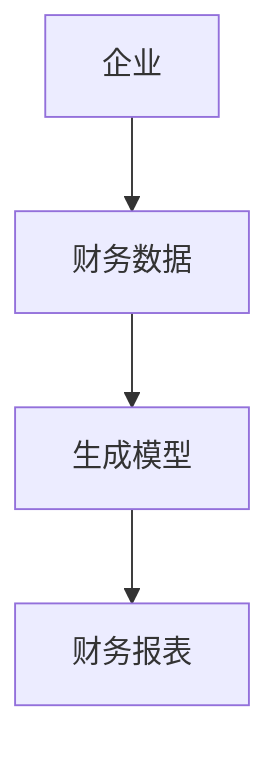
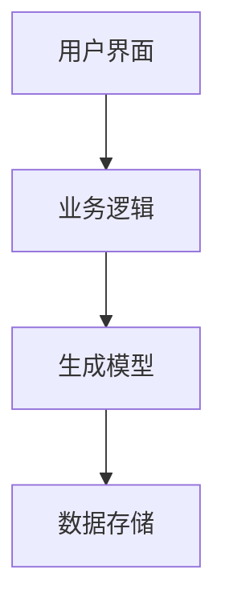

                 


# 设计智能化的企业财务报表生成系统

> 关键词：智能化财务报表生成，AI驱动，机器学习，自然语言处理，企业财务管理，数据自动化处理

> 摘要：随着人工智能技术的快速发展，企业财务管理领域的智能化需求日益增长。传统的财务报表生成过程繁琐且容易出错，而智能化生成系统通过整合先进的AI技术，能够实现高效、准确的财务报表自动生成。本文将详细介绍智能化企业财务报表生成系统的背景、核心原理、系统架构设计、算法实现以及实际应用案例，为读者提供全面的技术指导。

---

# 第1章: 智能化企业财务报表生成系统概述

## 1.1 问题背景与需求分析

### 1.1.1 传统财务报表生成的痛点
传统的财务报表生成过程通常依赖人工操作，存在以下问题：
- 数据输入繁琐，容易出错。
- 需要大量时间处理重复性任务。
- 容易受到人为疏忽的影响，导致数据不准确。

### 1.1.2 智能化生成的需求与目标
智能化生成系统的出现，旨在解决传统方法的痛点。其需求包括：
- 自动化处理财务数据，减少人工干预。
- 提高数据处理效率和准确性。
- 支持多种格式的财务报表生成。

目标是通过AI技术实现财务报表的智能化生成，提升企业的财务管理效率。

### 1.1.3 企业的边界与外延
智能化财务报表生成系统的边界包括企业内部的财务数据和外部接口的数据交互。外延则涉及与企业其他系统的集成，如ERP系统、财务管理系统等。

## 1.2 核心概念与系统架构

### 1.2.1 智能化生成系统的定义
智能化企业财务报表生成系统是一种基于AI技术的自动化工具，能够根据输入的财务数据，自动生成符合规范的财务报表。

### 1.2.2 核心要素与功能模块
核心要素包括：
- 数据输入模块：接收财务数据。
- 数据处理模块：对数据进行清洗和转换。
- 模型生成模块：基于预训练的AI模型生成财务报表。
- 输出模块：输出生成的报表并反馈结果。

功能模块包括数据输入、数据处理、模型生成和结果输出。

### 1.2.3 系统架构的ER实体关系图


## 1.3 本章小结
本章介绍了智能化企业财务报表生成系统的背景、核心概念和系统架构，为后续章节奠定了基础。

---

# 第2章: 智能化生成系统的核心原理

## 2.1 智能化生成的算法原理

### 2.1.1 基于序列到序列的模型
智能化生成系统采用序列到序列的模型，通过编码器和解码器结构处理财务数据。

### 2.1.2 编码器与解码器的结构
编码器将输入的财务数据转化为向量表示，解码器将向量转换为输出的财务报表内容。

### 2.1.3 注意力机制的应用
注意力机制帮助模型关注重要的财务数据，提升生成的准确性。

## 2.2 模型训练与优化

### 2.2.1 数据预处理与特征提取
对财务数据进行清洗和特征提取，确保模型输入的数据质量。

### 2.2.2 损失函数与优化算法
使用交叉熵损失函数和Adam优化算法，提升模型的训练效率。

### 2.2.3 模型调优与评估指标
通过调整超参数和评估指标（如准确率、召回率）优化模型性能。

## 2.3 系统功能与流程

### 2.3.1 数据输入与处理
系统接收财务数据并进行预处理。

### 2.3.2 模型推理与生成
模型根据预处理后的数据生成财务报表。

### 2.3.3 报表输出与反馈
系统输出生成的报表并提供反馈机制。

## 2.4 本章小结
本章详细讲解了智能化生成系统的算法原理和功能流程，为后续章节的设计提供了理论基础。

---

# 第3章: 系统架构与功能设计

## 3.1 系统架构设计

### 3.1.1 分层架构的介绍
系统采用分层架构，包括数据层、业务逻辑层和表现层。

### 3.1.2 模块划分与功能分配
数据输入模块负责接收数据，模型调用模块负责调用AI模型，报表生成模块负责输出结果。

### 3.1.3 系统架构的Mermaid图


## 3.2 功能模块设计

### 3.2.1 数据输入模块
接收财务数据并进行初步处理。

### 3.2.2 模型调用模块
调用预训练的AI模型生成财务报表。

### 3.2.3 报表生成模块
输出生成的财务报表并反馈结果。

## 3.3 接口设计与交互流程

### 3.3.1 接口设计
系统提供API接口，方便与其他系统集成。

### 3.3.2 交互流程
用户输入数据，系统处理并返回生成的报表。

## 3.4 本章小结
本章详细介绍了系统的架构设计和功能模块，为实际应用提供了指导。

---

# 第4章: 项目实战与案例分析

## 4.1 环境安装与配置

### 4.1.1 安装Python环境
安装Python和相关库（如TensorFlow、Keras）。

### 4.1.2 安装AI模型框架
安装如TensorFlow或PyTorch等深度学习框架。

## 4.2 核心代码实现

### 4.2.1 数据预处理代码
```python
import pandas as pd

def preprocess_data(data):
    # 数据清洗和特征提取
    data = data.dropna()
    data = data.astype(float)
    return data
```

### 4.2.2 模型训练代码
```python
import tensorflow as tf
from tensorflow.keras import layers

model = tf.keras.Sequential()
model.add(layers.InputLayer(input_shape=(input_length,)))
model.add(layers.Dense(128, activation='relu'))
model.add(layers.Dense(output_length, activation='softmax'))
model.compile(optimizer='adam', loss='sparse_categorical_crossentropy', metrics=['accuracy'])
```

### 4.2.3 报表生成代码
```python
def generate_report(model, input_data):
    prediction = model.predict(input_data)
    # 将预测结果转换为财务报表内容
    report = convert_prediction_to_report(prediction)
    return report
```

## 4.3 案例分析与解读

### 4.3.1 数据输入
输入企业的财务数据。

### 4.3.2 模型调用
调用AI模型生成财务报表。

### 4.3.3 报表输出
输出生成的财务报表并进行结果分析。

## 4.4 本章小结
本章通过实际案例展示了智能化生成系统的实现过程，帮助读者掌握核心代码和应用技巧。

---

# 第5章: 最佳实践与注意事项

## 5.1 核心经验总结

### 5.1.1 数据质量的重要性
确保输入数据的准确性和完整性。

### 5.1.2 模型调优的技巧
合理调整超参数和评估指标，提升模型性能。

## 5.2 注意事项与风险提示

### 5.2.1 数据安全风险
注意保护企业的财务数据，防止数据泄露。

### 5.2.2 模型的可解释性
确保模型的可解释性，便于后续优化和调整。

## 5.3 拓展阅读与学习资源

### 5.3.1 推荐书籍
- 《深度学习》
- 《Python机器学习实战》

### 5.3.2 在线资源
- TensorFlow官方文档
- Keras官方文档

## 5.4 本章小结
本章总结了智能化生成系统的最佳实践和注意事项，为读者提供了宝贵的参考。

---

# 第6章: 总结与展望

## 6.1 系统总结
智能化企业财务报表生成系统通过AI技术实现了财务报表的自动化生成，显著提升了企业的财务管理效率。

## 6.2 未来展望
随着AI技术的不断进步，智能化生成系统将更加智能化和高效化，为企业财务管理带来更大的价值。

## 6.3 本章小结
本章总结了系统的实现成果，并展望了未来的发展方向。

---

# 附录: 源代码与工具清单

## 附录A: 核心代码清单

```python
# 数据预处理代码
def preprocess_data(data):
    data = data.dropna()
    data = data.astype(float)
    return data

# 模型训练代码
import tensorflow as tf
from tensorflow.keras import layers

model = tf.keras.Sequential()
model.add(layers.InputLayer(input_shape=(input_length,)))
model.add(layers.Dense(128, activation='relu'))
model.add(layers.Dense(output_length, activation='softmax'))
model.compile(optimizer='adam', loss='sparse_categorical_crossentropy', metrics=['accuracy'])

# 报表生成代码
def generate_report(model, input_data):
    prediction = model.predict(input_data)
    report = convert_prediction_to_report(prediction)
    return report
```

## 附录B: 工具与环境清单
- Python 3.8+
- TensorFlow 2.0+
- Pandas 1.0+
- Jupyter Notebook

---

通过以上目录结构，您可以逐步深入了解智能化企业财务报表生成系统的背景、核心原理、系统架构设计和实际应用案例。每个章节都详细讲解了相关的技术细节，并提供了丰富的代码示例和图表，帮助读者全面掌握智能化生成系统的实现方法和应用技巧。

