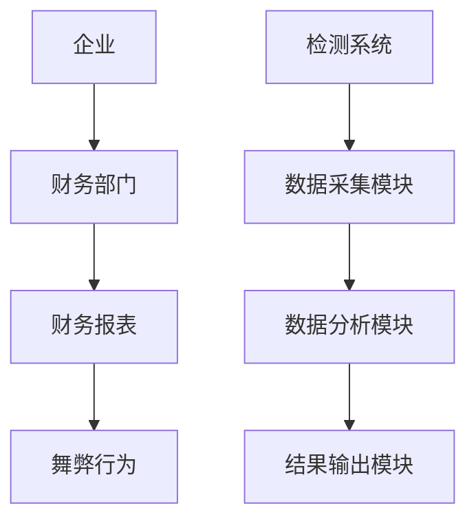

                 

# 设计智能化的企业财务报表舞弊检测系统

## 关键词：财务报表、舞弊检测、人工智能、大数据分析、机器学习

## 摘要：  
随着企业规模的不断扩大和财务数据的日益复杂化，财务报表舞弊问题日益严重。传统的财务审计方法已难以应对复杂的舞弊手段。本文将介绍一种基于人工智能和大数据分析的智能化财务报表舞弊检测系统，从背景、技术原理到系统设计、项目实战，全面解析如何利用现代技术手段提升企业财务报表的准确性与可靠性。

---

# 第一章：企业财务报表舞弊检测系统背景介绍

## 1.1 财务报表舞弊问题背景

### 1.1.1 财务报表舞弊的定义与特征

财务报表舞弊是指企业通过虚构、隐瞒、篡改财务数据，以虚增收入、虚减支出、虚增资产、虚减负债等方式，粉饰财务报表，误导利益相关者的行为。其主要特征包括：

1. **隐蔽性**：舞弊行为通常隐藏在合法的财务操作中，难以被发现。
2. **多样性**：舞弊手段多样，包括虚构交易、虚增资产、提前确认收入等。
3. **复杂性**：现代舞弊行为往往结合多种手段，甚至利用企业内部控制系统漏洞。

### 1.1.2 财务报表舞弊的常见手段

1. **虚构交易**：通过虚设客户或供应商，虚增收入或支出。
2. **资产虚增**：通过虚增存货、固定资产等，夸大资产规模。
3. **收入提前确认**：将未来的收入提前入账，虚增当期利润。
4. **费用隐瞒**：将应计入当期费用的支出延迟入账，虚增利润。

### 1.1.3 财务报表舞弊对企业的影响

1. **财务信息失真**：影响投资者、债权人等利益相关者的决策。
2. **法律风险**：可能导致企业面临法律诉讼和行政处罚。
3. **信任危机**：舞弊行为会破坏企业与利益相关者的信任关系。

## 1.2 财务报表舞弊检测的现状与挑战

### 1.2.1 传统财务报表审计的局限性

1. **人工审查效率低**：传统审计依赖人工审查，效率低下，难以应对海量数据。
2. **主观性**：审计人员的主观判断可能导致遗漏或误判。
3. **成本高**：传统审计需要大量的人力和时间，成本较高。

### 1.2.2 数据分析技术在财务舞弊检测中的应用现状

1. **数据挖掘技术**：通过数据挖掘技术发现数据中的异常模式。
2. **机器学习算法**：利用监督学习、无监督学习等算法，识别财务数据中的异常。
3. **自然语言处理（NLP）**：分析财务报告中的文本信息，发现潜在的舞弊信号。

### 1.2.3 当前技术在舞弊检测中的不足与挑战

1. **数据质量问题**：财务数据可能存在缺失、不一致等问题，影响模型的准确性。
2. **模型泛化能力不足**：现有的模型可能在特定场景下表现良好，但在不同行业、不同规模的企业中可能效果不佳。
3. **实时性问题**：现有的技术难以实现实时检测，无法及时发现舞弊行为。

## 1.3 企业智能化财务报表舞弊检测的目标与意义

### 1.3.1 智能化舞弊检测的目标

1. **提高检测效率**：利用人工智能技术快速分析海量财务数据，减少人工审查的时间和成本。
2. **提升准确性**：通过机器学习算法，提高舞弊检测的准确率，降低误判和漏判的概率。
3. **实现实时监控**：构建实时监控系统，及时发现和预警潜在的舞弊行为。

### 1.3.2 智能化舞弊检测的意义

1. **保障财务信息的真实性**：通过智能化检测系统，确保财务报表的真实性和准确性。
2. **降低企业风险**：及时发现和防范舞弊行为，降低企业的法律和财务风险。
3. **提升管理效率**：智能化系统能够自动分析数据，帮助企业管理者做出更高效的决策。

## 1.4 智能化财务报表舞弊检测的技术基础

### 1.4.1 人工智能技术在财务分析中的应用

1. **机器学习**：监督学习、无监督学习、半监督学习等算法在财务数据分类中的应用。
2. **深度学习**：利用神经网络模型（如CNN、RNN）进行复杂模式识别。
3. **自然语言处理（NLP）**：分析财务报告中的文本信息，发现潜在的舞弊信号。

### 1.4.2 大数据分析在财务报表舞弊检测中的作用

1. **数据挖掘**：通过数据挖掘技术发现数据中的异常模式。
2. **预测分析**：利用大数据分析技术预测潜在的舞弊行为。
3. **实时分析**：实现实时数据分析，提高检测的及时性。

### 1.4.3 机器学习算法在舞弊检测中的优势

1. **高效性**：机器学习算法能够快速处理大量数据，提高检测效率。
2. **准确性**：通过训练模型，能够识别复杂的舞弊模式，提高检测的准确性。
3. **可扩展性**：机器学习算法能够适应不同规模和类型的数据，具有良好的扩展性。

---

# 第二章：企业财务报表舞弊检测系统的核心概念与联系

## 2.1 财务报表舞弊检测的核心概念

### 2.1.1 财务报表舞弊检测的基本原理

财务报表舞弊检测的基本原理是通过对财务数据的分析，识别出异常的数据模式或交易行为。通常包括以下几个步骤：

1. **数据采集**：收集企业的财务数据，包括收入、支出、资产、负债等。
2. **数据预处理**：对数据进行清洗、标准化和特征提取。
3. **模型训练**：利用机器学习算法训练模型，识别异常模式。
4. **结果分析**：根据模型的输出结果，判断是否存在舞弊行为。

### 2.1.2 舞弊检测的关键要素

1. **财务数据**：包括企业的收入、支出、资产、负债等财务数据。
2. **交易行为**：包括交易的时间、金额、频率、参与者等信息。
3. **模型算法**：包括监督学习、无监督学习等机器学习算法。
4. **规则引擎**：基于行业经验制定的舞弊检测规则。

### 2.1.3 舞弊检测系统的功能模块

1. **数据采集模块**：负责采集企业的财务数据。
2. **数据预处理模块**：对数据进行清洗、标准化和特征提取。
3. **模型训练模块**：利用机器学习算法训练模型，识别异常模式。
4. **结果分析模块**：根据模型的输出结果，判断是否存在舞弊行为。
5. **规则引擎模块**：基于行业经验制定的舞弊检测规则。

## 2.2 核心概念的属性特征对比

### 2.2.1 财务数据特征的属性对比

| 特征属性 | 正常数据 | 异常数据 |
|----------|----------|----------|
| 数据分布 | 符合正态分布 | 数据分布异常 |
| 数据波动 | 波动较小 | 波动较大 |
| 数据关联 | 数据之间相关性低 | 数据之间相关性高 |

### 2.2.2 舞弊行为特征的属性对比

| 特征属性 | 无舞弊行为 | 有舞弊行为 |
|----------|------------|------------|
| 交易频率 | 交易频率正常 | 交易频率异常 |
| 交易金额 | 金额符合预期 | 金额不符合预期 |
| 交易时间 | 时间分布合理 | 时间分布不合理 |

### 2.2.3 正常与异常数据的特征对比

| 特征属性 | 正常数据 | 异常数据 |
|----------|----------|----------|
| 数据模式 | 数据模式符合预期 | 数据模式不符合预期 |
| 数据波动 | 波动较小 | 波动较大 |
| 数据关联 | 数据之间相关性低 | 数据之间相关性高 |

## 2.3 系统实体关系图

---

# 第三章：财务报表舞弊检测系统的算法原理

## 3.1 特征提取与数据预处理

### 3.1.1 财务数据的特征选择

1. **收入与支出分析**：分析收入与支出的匹配性，发现是否存在收入虚增或支出隐瞒。
2. **资产与负债分析**：分析资产与负债的匹配性，发现是否存在资产虚增或负债虚减。
3. **财务比率分析**：计算各项财务比率（如流动性比率、偿债能力比率、营运能力比率等），发现异常变化。

### 3.1.2 数据清洗与标准化

1. **数据清洗**：去除重复数据、缺失数据、异常数据。
2. **数据标准化**：将数据标准化到统一的范围，方便模型训练。

### 3.1.3 数据增强与降维

1. **数据增强**：通过增加数据的多样性，提高模型的泛化能力。
2. **降维**：通过主成分分析（PCA）等方法，降低数据维度，减少计算量。

## 3.2 舞弊分类算法

### 3.2.1 机器学习算法选择

1. **监督学习算法**：如支持向量机（SVM）、随机森林（Random Forest）、逻辑回归（Logistic Regression）等。
2. **无监督学习算法**：如聚类分析（K-Means）、异常检测（Isolation Forest）等。

### 3.2.2 基于决策树的分类算法

决策树是一种常用的分类算法，适用于财务数据的分类问题。以下是决策树算法的实现步骤：

1. **数据准备**：收集和整理财务数据，提取特征。
2. **模型训练**：利用决策树算法（如ID3、C4.5、CART）训练模型。
3. **模型预测**：利用训练好的模型，对新的数据进行分类预测。
4. **结果分析**：分析模型的预测结果，判断是否存在舞弊行为。

### 3.2.3 基于支持向量机的分类

支持向量机（SVM）是一种高效的分类算法，适用于高维数据的分类问题。以下是SVM算法的实现步骤：

1. **数据准备**：收集和整理财务数据，提取特征。
2. **数据预处理**：对数据进行标准化、归一化等处理。
3. **模型训练**：利用SVM算法训练模型。
4. **模型预测**：利用训练好的模型，对新的数据进行分类预测。
5. **结果分析**：分析模型的预测结果，判断是否存在舞弊行为。

---

## 总结

通过以上内容，我们详细介绍了智能化的企业财务报表舞弊检测系统的设计背景、核心概念、算法原理等。下一章我们将深入探讨系统的设计与实现，包括系统架构设计、功能模块实现等内容。

