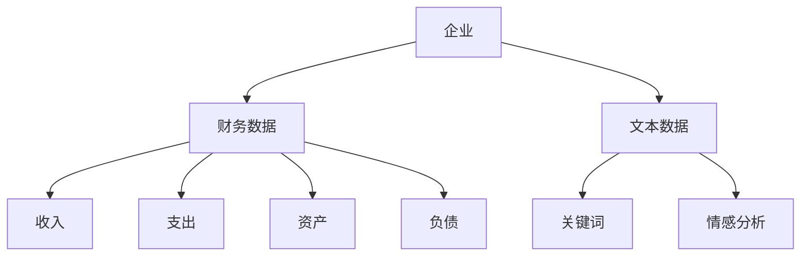
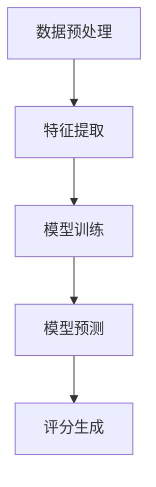
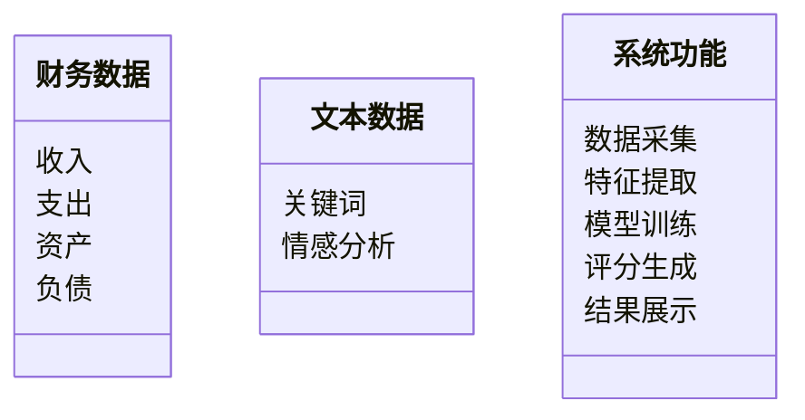
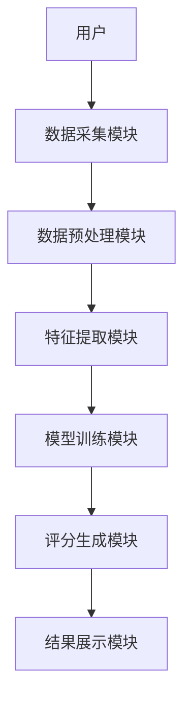
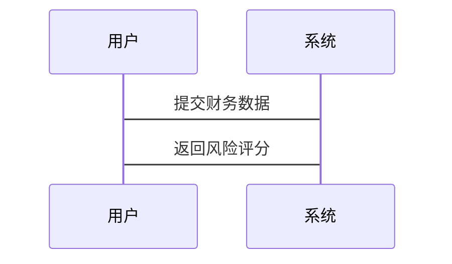

                 


# 设计智能化的企业财务报表舞弊风险评分系统

## 关键词：财务报表，舞弊风险，评分系统，人工智能，机器学习，数据特征，系统架构

## 摘要：  
本文详细探讨了设计智能化的企业财务报表舞弊风险评分系统的核心方法和实现路径。通过结合人工智能和大数据分析技术，提出了一种基于机器学习的财务报表舞弊识别模型，旨在帮助企业有效识别和评估财务报表中的舞弊风险。文章从问题背景、核心概念、算法原理、系统架构、项目实战等多个维度展开分析，提供了从理论到实践的全面指导。通过实际案例分析和代码实现，展示了如何利用技术手段构建高效、可靠的舞弊风险评分系统，为企业财务管理提供有力支持。

---

## 第一部分: 背景介绍

### 第1章: 企业财务报表舞弊风险评分系统背景

#### 1.1 问题背景
- **1.1.1 财务报表舞弊的现状**  
  随着企业规模的扩大和经济活动的复杂化，财务报表舞弊问题日益严重。企业通过虚构收入、隐瞒支出、虚增资产等手段 manipulate 财务数据，导致投资者和债权人蒙受损失。传统的财务审计方法效率低下，难以应对复杂的舞弊手段。

- **1.1.2 舞弊对企业及投资者的影响**  
  财务报表舞弊不仅损害企业的信誉，还可能导致投资者决策失误，甚至引发企业破产。例如，安然、世通等重大舞弊事件对企业和社会造成了深远的影响。

- **1.1.3 传统舞弊识别方法的局限性**  
  传统财务审计依赖人工审查，耗时长、成本高，且容易受到主观因素的影响。面对海量数据和复杂的舞弊手段，传统方法难以实现高效的舞弊识别。

#### 1.2 问题描述
- **1.2.1 财务报表舞弊的主要形式**  
  舞弊主要表现为虚增收入、虚减支出、资产虚增、负债虚减等。这些行为通常通过调整财务数据、隐藏交易信息等方式实现。

- **1.2.2 舞弊风险评分系统的定义**  
  舞弊风险评分系统是一种利用人工智能技术，通过对财务数据和非财务数据的分析，量化企业财务报表舞弊风险的系统。其核心目标是帮助企业快速识别潜在的舞弊行为。

- **1.2.3 系统的目标与应用场景**  
  系统的目标是通过自动化分析，为企业提供实时的舞弊风险评分。应用场景包括企业内部审计、第三方审计机构、投资者决策支持等。

#### 1.3 问题解决
- **1.3.1 智能化评分系统的必要性**  
  通过引入人工智能技术，可以显著提高舞弊识别的效率和准确性。智能化评分系统能够处理海量数据，快速识别异常模式。

- **1.3.2 人工智能在财务舞弊识别中的应用**  
  人工智能技术（如机器学习、自然语言处理）可以用于分析财务数据和文本信息，发现潜在的舞弊行为。

- **1.3.3 系统设计的核心思路**  
  系统设计的核心思路包括数据采集与预处理、特征提取、模型训练与优化、评分生成与结果展示。

#### 1.4 边界与外延
- **1.4.1 系统的适用范围**  
  系统适用于企业财务报表的分析，但不包括企业内部控制系统的设计。

- **1.4.2 系统的局限性**  
  系统依赖于历史数据和已知的舞弊模式，对于新型舞弊手段可能无法有效识别。

- **1.4.3 系统与其他财务工具的关系**  
  系统可以与企业 ERP 系统、财务审计工具等无缝集成，提供实时的舞弊风险评估。

#### 1.5 核心要素组成
- **1.5.1 数据来源与特征**  
  数据来源包括财务报表数据（收入、支出、资产、负债等）和非财务数据（文本信息、时间戳等）。特征包括财务比率、交易频率、文本情感等。

- **1.5.2 评分模型与算法**  
  系统采用机器学习算法（如逻辑回归、随机森林）构建评分模型，对财务数据进行分类和预测。

- **1.5.3 系统架构与实现**  
  系统架构包括数据采集模块、特征提取模块、模型训练模块、评分生成模块和结果展示模块。

## 第二部分: 核心概念与联系

### 第2章: 财务报表舞弊风险评分系统的核心概念

#### 2.1 评分模型原理
- **2.1.1 模型的输入与输出**  
  模型的输入是经过预处理的财务数据和非财务数据，输出是每个企业的舞弊风险评分（如高、中、低风险）。

- **2.1.2 模型的训练与优化**  
  模型通过历史数据进行训练，采用交叉验证和网格搜索优化模型参数。

- **2.1.3 模型的评估与验证**  
  通过准确率、召回率、F1 分数等指标评估模型性能。

#### 2.2 数据特征分析
- **2.2.1 财务数据的特征提取**  
  从财务报表中提取收入、支出、资产、负债等数据，并计算相关财务比率（如净利润率、资产负债率）。

- **2.2.2 文本数据的特征提取**  
  对财务报告中的文本信息进行关键词提取和情感分析，识别异常的文本模式。

- **2.2.3 综合特征的构建**  
  将财务数据和文本数据进行融合，构建综合特征向量。

#### 2.3 评分标准与结果
- **2.3.1 评分标准的制定**  
  根据历史数据和行业经验，制定舞弊风险评分标准（如低风险、中风险、高风险）。

- **2.3.2 评分结果的展示**  
  通过可视化工具（如仪表盘）展示评分结果，并提供风险预警功能。

#### 2.4 核心概念对比表
| 特征类型 | 财务特征 | 非财务特征 | 综合特征 |
|----------|----------|------------|----------|
| 示例     | 净利润   | 文本关键词  | 综合得分 |

#### 2.5 ER 实体关系图


## 第三部分: 算法原理讲解

### 第3章: 财务报表舞弊风险评分系统的算法原理

#### 3.1 算法选择与原理
- **3.1.1 机器学习算法的选择**  
  系统采用逻辑回归和随机森林算法，这两种算法在分类任务中表现优异，且易于解释。

- **3.1.2 算法流程图**  


#### 3.2 算法实现
- **3.2.1 数据预处理**  
  数据清洗、标准化和特征工程。

- **3.2.2 模型训练**  
  使用逻辑回归和随机森林对历史数据进行训练。

- **3.2.3 模型评估**  
  通过交叉验证评估模型性能。

#### 3.3 算法代码实现
```python
import pandas as pd
from sklearn.model_selection import train_test_split
from sklearn.linear_model import LogisticRegression
from sklearn.ensemble import RandomForestClassifier
from sklearn.metrics import accuracy_score, recall_score, f1_score

# 数据加载与预处理
data = pd.read_csv('financial_data.csv')
X = data.drop('label', axis=1)
y = data['label']

# 数据分割
X_train, X_test, y_train, y_test = train_test_split(X, y, test_size=0.2, random_state=42)

# 模型训练
lr_model = LogisticRegression(max_iter=1000).fit(X_train, y_train)
rf_model = RandomForestClassifier(n_estimators=100, random_state=42).fit(X_train, y_train)

# 模型预测
y_pred_lr = lr_model.predict(X_test)
y_pred_rf = rf_model.predict(X_test)

# 模型评估
print(f"Logistic Regression Accuracy: {accuracy_score(y_test, y_pred_lr)}")
print(f"Random Forest Recall: {recall_score(y_test, y_pred_rf)}")
print(f"Random Forest F1 Score: {f1_score(y_test, y_pred_rf)}")
```

#### 3.4 算法数学模型
- **逻辑回归模型**  
  损失函数为对数损失函数：$$L = -\sum_{i=1}^{n} [y_i \log(p_i) + (1-y_i)\log(1-p_i)]$$  
  优化方法为梯度下降：$$\theta = \theta - \alpha \cdot \nabla L$$  

- **随机森林模型**  
  随机森林通过 bagging 和特征随机化构建多个决策树，最终结果为各树的投票结果。

## 第四部分: 系统分析与架构设计方案

### 第4章: 财务报表舞弊风险评分系统的架构设计

#### 4.1 问题场景介绍
- 系统需要处理大量的财务数据和非财务数据，提供实时的舞弊风险评分。

#### 4.2 系统功能设计
- **领域模型**  


- **系统架构**  


- **接口设计**  
  系统提供 RESTful API 接口，供其他系统调用评分结果。

- **交互设计**  


## 第五部分: 项目实战

### 第5章: 实战: 智能化财务报表舞弊风险评分系统

#### 5.1 环境安装
- 安装 Python 和必要的库（如 pandas、scikit-learn、matplotlib）。

#### 5.2 系统核心实现
- **数据采集**  
  从企业财务系统中获取数据，存储为 CSV 文件。

- **特征提取**  
  使用 pandas 进行数据清洗和特征工程。

- **模型训练**  
  使用 scikit-learn 进行模型训练和优化。

- **评分生成**  
  通过训练好的模型对新数据进行评分。

- **结果展示**  
  使用 matplotlib 或 seaborn 进行结果可视化。

#### 5.3 代码实现
```python
import pandas as pd
from sklearn.model_selection import train_test_split
from sklearn.linear_model import LogisticRegression
from sklearn.metrics import classification_report

# 数据加载
data = pd.read_csv('financial_data.csv')

# 特征工程
data = data.dropna()
X = data.drop('label', axis=1)
y = data['label']

# 数据分割
X_train, X_test, y_train, y_test = train_test_split(X, y, test_size=0.2, random_state=42)

# 模型训练
model = LogisticRegression(max_iter=1000).fit(X_train, y_train)

# 模型预测
y_pred = model.predict(X_test)

# 模型评估
print(classification_report(y_test, y_pred))
```

#### 5.4 实际案例分析
- 使用实际企业数据进行测试，展示系统的评分结果和分析报告。

## 第六部分: 最佳实践、小结、注意事项和拓展阅读

### 第6章: 最佳实践与总结

#### 6.1 小结
- 本文详细介绍了智能化的企业财务报表舞弊风险评分系统的 design 和实现过程，从理论到实践，提供了全面的指导。

#### 6.2 注意事项
- 数据质量对系统性能影响重大，需确保数据的完整性和准确性。
- 系统的可解释性是实际应用中的重要考量，需关注模型的可解释性。
- 系统的实时性需根据实际需求进行优化。

#### 6.3 拓展阅读
- 《Python机器学习实战》
- 《数据挖掘导论》
- 《财务报表分析》

---

通过以上步骤，我们可以设计出一个智能化的企业财务报表舞弊风险评分系统，帮助企业有效识别和评估财务报表中的舞弊风险。

