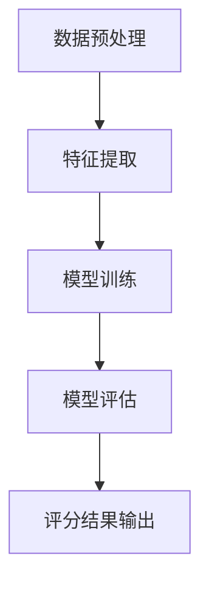
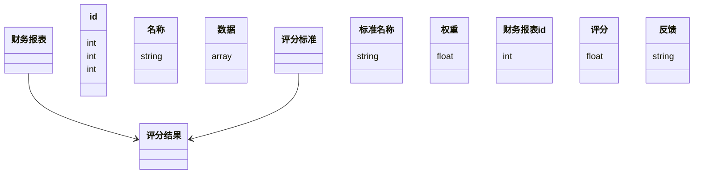
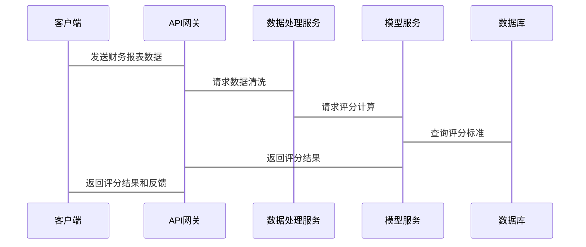

                 


# 设计智能化的企业财务报表质量评分系统

## 关键词：企业财务报表，质量评分，智能化系统，机器学习，财务数据分析

## 摘要：  
本文详细探讨了设计智能化的企业财务报表质量评分系统的核心概念、算法原理、系统架构和实现方案。通过分析财务报表质量的关键指标，结合机器学习算法，构建了一个高效、准确的评分模型，帮助企业提升财务数据管理的智能化水平。文章从背景介绍到项目实战，全面阐述了系统的构建过程，并提供了具体的代码实现和案例分析，为读者提供了从理论到实践的完整指南。

---

## 第一部分：背景介绍

### 第1章：企业财务报表质量评分系统概述

#### 1.1 问题背景
- **企业财务报表的重要性**：财务报表是企业经济活动的重要记录，是投资者、债权人和管理层评估企业财务状况的关键依据。然而，财务报表的质量直接影响其信息的可靠性和决策的有效性。
- **财务报表质量问题的现状**：传统财务报表可能存在数据错误、虚假信息、格式不统一等问题，导致分析结果的偏差。此外，手动审核的效率低下，难以满足大规模数据处理的需求。
- **智能化评分系统的必要性**：随着企业规模的扩大和数据量的增加，传统的财务报表审核方式已经难以满足需求。智能化评分系统能够通过自动化处理和数据分析，提高评分的准确性和效率，降低人为错误。

#### 1.2 问题描述
- **财务报表质量的多维度评估**：财务报表的质量需要从多个维度进行评估，包括数据的完整性、准确性、逻辑性等。
- **传统评分方法的局限性**：传统方法主要依赖人工审核，存在主观性、效率低、成本高等问题。
- **智能化评分的需求与目标**：智能化评分系统的目标是通过技术手段实现财务报表的自动评分，提高评分效率和准确性，降低企业成本。

#### 1.3 解决方案与价值
- **智能化评分系统的总体思路**：利用机器学习算法对财务数据进行分析，构建评分模型，实现自动化评分。
- **系统的核心价值**：提高财务报表审核的效率和准确性，降低企业运营成本，增强财务数据的可信度。
- **边界与外延**：系统专注于财务报表的质量评分，不涉及具体的财务决策或战略分析。

#### 1.4 核心概念与联系
- **概念结构与核心要素**：系统需要处理的主要要素包括财务数据、评分模型、评分标准等。
- **概念属性对比表**：下表展示了传统评分与智能化评分的核心区别。

| 对比维度 | 传统评分 | 智能化评分 |
|----------|----------|------------|
| 审核方式 | 人工审核 | 自动化处理 |
| 审核效率 | 低效 | 高效 |
| 审核成本 | 高 | 低 |
| 审核准确性 | 易出错 | 高 |

- **ER实体关系图**：以下是系统的核心实体关系图（使用 Mermaid）：

```mermaid
erd
  title 实体关系图
  企业
    id: int
    名称: varchar(255)
  财务报表
    id: int
    报表编号: varchar(255)
    企业id: int
  评分标准
    id: int
    标准名称: varchar(255)
  评分结果
    id: int
    财务报表id: int
    评分标准id: int
    评分: int
```

---

## 第二部分：核心概念与联系

### 第2章：智能化评分系统的原理与机制

#### 2.1 智能化评分模型的构建
- **数据预处理与特征提取**：对财务数据进行清洗、标准化和特征提取，确保数据的可用性和一致性。
- **模型训练与优化**：选择合适的机器学习算法（如随机森林、支持向量机），对数据进行训练和优化，提高模型的准确性。
- **模型评估与调优**：通过交叉验证等方法评估模型性能，调整参数以优化模型效果。

#### 2.2 数据预处理与特征工程
- **数据清洗与标准化**：去除重复数据、处理缺失值、标准化数值型数据。
- **特征选择与降维**：通过特征重要性分析选择关键特征，减少数据维度，提高模型效率。
- **数据增强与扩展**：通过数据增强技术扩展训练数据，提高模型的泛化能力。

#### 2.3 财务报表评分标准与规则
- **评分指标的权重分配**：根据财务报表的关键指标（如利润、收入、成本）分配权重，构建评分模型。
- **评分规则的设计与实现**：制定评分规则，如“收入大于成本则评分+1”，并将其转化为代码实现。
- **评分结果的解释与反馈**：对评分结果进行解释，提供反馈意见，帮助用户优化财务报表质量。

---

## 第三部分：算法原理与数学模型

### 第3章：基于机器学习的评分算法

#### 3.1 算法原理
- **机器学习在评分系统中的应用**：机器学习算法能够通过大量数据训练，自动识别财务报表中的异常和错误，实现智能化评分。
- **常见算法的比较与选择**：随机森林和神经网络是常用的算法，随机森林适用于特征较多的情况，而神经网络适用于复杂的数据关系。
- **算法流程图（使用 Mermaid）**：



#### 3.2 数学模型与公式
- **模型的数学表达式**：
  $$ \text{评分} = \sum_{i=1}^{n} w_i \cdot x_i $$
  其中，\( w_i \) 是特征 \( x_i \) 的权重，\( x_i \) 是标准化后的特征值。
- **损失函数与优化目标**：
  $$ \text{损失函数} = \sum_{i=1}^{m} (y_i - \hat{y}_i)^2 $$
  其中，\( y_i \) 是真实评分，\( \hat{y}_i \) 是模型预测评分。
- **示例计算与解释**：
  假设我们有三个特征，权重分别为0.4、0.3、0.3，标准化后的特征值分别为1、0.8、0.6。则评分计算如下：
  $$ \text{评分} = 0.4 \times 1 + 0.3 \times 0.8 + 0.3 \times 0.6 = 0.4 + 0.24 + 0.18 = 0.82 $$

---

## 第四部分：系统分析与架构设计

### 第4章：系统架构与功能设计

#### 4.1 问题场景介绍
- **系统目标**：实现智能化的财务报表质量评分，提高审核效率和准确性。
- **核心功能**：数据导入、数据清洗、评分计算、结果展示、报告生成。

#### 4.2 系统功能设计（领域模型）
- **领域模型设计（使用 Mermaid 类图）**：



#### 4.3 系统架构设计（使用 Mermaid）


#### 4.4 接口设计与交互
- **系统接口设计**：
  - 输入接口：财务报表数据
  - 输出接口：评分结果和反馈
- **系统交互流程图（使用 Mermaid）**：



---

## 第五部分：项目实战

### 第5章：系统实现与案例分析

#### 5.1 环境安装与配置
- **安装Python环境**：使用Anaconda或virtualenv创建虚拟环境。
- **安装依赖库**：安装numpy、pandas、scikit-learn、mermaid等库。

#### 5.2 核心代码实现
- **数据预处理代码**：

```python
import pandas as pd
from sklearn.preprocessing import StandardScaler

# 加载数据
df = pd.read_csv('financial_statements.csv')

# 数据清洗
df.dropna(inplace=True)
df.drop_duplicates(inplace=True)

# 特征提取
features = df[['收入', '成本', '利润']]
scaler = StandardScaler()
features_scaled = scaler.fit_transform(features)
```

- **模型训练代码**：

```python
from sklearn.ensemble import RandomForestClassifier

# 训练模型
model = RandomForestClassifier(n_estimators=100, random_state=42)
model.fit(features_scaled, df['标签'])
```

- **评分计算代码**：

```python
import numpy as np

# 预测评分
predicted_scores = model.predict(features_scaled)
# 计算准确率
accuracy = np.mean(predicted_scores == df['标签'])
print(f'准确率: {accuracy}')
```

#### 5.3 案例分析与结果解读
- **案例分析**：以某企业财务报表为例，展示评分过程和结果。
- **结果解读**：解释评分结果的意义，提供改进建议。

#### 5.4 项目小结
- **项目总结**：回顾项目的实施过程，总结经验和教训。
- **优化建议**：提出进一步优化系统的建议，如引入更多的数据源、优化模型结构等。

---

## 第六部分：总结与展望

### 第6章：总结与展望

#### 6.1 最佳实践 tips
- **数据质量管理**：确保数据的准确性和完整性。
- **模型优化**：定期更新模型，适应数据变化。
- **系统维护**：及时修复系统漏洞，确保运行稳定。

#### 6.2 小结
- 本文详细介绍了智能化企业财务报表质量评分系统的构建过程，从背景介绍到项目实战，全面阐述了系统的理论与实践。
- 系统通过机器学习算法和数据处理技术，实现了高效、准确的财务报表评分。

#### 6.3 注意事项
- 在实际应用中，需注意数据隐私和安全问题。
- 系统的性能优化需要结合具体业务需求进行。

#### 6.4 拓展阅读
- **推荐书籍**：《机器学习实战》、《数据挖掘导论》
- **推荐博客**：深入探讨机器学习在财务领域的应用。

---

## 结语
设计智能化的企业财务报表质量评分系统不仅能够提高企业的财务数据管理效率，还能为企业提供更准确的决策支持。通过本文的详细指导，读者可以掌握从理论到实践的完整流程，为企业的智能化转型提供有力支持。

