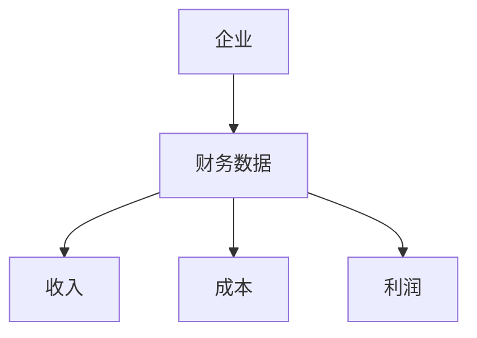
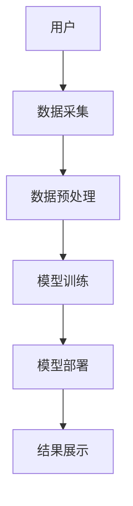
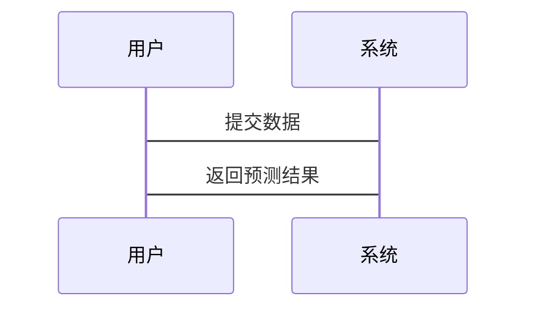

                 


# 设计智能化的企业财务报表预测模型

**关键词**：企业财务报表预测，人工智能，机器学习，数据预处理，特征工程，回归分析

**摘要**：本文详细探讨了设计智能化企业财务报表预测模型的全过程，从问题背景、核心概念到算法原理、系统架构，再到项目实战和总结。通过逐步分析，结合实际案例和代码示例，帮助读者全面理解如何利用人工智能技术提升财务预测的准确性和效率。

---

# 第1章 企业财务报表预测的背景与价值

## 1.1 问题背景

### 1.1.1 传统财务报表分析的局限性

传统财务报表分析依赖人工判断，存在主观性强、效率低、精度不足的问题。企业需要更高效、精准的预测模型来辅助决策。

### 1.1.2 数据驱动的财务预测需求

随着大数据技术的发展，企业希望通过历史数据和机器学习算法，建立自动化、智能化的财务预测模型。

### 1.1.3 企业智能化转型的必然性

智能化转型已成为企业提升竞争力的关键，财务报表预测是企业智能化的重要组成部分。

## 1.2 问题描述

### 1.2.1 财务报表预测的核心目标

通过历史财务数据，预测未来的收入、成本、利润等关键指标，为企业决策提供数据支持。

### 1.2.2 数据来源与特征分析

数据来源包括财务报表、业务数据、外部经济指标等，特征包括收入、成本、利润、资产、负债等。

### 1.2.3 预测模型的输入与输出

输入：财务和业务数据；输出：预测的财务指标。

## 1.3 问题解决

### 1.3.1 数据预处理与特征工程

处理缺失值、异常值，标准化数据，选择重要特征。

### 1.3.2 选择合适的预测模型

根据数据特征选择线性回归、随机森林等模型。

### 1.3.3 模型训练与优化

训练模型，调整参数，验证准确性。

## 1.4 边界与外延

### 1.4.1 预测模型的适用范围

适用于财务数据充足的企业，需处理数据质量差的情况。

### 1.4.2 预测结果的解释与应用

解释预测结果，辅助企业决策。

### 1.4.3 模型的局限性与改进方向

模型依赖历史数据，需结合业务知识优化。

## 1.5 概念结构与核心要素

### 1.5.1 数据特征的构成

收入、成本、利润等财务指标。

### 1.5.2 预测模型的组成

数据预处理、特征工程、模型训练、结果解释。

### 1.5.3 业务场景与模型的关系

业务需求指导模型设计，模型结果反哺业务决策。

## 1.6 本章小结

企业财务报表预测是智能化转型的重要部分，需要结合数据预处理、特征工程和机器学习算法，构建高效准确的预测模型。

---

# 第2章 财务报表预测的核心概念

## 2.1 数据预处理与特征工程

### 2.1.1 数据清洗与缺失值处理

使用pandas库处理缺失值，填充或删除。

### 2.1.2 数据标准化与归一化

标准化：标准化数据；归一化：归一化处理。

### 2.1.3 特征选择与降维

使用特征重要性筛选，或主成分分析。

## 2.2 模型选择与训练

### 2.2.1 线性回归模型

数学公式：y = β0 + β1x + ε

### 2.2.2 支持向量机

支持向量回归（SVR）用于非线性关系。

### 2.2.3 随机森林与梯度提升树

随机森林和梯度提升树适合复杂关系。

### 2.2.4 神经网络与深度学习

神经网络适合非线性复杂预测。

## 2.3 模型评估与优化

### 2.3.1 均方误差与均方根误差

MSE和RMSE衡量预测误差。

### 2.3.2 回归系数的解释

线性回归系数的经济意义。

### 2.3.3 超参数调优与交叉验证

使用网格搜索优化模型。

## 2.4 核心概念对比表

| 概念 | 描述 | 示例 |
|------|------|------|
| 数据特征 | 输入模型的变量 | 收入、成本 |
| 模型类型 | 不同算法的选择 | 线性回归、随机森林 |
| 评估指标 | 衡量模型性能的指标 | MSE、R² |

## 2.5 ER实体关系图



---

# 第3章 算法原理与实现

## 3.1 线性回归模型

### 3.1.1 算法原理

线性回归模型通过最小化残差平方和，找到最佳拟合直线。

### 3.1.2 实现步骤

1. 数据预处理
2. 模型训练
3. 模型评估
4. 模型预测

### 3.1.3 代码示例

```python
import pandas as pd
from sklearn.linear_model import LinearRegression
from sklearn.metrics import mean_squared_error

# 数据预处理
data = pd.read_csv('financial_data.csv')
X = data[['收入', '成本']]
y = data['利润']

# 训练模型
model = LinearRegression()
model.fit(X, y)

# 预测
y_pred = model.predict(X)

# 评估
mse = mean_squared_error(y, y_pred)
print('均方误差:', mse)
```

### 3.1.4 优缺点分析

优点：简单易懂，计算效率高；缺点：假设线性关系，可能不准确。

## 3.2 随机森林模型

### 3.2.1 算法原理

随机森林通过集成多个决策树，减少过拟合，提高准确性。

### 3.2.2 实现步骤

1. 数据预处理
2. 构建多个决策树
3. 集成预测结果

### 3.2.3 代码示例

```python
from sklearn.ensemble import RandomForestRegressor

# 训练模型
model = RandomForestRegressor(n_estimators=100)
model.fit(X, y)

# 预测
y_pred = model.predict(X)

# 评估
mse = mean_squared_error(y, y_pred)
print('均方误差:', mse)
```

## 3.3 神经网络模型

### 3.3.1 算法原理

神经网络通过多层感知机，学习复杂非线性关系。

### 3.3.2 实现步骤

1. 数据预处理
2. 构建神经网络模型
3. 训练模型
4. 预测与评估

### 3.3.3 代码示例

```python
from tensorflow.keras.models import Sequential
from tensorflow.keras.layers import Dense

# 构建模型
model = Sequential()
model.add(Dense(64, activation='relu', input_shape=(n_features,)))
model.add(Dense(1))

model.compile(optimizer='adam', loss='mean_squared_error')

# 训练
model.fit(X_train, y_train, epochs=100, batch_size=32)
```

---

# 第4章 系统分析与架构设计

## 4.1 项目背景

设计一个智能化的财务报表预测系统，帮助企业高效预测财务指标。

## 4.2 功能设计

### 4.2.1 预测模型训练

处理数据，训练模型，保存模型。

### 4.2.2 数据可视化分析

可视化预测结果，分析趋势。

### 4.2.3 预测结果解释

解释预测结果，提供业务建议。

## 4.3 系统架构设计



## 4.4 接口设计

API接口：输入数据，返回预测结果。

## 4.5 交互设计



---

# 第5章 项目实战与实现

## 5.1 环境安装

安装Python、pandas、scikit-learn、tensorflow等库。

## 5.2 核心代码实现

### 5.2.1 数据预处理

```python
import pandas as pd
import numpy as np

# 处理缺失值
data = data.dropna()

# 标准化数据
from sklearn.preprocessing import StandardScaler
scaler = StandardScaler()
X_scaled = scaler.fit_transform(X)
```

### 5.2.2 模型训练

```python
from sklearn.ensemble import RandomForestRegressor

model = RandomForestRegressor(n_estimators=100)
model.fit(X_scaled, y)
```

### 5.2.3 模型评估

```python
from sklearn.metrics import mean_squared_error, r2_score

y_pred = model.predict(X_scaled)
mse = mean_squared_error(y, y_pred)
r2 = r2_score(y, y_pred)
print(f'MSE: {mse}, R²: {r2}')
```

## 5.3 实际案例分析

以某企业为例，使用历史数据训练模型，预测未来季度的财务状况。

---

# 第6章 总结与展望

## 6.1 核心知识点总结

总结数据预处理、特征工程、模型选择等关键步骤。

## 6.2 实践中的注意事项

数据质量、模型调优、结果解释等注意事项。

## 6.3 未来发展方向

深度学习、多模型融合、实时预测等方向。

---

# 参考文献

列出使用的书籍、论文和技术文档。

---

通过以上详细的内容，我们可以系统地设计和实现一个智能化的企业财务报表预测模型，结合理论与实践，帮助企业在数字化转型中提升财务预测的准确性和效率。

