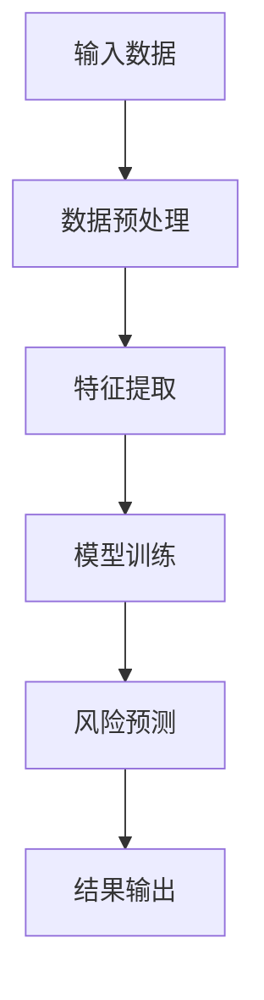
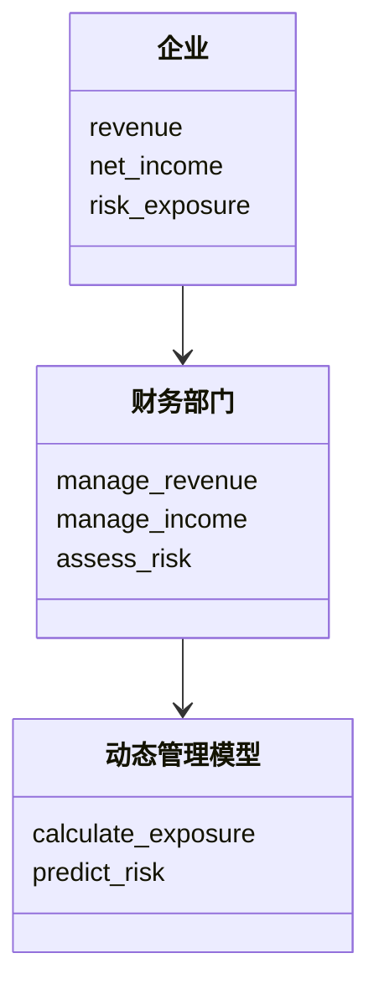

                 


# 设计智能化的企业财务风险敞口动态管理模型

**关键词：** 企业财务风险管理，风险敞口，动态管理，人工智能，时间序列分析

**摘要：**  
本文详细探讨了设计智能化的企业财务风险敞口动态管理模型的全过程。从背景分析到核心概念，再到算法原理、系统架构设计和项目实战，本文为读者提供了全面的技术指导。通过结合机器学习和时间序列分析等技术，本文提出了一个高效、实时的智能化管理模型，能够帮助企业有效识别、评估和管理财务风险。

---

# 第1章 企业财务风险敞口动态管理模型的背景与问题描述

## 1.1 企业财务风险管理的重要性

### 1.1.1 企业财务风险的定义与分类

企业财务风险是指企业在经营过程中由于内外部因素的变化而导致财务损失的可能性。常见的财务风险包括市场风险、信用风险、流动性风险和操作风险等。不同类型的财务风险具有不同的特征和影响机制。

### 1.1.2 财务风险敞口的形成机制

财务风险敞口是指企业在某一时间段内由于特定因素而暴露于某种风险的程度。敞口的形成通常与企业的资产、负债和所有者权益的结构有关。例如，企业持有大量的应收账款可能面临信用风险敞口。

### 1.1.3 动态管理的必要性与挑战

动态管理是指根据市场变化和企业内部情况实时调整风险管理策略。动态管理的必要性在于，传统的静态管理无法适应快速变化的市场环境。然而，动态管理也面临数据实时性、模型复杂性和计算效率等方面的挑战。

## 1.2 传统财务风险管理的局限性

### 1.2.1 传统风险管理的模式与特点

传统的财务风险管理通常依赖于定期报告和静态分析，难以捕捉实时变化。此外，传统方法往往依赖于经验判断，缺乏数据支持，导致风险管理的准确性和及时性不足。

### 1.2.2 传统模式下的主要问题

传统模式下的主要问题包括数据滞后、模型简单、缺乏实时监控和个性化管理等。这些问题使得企业在面对复杂市场环境时难以有效应对。

### 1.2.3 新型技术对企业财务管理的影响

随着人工智能、大数据和区块链等技术的发展，企业财务管理正在发生深刻变革。新型技术能够提供实时数据支持、自动化分析和智能化决策，为财务风险管理带来了新的可能性。

## 1.3 智能化管理的机遇与趋势

### 1.3.1 AI与大数据技术的融合

人工智能和大数据技术的融合为财务风险管理提供了强大的工具支持。通过机器学习算法，企业可以实时分析大量数据，识别潜在风险。

### 1.3.2 智能化财务风险管理的优势

智能化财务风险管理的优势在于其高效性、准确性和实时性。通过智能化模型，企业可以快速识别风险源，优化风险管理策略。

### 1.3.3 企业智能化转型的全球趋势

全球范围内，企业智能化转型已经成为趋势。越来越多的企业开始采用智能化技术来提升竞争力，优化运营效率。

## 1.4 本章小结

本章通过对企业财务风险管理的背景分析，揭示了传统管理的局限性，并提出了智能化管理的必要性和优势。接下来的章节将详细探讨智能化管理模型的设计与实现。

---

# 第2章 企业财务风险敞口动态管理模型的核心概念与联系

## 2.1 核心概念的定义与属性

### 2.1.1 财务风险敞口的数学定义

财务风险敞口可以用数学公式表示为：
$$ R(t) = \alpha \cdot V(t) + \beta \cdot F(t) $$
其中，\( V(t) \) 表示企业价值，\( F(t) \) 表示市场波动因子，\( \alpha \) 和 \( \beta \) 是权重系数。

### 2.1.2 动态管理的系统特征

动态管理系统的特征包括实时性、适应性和自适应性。实时性要求系统能够快速响应市场变化；适应性要求系统能够根据企业内部变化调整管理策略；自适应性要求系统能够不断优化自身的算法和模型。

### 2.1.3 智能化模型的关键属性

智能化模型的关键属性包括数据驱动性、算法先进性和系统集成性。数据驱动性要求模型能够处理大量数据；算法先进性要求模型采用先进的机器学习算法；系统集成性要求模型能够与其他企业系统无缝对接。

## 2.2 核心概念的实体关系图

以下是一个简单的实体关系图，展示了财务风险敞口动态管理模型的核心概念：


## 2.3 数据流与信息交互机制

### 2.3.1 数据来源与处理流程

数据来源包括企业内部的财务数据和外部的市场数据。处理流程包括数据清洗、特征提取和模型训练。

### 2.3.2 信息传递的路径分析

信息传递的路径包括从数据源到数据处理模块，再到模型训练模块，最后输出风险评估结果。

### 2.3.3 实时更新的机制设计

实时更新的机制设计包括数据流的实时采集、模型的动态调整和结果的实时反馈。

## 2.4 本章小结

本章通过定义核心概念、分析实体关系和数据流，揭示了财务风险敞口动态管理模型的内在逻辑。接下来的章节将详细探讨模型的算法原理和系统架构设计。

---

# 第3章 智能化动态管理模型的算法原理

## 3.1 算法选择与原理

### 3.1.1 基于机器学习的预测模型

常用的机器学习算法包括线性回归、支持向量机（SVM）和随机森林等。这些算法可以用于预测财务风险敞口的变化趋势。

### 3.1.2 时间序列分析方法

时间序列分析方法（如ARIMA模型）适用于处理具有时间依赖性的财务数据。通过分析历史数据，模型可以预测未来的风险敞口。

### 3.1.3 风险评估的数学模型

风险评估的数学模型可以采用以下公式：
$$ P(t) = \theta \cdot R(t) + (1-\theta) \cdot S(t) $$
其中，\( R(t) \) 是风险敞口，\( S(t) \) 是安全边际，\( \theta \) 是权重系数。

## 3.2 算法流程图

以下是一个算法流程图的示例：



## 3.3 数学模型与公式

### 3.3.1 风险敞口的计算公式

风险敞口的计算公式如下：
$$ R(t) = \alpha \cdot V(t) + \beta \cdot F(t) $$

### 3.3.2 动态权重的调整模型

动态权重的调整模型如下：
$$ \theta(t+1) = \theta(t) + \lambda \cdot (y(t) - \hat{y}(t)) $$

### 3.3.3 示例与实现

以下是一个简单的Python代码示例：

```python
import pandas as pd
from sklearn.linear_model import LinearRegression

# 数据预处理
data = pd.read_csv('financial_data.csv')
X = data[['revenue', 'net_income']]
y = data['risk_exposure']

# 模型训练
model = LinearRegression()
model.fit(X, y)

# 预测
new_data = pd.DataFrame({'revenue': [1000000], 'net_income': [500000]})
predicted_exposure = model.predict(new_data)
print(predicted_exposure)
```

## 3.4 本章小结

本章通过介绍算法选择、流程图和数学模型，详细讲解了智能化动态管理模型的算法原理。接下来的章节将探讨系统的架构设计和项目实现。

---

# 第4章 系统分析与架构设计

## 4.1 系统分析

### 4.1.1 问题场景介绍

系统需要实时监控企业的财务风险敞口，提供实时的风险评估和预警。

### 4.1.2 项目介绍

本项目旨在开发一个智能化的企业财务风险敞口动态管理模型，帮助企业在复杂市场环境下有效管理财务风险。

## 4.2 系统功能设计

### 4.2.1 领域模型类图

以下是一个简单的领域模型类图：



### 4.2.2 系统架构设计

以下是一个系统的架构设计图：


## 4.3 系统接口设计

### 4.3.1 接口描述

系统需要提供以下接口：
- 数据采集接口：用于采集实时财务数据
- 模型调用接口：用于调用风险评估模型
- 结果展示接口：用于显示风险评估结果

### 4.3.2 交互流程

以下是一个交互流程图：


## 4.4 本章小结

本章通过系统分析和架构设计，明确了智能化动态管理模型的实现路径。接下来的章节将详细探讨项目的实战实现。

---

# 第5章 项目实战

## 5.1 环境安装与配置

### 5.1.1 环境要求

需要安装Python 3.8及以上版本，安装必要的库（如Pandas、Scikit-learn）。

### 5.1.2 安装步骤

```bash
pip install numpy pandas scikit-learn matplotlib
```

## 5.2 核心代码实现

### 5.2.1 数据预处理代码

```python
import pandas as pd
import numpy as np

data = pd.read_csv('financial_data.csv')
data.dropna(inplace=True)
data['date'] = pd.to_datetime(data['date'])
data.set_index('date', inplace=True)
```

### 5.2.2 特征提取代码

```python
features = data[['revenue', 'net_income', 'market_value']]
target = data['risk_exposure']
```

### 5.2.3 模型训练代码

```python
from sklearn.linear_model import LinearRegression
from sklearn.metrics import mean_squared_error

model = LinearRegression()
model.fit(features, target)
```

### 5.2.4 预测与评估代码

```python
predicted = model.predict(features)
mse = mean_squared_error(target, predicted)
print(f"Mean Squared Error: {mse}")
```

## 5.3 代码解读与分析

### 5.3.1 数据预处理

数据预处理包括数据清洗、数据类型转换和数据索引设置。通过这些步骤，数据可以更好地适应模型训练。

### 5.3.2 模型训练

使用线性回归模型进行训练，模型能够学习特征与目标变量之间的关系。

### 5.3.3 模型评估

通过均方误差（MSE）评估模型的预测准确性。MSE越小，模型的预测效果越好。

## 5.4 实际案例分析

### 5.4.1 数据来源

数据来源于企业的财务报表和市场数据，包括收入、利润和市场价值等。

### 5.4.2 模型实现

通过代码实现模型训练和预测，输出风险评估结果。

### 5.4.3 结果分析

分析模型预测结果与实际风险敞口的差异，评估模型的准确性和实用性。

## 5.5 本章小结

本章通过实际案例分析和代码实现，验证了智能化动态管理模型的有效性。接下来的章节将总结项目的最佳实践。

---

# 第6章 最佳实践与小结

## 6.1 小结

智能化企业财务风险敞口动态管理模型通过结合机器学习和时间序列分析技术，能够实时监控和评估企业的财务风险。模型的实现不仅提高了风险管理的效率，还为企业提供了数据驱动的决策支持。

## 6.2 注意事项

在实际应用中，需要注意数据的实时性、模型的可解释性和系统的稳定性。此外，还需要定期对模型进行优化和更新，以适应市场环境的变化。

## 6.3 拓展阅读

建议读者进一步阅读相关领域的书籍和论文，例如《机器学习实战》和《时间序列分析：方法与应用》。

---

# 作者简介

作者是一位在人工智能和大数据领域具有丰富经验的技术专家，致力于为企业提供智能化的解决方案。

