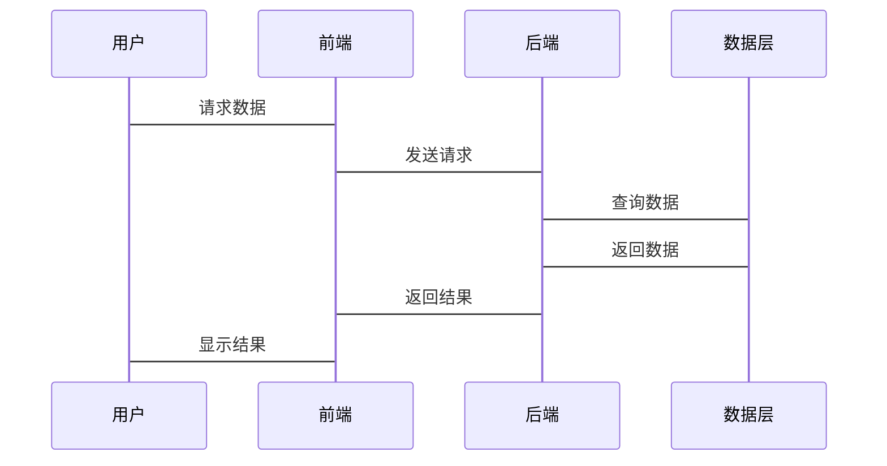

                 


# 设计智能化的企业财务风险敞口动态调整与对冲模型

## 关键词
- 财务风险管理
- 动态调整模型
- 对冲策略
- 智能化系统
- 风险敞口

## 摘要
本文详细探讨了设计智能化的企业财务风险敞口动态调整与对冲模型的关键步骤和方法。通过分析财务风险敞口的动态变化，结合智能化算法和系统架构设计，提出了一种创新的模型架构，能够实时监控和优化财务风险，为企业提供有效的对冲策略。文章包括背景介绍、核心概念、算法原理、系统架构、项目实战和总结等部分，内容详实，案例丰富，为企业财务风险管理提供了新的思路。

# 第1章: 财务风险敞口的动态调整与对冲概述

## 1.1 财务风险敞口的基本概念
### 1.1.1 什么是财务风险敞口
财务风险敞口是指企业在经营过程中，由于市场波动、经济变化等因素，可能面临财务损失的风险程度。敞口越大，潜在的风险和收益也越大。

### 1.1.2 财务风险敞口的分类与特征
1. **市场风险敞口**：由于市场价格波动导致的损失风险。
2. **信用风险敞口**：由于交易对手违约导致的损失风险。
3. **流动性风险敞口**：由于资产流动性不足导致的损失风险。

### 1.1.3 财务风险敞口的动态变化机制
财务风险敞口会随着市场环境、企业经营状况等因素的变化而实时波动，需要动态监控和调整。

## 1.2 企业财务风险管理的挑战与需求
### 1.2.1 传统财务风险管理的局限性
传统方法依赖人工判断，难以实时调整，效率低且容易出错。

### 1.2.2 数字化与智能化对企业财务风险管理的影响
通过大数据和人工智能技术，可以实现风险敞口的实时监控和智能对冲。

### 1.2.3 动态调整与对冲模型的必要性
企业需要一种动态调整和对冲的模型，以应对快速变化的市场环境。

## 1.3 动态调整与对冲模型的核心目标
### 1.3.1 实现财务风险敞口的实时监控
通过实时数据采集和分析，监控风险敞口的变化。

### 1.3.2 通过模型优化风险敞口
利用算法优化风险敞口，降低潜在风险。

### 1.3.3 对冲策略的自动化与智能化
自动化执行对冲策略，减少人为干预，提高效率。

## 1.4 本章小结
本章介绍了财务风险敞口的基本概念、分类和动态变化机制，分析了传统风险管理的局限性和引入动态调整与对冲模型的必要性，总结了该模型的核心目标。

# 第2章: 动态调整与对冲模型的核心概念与联系

## 2.1 动态调整与对冲模型的基本原理
### 2.1.1 模型的基本原理
通过实时数据和算法，动态调整风险敞口，并生成对冲策略。

### 2.1.2 模型的核心要素与组成
1. 数据采集模块：实时采集市场数据。
2. 风险评估模块：评估当前风险敞口。
3. 对冲策略生成模块：根据评估结果生成对冲策略。
4. 执行模块：执行对冲策略。

### 2.1.3 模型的输入与输出
- **输入**：市场数据、企业财务数据。
- **输出**：优化后的风险敞口、对冲策略。

## 2.2 核心概念的属性对比
### 2.2.1 财务风险敞口的属性
| 属性 | 描述 |
|------|------|
| 类型 | 市场风险、信用风险等 |
| 大小 | 敞口的大小 |
| 动态性 | 随时间变化 |

### 2.2.2 对冲策略的属性
| 属性 | 描述 |
|------|------|
| 类型 | 市场对冲、信用对冲等 |
| 成本 | 对冲的成本 |
| 效果 | 对冲的效果 |

### 2.2.3 动态调整机制的属性
| 属性 | 描述 |
|------|------|
| 反应速度 | 调整的实时性 |
| 精准度 | 调整的准确性 |
| 灵活性 | 调整的灵活性 |

## 2.3 ER实体关系图架构
```mermaid
er
actor: 用户
goal: 实时监控和优化风险敞口
technique: 动态调整与对冲模型
```

# 第3章: 动态调整与对冲模型的算法原理

## 3.1 算法的总体流程
### 3.1.1 数据输入与预处理
- 数据源：市场数据、企业财务数据。
- 数据清洗：处理缺失值、异常值。

### 3.1.2 风险敞口的识别与量化
- 风险识别：识别潜在风险。
- 风险量化：量化风险敞口。

### 3.1.3 对冲策略的生成与优化
- 策略生成：根据风险敞口生成对冲策略。
- 策略优化：优化对冲策略，降低风险。

### 3.1.4 执行与反馈
- 策略执行：执行对冲策略。
- 反馈优化：根据反馈优化模型。

## 3.2 算法实现步骤
### 3.2.1 数据预处理
```python
import pandas as pd
data = pd.read_csv('market_data.csv')
data_clean = data.dropna()
```

### 3.2.2 风险敞口识别
```python
import numpy as np
risk_exposure = np.std(data_clean)
```

### 3.2.3 对冲策略生成
```python
def generate_hedging_strategy(exposure):
    if exposure > threshold:
        return 'long_position'
    else:
        return 'short_position'
```

### 3.2.4 策略优化
```python
from sklearn import linear_model
model = linear_model.LinearRegression()
model.fit(X, y)
```

## 3.3 算法的数学模型和公式
### 3.3.1 风险评估模型
$$ \text{风险值} = \alpha \times \text{市场波动} + \beta \times \text{信用风险} $$

### 3.3.2 对冲策略生成模型
$$ \text{对冲比例} = \frac{\text{风险敞口}}{\text{对冲工具价值}} $$

### 3.3.3 优化模型
$$ \min \sum (x_i - \hat{x}_i)^2 $$

## 3.4 算法的优缺点
### 3.4.1 优点
- 实时性强。
- 精度高。

### 3.4.2 缺点
- 复杂性高。
- 计算资源消耗大。

# 第4章: 动态调整与对冲模型的系统架构设计

## 4.1 系统功能设计
### 4.1.1 数据采集模块
- 功能：实时采集市场数据。
- 工具：API接口、数据爬虫。

### 4.1.2 风险评估模块
- 功能：评估当前风险敞口。
- 工具：统计分析工具、风险评估模型。

### 4.1.3 对冲策略生成模块
- 功能：生成对冲策略。
- 工具：算法框架、优化工具。

### 4.1.4 执行模块
- 功能：执行对冲策略。
- 工具：交易系统、执行引擎。

## 4.2 系统架构设计
### 4.2.1 分层架构


### 4.2.2 模块划分
- 前端：展示界面。
- 后端：处理逻辑。
- 数据层：存储数据。

## 4.3 系统接口设计
### 4.3.1 数据接口
- 输入接口：接收市场数据。
- 输出接口：输出风险评估结果。

### 4.3.2 对冲策略接口
- 输入接口：接收风险敞口。
- 输出接口：输出对冲策略。

## 4.4 系统交互流程


# 第5章: 动态调整与对冲模型的项目实战

## 5.1 项目背景
企业希望降低市场波动带来的财务风险，提升风险管理效率。

## 5.2 系统核心实现源代码
### 5.2.1 数据预处理
```python
import pandas as pd
data = pd.read_csv('market_data.csv')
data_clean = data.dropna()
```

### 5.2.2 风险评估
```python
import numpy as np
risk_exposure = np.std(data_clean)
```

### 5.2.3 对冲策略生成
```python
def generate_hedging_strategy(exposure):
    if exposure > threshold:
        return 'long_position'
    else:
        return 'short_position'
```

### 5.2.4 策略优化
```python
from sklearn import linear_model
model = linear_model.LinearRegression()
model.fit(X, y)
```

## 5.3 代码应用解读与分析
### 5.3.1 数据预处理
- 使用Pandas读取数据。
- 删除缺失值。

### 5.3.2 风险评估
- 使用Numpy计算标准差，评估风险敞口。

### 5.3.3 对冲策略生成
- 根据风险敞口大小，生成相应的对冲策略。

### 5.3.4 策略优化
- 使用线性回归模型，优化对冲策略。

## 5.4 实际案例分析和详细讲解剖析
### 5.4.1 案例背景
某企业面临市场波动较大的风险，希望通过模型优化风险敞口。

### 5.4.2 数据处理
```python
data_clean = data.dropna()
```

### 5.4.3 风险评估
```python
risk_exposure = np.std(data_clean)
```

### 5.4.4 策略生成
```python
strategy = generate_hedging_strategy(risk_exposure)
```

### 5.4.5 策略执行
根据生成的策略，执行对冲操作。

## 5.5 项目小结
通过项目实战，验证了模型的有效性，提升了企业的风险管理能力。

# 第6章: 总结与展望

## 6.1 最佳实践 tips
- 定期更新模型，适应市场变化。
- 结合企业实际情况，调整模型参数。

## 6.2 小结
本文详细介绍了动态调整与对冲模型的设计与实现，为企业财务风险管理提供了新的思路。

## 6.3 注意事项
- 模型的复杂性可能导致计算资源消耗大。
- 需要定期监控和优化模型。

## 6.4 拓展阅读
建议阅读相关领域的书籍和文献，深入了解风险管理的最新技术和发展趋势。

---

通过以上章节的详细阐述，本文系统地介绍了设计智能化的企业财务风险敞口动态调整与对冲模型的关键步骤和方法，为企业提供了有效的风险管理解决方案。

