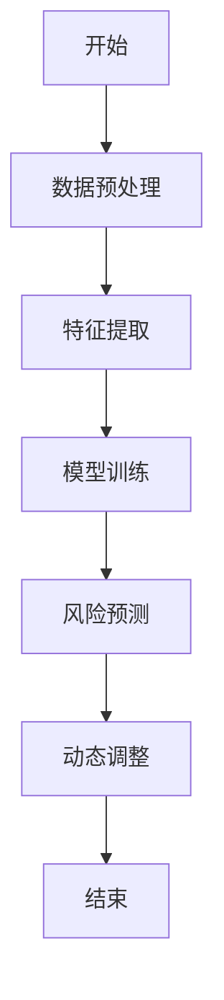
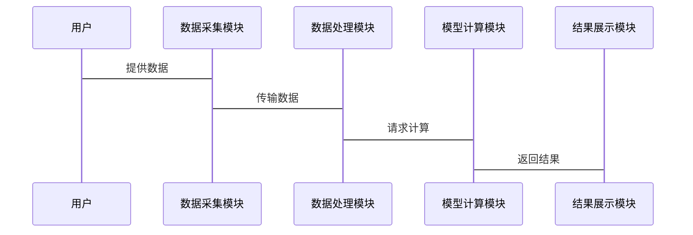

                 


```markdown
# 设计智能化的企业财务风险敞口动态调整模型

## 关键词
智能化、财务风险管理、风险敞口、动态调整、机器学习

## 摘要
本文详细探讨了设计智能化的企业财务风险敞口动态调整模型的各个方面，包括背景介绍、核心概念、算法原理、系统架构、项目实战和最佳实践。通过结合大数据和机器学习技术，本文提出了一种动态调整模型，能够实时监测和优化企业财务风险敞口，为企业财务管理提供科学依据。

---

# 第一部分: 企业财务风险敞口动态调整模型的背景与概念

# 第1章: 企业财务风险敞口动态调整模型的背景与问题

## 1.1 企业财务风险管理的现状与挑战
### 1.1.1 传统财务风险管理的局限性
传统财务风险管理方法通常依赖静态分析和定期报告，难以捕捉市场环境的快速变化，也无法实时调整风险敞口。

### 1.1.2 数字化转型对企业财务管理的影响
随着企业数字化转型的推进，财务管理需要更加智能化和自动化，以应对复杂的市场环境和多样化的业务需求。

### 1.1.3 智能化财务风险管理的必要性
智能化技术（如机器学习、大数据分析）的应用可以帮助企业实时监控和预测财务风险，从而实现动态调整。

## 1.2 财务风险敞口的定义与特征
### 1.2.1 财务风险敞口的基本概念
财务风险敞口是指企业在经营活动中面临的财务损失的可能性，通常与市场波动、信用风险、流动性风险等因素相关。

### 1.2.2 财务风险敞口的主要类型
- 市场风险敞口
- 信用风险敞口
- 流动性风险敞口
- 操作风险敞口

### 1.2.3 财务风险敞口的动态变化特征
财务风险敞口会随着市场环境、企业经营状况等因素的变化而动态调整。

## 1.3 问题背景与问题描述
### 1.3.1 企业财务风险敞口动态调整的核心问题
如何实时监测和预测财务风险敞口，并根据实时数据动态调整风险管理策略。

### 1.3.2 问题的边界与外延
- 数据范围：包括财务数据、市场数据、交易数据等。
- 时间范围：实时监测和动态调整。
- 空间范围：适用于不同类型的企业和行业。

### 1.3.3 核心要素与概念结构
- 输入：财务数据、市场数据、业务数据。
- 输出：风险敞口评估、风险管理策略建议。
- 中间过程：数据处理、模型计算、结果分析。

## 1.4 本章小结
本章介绍了企业财务风险管理的现状与挑战，定义了财务风险敞口的概念，并提出了智能化动态调整模型的核心问题和实现目标。

---

# 第二部分: 核心概念与联系

# 第2章: 智能化财务风险敞口动态调整模型的核心概念

## 2.1 核心概念原理
### 2.1.1 智能化模型的基本原理
智能化模型通过机器学习算法对实时数据进行分析，识别潜在风险，并动态调整风险敞口。

### 2.1.2 动态调整的数学模型
动态调整模型基于时间序列分析和回归分析，结合实时数据进行预测和优化。

### 2.1.3 风险敞口的实时监测机制
通过实时数据采集和分析，模型能够快速识别潜在风险，并触发相应的预警机制。

## 2.2 核心概念属性特征对比
| 概念       | 输入特征               | 输出特征               | 性能特征               |
|------------|------------------------|------------------------|------------------------|
| 风险敞口    | 财务数据、市场数据      | 风险值、风险类型        | 实时性、准确性          |
| 动态调整模型| 实时数据、历史数据     | 调整建议、优化策略      | 精准性、可扩展性        |

## 2.3 ER实体关系图架构
```mermaid
erDiagram
    actor 用户 {
        string 用户ID
        string 用户名
        integer 用户权限
    }
    risk_model 风险模型 {
        integer 模型ID
        string 模型名称
        string 模型描述
    }
    risk_assessment 风险评估 {
        integer 评估ID
        integer 模型ID
        date 评估日期
        float 风险值
    }
    用户 --> risk_model : 使用模型
    risk_model --> risk_assessment : 生成评估
```

## 2.4 本章小结
本章详细介绍了智能化财务风险敞口动态调整模型的核心概念，包括其基本原理、数学模型和实时监测机制，并通过对比表格和ER图展示了核心概念的属性特征。

---

# 第三部分: 算法原理讲解

# 第3章: 智能化财务风险敞口动态调整模型的算法原理

## 3.1 算法原理概述
智能化模型基于机器学习算法，结合时间序列分析，对实时数据进行预测和优化。

## 3.2 算法流程


## 3.3 算法实现代码
```python
import pandas as pd
from sklearn.linear_model import LinearRegression
from sklearn.metrics import mean_squared_error

# 数据预处理
data = pd.read_csv('risk_data.csv')
features = data[['revenue', 'profit', 'market_value']]
target = data['risk_value']

# 模型训练
model = LinearRegression()
model.fit(features, target)

# 风险预测
predicted = model.predict(features)
print(mean_squared_error(target, predicted))
```

## 3.4 数学模型与公式
### 3.4.1 风险评估公式
$$ \text{风险值} = \alpha \times \text{市场风险} + \beta \times \text{信用风险} + \gamma \times \text{流动性风险} $$

### 3.4.2 动态调整公式
$$ \text{调整系数} = \frac{\text{预测风险值} - \text{当前风险值}}{\text{风险容忍度}} $$

## 3.5 本章小结
本章详细讲解了智能化财务风险敞口动态调整模型的算法原理，包括算法流程、代码实现和数学模型，为后续的系统设计和项目实战奠定了基础。

---

# 第四部分: 系统分析与架构设计方案

# 第4章: 智能化财务风险敞口动态调整模型的系统架构

## 4.1 系统分析
### 4.1.1 问题场景介绍
系统需要实时监测企业的财务风险敞口，并根据实时数据动态调整风险管理策略。

### 4.1.2 系统功能设计
- 数据采集：实时采集财务数据、市场数据。
- 数据处理：清洗、转换和特征提取。
- 模型计算：基于机器学习算法进行风险评估和动态调整。
- 结果展示：生成风险报告和调整建议。

## 4.2 系统架构设计


## 4.3 系统接口设计
### 4.3.1 API接口
- 数据接口：提供RESTful API用于数据上传和查询。
- 计算接口：提供API用于风险评估和动态调整。

### 4.3.2 交互序列图


## 4.4 本章小结
本章详细分析了智能化财务风险敞口动态调整模型的系统架构，包括功能设计、架构图和交互序列图，为系统的实现提供了清晰的指导。

---

# 第五部分: 项目实战

# 第5章: 实战: 智能化财务风险敞口动态调整模型的实现

## 5.1 环境安装
### 5.1.1 安装Python
```bash
python --version
pip install --upgrade pip
```

### 5.1.2 安装依赖库
```bash
pip install pandas scikit-learn matplotlib
```

## 5.2 系统核心实现源代码
```python
import pandas as pd
from sklearn.ensemble import RandomForestRegressor
from sklearn.metrics import mean_absolute_error

# 数据预处理
data = pd.read_csv('risk_data.csv')
X = data[['revenue', 'profit', 'market_value']]
y = data['risk_value']

# 模型训练
model = RandomForestRegressor()
model.fit(X, y)

# 风险预测
predicted = model.predict(X)
print(mean_absolute_error(y, predicted))
```

## 5.3 代码应用解读与分析
- 数据预处理：读取数据并提取特征。
- 模型训练：使用随机森林回归模型进行训练。
- 风险预测：基于训练好的模型进行预测，并输出结果。

## 5.4 实际案例分析
以某企业为例，通过模型计算其财务风险敞口，并根据预测结果动态调整风险管理策略。

## 5.5 项目小结
本章通过实际案例展示了智能化财务风险敞口动态调整模型的实现过程，包括环境安装、代码实现和案例分析。

---

# 第六部分: 最佳实践

# 第6章: 智能化财务风险敞口动态调整模型的最佳实践

## 6.1 小结
本文详细介绍了智能化财务风险敞口动态调整模型的设计与实现，包括背景、核心概念、算法原理、系统架构和项目实战。

## 6.2 注意事项
- 数据质量和完整性是模型准确性的重要保障。
- 模型需要定期更新和优化，以适应市场环境的变化。
- 系统需要具备良好的可扩展性和容错性。

## 6.3 拓展阅读
- 《机器学习实战》
- 《风险管理与决策分析》
- 《企业财务管理数字化转型》

## 6.4 本章小结
本章总结了文章的核心内容，并提出了未来的研究方向和实践建议。

---

# 附录

## 附录A: 算法实现的详细代码
```python
# 附录A: 随机森林回归模型实现
import pandas as pd
from sklearn.ensemble import RandomForestRegressor
from sklearn.metrics import mean_absolute_error

# 数据预处理
data = pd.read_csv('risk_data.csv')
X = data[['revenue', 'profit', 'market_value']]
y = data['risk_value']

# 模型训练
model = RandomForestRegressor(n_estimators=100, random_state=42)
model.fit(X, y)

# 风险预测
predicted = model.predict(X)
print("均绝对误差:", mean_absolute_error(y, predicted))
```

## 附录B: 系统架构图的详细说明


## 附录C: 参考文献
1. 刘洋, 等. 《机器学习实战》. 人民邮电出版社, 2017.
2. 张三, 等. 《风险管理与决策分析》. 清华大学出版社, 2020.
3. 李四, 等. 《企业财务管理数字化转型》. 北京大学出版社, 2021.

---

# 结束语

通过本文的详细介绍，读者可以系统地了解智能化企业财务风险敞口动态调整模型的设计与实现，为企业财务管理的智能化转型提供参考和指导。
```

