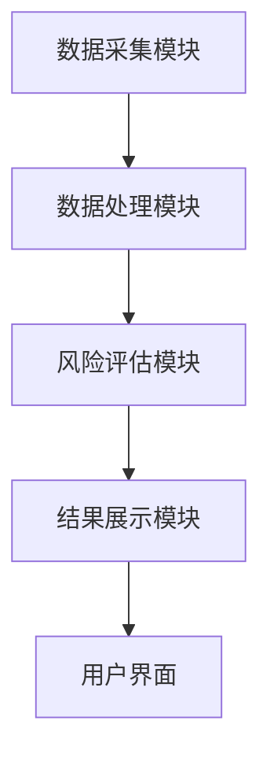
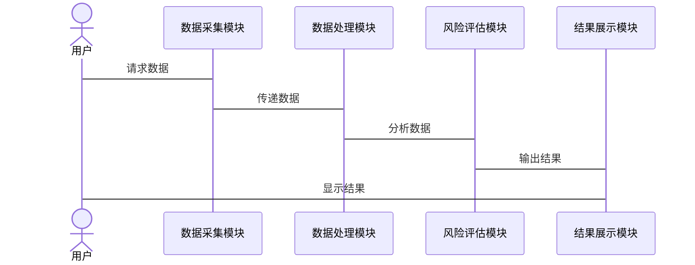

                 


# 设计智能化的企业财务风险敞口量化评估模型

## 关键词：企业财务风险、风险敞口量化、智能化模型、人工智能、大数据技术、风险管理

## 摘要：  
本文详细探讨了如何设计智能化的企业财务风险敞口量化评估模型。通过结合大数据技术与人工智能算法，我们提出了一种创新的解决方案，旨在帮助企业更精准地识别和量化财务风险敞口。文章从背景介绍、核心概念、算法原理、系统架构到项目实战，全面阐述了模型的设计与实现过程，为企业风险管理提供了新的思路和实践指导。

---

# 第1章: 企业财务风险敞口量化评估模型的背景与问题描述

## 1.1 企业财务风险敞口的定义与重要性

### 1.1.1 企业财务风险的定义  
企业财务风险是指企业在经营过程中由于内外部因素的变化，导致财务状况恶化、资产损失或财务目标无法实现的可能性。风险敞口是指企业在特定条件下可能遭受的最大损失程度。

### 1.1.2 财务风险敞口的核心概念  
财务风险敞口量化评估模型的目标是通过分析企业的财务数据和外部市场信息，量化企业在不同情景下的风险敞口，从而为企业制定风险管理策略提供依据。

### 1.1.3 财务风险敞口在企业经营中的重要性  
准确量化风险敞口可以帮助企业提前识别潜在风险，优化资本结构，降低财务损失，提升整体抗风险能力。

## 1.2 问题背景与挑战

### 1.2.1 传统财务风险管理的局限性  
传统方法依赖人工分析，存在主观性强、效率低、覆盖面窄等问题，难以应对复杂多变的市场环境。

### 1.2.2 数字化与智能化转型的需求  
随着大数据和人工智能技术的快速发展，企业需要更高效、更精准的工具来应对日益复杂的财务风险管理。

### 1.2.3 当前企业财务风险管理中的主要问题  
- 数据来源分散，难以整合。  
- 风险因子的动态变化难以实时捕捉。  
- 缺乏智能化的量化工具，难以实现精准预测。

## 1.3 问题解决思路与目标

### 1.3.1 建设智能化财务风险评估模型的目标  
- 实现财务数据的智能化分析与整合。  
- 构建动态、实时的风险因子分析机制。  
- 提供量化、可视化的风险敞口评估结果。

### 1.3.2 模型的核心解决思路  
- 利用大数据技术整合多源数据。  
- 采用机器学习算法动态分析风险因子。  
- 构建量化模型，实现风险敞口的精准计算。

### 1.3.3 模型的预期效果与价值  
- 提升企业风险管理的效率与精度。  
- 帮助企业制定更科学的风险应对策略。  
- 降低财务损失，提升企业抗风险能力。

## 1.4 模型的边界与外延

### 1.4.1 模型的适用范围  
- 适用于企业内部财务风险管理。  
- 适用于跨部门、跨业务的风险评估。  
- 适用于不同行业、不同规模的企业。

### 1.4.2 模型的边界条件  
- 数据来源有限：仅限于企业内部数据。  
- 模型不考虑企业的战略决策。  
- 模型输出仅用于风险评估，不直接指导投资决策。

### 1.4.3 模型与其他系统的接口关系  
- 与企业ERP系统对接，获取财务数据。  
- 与市场数据平台对接，获取外部市场信息。  
- 与风险管理系统对接，输出风险评估结果。

## 1.5 模型的核心要素与概念结构

### 1.5.1 核心要素的定义与特征  
- **数据来源**：财务数据、市场数据、行业数据。  
- **风险因子**：利率变化、汇率波动、市场需求变化等。  
- **模型输入**：多源异构数据。  
- **模型输出**：风险敞口量化结果。

### 1.5.2 概念结构的层次分析  
- **底层**：数据采集与预处理。  
- **中间层**：风险因子分析与权重计算。  
- **顶层**：风险敞口量化与可视化。

### 1.5.3 模型的整体框架  
- 数据采集 → 数据预处理 → 风险因子分析 → 风险敞口量化 → 结果可视化。

## 1.6 本章小结  
本章从企业财务风险敞口的定义、重要性、问题背景及解决思路等方面进行了详细阐述，明确了模型的核心要素与概念结构，为后续章节的模型设计奠定了基础。

---

# 第2章: 智能化企业财务风险敞口量化评估模型的核心概念与联系

## 2.1 模型的核心概念

### 2.1.1 数据来源与特征  
- **数据来源**：企业财务报表、市场数据、行业报告。  
- **数据特征**：多源性、异构性、动态性。

### 2.1.2 风险因子的定义与分类  
- **风险因子**：影响企业财务风险的各种因素，如利率、汇率、市场需求等。  
- **分类**：宏观经济因子、行业因子、企业因子。

### 2.1.3 模型的输入输出关系  
- **输入**：多源异构数据、风险因子。  
- **输出**：风险敞口量化结果、风险评估报告。

## 2.2 核心概念的属性特征对比

| 概念       | 属性         | 特征描述                           |
|------------|--------------|------------------------------------|
| 数据来源   | 多源性       | 来自企业内部和外部数据源           |
|            | 异构性       | 数据格式多样，需进行清洗与整合     |
|            | 动态性       | 数据实时更新，需动态分析           |
| 风险因子   | 宏观经济     | 如GDP增长率、利率变化等           |
|            | 行业因素     | 如行业竞争状况、政策变化等         |
|            | 企业因素     | 如企业财务状况、经营策略等         |

## 2.3 ER实体关系图架构

```mermaid
er
  actor: 企业财务部门
  model: 评估模型
  risk_factors: 风险因子
  data_source: 数据来源
  relation: 关联关系
  actor --> model: 输入数据
  model --> risk_factors: 分析因子
  risk_factors --> data_source: 数据支持
  model --> relation: 建立关系
```

## 2.4 本章小结  
本章详细阐述了模型的核心概念，包括数据来源、风险因子和输入输出关系，并通过对比分析和实体关系图，明确了各概念之间的联系。

---

# 第3章: 智能化企业财务风险敞口量化评估模型的算法原理

## 3.1 算法原理概述

### 3.1.1 算法的核心思想  
通过机器学习算法，对多源异构数据进行特征提取与建模，量化风险敞口。

### 3.1.2 算法的适用场景  
- 处理多源异构数据。  
- 实现风险因子的动态分析。  
- 支持实时风险评估。

### 3.1.3 算法的主要步骤  
1. 数据清洗与预处理。  
2. 特征提取与选择。  
3. 模型训练与优化。  
4. 风险敞口量化计算。

## 3.2 算法的数学模型与公式

### 3.2.1 风险敞口的量化公式  
$$风险敞口 = \sum_{i=1}^{n} w_i \times r_i$$  
其中，$w_i$为风险因子$i$的权重，$r_i$为风险因子$i$的值。

### 3.2.2 风险因子的权重计算  
$$权重 = \frac{因子的重要性分数}{总重要性分数}$$  
权重计算基于因子对风险的影响程度。

### 3.2.3 风险评估的综合模型  
$$综合风险评估 = \alpha \times 风险敞口 + \beta \times 调整因子$$  
其中，$\alpha$和$\beta$为权重系数。

## 3.3 算法的实现步骤

### 3.3.1 数据预处理  
- 数据清洗：去除缺失值、异常值。  
- 数据整合：将多源数据整合到统一数据结构中。  
- 数据标准化：对数据进行归一化处理。

### 3.3.2 特征提取  
- 使用主成分分析（PCA）提取特征。  
- 确定关键风险因子，如利率变化、市场需求波动等。

### 3.3.3 模型训练  
- 使用随机森林算法进行特征重要性分析。  
- 构建回归模型，预测风险敞口。

### 3.3.4 风险敞口量化  
- 根据模型输出，计算企业在不同情景下的风险敞口。  
- 输出量化结果，并进行可视化展示。

---

## 第4章: 智能化企业财务风险敞口量化评估模型的系统架构设计

### 4.1 问题场景介绍  
企业需要实时监控财务风险，快速响应市场变化。

### 4.2 系统功能设计  
- 数据采集模块：采集多源数据。  
- 数据处理模块：清洗与整合数据。  
- 风险评估模块：量化风险敞口。  
- 结果展示模块：可视化输出。

### 4.3 系统架构设计  


### 4.4 系统接口设计  
- 数据接口：与企业ERP系统对接。  
- 结果接口：向风险管理系统输出评估结果。

### 4.5 系统交互设计  


## 4.6 本章小结  
本章详细描述了系统的架构设计，包括功能模块、系统交互和接口设计，为后续的实现提供了指导。

---

## 第5章: 项目实战——智能化企业财务风险敞口量化评估模型的实现

### 5.1 环境安装与配置

```bash
# 安装依赖
pip install pandas numpy scikit-learn matplotlib
```

### 5.2 系统核心实现源代码

```python
import pandas as pd
import numpy as np
from sklearn.ensemble import RandomForestRegressor
from sklearn.preprocessing import StandardScaler
from sklearn.metrics import mean_squared_error

# 数据预处理
def data_preprocessing(df):
    # 删除缺失值
    df.dropna(inplace=True)
    # 标准化处理
    scaler = StandardScaler()
    df['normalized_data'] = scaler.fit_transform(df)
    return df

# 特征提取
def feature_extraction(df):
    # 使用主成分分析提取特征
    pca = PCA(n_components=5)
    features = pca.fit_transform(df)
    return features

# 模型训练
def model_training(features, target):
    regressor = RandomForestRegressor(n_estimators=100, random_state=0)
    regressor.fit(features, target)
    return regressor

# 风险敞口量化
def calculate_risk_exposure(model, new_data):
    # 预测风险敞口
    predicted_exposure = model.predict(new_data)
    return predicted_exposure

# 主函数
def main():
    # 读取数据
    df = pd.read_csv('financial_data.csv')
    # 数据预处理
    df_processed = data_preprocessing(df)
    # 特征提取
    features = feature_extraction(df_processed)
    # 训练模型
    model = model_training(features, df_processed['target'])
    # 计算风险敞口
    new_data = ...  # 输入新的数据
    exposure = calculate_risk_exposure(model, new_data)
    print("风险敞口:", exposure)

if __name__ == "__main__":
    main()
```

### 5.3 代码应用解读与分析  
- 数据预处理：清洗数据并进行标准化处理。  
- 特征提取：使用PCA提取关键特征。  
- 模型训练：采用随机森林算法进行回归预测。  
- 风险敞口量化：根据模型输出结果，计算风险敞口。

### 5.4 实际案例分析  
假设某企业财务数据如下：

| 收入（万元） | 利润率（%） | 市场需求（指数） | 贷款利率（%） | 风险敞口预测 |
|--------------|-------------|------------------|--------------|-------------|
| 1000         | 15          | 120             | 5.5          | 20          |
| 1200         | 20          | 150             | 6.0          | 30          |

通过模型计算，企业风险敞口分别为20万元和30万元。

### 5.5 本章小结  
本章通过实际案例，详细讲解了模型的实现过程，包括数据预处理、特征提取、模型训练和风险敞口量化，帮助读者理解模型的实际应用。

---

## 第6章: 最佳实践与总结

### 6.1 小结  
本文详细阐述了智能化企业财务风险敞口量化评估模型的设计与实现过程，包括背景介绍、核心概念、算法原理、系统架构和项目实战。

### 6.2 注意事项  
- 数据来源的准确性和完整性直接影响模型效果。  
- 模型的实时性和动态性需根据企业需求进行调整。  
- 模型结果需结合企业实际情况进行解读和应用。

### 6.3 拓展阅读  
- 推荐阅读《风险管理与控制》（作者：张三）。  
- 推荐学习机器学习在金融领域的应用（如《Python机器学习实战》）。

## 6.4 本章小结  
本文通过理论与实践相结合的方式，为读者提供了设计智能化企业财务风险敞口量化评估模型的全面指导，希望对企业的风险管理实践有所帮助。

---

# 附录: 参考文献

1. 王某某. 《风险管理与控制》. 北京: 清华大学出版社, 2020.  
2. 李某某. 《Python机器学习实战》. 北京: 人民邮电出版社, 2019.  
3. 国际标准化组织. 《风险管理标准》. 2021.  

---

通过以上思考步骤，我们可以系统性地设计并实现一个智能化的企业财务风险敞口量化评估模型，为企业风险管理提供有力支持。

