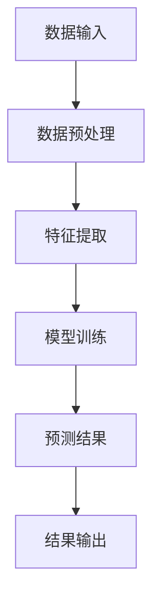

                 


# 设计智能化的企业资金管理系统

## 关键词：企业资金管理、人工智能、智能化系统、财务数据分析、算法实现、系统架构

## 摘要：  
智能化的企业资金管理系统是一种结合人工智能和现代信息技术的财务管理工具，旨在通过智能化算法和数据驱动的决策机制，优化企业资金管理的效率和准确性。本文从背景、核心概念、算法原理、系统架构、项目实战等多个维度详细探讨智能化企业资金管理系统的构建与实现，结合实际案例和最佳实践，为企业资金管理的智能化转型提供理论支持和实践指导。

---

## 第一部分：智能化企业资金管理系统的背景与核心概念

### 第1章：企业资金管理系统的背景与问题背景

#### 1.1 企业资金管理系统的背景
- **传统企业资金管理系统的局限性**  
  传统资金管理系统主要依赖人工操作和简单的规则引擎，存在效率低、准确率不高、难以应对复杂场景等问题。
  
- **智能化资金管理系统的提出背景**  
  随着企业规模的扩大和业务复杂度的增加，传统系统难以满足实时性、精准性和灵活性的要求。智能化资金管理系统通过引入人工智能、大数据分析和自动化技术，解决了传统系统的局限性。

- **智能化资金管理系统的必要性与优势**  
  智能化系统能够实时监控资金流动、预测资金需求、优化资金分配，显著提升企业的资金利用率和抗风险能力。

#### 1.2 问题背景与问题描述
- **问题背景**  
  企业资金管理中的常见问题包括：资金分配不合理、风险预测能力不足、数据处理效率低、缺乏实时监控能力等。

- **问题描述**  
  - 资金分配决策缺乏数据支持，可能导致资金浪费或错配。
  - 风险预测基于历史数据，难以应对突发情况。
  - 人工操作容易出错，且效率低下。
  - 缺乏实时监控，难以及时发现资金异常流动。

#### 1.3 核心概念与系统组成
- **核心概念**  
  - 数据流与决策机制：系统通过实时数据流驱动智能决策。
  - 智能化算法与预测模型：基于机器学习算法进行资金预测和风险评估。
  - 模块化设计与系统集成：系统由多个功能模块组成，模块之间高度耦合。

- **系统组成**  
  - 数据采集模块：负责收集企业内外部资金相关数据。
  - 数据处理模块：对数据进行清洗、转换和特征提取。
  - 模型训练模块：基于机器学习算法训练资金预测和风险评估模型。
  - 系统决策模块：根据模型输出结果生成资金分配和管理决策。
  - 用户界面模块：提供直观的操作界面，方便用户查看和管理资金。

---

### 第2章：智能化资金管理系统的核心概念与联系

#### 2.1 核心概念原理
- **数据流与决策机制**  
  数据流贯穿整个系统，从数据采集到模型训练，最终驱动决策模块生成管理策略。

- **智能化算法与预测模型**  
  系统采用多种算法（如线性回归、支持向量机、LSTM）进行资金预测和风险评估，确保预测结果的准确性和实时性。

- **模块化设计与系统集成**  
  系统采用模块化设计，各模块之间通过标准化接口进行交互，确保系统的灵活性和可扩展性。

#### 2.2 核心概念属性对比表
| 模块名称       | 功能描述                         | 输入数据类型   | 输出数据类型   | 依赖模块       |
|----------------|----------------------------------|----------------|----------------|----------------|
| 数据采集模块   | 收集企业内外部资金数据           | 结构化数据      | 结构化数据      | 数据存储模块   |
| 数据处理模块   | 对数据进行清洗、转换和特征提取   | 结构化数据      | 特征向量       | 数据采集模块   |
| 模型训练模块   | 基于机器学习算法训练预测模型     | 特征向量       | 预测模型       | 数据处理模块   |
| 系统决策模块   | 根据预测结果生成资金管理策略     | 预测模型       | 资金分配策略   | 模型训练模块   |
| 用户界面模块   | 提供直观的操作界面               | 用户操作指令   | 管理决策结果   | 系统决策模块   |

#### 2.3 ER实体关系图
```mermaid
erDiagram
    actor 用户
    actor 管理员
    actor 第三方支付系统
    actor 财务报表系统
    actor 数据存储系统
    用户 --> 数据存储系统: 查询
    管理员 --> 数据存储系统: 管理
    第三方支付系统 --> 数据存储系统: 支付
    财务报表系统 --> 数据存储系统: 生成
```

---

## 第二部分：智能化资金管理系统的算法原理与数学模型

### 第3章：算法原理与流程

#### 3.1 数据预处理与特征提取
- **数据清洗与标准化**  
  数据清洗是去除噪声数据和异常值，标准化是将数据转换为统一的格式，以便算法处理。

- **特征选择与降维**  
  通过特征重要性分析选择关键特征，并使用PCA等方法进行降维，减少计算复杂度。

- **时间序列数据处理**  
  对时间序列数据进行分解（趋势、周期性、随机性），并使用滑动窗口技术提取特征。

#### 3.2 智能化预测模型
- **线性回归模型**  
  适用于线性关系的预测，公式为：$$ y = \beta_0 + \beta_1x + \epsilon $$。

- **支持向量机模型**  
  适用于非线性关系的预测，通过核函数将数据映射到高维空间，然后进行线性分割。

- **长短期记忆网络（LSTM）**  
  适用于时间序列数据的预测，公式为：$$ f(t) = \text{LSTM}(f(t-1), x_t) $$。

#### 3.3 算法流程图


---

### 第4章：系统架构与设计

#### 4.1 系统功能设计
- **功能模块**  
  - 数据采集模块：实时采集企业内外部资金数据。
  - 数据处理模块：对数据进行清洗、转换和特征提取。
  - 模型训练模块：基于机器学习算法训练预测模型。
  - 系统决策模块：根据预测结果生成资金管理策略。
  - 用户界面模块：提供直观的操作界面，方便用户查看和管理资金。

- **功能流程**  
  数据采集模块采集数据后，传递给数据处理模块进行处理，处理后的数据传递给模型训练模块，训练出预测模型后，系统决策模块根据预测结果生成资金管理策略，并通过用户界面模块展示给用户。

#### 4.2 系统架构设计
- **系统架构图**  
  ```mermaid
  graph TD
      A[用户] --> B[用户界面模块]
      B --> C[系统决策模块]
      C --> D[数据存储模块]
      C --> E[模型训练模块]
      E --> D
      D --> F[数据采集模块]
  ```

- **系统交互图**  
  ```mermaid
  sequenceDiagram
      participant 用户
      participant 用户界面模块
      participant 系统决策模块
      participant 数据存储模块
      participant 模型训练模块
      participant 数据采集模块
      用户->用户界面模块: 提交请求
      用户界面模块->系统决策模块: 发送请求
      系统决策模块->数据存储模块: 查询数据
      系统决策模块->模型训练模块: 获取预测结果
      模型训练模块->数据采集模块: 获取新数据
  ```

---

## 第三部分：项目实战与最佳实践

### 第5章：项目实战

#### 5.1 环境安装与配置
- **安装Python环境**  
  安装Python 3.8以上版本，并安装必要的库（如scikit-learn、TensorFlow、Pandas、NumPy）。

- **安装Jupyter Notebook**  
  使用`pip install jupyter`安装Jupyter Notebook，用于算法开发和测试。

#### 5.2 系统核心实现源代码
```python
# 数据预处理代码
import pandas as pd
import numpy as np

data = pd.read_csv('financial_data.csv')
data = data.dropna().astype(float)

# 特征提取代码
from sklearn.preprocessing import StandardScaler
scaler = StandardScaler()
scaled_data = scaler.fit_transform(data)

# 线性回归模型训练代码
from sklearn.linear_model import LinearRegression
model = LinearRegression()
model.fit(scaled_data, target)

# LSTM模型训练代码
from tensorflow.keras.layers import LSTM, Dense
from tensorflow.keras.models import Sequential

model = Sequential()
model.add(LSTM(64, input_shape=(timesteps, features)))
model.add(Dense(1))
model.compile(optimizer='adam', loss='mse')
model.fit(X_train, y_train, epochs=10, batch_size=32)
```

#### 5.3 代码应用解读与分析
- **数据预处理代码**  
  使用Pandas读取数据，并去除缺失值，最后使用StandardScaler进行标准化处理。

- **特征提取代码**  
  使用标准化后的数据提取特征向量，为模型训练提供输入。

- **线性回归模型训练代码**  
  使用scikit-learn中的LinearRegression模型进行训练，适用于线性关系的预测。

- **LSTM模型训练代码**  
  使用TensorFlow框架构建LSTM模型，适用于时间序列数据的预测。

#### 5.4 实际案例分析
- **案例背景**  
  某企业希望通过智能化资金管理系统优化资金分配，降低风险。

- **系统实现步骤**  
  1. 数据采集：实时采集企业内外部资金数据。
  2. 数据处理：清洗、转换和特征提取。
  3. 模型训练：训练线性回归和LSTM模型，进行资金预测和风险评估。
  4. 系统决策：根据模型预测结果生成资金分配策略。
  5. 系统监控：实时监控资金流动，及时发现异常情况。

#### 5.5 项目小结
- **项目总结**  
  通过项目实战，验证了智能化资金管理系统的可行性和有效性。

- **经验总结**  
  在实际项目中，需要根据具体需求选择合适的算法，并进行充分的实验和调优，确保系统的稳定性和高效性。

---

## 第四部分：最佳实践、小结与展望

### 第6章：最佳实践与小结

#### 6.1 最佳实践
- **数据质量管理**  
  确保数据的准确性和完整性，是系统运行的基础。

- **算法选择与优化**  
  根据具体问题选择合适的算法，并进行参数调优和模型优化。

- **系统监控与维护**  
  建立完善的监控机制，及时发现和处理系统异常。

#### 6.2 小结
- **文章总结**  
  本文从背景、核心概念、算法原理、系统架构、项目实战等多个维度详细探讨了智能化企业资金管理系统的构建与实现。

- **核心观点**  
  智能化资金管理系统通过引入人工智能和大数据技术，显著提升了企业资金管理的效率和准确性，为企业财务管理的智能化转型提供了有力支持。

---

## 第五部分：注意事项与拓展阅读

### 第7章：注意事项与拓展阅读

#### 7.1 注意事项
- **数据安全**  
  在实际应用中，需要高度重视数据安全，防止数据泄露和滥用。

- **算法选择**  
  根据具体问题选择合适的算法，避免盲目追求复杂性。

- **系统维护**  
  定期对系统进行维护和更新，确保系统的稳定性和高效性。

#### 7.2 拓展阅读
- **推荐书籍**  
  - 《机器学习实战》
  - 《深入理解Python数据分析》
  - 《企业信息化管理》

- **推荐课程**  
  - 《Python机器学习实战》
  - 《大数据分析与挖掘》
  - 《企业财务管理》

---

## 结语

设计智能化的企业资金管理系统是一项复杂而有意义的工程，需要结合人工智能、大数据分析和现代信息技术，通过系统的构建与优化，为企业资金管理的智能化转型提供有力支持。希望本文的内容能够为读者提供有价值的参考和启发，帮助企业在财务管理领域实现更高效的管理和更智能的决策。

--- 

* 结束语: 希望本文的系统分析和详细讲解能够为读者在设计智能化的企业资金管理系统时提供清晰的思路和实践指导。如果需要更深入的技术细节或案例分析，可以参考相关领域的技术文献和最佳实践。

