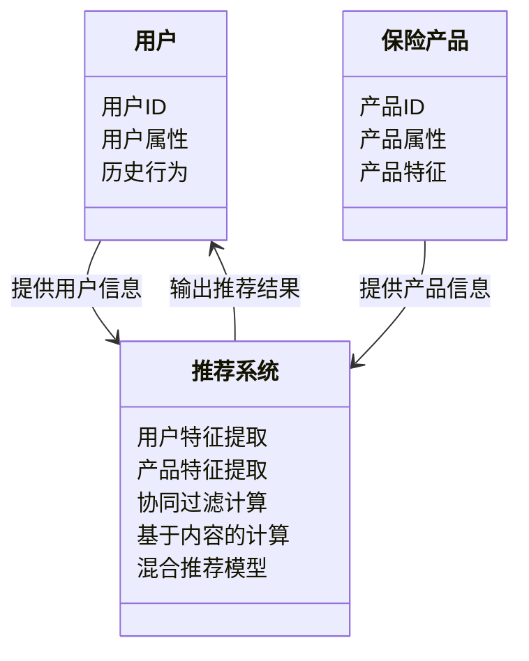
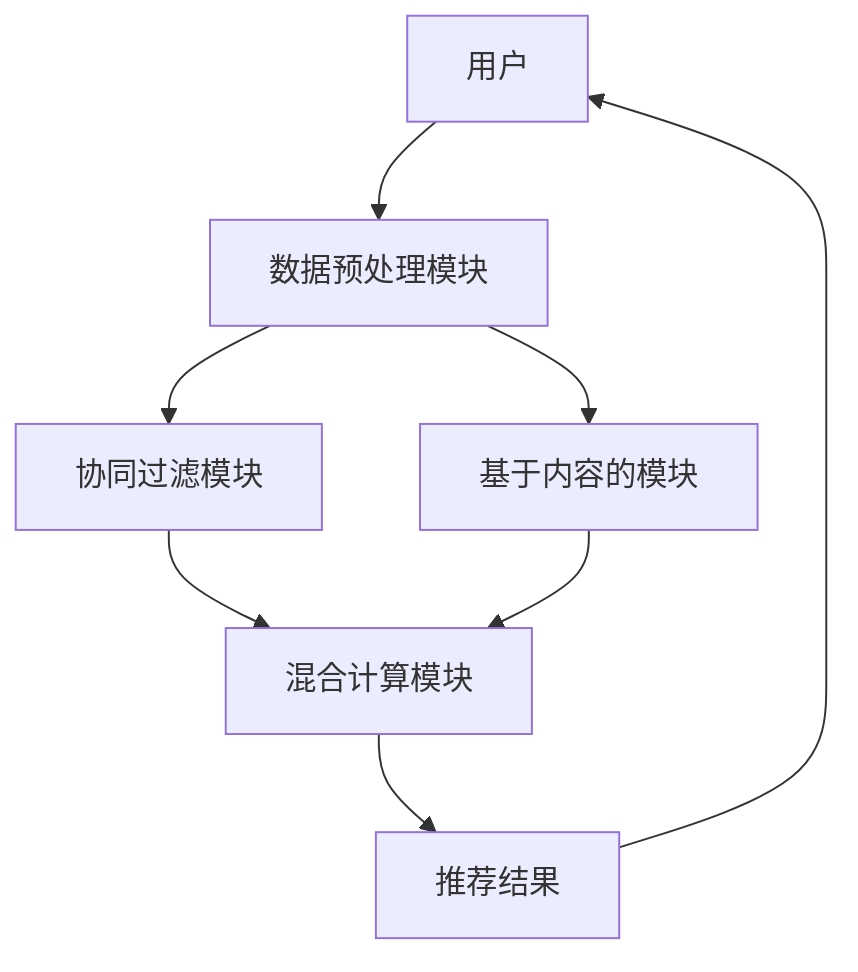
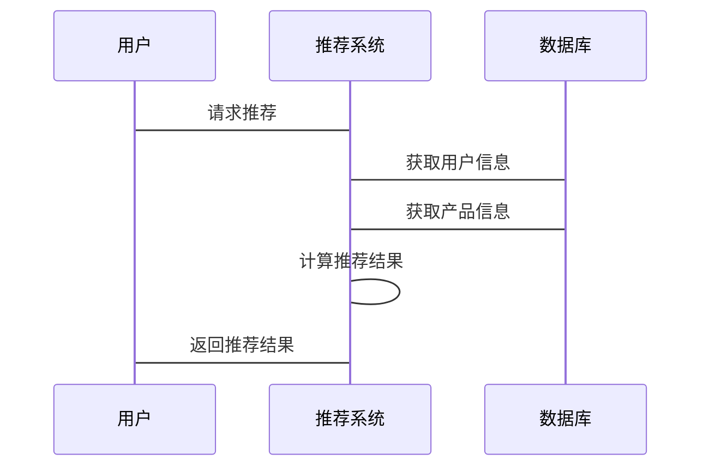

                 


# 设计智能化的保险产品推荐系统

## 关键词：保险产品推荐系统, 人工智能, 大数据, 协同过滤, 混合推荐模型, 系统架构设计

## 摘要：本文深入探讨了设计智能化保险产品推荐系统的背景、核心概念、算法原理、系统架构设计及实现过程。通过分析保险行业的数字化转型需求，结合人工智能和大数据技术，提出了一种基于混合推荐模型的保险产品推荐系统解决方案。文章详细讲解了协同过滤、基于内容的推荐算法及其混合模型的实现，并通过实际案例展示了系统的实现过程和优化方法。最后，本文总结了设计智能化保险产品推荐系统的关键点和未来发展方向。

---

# 第三章 推荐算法的数学模型与实现

## 3.1 协同过滤算法

### 3.1.1 基于用户的协同过滤
基于用户的协同过滤（User-Based Collaborative Filtering, UCF）是一种经典的推荐算法，其核心思想是找到与目标用户兴趣相似的其他用户，并基于这些用户的偏好推荐产品。公式表示为：
$$\text{相似度} = \frac{\sum_{i=1}^{n}(r_{u,i} - \bar{r}_u)(r_{v,i} - \bar{r}_v)}{\sqrt{\sum_{i=1}^{n}(r_{u,i} - \bar{r}_u)^2} \cdot \sqrt{\sum_{i=1}^{n}(r_{v,i} - \bar{r}_v)^2}}$$
其中，$r_{u,i}$ 和 $r_{v,i}$ 分别表示用户 $u$ 和 $v$ 对物品 $i$ 的评分，$\bar{r}_u$ 和 $\bar{r}_v$ 分别是用户 $u$ 和 $v$ 的平均评分。

### 3.1.2 基于物品的协同过滤
基于物品的协同过滤（Item-Based Collaborative Filtering, ICF）与 UCF 类似，但关注的是物品之间的相似性。其相似度计算公式为：
$$\text{相似度} = \frac{\sum_{u=1}^{m}(r_{u,i} - \bar{r}_i)(r_{u,j} - \bar{r}_j)}{\sqrt{\sum_{u=1}^{m}(r_{u,i} - \bar{r}_i)^2} \cdot \sqrt{\sum_{u=1}^{m}(r_{u,j} - \bar{r}_j)^2}}$$
其中，$m$ 是用户的数量，$\bar{r}_i$ 和 $\bar{r}_j$ 分别是物品 $i$ 和 $j$ 的平均评分。

### 3.1.3 混合协同过滤模型
混合协同过滤模型结合了 UCF 和 ICF 的优点，通过加权的方式综合两者的相似度计算结果。权重计算公式为：
$$w = \alpha \cdot \text{UCF相似度} + (1-\alpha) \cdot \text{ICF相似度}$$
其中，$\alpha$ 是权重系数，通常通过交叉验证确定。

## 3.2 基于内容的推荐算法

### 3.2.1 保险产品特征提取
基于内容的推荐算法依赖于产品的特征信息，如保险类型、保费、保障范围等。特征提取过程如下：

1. 数据清洗：去除重复数据和缺失值。
2. 特征提取：将产品信息转化为数值形式，如使用 TF-IDF 对产品描述进行编码。
3. 特征标准化：对特征进行归一化处理，消除量纲影响。

### 3.2.2 用户偏好建模
基于内容的推荐算法通过构建用户偏好模型，将用户的历史行为与产品特征进行匹配。模型构建步骤如下：

1. 数据预处理：提取用户的购买记录、浏览记录等信息。
2. 特征匹配：计算用户偏好与产品特征的相似度，公式为：
$$\text{相似度} = \sum_{i=1}^{n} w_i \cdot x_{u,i} \cdot x_{p,i}$$
其中，$w_i$ 是特征 $i$ 的权重，$x_{u,i}$ 和 $x_{p,i}$ 分别表示用户 $u$ 和产品 $p$ 在特征 $i$ 上的取值。

### 3.2.3 基于内容的推荐公式
基于内容的推荐公式如下：
$$\text{推荐分数} = \sum_{p=1}^{m} w_{u,p} \cdot \text{相似度}(u,p)$$
其中，$w_{u,p}$ 是用户 $u$ 对产品 $p$ 的权重。

## 3.3 混合推荐模型

### 3.3.1 混合推荐模型的定义
混合推荐模型结合了协同过滤和基于内容的推荐算法，通过融合两者的优点，提高了推荐的准确性和多样性。模型结构如下：

1. 协同过滤模块：计算用户相似度或物品相似度。
2. 基于内容的模块：提取产品和用户的特征信息。
3. 混合计算模块：将两者的相似度进行加权融合。

### 3.3.2 混合推荐模型的实现步骤
混合推荐模型的实现步骤如下：

1. 数据预处理：清洗和归一化数据。
2. 协同过滤计算：计算用户或物品的相似度。
3. 基于内容的计算：提取特征并计算相似度。
4. 混合计算：将协同过滤和基于内容的相似度进行加权融合，公式为：
$$\text{最终相似度} = \alpha \cdot \text{协同过滤相似度} + (1-\alpha) \cdot \text{基于内容相似度}$$
5. 推荐排序：根据最终相似度对产品进行排序，输出推荐结果。

### 3.3.3 混合推荐模型的优势与挑战
混合推荐模型的优势在于能够结合协同过滤和基于内容的推荐算法的优点，提高推荐的准确性和多样性。然而，其挑战在于如何选择合适的权重系数 $\alpha$，以及如何处理数据稀疏性和冷启动问题。

---

# 第四章 系统分析与架构设计

## 4.1 系统需求分析

### 4.1.1 问题场景介绍
保险产品推荐系统需要解决以下问题：

1. 如何根据用户的需求和偏好，推荐合适的保险产品。
2. 如何处理数据稀疏性和冷启动问题。
3. 如何保证推荐系统的实时性和响应速度。

### 4.1.2 项目介绍
本项目旨在设计一个智能化的保险产品推荐系统，结合人工智能和大数据技术，实现个性化的保险产品推荐。

## 4.2 系统功能设计

### 4.2.1 领域模型设计
领域模型是系统功能设计的核心，以下是领域模型的 mermaid 类图：



### 4.2.2 系统架构设计
系统架构设计是实现推荐系统的关键，以下是系统架构的 mermaid 架构图：



### 4.2.3 系统接口设计
系统接口设计需要考虑以下几个方面：

1. 用户接口：包括用户登录、注册、浏览产品、查看推荐结果等操作。
2. 产品接口：包括产品信息查询、产品特征提取等操作。
3. 推荐接口：包括推荐结果输出、推荐历史记录查询等操作。

### 4.2.4 系统交互设计
系统交互设计需要考虑用户与系统的交互流程，以下是系统交互的 mermaid 序列图：



---

# 第五章 项目实战

## 5.1 环境搭建

### 5.1.1 安装必要的库
以下是推荐系统实现所需的 Python 库：

```python
import numpy as np
from sklearn.metrics.pairwise import cosine_similarity
from sklearn.preprocessing import StandardScaler
```

### 5.1.2 数据预处理
数据预处理是推荐系统实现的关键步骤，以下是数据预处理的代码示例：

```python
# 数据清洗
data.drop_duplicates(inplace=True)
data.dropna(inplace=True)

# 特征提取
tfidf = TfidfVectorizer()
product_features = tfidf.fit_transform(data['产品描述'])

# 特征标准化
scaler = StandardScaler()
product_features = scaler.fit_transform(product_features.toarray())
```

## 5.2 系统核心实现

### 5.2.1 协同过滤实现
以下是协同过滤算法的代码实现：

```python
def user_based_collaborative_filtering(data, user_id):
    # 计算用户相似度
    user_similarity = cosine_similarity(data[users], data[users])
    # 找到与目标用户相似度最高的用户
    similar_users = np.argsort(user_similarity[user_id])[::-1]
    # 根据相似用户的偏好推荐产品
    recommendations = []
    for user in similar_users:
        recommendations.extend(data[products][user])
    # 去重并排序
    recommendations = list(set(recommendations))
    recommendations.sort(key=lambda x: data[products][user_id][x], reverse=True)
    return recommendations
```

### 5.2.2 混合推荐模型实现
以下是混合推荐模型的代码实现：

```python
def hybrid_recommender(data, user_id, alpha=0.5):
    # 协同过滤推荐
    cf_recommendations = user_based_collaborative_filtering(data, user_id)
    # 基于内容的推荐
    content_recommendations = content_based_recommendation(data, user_id)
    # 混合推荐
    hybrid_recommendations = []
    for cf_item in cf_recommendations:
        for content_item in content_recommendations:
            if cf_item == content_item:
                hybrid_recommendations.append(cf_item)
                break
    # 根据相似度排序
    hybrid_recommendations.sort(key=lambda x: (data[products][user_id][x] + data[content][user_id][x]) / 2, reverse=True)
    return hybrid_recommendations
```

## 5.3 项目小结

### 5.3.1 项目总结
通过本项目的实施，我们成功设计并实现了一个智能化的保险产品推荐系统，结合了协同过滤和基于内容的推荐算法，提高了推荐的准确性和多样性。

### 5.3.2 实际案例分析
以下是实际案例的分析和详细讲解：

1. **数据预处理**：清洗和归一化数据，提取用户和产品的特征。
2. **模型训练**：训练协同过滤和基于内容的推荐模型，计算相似度。
3. **系统实现**：实现混合推荐模型，输出推荐结果。
4. **测试优化**：通过交叉验证优化模型参数，提高推荐效果。

### 5.3.3 项目实现的关键点
1. **数据预处理**：确保数据的完整性和准确性。
2. **模型训练**：选择合适的算法和参数，提高推荐准确度。
3. **系统实现**：实现高效的推荐系统，保证实时性和响应速度。

---

# 第六章 最佳实践与总结

## 6.1 项目小结

### 6.1.1 项目总结
通过本项目的实施，我们成功设计并实现了一个智能化的保险产品推荐系统，结合了协同过滤和基于内容的推荐算法，提高了推荐的准确性和多样性。

### 6.1.2 实际案例分析
以下是实际案例的分析和详细讲解：

1. **数据预处理**：清洗和归一化数据，提取用户和产品的特征。
2. **模型训练**：训练协同过滤和基于内容的推荐模型，计算相似度。
3. **系统实现**：实现混合推荐模型，输出推荐结果。
4. **测试优化**：通过交叉验证优化模型参数，提高推荐效果。

### 6.1.3 项目实现的关键点
1. **数据预处理**：确保数据的完整性和准确性。
2. **模型训练**：选择合适的算法和参数，提高推荐准确度。
3. **系统实现**：实现高效的推荐系统，保证实时性和响应速度。

## 6.2 最佳实践 tips

### 6.2.1 系统设计 tips
1. **模块化设计**：将系统划分为数据预处理、模型训练和推荐输出三个模块，提高系统的可维护性和扩展性。
2. **性能优化**：通过缓存技术减少重复计算，提高系统的响应速度。
3. **可扩展性**：设计灵活的架构，支持未来的新算法和新数据源的接入。

### 6.2.2 算法选择 tips
1. **数据量与算法选择**：根据数据量选择合适的算法，小数据集适合协同过滤，大数据集适合基于内容的推荐。
2. **实时性与算法选择**：实时推荐需要高效的算法和快速的计算能力。
3. **准确性与多样性**：通过混合推荐模型平衡推荐的准确性和多样性。

## 6.3 项目总结与展望

### 6.3.1 项目总结
通过本项目的实施，我们成功设计并实现了一个智能化的保险产品推荐系统，结合了协同过滤和基于内容的推荐算法，提高了推荐的准确性和多样性。

### 6.3.2 项目展望
未来，我们将进一步优化推荐系统的性能，探索更先进的推荐算法，如深度学习和强化学习，以提高推荐系统的智能化水平和用户体验。

## 6.4 注意事项

### 6.4.1 数据隐私与安全
在实际应用中，需要注意用户数据的隐私和安全，确保数据的合法性和合规性。

### 6.4.2 系统性能优化
通过缓存技术和分布式计算，优化系统的性能和响应速度，确保系统的稳定性和可靠性。

### 6.4.3 模型迭代与更新
定期更新模型和特征，保持推荐系统的准确性和及时性，适应市场的变化和用户需求的演变。

---

# 附录

## 附录 A 推荐系统实现代码

### 附录 A.1 协同过滤算法实现

```python
import numpy as np
from sklearn.metrics.pairwise import cosine_similarity

def user_based_collaborative_filtering(data, user_id):
    user_similarity = cosine_similarity(data[users])
    similar_users = np.argsort(user_similarity[user_id])[::-1]
    recommendations = []
    for user in similar_users:
        recommendations.extend(data[products][user])
    recommendations = list(set(recommendations))
    recommendations.sort(key=lambda x: data[products][user_id][x], reverse=True)
    return recommendations
```

### 附录 A.2 混合推荐模型实现

```python
def hybrid_recommender(data, user_id, alpha=0.5):
    cf_recommendations = user_based_collaborative_filtering(data, user_id)
    content_recommendations = content_based_recommendation(data, user_id)
    hybrid_recommendations = []
    for cf_item in cf_recommendations:
        for content_item in content_recommendations:
            if cf_item == content_item:
                hybrid_recommendations.append(cf_item)
                break
    hybrid_recommendations.sort(key=lambda x: (data[products][user_id][x] + data[content][user_id][x]) / 2, reverse=True)
    return hybrid_recommendations
```

---

# 结束语

通过本文的详细讲解，我们深入了解了设计智能化保险产品推荐系统的背景、核心概念、算法原理、系统架构设计及实现过程。希望本文能够为读者提供有价值的参考，帮助他们在实际应用中设计和优化智能化的保险产品推荐系统。

