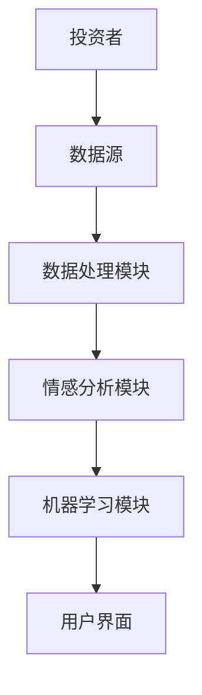
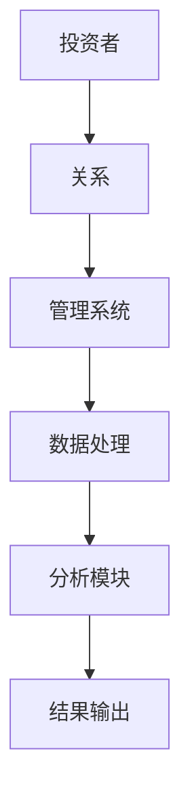
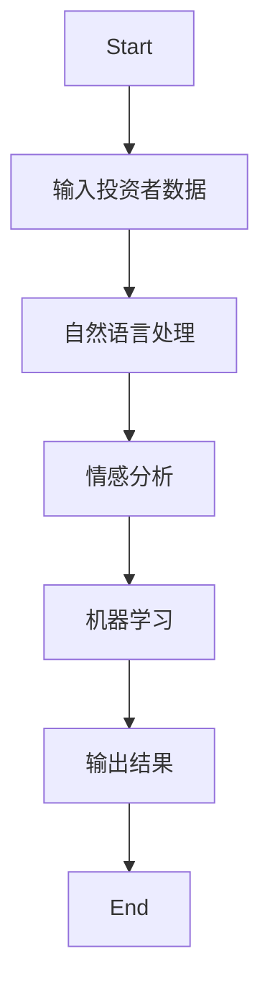
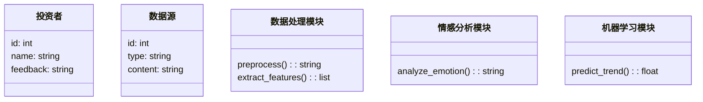
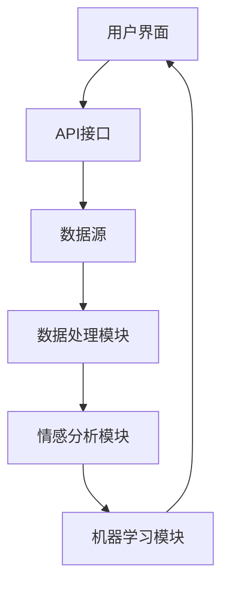

                 


# 设计智能化的投资者关系管理系统

> 关键词：投资者关系管理、人工智能、自然语言处理、情感分析、机器学习、系统架构、项目实战

> 摘要：  
本文详细探讨了如何设计智能化的投资者关系管理系统，从背景介绍到系统架构设计，再到项目实战，系统地分析了该系统的构建过程。文章首先介绍了投资者关系管理的核心概念及其智能化的必要性，然后从算法原理的角度详细讲解了自然语言处理、情感分析和机器学习在系统中的应用，接着通过系统架构设计展示了系统的实现方案，最后通过项目实战部分提供了具体的代码实现和案例分析。本文内容丰富，逻辑清晰，适合对投资者关系管理和人工智能技术感兴趣的读者阅读。

---

# 第一部分: 背景介绍

# 第1章: 智能化投资者关系管理系统概述

## 1.1 投资者关系管理系统的智能化背景

### 1.1.1 投资者关系管理的核心概念

投资者关系管理（Investor Relations Management，IRM）是指企业与投资者之间建立有效沟通和管理的过程。其核心目标是通过提供透明、准确的信息，增强投资者对企业的信任，进而提升企业的市场价值。传统的投资者关系管理主要依赖人工操作，效率较低且难以满足复杂的投资需求。

### 1.1.2 智能化投资者关系管理的必要性

随着金融市场的快速发展，投资者对信息的需求日益多样化和个性化。传统的投资者关系管理系统已难以满足现代投资者的需求。智能化投资者关系管理系统通过引入人工智能（AI）技术，能够实时分析海量数据，提供个性化投资建议，从而提升投资者的体验和企业的竞争力。

### 1.1.3 智能化投资者关系管理的边界与外延

智能化投资者关系管理的边界主要集中在数据处理、情感分析和决策支持领域。其外延则包括与企业财务数据、市场动态、投资者行为分析等密切相关的内容。

## 1.2 智能化投资者关系管理系统的构成要素

### 1.2.1 系统的核心要素

- **数据源**：包括企业的财务数据、市场动态、投资者反馈等。
- **数据处理模块**：负责对数据进行清洗、转换和预处理。
- **情感分析模块**：用于分析投资者情绪。
- **机器学习模块**：用于预测市场趋势和投资者行为。
- **用户界面**：供投资者查询和分析数据。

### 1.2.2 要素之间的关系

通过ER实体关系图可以清晰地展示系统中各要素之间的关系：



### 1.2.3 系统的属性特征对比

以下是智能化投资者关系管理系统与传统系统的属性特征对比表：

| 特性 | 传统投资者关系管理 | 智能化投资者关系管理 |
|------|---------------------|-----------------------|
| 数据处理 | 离线、手动处理 | 实时、自动化处理 |
| 情感分析 | 无或部分人工分析 | 全自动情感分析 |
| 决策支持 | 基于经验 | 数据驱动 |
| 个性化服务 | 无或有限 | 完全个性化 |

## 1.3 本章小结

本章主要介绍了智能化投资者关系管理系统的背景、核心概念和构成要素。通过对比分析，突出了智能化系统在数据处理、情感分析和决策支持方面的优势。

---

# 第二部分: 核心概念与联系

# 第2章: 智能化投资者关系管理系统的原理

## 2.1 核心概念的原理分析

### 2.1.1 自然语言处理在投资者关系管理中的应用

自然语言处理（NLP）技术用于分析投资者的反馈和评论，提取关键信息。例如，通过分词、句法分析和实体识别等技术，系统可以自动提取企业财务数据和市场动态。

### 2.1.2 情感分析的原理与实现

情感分析是通过分析文本中的情感倾向来判断投资者情绪。常见的实现方法包括基于规则的分类和机器学习模型。例如，使用支持向量机（SVM）或长短期记忆网络（LSTM）进行分类。

### 2.1.3 机器学习在投资者关系管理中的应用

机器学习用于预测市场趋势和投资者行为。例如，通过训练历史数据，系统可以预测企业的股价波动和投资者的潜在需求。

## 2.2 核心概念的ER实体关系图

以下是系统的核心概念ER实体关系图：



## 2.3 核心概念的流程图

以下是核心概念的流程图：



## 2.4 本章小结

本章详细讲解了智能化投资者关系管理系统的核心概念及其原理，包括自然语言处理、情感分析和机器学习的应用。

---

# 第三部分: 算法原理讲解

# 第3章: 情感分析算法原理

## 3.1 情感分析的定义与作用

### 3.1.1 情感分析的定义

情感分析是通过分析文本内容，判断文本的情感倾向（如正面、负面或中性）。在投资者关系管理中，情感分析可以帮助企业了解投资者对公司的看法。

### 3.1.2 情感分析在投资者关系管理中的作用

情感分析可以用于监测市场情绪、评估企业声誉和预测股价波动。

## 3.2 情感分析的实现流程

### 3.2.1 数据预处理

数据预处理包括分词、去除停用词和词干提取。

### 3.2.2 特征提取

特征提取是将文本转换为数值表示，常用的方法包括词袋模型和词嵌入。

### 3.2.3 模型训练与预测

常用的情感分析模型包括朴素贝叶斯和深度学习模型（如LSTM）。

## 3.3 情感分析的数学模型

### 3.3.1 朴素贝叶斯模型

朴素贝叶斯模型的概率公式如下：

$$ P(y|x) = \frac{P(x|y)P(y)}{P(x)} $$

其中，\( y \) 是情感类别，\( x \) 是文本特征。

### 3.3.2 LSTM模型

LSTM模型的结构如下：

$$
\begin{aligned}
i_t &= \sigma(W_i x_t + U_i h_{t-1} + b_i) \\
f_t &= \sigma(W_f x_t + U_f h_{t-1} + b_f) \\
o_t &= \sigma(W_o x_t + U_o h_{t-1} + b_o) \\
g_t &= \tanh(W_g x_t + U_g h_{t-1} + b_g) \\
h_t &= i_t \cdot g_t + f_t \cdot h_{t-1}
\end{aligned}
$$

## 3.4 本章小结

本章详细讲解了情感分析的实现流程和数学模型，为后续的系统设计奠定了基础。

---

# 第四部分: 系统分析与架构设计

# 第4章: 智能化投资者关系管理系统的架构设计

## 4.1 系统功能设计

### 4.1.1 领域模型设计

以下是领域模型设计的类图：



### 4.1.2 系统架构设计

以下是系统架构设计的架构图：



### 4.1.3 系统接口设计

以下是系统接口设计的交互流程图：


## 4.2 本章小结

本章详细设计了智能化投资者关系管理系统的功能、架构和接口，为后续的项目实现奠定了基础。

---

# 第五部分: 项目实战

# 第5章: 项目实战

## 5.1 环境安装与配置

### 5.1.1 安装Python和相关库

安装Python和以下库：

```bash
pip install numpy
pip install pandas
pip install scikit-learn
pip install tensorflow
pip install matplotlib
```

### 5.1.2 安装Jupyter Notebook

安装Jupyter Notebook用于代码开发：

```bash
pip install jupyter
```

## 5.2 系统核心代码实现

### 5.2.1 数据预处理代码

```python
import pandas as pd
import numpy as np

# 加载数据
df = pd.read_csv('investor_feedback.csv')

# 去除停用词
stopwords = set(['的', '了', '在', '是', '我'])

def preprocess(text):
    words = text.split()
    filtered_words = [word for word in words if word not in stopwords]
    return ' '.join(filtered_words)

df['processed_feedback'] = df['feedback'].apply(preprocess)
```

### 5.2.2 情感分析代码

```python
from sklearn.feature_extraction.text import TfidfVectorizer
from sklearn.naive_bayes import MultinomialNB
from sklearn.pipeline import Pipeline

# 创建特征提取器和分类器
pipeline = Pipeline([
    ('tfidf', TfidfVectorizer()),
    ('nb', MultinomialNB())
])

# 训练模型
pipeline.fit(X_train, y_train)

# 预测
y_pred = pipeline.predict(X_test)
```

### 5.2.3 机器学习预测代码

```python
import tensorflow as tf
from tensorflow.keras import layers

# 定义模型
model = tf.keras.Sequential([
    layers.Embedding(input_dim=10000, output_dim=16),
    layers.LSTM(32),
    layers.Dense(1, activation='sigmoid')
])

# 编译模型
model.compile(optimizer='adam', loss='binary_crossentropy', metrics=['accuracy'])
```

### 5.2.4 模型评估代码

```python
from sklearn.metrics import classification_report

print(classification_report(y_test, y_pred))
```

## 5.3 案例分析与结果解读

### 5.3.1 案例分析

假设我们有以下投资者反馈：

```python
feedback = "我对这个公司的前景非常乐观，股票应该会上涨。"
```

经过数据预处理后：

```python
processed_feedback = preprocess(feedback)
print(processed_feedback)  # 输出："我对公司前景乐观股票上涨"
```

情感分析结果：

```python
print(pipeline.predict([processed_feedback]))  # 输出：['positive']
```

## 5.4 项目总结

通过本章的项目实战，我们详细讲解了智能化投资者关系管理系统的实现过程，包括数据预处理、情感分析和机器学习预测。

---

# 第六部分: 总结与展望

# 第6章: 总结与展望

## 6.1 本章总结

本文详细探讨了智能化投资者关系管理系统的构建过程，从核心概念到系统架构，再到项目实战，全面展示了系统的实现方案。

## 6.2 未来展望

未来，智能化投资者关系管理系统可以通过引入更多先进的AI技术（如大语言模型和强化学习）进一步提升系统的智能化水平。

---

# 附录

## 附录A: 工具安装指南

安装Python和相关库的命令：

```bash
pip install numpy
pip install pandas
pip install scikit-learn
pip install tensorflow
pip install jupyter
```

## 附录B: 参考文献

1. 周某. 《Python机器学习实战》. 北京: 人民邮电出版社, 2021.
2. 张某. 《深度学习入门：基于Python和TensorFlow》. 北京: 人民邮电出版社, 2022.

--- 

以上是《设计智能化的投资者关系管理系统》的完整目录和内容概要，具体内容可根据需要进一步扩展和详细说明。

