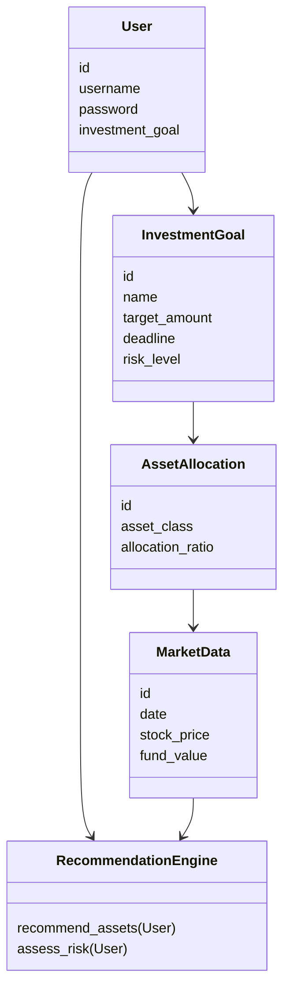
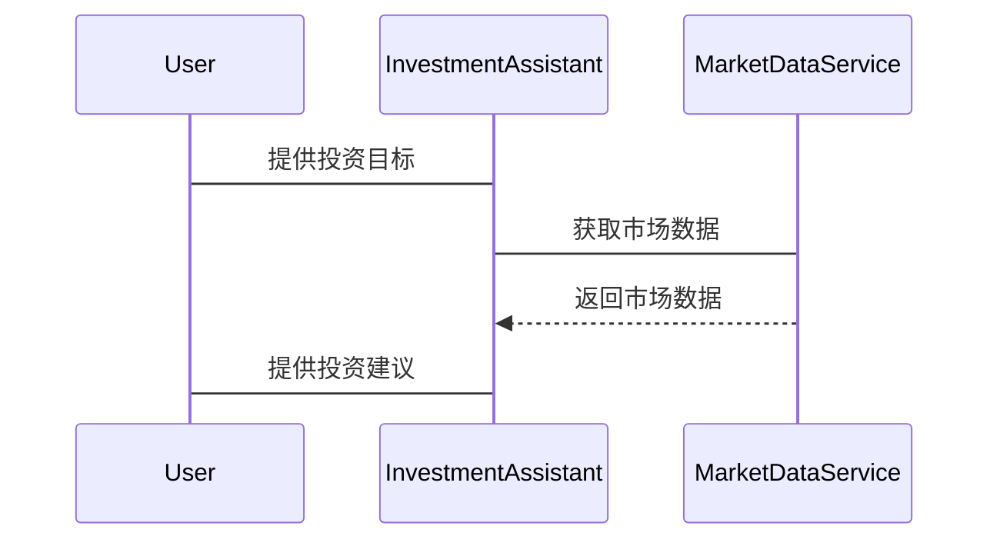

                 


# 设计直观易用的投资理财智能助手用户界面

> **关键词**：用户界面设计、投资理财、智能助手、用户体验、交互设计、可视化、算法原理

> **摘要**：  
本文将详细探讨设计直观易用的投资理财智能助手用户界面的关键要素，从背景分析到算法原理，从系统架构到项目实战，全面解析如何打造高效的智能理财工具。我们将结合实际案例，通过详细的数学模型和流程图，深入分析设计原则、算法优化和系统实现，帮助读者掌握设计直观易用的投资理财智能助手的核心方法。

---

# 第一部分: 投资理财智能助手的背景与意义

## 第1章: 投资理财智能助手的背景

### 1.1 投资理财智能助手的背景

#### 1.1.1 问题背景  
随着经济的发展和投资渠道的多样化，越来越多的用户开始关注个人投资理财。然而，传统的投资理财工具存在以下问题：  
1. 信息繁杂，用户难以快速获取关键数据。  
2. 缺乏个性化的投资建议，用户难以根据自身需求制定策略。  
3. 界面复杂，操作门槛高，尤其是对非专业用户而言。  

#### 1.1.2 智能化投资理财工具的兴起  
人工智能和大数据技术的进步，使得智能投资理财助手成为可能。通过自然语言处理、机器学习和数据可视化等技术，智能助手能够为用户提供个性化的投资建议、实时市场分析和风险评估。

#### 1.1.3 用户需求变化  
现代用户对投资理财工具的需求发生了显著变化：  
1. 用户希望工具能够简化复杂的投资决策过程。  
2. 用户需要直观的可视化界面，快速理解市场动态。  
3. 用户期待个性化的投资建议，满足不同风险偏好和财务目标。

---

## 第2章: 智能助手在投资理财中的作用

### 2.1 提供个性化投资建议

#### 2.1.1 个性化投资策略  
通过分析用户的财务状况、投资目标和风险偏好，智能助手能够推荐适合的投资组合。例如，使用协同过滤算法（Collaborative Filtering）为用户推荐相似投资行为的用户群体，并基于此生成个性化建议。

#### 2.1.2 实时市场数据分析  
智能助手能够实时获取市场数据（如股票价格、基金净值等），并通过数据可视化工具（如K线图、折线图）帮助用户快速理解市场动态。

#### 2.1.3 风险评估与优化  
通过机器学习模型，智能助手能够评估用户的投资组合风险，并提出优化建议，如调整资产配置比例。

---

### 2.2 直观性与易用性设计原则

#### 2.2.1 直观性  
用户界面设计应遵循“所见即所得”的原则，确保用户能够快速理解界面元素的功能。例如，使用颜色编码区分不同资产类型（绿色表示股票，橙色表示基金等）。

#### 2.2.2 易用性  
界面设计应简化操作流程，减少用户的学习成本。例如，采用向导式设计，引导用户逐步完成投资目标设定和风险评估。

#### 2.2.3 个性化配置  
允许用户自定义界面布局和显示内容，例如选择关注的资产类别或调整风险提示的敏感度。

---

# 第二部分: 核心概念与算法原理

## 第3章: 核心概念与联系

### 3.1 用户界面设计的核心要素

#### 3.1.1 信息架构  
信息架构是用户界面设计的基础，包括如何组织和呈现信息。例如，将投资组合分为“股票”、“基金”、“债券”等类别，并设计层级分明的导航结构。

#### 3.1.2 交互设计  
交互设计决定了用户与界面的互动方式。例如，用户可以通过滑动或点击操作调整资产配置比例。

#### 3.1.3 视觉设计  
视觉设计通过颜色、字体和图形等元素提升界面的美观性和可读性。例如，使用对比鲜明的色彩区分不同风险等级。

### 3.2 投资理财用户的特征分析

#### 3.2.1 不同用户群体的需求  
- **高净值用户**：关注资产保值和长期增值，倾向于选择低风险、高收益的投资组合。  
- **年轻用户**：更注重便捷性和个性化，倾向于使用移动应用进行投资管理。  
- **风险厌恶型用户**：偏好低风险投资，如债券或货币基金。  

#### 3.2.2 用户的行为模型  
用户在使用投资理财工具时通常会经历以下阶段：  
1. **信息收集**：获取市场数据和投资建议。  
2. **决策制定**：根据收集的信息做出投资决策。  
3. **操作执行**：完成投资操作（如购买、卖出）。  

### 3.3 核心概念的对比分析

#### 3.3.1 传统界面设计与智能界面设计的对比  

| **对比维度** | **传统界面设计** | **智能界面设计** |  
|--------------|-------------------|------------------|  
| 信息呈现     | 纯文本或简单图表 | 丰富的可视化元素 |  
| 个性化       | 无                | 强调个性化配置   |  
| 智能性       | 无                | 集成 AI 推荐系统 |  

---

## 第4章: 算法原理与数学模型

### 4.1 推荐系统的算法原理

#### 4.1.1 协同过滤算法  
协同过滤是一种基于用户行为相似性的推荐算法。  
- **公式**：  
  $$ sim(u, v) = \frac{\sum_{i=1}^{n} (r_{u,i} - \bar{r}_u)(r_{v,i} - \bar{r}_v)}{\sqrt{\sum_{i=1}^{n} (r_{u,i} - \bar{r}_u)^2} \cdot \sqrt{\sum_{i=1}^{n} (r_{v,i} - \bar{r}_v)^2}}} $$  
  其中，$sim(u, v)$ 表示用户 $u$ 和用户 $v$ 之间的相似度，$r_{u,i}$ 表示用户 $u$ 对物品 $i$ 的评分，$\bar{r}_u$ 表示用户 $u$ 的平均评分。

---

### 4.2 算法实现与优化

#### 4.2.1 算法实现流程  
1. **数据预处理**：对用户行为数据进行清洗和归一化处理。  
2. **相似度计算**：基于协同过滤算法计算用户之间的相似度。  
3. **推荐生成**：根据相似用户的偏好生成推荐列表。  

#### 4.2.2 算法优化  
为了提高推荐系统的效率，可以采用以下优化策略：  
- 使用矩阵分解技术（如SVD，奇异值分解）对用户-物品矩阵进行降维。  
- 引入正则化项，防止过拟合。  

---

# 第三部分: 系统分析与架构设计

## 第5章: 系统分析与架构设计

### 5.1 系统功能设计

#### 5.1.1 领域模型设计  
以下是领域模型的类图：



---

### 5.2 系统架构设计

#### 5.2.1 分层架构  
以下是系统架构图：


---

### 5.3 系统交互设计

以下是系统交互序列图：



---

# 第四部分: 项目实战

## 第6章: 智能投资理财助手的设计与实现

### 6.1 环境安装

#### 6.1.1 系统要求  
- 操作系统：Windows 10 或 macOS 10.15 及以上  
- 开发工具：IntelliJ IDEA 或 PyCharm  
- 依赖库：Python 3.8+, Matplotlib, Pandas, Scikit-learn  

#### 6.1.2 环境配置  
```bash
pip install matplotlib pandas scikit-learn
```

---

### 6.2 核心代码实现

#### 6.2.1 推荐系统实现  
```python
from sklearn.metrics.pairwise import cosine_similarity

# 示例数据：用户-资产评分矩阵
user_asset_ratings = {
    'user1': {'股票': 4, '基金': 3, '债券': 2},
    'user2': {'股票': 3, '基金': 4, '债券': 5},
    'user3': {'股票': 2, '基金': 5, '债券': 4}
}

# 转换为矩阵形式
assets = ['股票', '基金', '债券']
users = ['user1', 'user2', 'user3']
rating_matrix = [[4, 3, 2], [3, 4, 5], [2, 5, 4]]

# 计算余弦相似度
similarity_matrix = cosine_similarity(rating_matrix)

# 推荐资产
def recommend_assets(user_id, similarity_matrix, assets):
    user_index = users.index(user_id)
    asset_scores = []
    for i in range(len(similarity_matrix[user_index])):
        score = similarity_matrix[user_index][i]
        asset_scores.append((assets[i], score))
    # 按相似度排序
    asset_scores.sort(key=lambda x: x[1], reverse=True)
    return asset_scores[:3]

# 示例推荐
print(recommend_assets('user1', similarity_matrix, assets))
```

---

## 第7章: 最佳实践与小结

### 7.1 最佳实践

#### 7.1.1 设计原则  
- **直观性**：使用颜色、图标等视觉元素提升界面可读性。  
- **简洁性**：减少不必要的功能和元素，降低用户认知负担。  
- **个性化**：根据用户需求提供定制化功能。  

#### 7.1.2 开发注意事项  
- 在数据可视化方面，选择合适的图表类型（如K线图、散点图等）。  
- 在算法优化方面，采用分布式计算框架（如Spark）处理大规模数据。  

### 7.2 小结  
设计直观易用的投资理财智能助手用户界面需要结合用户需求、界面设计原则和算法优化。通过本文的分析和案例，读者可以掌握从需求分析到系统实现的完整流程，从而设计出高效、易用的智能理财工具。

---

# 结语

投资理财智能助手的用户界面设计是一个复杂但充满挑战的过程。通过本文的系统分析和实战案例，读者可以深入了解如何将技术与用户需求相结合，打造直观、易用的投资理财工具。未来，随着人工智能和大数据技术的进一步发展，投资理财智能助手的功能将更加智能化和个性化。

