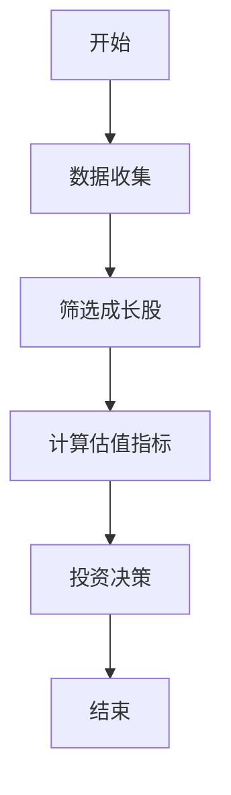
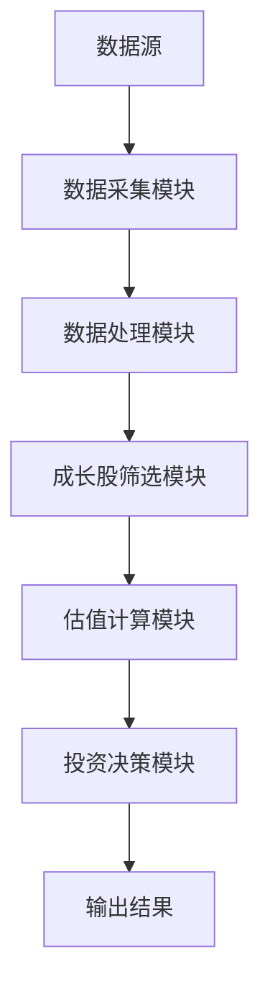

                 


# 费雪到现代：成长型投资的发展

## 关键词：成长型投资、费雪、巴菲特、多德、投资策略、量化分析

## 摘要：成长型投资是一种以企业成长为核心的投资策略，起源于20世纪初的费雪，经过巴菲特、彼得·林奇等投资大师的发展，形成了独特的理论体系。本文从费雪的成长型投资理论出发，详细分析了成长型投资的核心概念、量化分析方法、系统架构设计以及实战案例，最后总结了成长型投资的发展趋势和未来展望。

---

## 第一部分：成长型投资的起源与演变

### 第1章：成长型投资的起源与核心理念

#### 1.1 费雪的成长型投资理论

##### 1.1.1 费雪的生平与投资理念
菲利普·费雪（Philip Fisher）是成长型投资的鼻祖，他于1934年出版的《共同投资的答案》奠定了成长型投资的基础。费雪认为，投资的最终目标是找到那些具有持续盈利能力的公司，并长期持有。他强调，投资者应关注企业的成长性，而不是仅仅追求低估值。

##### 1.1.2 费雪的成长型投资核心思想
费雪提出了“成长股”的概念，认为这些公司具有以下特点：
1. **高成长性**：公司收入和利润持续增长，年增长率超过行业平均水平。
2. **竞争优势**：公司具有独特的竞争优势，能够持续获取超额利润。
3. **管理团队**：公司管理层具有高度的诚信和能力。
4. **财务健康**：公司财务状况稳健，无重大负债问题。

##### 1.1.3 费雪投资策略的现代意义
尽管费雪的理论提出于20世纪初，但其核心思想在现代投资中依然具有重要价值。成长型投资的策略在科技股、互联网公司等领域得到了广泛应用，尤其是在高成长性行业的投资中，费雪的理论仍然具有指导意义。

#### 1.2 格雷厄姆与多德的价值投资基础

##### 1.2.1 格雷厄姆的防御性投资策略
本杰明·格雷厄姆（Benjamin Graham）是价值投资的代表人物，他主张以低于内在价值的价格购买股票，并长期持有。他的理论强调安全边际，即以低于合理估值的价格买入股票，以降低投资风险。

##### 1.2.2 多德对成长股的早期研究
多德（David Dodd）是格雷厄姆的学生，他对成长股的研究为成长型投资奠定了基础。他提出了“内在价值”的概念，并强调在评估股票时，应考虑公司的未来增长潜力。

##### 1.2.3 格雷厄姆与费雪的理论差异与融合
格雷厄姆的价值投资强调安全边际和低估值，而费雪的成长型投资则更关注公司的成长性和竞争优势。两者在理论上存在差异，但实践中，许多投资者会将两者的思想结合起来，形成自己的投资策略。

---

### 第2章：成长型投资的核心概念与分析框架

#### 2.1 成长型投资的定义与特点

##### 2.1.1 成长型投资的定义
成长型投资是一种以寻找高成长性公司为核心的投资策略。投资者通过分析公司的财务数据、行业地位、竞争优势等因素，寻找那些具有持续盈利能力的公司，并进行长期投资。

##### 2.1.2 成长型投资的核心特征对比表

| **特征**             | **成长型投资**         | **价值投资**           |
|----------------------|-----------------------|------------------------|
| 核心目标             | 寻找高成长公司         | 寻找低估值公司         |
| 关注点               | 收入和利润增长率       | 内在价值与市场价差     |
| 投资期限             | 长期持有              | 中长期持有            |
| 风险承受能力         | 较高                 | 较低                  |

##### 2.1.3 成长型投资与价值投资的联系与区别
成长型投资与价值投资的联系在于，两者都强调对公司基本面的深入分析。区别在于，成长型投资更注重公司的未来增长潜力，而价值投资更注重当前的估值水平。

#### 2.2 成长型投资的关键指标分析

##### 2.2.1 市盈率（P/E）分析
市盈率是股票价格与每股收益的比率，用于衡量股票的估值水平。成长型投资者通常更关注公司的盈利能力，而非市盈率的高低。

##### 2.2.2 市净率（P/B）分析
市净率是股票价格与每股净资产的比率，用于衡量股票相对于账面价值的高低。成长型投资者通常更关注公司的成长性，而非市净率的高低。

##### 2.2.3 市销率（P/S）分析
市销率是股票价格与每股销售收入的比率，用于衡量股票相对于销售收入的高低。成长型投资者通常更关注公司的收入增长，而非市销率的高低。

##### 2.2.4 净利润增长率分析
净利润增长率是衡量公司盈利能力的重要指标，成长型投资者通常更关注公司净利润的持续增长。

##### 2.2.5 现金流分析
现金流是衡量公司财务健康状况的重要指标，成长型投资者通常更关注公司经营活动现金流的持续增长。

#### 2.3 成长型投资的行业选择策略

##### 2.3.1 高成长行业识别方法
高成长行业通常具有以下特征：
1. 行业处于快速增长阶段。
2. 行业具有较高的进入壁垒。
3. 行业具有较大的市场空间。

##### 2.3.2 行业生命周期分析
行业生命周期分为导入期、成长期、成熟期和衰退期。成长型投资者通常更关注处于成长期的行业。

##### 2.3.3 行业竞争结构分析
行业竞争结构分析是选择高成长行业的重要步骤，通常包括对行业集中度、竞争对手分析等因素的评估。

---

### 第3章：成长型投资的算法与数学模型

#### 3.1 成长型投资的量化分析方法

##### 3.1.1 成长股筛选的多因子模型
多因子模型是一种常用的量化分析方法，通过多个因子的综合评估，筛选出具有高成长性的公司。

##### 3.1.2 市盈率与净利润增长率的拟合关系
市盈率（P/E）与净利润增长率（G）之间的关系可以通过回归分析进行拟合，从而找出具有高成长性的公司。

##### 3.1.3 现金流贴现模型（DCF）的应用
现金流贴现模型（DCF）是一种常用的估值方法，通过预测公司的未来现金流，计算其内在价值。

#### 3.2 成长型投资的数学模型

##### 3.2.1 市盈率模型
$$ P = E \times PE $$
其中，\( P \) 是股票价格，\( E \) 是每股收益，\( PE \) 是市盈率。

##### 3.2.2 现金流贴现模型（DCF）
$$ V = \sum_{t=1}^{n} \frac{CF_t}{(1+r)^t} + \frac{TV}{(1+r)^n} $$
其中，\( V \) 是公司价值，\( CF_t \) 是第 \( t \) 年的现金流，\( r \) 是折现率，\( TV \) 是终值。

##### 3.2.3 市净率模型
$$ P = B \times PB $$
其中，\( P \) 是股票价格，\( B \) 是每股净资产，\( PB \) 是市净率。

#### 3.3 成长型投资的算法流程图


---

### 第4章：成长型投资的系统架构与实现

#### 4.1 成长型投资系统的功能模块

##### 4.1.1 数据采集模块
数据采集模块负责从股票市场获取相关数据，包括股票价格、财务数据等。

##### 4.1.2 成长股筛选模块
成长股筛选模块负责根据多因子模型筛选出具有高成长性的公司。

##### 4.1.3 估值计算模块
估值计算模块负责根据DCF模型计算公司内在价值。

##### 4.1.4 投资决策模块
投资决策模块负责根据筛选结果和估值结果，制定投资策略。

#### 4.2 成长型投资系统的架构设计


---

### 第5章：成长型投资的项目实战

#### 5.1 项目背景与目标
本项目旨在通过量化分析方法，筛选出具有高成长性的公司，并进行投资决策。

#### 5.2 系统核心实现源代码
```python
import pandas as pd
import numpy as np

# 数据采集模块
data = pd.read_csv('stock_data.csv')

# 成长股筛选模块
data['净利润增长率'] = (data['净利润'] - data['去年同期净利润']) / data['去年同期净利润'] * 100
data['市盈率'] = data['股价'] / data['每股收益']

# 估值计算模块
def calculate_intrinsic_value(company_data):
    CF = company_data['现金流']
    r = 0.1
    TV = CF * (1 + 0.05) / (1 - 0.05)
    return sum(CF / (1 + r)**t for t in range(10)) + TV / (1 + r)**10

intrinsic_values = data.apply(calculate_intrinsic_value, axis=1)

# 投资决策模块
data['投资建议'] = '买入' if intrinsic_values > data['股价'] else '卖出'
```

#### 5.3 项目小结
通过本项目，我们可以看到成长型投资的理论在实际操作中的应用。通过量化分析方法，我们可以更有效地筛选出具有高成长性的公司，并制定相应的投资策略。

---

### 第6章：成长型投资的总结与展望

#### 6.1 成长型投资的发展总结
成长型投资从费雪的理论到现代的量化分析，经历了漫长的发展过程。通过对成长型投资的理论和实践的深入分析，我们可以更好地理解其核心思想和实际应用。

#### 6.2 成长型投资的未来展望
随着科技的发展和数据的丰富，成长型投资的理论和实践将更加紧密地结合。未来，成长型投资将更加依赖于量化分析和人工智能技术，以提高投资决策的准确性和效率。

#### 6.3 投资建议与注意事项
投资者在进行成长型投资时，应注重以下几点：
1. **长期持有**：成长型投资需要耐心和信心，长期持有优质公司股票。
2. **分散投资**：避免过度集中，分散投资以降低风险。
3. **持续学习**：市场环境不断变化，投资者需要持续学习和调整策略。

---

通过本文的分析，我们可以看到成长型投资的发展历程及其在现代投资中的重要地位。希望本文能够为投资者提供有价值的参考和启示。

