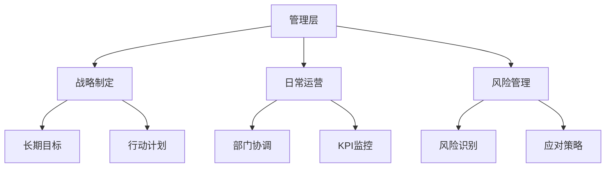
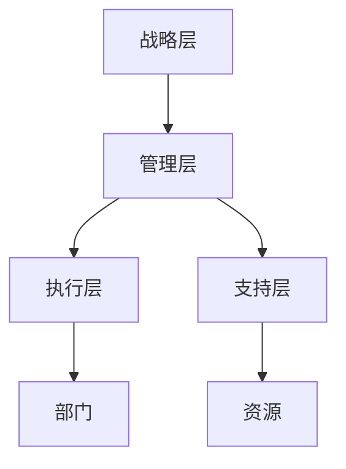
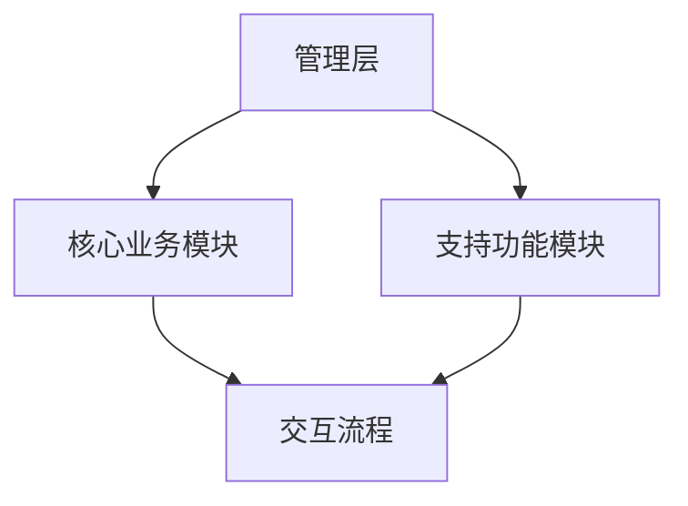

                 

# 费雪的'与经理人面谈'：深入了解公司管理层

---

## 关键词

- 费雪
- 经理人面谈
- 公司管理层
- 管理决策
- 投资分析

---

## 摘要

本文深入探讨了费雪的“与经理人面谈”方法，分析其在理解公司管理层决策、战略规划和管理风格中的应用。通过详细解析费雪的访谈技巧、方法论及其在实际中的应用，本文为投资者和企业管理者提供了实用的工具和见解。

---

## 目录大纲

1. **背景介绍**
   - 费雪的生平与投资理念
   - 公司管理层的核心职责

2. **费雪访谈法的理论基础**
   - 费雪访谈法的核心原理
   - 访谈法与公司治理

3. **系统分析与架构设计**
   - 企业架构分析
   - 系统架构设计

4. **项目实战**
   - 费雪访谈法的实际应用
   - 案例分析与经验总结

5. **最佳实践与小结**
   - 费雪方法的优势与局限
   - 投资者的实用建议

---

## 正文

### 第一部分：背景介绍

#### 第1章：费雪的生平与投资理念

##### 1.1 费雪的生平简介

菲利普·费雪（Philip Fisher）是20世纪著名的投资家和管理学家，被誉为“成长型投资之父”。他出生于1907年，逝世于2004年。费雪的投资理念强调长期成长和对公司管理层的深入分析。他主张通过与公司管理层的直接交流，深入了解企业的经营状况、未来规划和潜在风险。

**费雪的投资理念**：
- **成长导向**：投资于具有持续增长潜力的公司。
- **管理层质量**：公司管理层的能力和决策对公司价值至关重要。
- **长期视角**：关注公司的长期发展而非短期波动。

##### 1.2 费雪的“与经理人面谈”方法

费雪认为，要真正理解一家公司，必须与其管理层进行深入交流。这种方法的核心在于通过提问和倾听，获取公司内部的信息，评估管理层的战略能力、决策风格和应对挑战的能力。

**费雪访谈法的目标**：
- **识别管理层的质量**：评估管理层的智慧、判断力和决策能力。
- **理解公司战略**：了解公司的长期目标和实现路径。
- **发现潜在问题**：识别公司面临的风险和挑战。

---

#### 第2章：公司管理层的核心职责

##### 2.1 公司管理层的核心职责

公司管理层在企业的运营中扮演着至关重要的角色。他们的职责包括制定战略、管理日常运营、监控财务状况、评估风险并采取应对措施。以下是管理层的主要职责：

1. **战略制定**：
   - 设定公司的长期目标和战略。
   - 制定实现目标的具体行动计划。

2. **日常运营**：
   - 管理公司日常运作，确保各部门协调一致。
   - 监督关键绩效指标（KPIs）的达成情况。

3. **风险管理**：
   - 识别潜在风险并制定应对策略。
   - 确保公司具备应对危机的能力。

**图1：公司管理层的职责结构图**

##### 2.2 管理层面临的挑战

尽管管理层在公司中扮演着重要角色，但他们也面临着诸多挑战：

1. **内部协调问题**：
   - 管理层需要协调各部门之间的资源和目标，确保公司整体运作顺畅。

2. **外部环境变化**：
   - 市场环境的不确定性和变化要求管理层具备快速反应的能力。

3. **信息不对称的影响**：
   - 管理层需要处理来自各个渠道的信息，确保决策的准确性和及时性。

---

### 第二部分：费雪访谈法的理论基础

#### 第3章：费雪访谈法的核心原理

##### 3.1 费雪访谈法的基本概念

费雪访谈法是一种通过与公司管理层深入交流，以评估公司潜在价值和风险的方法。这种方法注重通过提问和倾听，获取公司内部的关键信息，从而为投资决策提供依据。

**核心原理**：
- **问题导向**：通过精心设计的问题，引导管理层揭示公司的优势和劣势。
- **解决方案导向**：关注管理层如何解决问题，评估其应对挑战的能力。
- **未来视角**：了解管理层对未来的规划和预期。

##### 3.2 费雪访谈法的独特性

与其他管理分析方法相比，费雪访谈法的独特之处在于：

1. **以问题为导向**：
   - 访谈围绕公司战略、运营和财务等核心问题展开。

2. **以解决方案为导向**：
   - 关注管理层如何解决问题，评估其应对能力。

3. **面向未来**：
   - 强调管理层对未来的规划和预期，而非仅仅回顾过去。

---

#### 第4章：费雪访谈法的理论框架

##### 4.1 费雪访谈法的理论基础

费雪访谈法的理论基础主要来源于以下几个方面：

1. **行为科学理论**：
   - 研究管理层的行为模式和决策过程。
   
2. **组织行为学**：
   - 分析组织结构和管理层在其中的角色。
   
3. **信息处理理论**：
   - 研究管理层如何处理信息并做出决策。

##### 4.2 费雪访谈法与公司治理

费雪访谈法在公司治理中的应用主要体现在以下几个方面：

1. **治理结构分析**：
   - 评估公司治理结构的有效性和合理性。

2. **管理层决策过程**：
   - 分析管理层的决策过程和风格。

3. **治理效率提升**：
   - 通过访谈识别治理中的问题并提出改进建议。

---

### 第三部分：系统分析与架构设计

#### 第5章：企业架构分析

##### 5.1 企业架构概述

企业架构是公司整体结构和运作方式的蓝图，包括战略、组织、技术和风险管理等方面。

**企业架构的核心要素**：
- **战略层**：公司的长期目标和战略。
- **管理层**：执行战略的主体。
- **执行层**：具体执行战略的部门和员工。
- **支持层**：提供资源和支持的部门。

##### 5.2 管理层在架构中的角色

在企业架构中，管理层扮演着关键角色：

1. **战略层**：
   - 制定和实施公司的长期战略。
   
2. **管理层**：
   - 协调各部门的运作，确保战略的执行。
   
3. **支持层**：
   - 提供必要的资源和支持，确保战略的顺利实施。

**图2：企业架构图**

#### 第6章：系统架构设计

##### 6.1 系统架构概述

系统架构设计是将企业架构转化为具体的系统结构和功能模块。

**系统架构的核心模块**：
- **核心业务模块**：公司主要业务的实现。
- **支持功能模块**：支持核心业务运作的辅助功能。
- **交互流程设计**：模块之间的数据流和交互逻辑。

##### 6.2 管理层的系统接口

在系统架构中，管理层需要与各个模块进行交互：

1. **数据输入接口**：
   - 管理层提供战略目标和决策输入。
   
2. **信息处理接口**：
   - 管理层接收各部门的反馈和数据，进行分析和决策。

3. **输出接口**：
   - 管理层将决策结果传递给执行层和相关部门。

**图3：系统架构图**

---

### 第四部分：项目实战

#### 第7章：费雪访谈法的实际应用

##### 7.1 项目背景

某成长型科技公司希望通过与管理层的深入访谈，评估公司的发展潜力和风险。

##### 7.2 访谈过程

1. **访谈准备**：
   - 确定访谈目标和问题清单。
   
2. **实施访谈**：
   - 与公司CEO、 CFO等高管进行深入交流。
   
3. **分析与总结**：
   - 根据访谈结果，评估公司管理层的能力和公司的潜在风险。

##### 7.3 案例分析

通过对某科技公司的访谈，我们发现：

1. **管理层能力**：
   - CEO具有丰富的行业经验和清晰的战略 vision。
   
2. **公司战略**：
   - 公司计划在未来三年内拓展海外市场，但面临一定的竞争压力。
   
3. **潜在风险**：
   - 技术更新换代快，需要持续投入研发。

---

### 第五部分：最佳实践与小结

#### 第8章：费雪方法的优势与局限

##### 8.1 费雪方法的优势

1. **深度洞察**：
   - 通过直接交流，获取公司内部的第一手信息。
   
2. **评估管理层质量**：
   - 有效评估公司管理层的能力和决策风格。

3. **识别潜在风险**：
   - 发现公司运营中的潜在问题，提前采取应对措施。

##### 8.2 费雪方法的局限

1. **时间成本**：
   - 访谈需要大量时间和资源，对投资者和管理层都提出了较高的要求。
   
2. **主观性**：
   - 访谈结果受到访谈者主观判断的影响，可能存在偏差。

#### 第9章：投资者的实用建议

##### 9.1 实用建议

1. **选择合适的公司**：
   - 优先选择管理层能力强、战略清晰的公司。
   
2. **深入研究公司**：
   - 通过多种渠道，包括财务报表、行业报告和管理层访谈，全面了解公司。

3. **持续关注**：
   - 定期跟踪公司的发展情况，及时调整投资策略。

---

## 总结

通过本文的分析，我们可以看到，费雪的“与经理人面谈”方法是一种有效的工具，能够帮助投资者和企业管理者深入了解公司管理层的决策和公司整体运营情况。尽管这种方法具有一定的挑战，但其带来的深度洞察和潜在价值使其成为值得尝试的方法。

---

## 建议阅读

- 费雪的其他著作，如《如何选择成长股》。
- 管理学经典书籍，如《竞争优势》（迈克尔·波特）。
- 企业治理相关的学术研究和实践报告。

---

以上是本文的完整结构，每个部分都进行了详细的分析和讲解，确保读者能够全面理解费雪的“与经理人面谈”方法及其在实际中的应用。

