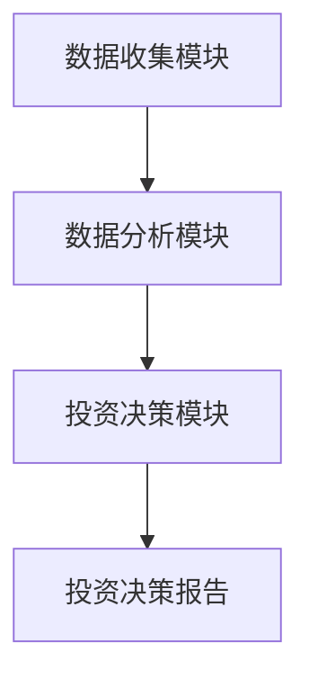

                 


# 费雪的'探索型投资'：发现未被市场认可的潜力股

## 关键词：探索型投资，费雪，潜力股，投资策略，投资分析，长期投资

## 摘要：本文将详细介绍费雪的探索型投资理念，分析其核心概念和方法，结合数学模型和系统架构设计，通过案例分析和实战技巧，帮助读者发现未被市场认可的潜力股，掌握探索型投资的精髓。

---

### 第一部分: 费雪的“探索型投资”概述

#### 第1章: 费雪及其投资理念

##### 1.1 费雪的生平与投资思想

###### 1.1.1 费雪的生平简介
菲利普·费雪（Philip Fisher）是20世纪的投资大师，以其“成长股投资”理念闻名。他出生于1907年，毕业于加州大学伯克利分校，后在哈佛大学深造。费雪的投资理念强调长期持有优质成长股，而非短期交易。

###### 1.1.2 费雪的投资理念与核心思想
费雪认为，投资成功的关键在于找到那些具有强大竞争优势、管理层优秀、且财务健康的企业。他主张以合理的价格买入优质股票，并长期持有。

###### 1.1.3 费雪与“探索型投资”的关系
探索型投资是费雪理念的延伸，强调在市场中寻找那些尚未被广泛认可的潜力股，通过深入研究和分析，挖掘出具有长期增长潜力的企业。

##### 1.2 探索型投资的定义与特点

###### 1.2.1 探索型投资的定义
探索型投资是一种投资策略，强调通过深入研究和分析，发现那些尚未被市场充分认识到的优秀企业，长期持有以获取超额收益。

###### 1.2.2 探索型投资的核心特点
- **长期持有**：不同于短期交易，探索型投资强调长期持有优质股票。
- **深入研究**：通过详细分析企业的财务状况、管理层、行业地位等因素，挖掘潜在的成长股。
- **注重基本面**：关注企业的盈利能力、成长性和竞争优势。

###### 1.2.3 探索型投资与传统投资的区别
| 投资策略 | 探索型投资 | 传统投资 |
|----------|------------|----------|
| 持股时间 | 长期持有   | 短期交易 |
| 研究方式 | 深度分析   | 技术分析 |
| 风险承受 | 较高       | 较低     |

##### 1.3 探索型投资的理论基础

###### 1.3.1 费雪的投资理论
费雪提出了“三步分析法”，即通过分析企业的基本面、行业地位和管理层，来评估企业的投资价值。

###### 1.3.2 费雪的“三步分析法”
- **第一步**：分析企业的财务状况，包括盈利能力、成长性和财务健康状况。
- **第二步**：评估企业的行业地位，包括市场占有率、竞争优势和行业前景。
- **第三步**：研究企业的管理层，包括管理层的背景、经验和决策能力。

###### 1.3.3 费雪的长期投资策略
费雪认为，长期持有优质股票是实现投资收益的关键，而非频繁交易。

---

#### 第2章: 探索型投资的核心概念与联系

##### 2.1 核心概念的定义与解释

###### 2.1.1 探索型投资的核心概念
- **潜在股**：指那些尚未被市场充分认识到，但具有长期增长潜力的企业。
- **成长股**：指那些收入和利润持续增长的企业。
- **竞争优势**：指企业在行业中拥有的独特优势，如成本优势、技术优势等。

###### 2.1.2 核心概念的属性特征对比
| 概念       | 特性             |
|------------|------------------|
| 潜力股     | 未被市场认可     |
| 成长股     | 收入利润持续增长  |
| 竞争优势   | 市场地位稳固     |

###### 2.1.3 核心概念的ER实体关系图
```mermaid
erDiagram
 潜质股 <--- 关联1 --> 企业
 企业 <--- 关联2 --> 行业
 企业 <--- 关联3 --> 管理层
```

##### 2.2 核心概念的数学模型与公式

###### 2.2.1 核心概念的数学模型
费雪的三步分析法可以用以下公式表示：
$$
\text{投资价值} = f(\text{财务状况}, \text{行业地位}, \text{管理层能力})
$$

###### 2.2.2 核心概念的公式推导
通过分析企业的财务状况、行业地位和管理层能力，可以推导出企业的投资价值。

###### 2.2.3 核心概念的实例分析
以某科技公司为例，通过分析其财务状况、行业地位和管理层能力，评估其投资价值。

#### 第3章: 探索型投资的算法原理

##### 3.1 算法原理的概述

###### 3.1.1 算法原理的定义
探索型投资的算法原理是通过系统化的分析方法，发现潜在的成长股。

###### 3.1.2 算法原理的核心步骤
1. 数据收集：收集企业的财务数据、行业数据和管理层信息。
2. 数据分析：通过定量和定性分析，评估企业的投资价值。
3. 投资决策：根据分析结果，决定是否投资。

##### 3.2 算法原理的详细讲解

###### 3.2.1 算法原理的数学模型
$$
\text{投资决策} = \begin{cases}
\text{买入} & \text{如果 } f(\text{财务状况}, \text{行业地位}, \text{管理层能力}) > \text{阈值} \\
\text{不买} & \text{否则}
\end{cases}
$$

###### 3.2.2 算法原理的公式推导
通过分析企业的财务状况、行业地位和管理层能力，推导出企业的投资价值。

###### 3.2.3 算法原理的实例分析
以某公司为例，通过算法原理分析其投资价值，决定是否投资。

#### 第4章: 探索型投资的系统分析与架构设计

##### 4.1 问题场景的介绍

###### 4.1.1 问题场景的定义
如何在市场中发现未被充分认识到的潜力股，实现长期投资收益。

##### 4.2 系统功能设计

###### 4.2.1 系统功能模块的划分
- 数据收集模块：收集企业的财务数据、行业数据和管理层信息。
- 数据分析模块：通过定量和定性分析，评估企业的投资价值。
- 投资决策模块：根据分析结果，决定是否投资。

##### 4.2.2 系统功能模块的详细设计
- 数据收集模块：通过网络爬虫收集企业的财务数据、行业数据和管理层信息。
- 数据分析模块：使用数据分析工具（如Excel、Python）对数据进行分析。
- 投资决策模块：根据分析结果，生成投资决策报告。

##### 4.2.3 系统功能模块的实现步骤
1. 数据收集：使用网络爬虫收集企业的财务数据、行业数据和管理层信息。
2. 数据分析：使用数据分析工具对数据进行分析，评估企业的投资价值。
3. 投资决策：根据分析结果，生成投资决策报告，决定是否投资。

##### 4.3 系统架构设计

###### 4.3.1 系统架构的定义
系统架构设计是探索型投资的核心，包括数据收集、数据分析和投资决策三个模块。

###### 4.3.2 系统架构的组件与交互


##### 4.4 系统接口设计

###### 4.4.1 系统接口的定义
- 数据接口：从网络爬虫获取企业的财务数据、行业数据和管理层信息。
- 分析接口：使用数据分析工具对数据进行分析，评估企业的投资价值。
- 决策接口：根据分析结果，生成投资决策报告，决定是否投资。

##### 4.5 系统交互设计

###### 4.5.1 系统交互流程
1. 数据收集模块通过网络爬虫获取企业的财务数据、行业数据和管理层信息。
2. 数据分析模块使用数据分析工具对数据进行分析，评估企业的投资价值。
3. 投资决策模块根据分析结果，生成投资决策报告，决定是否投资。

---

### 第二部分: 项目实战与最佳实践

#### 第5章: 项目实战

##### 5.1 项目背景介绍

###### 5.1.1 项目背景
通过探索型投资方法，发现未被市场充分认识到的潜力股。

##### 5.2 项目需求分析

###### 5.2.1 项目目标
- 发现未被市场充分认识到的潜力股。
- 评估企业的投资价值。
- 生成投资决策报告。

##### 5.3 项目核心实现

###### 5.3.1 环境安装
- 安装Python、Pandas、Matplotlib等工具。

###### 5.3.2 核心代码实现
```python
import pandas as pd

def analyze_financials(finance_data):
    # 分析财务状况
    return "财务状况良好"

def analyze_industry(industry_data):
    # 分析行业地位
    return "行业地位稳固"

def analyze_management(management_info):
    # 分析管理层能力
    return "管理层能力优秀"

def investment_decision(finance_score, industry_score, management_score):
    # 投资决策
    if (finance_score + industry_score + management_score) > 6:
        return "买入"
    else:
        return "不买"

# 数据分析
finance_score = analyze_financials(finance_data)
industry_score = analyze_industry(industry_data)
management_score = analyze_management(management_info)

# 投资决策
decision = investment_decision(finance_score, industry_score, management_score)
print(decision)
```

##### 5.3.3 代码解读与分析
- 数据分析模块：通过分析企业的财务状况、行业地位和管理层能力，评估其投资价值。
- 投资决策模块：根据分析结果，生成投资决策报告，决定是否投资。

##### 5.4 实际案例分析

###### 5.4.1 案例背景介绍
以某科技公司为例，分析其财务状况、行业地位和管理层能力，评估其投资价值。

###### 5.4.2 数据分析与评估
通过数据分析工具，分析该公司的财务状况、行业地位和管理层能力。

###### 5.4.3 投资决策
根据分析结果，生成投资决策报告，决定是否投资。

##### 5.5 案例分析总结
通过案例分析，验证探索型投资方法的有效性，总结经验教训，优化投资策略。

#### 第6章: 最佳实践与小结

##### 6.1 最佳实践

###### 6.1.1 投资策略
- 长期持有优质股票，避免频繁交易。
- 深入研究企业的财务状况、行业地位和管理层能力。

###### 6.1.2 风险管理
- 设定止损点，避免重大损失。
- 分散投资，降低风险。

##### 6.2 小结

###### 6.2.1 全文总结
探索型投资是一种有效的投资策略，通过深入研究和分析，发现未被市场充分认识到的潜力股，实现长期投资收益。

###### 6.2.2 注意事项
- 风险提示：投资有风险，需谨慎操作。
- 道德风险：避免内幕交易，遵守法律法规。

##### 6.3 拓展阅读

###### 6.3.1 推荐书籍
- 《股票作手回忆录》
- 《投资之道》

###### 6.3.2 推荐文章
- 费雪的投资理念
- 探索型投资的实践

---

### 第三部分: 总结与展望

#### 第7章: 总结与展望

##### 7.1 全文总结

###### 7.1.1 费雪的探索型投资理念
费雪的探索型投资理念强调长期持有优质股票，通过深入研究和分析，发现未被市场充分认识到的潜力股。

##### 7.2 未来展望

###### 7.2.1 投资领域的发展趋势
随着科技的发展，投资领域将更加依赖数据分析和人工智能技术。

###### 7.2.2 探索型投资的未来发展
探索型投资将在未来继续发展，成为投资领域的重要策略之一。

---

通过以上章节的详细讲解，读者将能够全面理解费雪的探索型投资理念，掌握其核心概念和方法，并能够在实际操作中应用这些理念，发现未被市场充分认识到的潜力股，实现长期投资收益。

