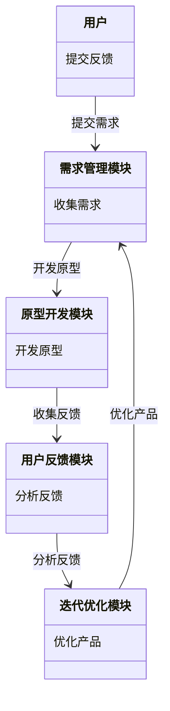

                 


# 费雪的'臭鼬工厂'理论：创新如何推动公司增长

> 关键词：创新，公司增长，臭鼬工厂理论，系统架构，项目实战

> 摘要：本文详细探讨了费雪的“臭鼬工厂”理论，从理论背景、核心概念到数学模型、系统架构，再到项目实战，全面分析了该理论如何通过创新推动公司增长。通过实际案例和系统设计，展示了如何在实际中应用该理论以实现公司创新和增长。

---

## 第一章: 费雪的“臭鼬工厂”理论的背景与核心观点

### 1.1 理论的提出背景

#### 1.1.1 创新在企业中的重要性

创新是企业持续发展的核心动力。在竞争激烈的市场环境中，企业需要不断推出新产品、优化流程、改进服务，以保持竞争优势。然而，传统的创新方法往往效率低下，资源浪费严重，且难以快速响应市场变化。

#### 1.1.2 理论的提出背景

费雪的“臭鼬工厂”理论（Skunk Works Theory）起源于20世纪40年代，最初由美国洛克希德·马丁公司（Lockheed Martin）的臭鼬工厂（Skunk Works）团队提出。该团队在二战期间负责研发高性能飞机，通过快速原型开发和小团队协作，成功实现了创新项目的高效推进。这一方法后来被推广到其他领域，并逐渐发展成为一种经典的创新管理理论。

#### 1.1.3 理论的核心观点

“臭鼬工厂”理论强调通过小团队协作、快速原型开发和用户反馈，快速验证创新想法并推动其落地。这种方法注重高效沟通、快速迭代和风险控制，能够有效降低创新成本，提高创新成功率。

### 1.2 “臭鼬工厂”理论与公司增长的关系

#### 1.2.1 创新在公司增长中的作用

创新是公司增长的核心驱动力。通过创新，企业可以推出新产品、优化业务模式、提升效率，从而在市场中占据领先地位。

#### 1.2.2 “臭鼬工厂”理论如何推动创新

通过小团队协作、快速原型开发和用户反馈，臭鼬工厂理论能够快速验证创新想法，降低创新成本，提高创新效率。

#### 1.2.3 理论的实践案例

臭鼬工厂理论已经在多个领域得到成功应用，例如互联网初创公司、软件开发团队等。通过快速迭代和用户反馈，这些团队能够迅速调整产品方向，抓住市场机会。

---

## 第二章: “臭鼬工厂”理论的核心概念与关键要素

### 2.1 理论的核心概念

#### 2.1.1 创新思维的定义

创新思维是指通过打破常规、探索新方法、寻找新思路，从而产生新的解决方案的过程。

#### 2.1.2 快速原型开发的内涵

快速原型开发是一种通过快速构建可运行的原型，验证产品想法并进行迭代优化的方法。这种方法能够快速验证产品的可行性和用户需求。

#### 2.1.3 用户反馈在创新中的作用

用户反馈是创新过程中不可或缺的一部分。通过收集和分析用户反馈，团队可以快速调整产品方向，优化用户体验，提高产品成功率。

### 2.2 理论的关键要素

#### 2.2.1 小团队协作

小团队协作是指通过精简团队结构，减少沟通成本，提高效率。小团队能够快速响应需求，迅速调整方向。

#### 2.2.2 迭代开发

迭代开发是一种通过多次小规模开发和测试，逐步优化产品的方法。这种方法能够快速验证产品想法，降低风险。

#### 2.2.3 风险控制

风险控制是指通过合理的规划和管理，降低创新过程中的不确定性。臭鼬工厂理论通过快速迭代和小团队协作，能够有效降低创新风险。

---

## 第三章: “臭鼬工厂”理论的数学模型与算法原理

### 3.1 创新过程的数学模型

#### 3.1.1 创新过程的阶段划分

创新过程可以分为以下几个阶段：
1. **问题识别**：识别创新机会和需求。
2. **原型开发**：快速构建原型，验证想法。
3. **用户反馈**：收集用户反馈，优化产品。
4. **迭代优化**：根据反馈进行迭代优化。
5. **产品推广**：将产品推向市场。

#### 3.1.2 每个阶段的数学表达

在问题识别阶段，我们可以将需求转化为数学问题。例如，假设我们需要开发一个在线教育平台，可以通过以下公式确定用户需求：
$$
需求 = \sum_{i=1}^{n} 用户反馈_i
$$

在原型开发阶段，我们可以使用快速原型开发算法，通过以下步骤构建原型：
1. 确定核心功能。
2. 快速开发核心功能。
3. 验证核心功能是否满足需求。

在用户反馈阶段，我们可以通过以下公式计算用户满意度：
$$
满意度 = \frac{\sum_{i=1}^{m} 正面反馈_i}{m}
$$

在迭代优化阶段，我们可以通过以下步骤优化产品：
1. 分析用户反馈。
2. 优化核心功能。
3. 再次验证优化后的功能。

### 3.2 快速原型开发的算法原理

#### 3.2.1 快速原型开发的流程

快速原型开发的流程可以表示为以下步骤：
1. 确定需求。
2. 快速开发原型。
3. 用户验证。
4. 迭代优化。

#### 3.2.2 算法的数学表达

快速原型开发算法可以通过以下公式表示：
$$
原型 = f(需求)
$$
其中，$f$ 表示快速开发函数，$需求$ 表示用户需求。

---

## 第四章: “臭鼬工厂”理论的系统分析与架构设计

### 4.1 系统功能设计

#### 4.1.1 系统功能模块

臭鼬工厂理论的系统功能模块包括：
1. **需求管理模块**：用于管理用户需求和反馈。
2. **原型开发模块**：用于快速开发原型。
3. **用户反馈模块**：用于收集和分析用户反馈。
4. **迭代优化模块**：用于根据反馈优化产品。

#### 4.1.2 系统功能设计的 Mermaid 类图



#### 4.1.3 系统架构设计的 Mermaid 架构图


---

## 第五章: 项目实战

### 5.1 环境安装

要实现臭鼬工厂理论的系统，我们需要以下环境：
1. **开发工具**：推荐使用 IntelliJ IDEA 或 Visual Studio。
2. **编程语言**：推荐使用 Python 或 Java。
3. **数据库**：推荐使用 MySQL 或 MongoDB。
4. **框架**：推荐使用 Spring Boot 或 Django。

### 5.2 系统核心实现源代码

以下是系统核心实现的源代码示例（Python）：

```python
class Prototype:
    def __init__(self, name):
        self.name = name
        self.features = []
    
    def add_feature(self, feature):
        self.features.append(feature)
    
    def validate(self):
        return len(self.features) > 0

def main():
    prototype = Prototype("New Feature")
    prototype.add_feature("User Authentication")
    prototype.add_feature("File Upload")
    if prototype.validate():
        print("Prototype is valid!")
    else:
        print("Prototype is invalid!")

if __name__ == "__main__":
    main()
```

### 5.3 代码应用解读与分析

上述代码实现了一个简单的原型验证系统。通过 `Prototype` 类，我们可以管理原型的功能，并通过 `validate` 方法验证原型是否满足需求。

### 5.4 实际案例分析

假设我们正在开发一个在线教育平台，我们可以使用臭鼬工厂理论进行快速原型开发。通过收集用户反馈，我们可以迅速调整产品方向，优化用户体验。

### 5.5 项目小结

通过该项目实战，我们可以看到臭鼬工厂理论在实际应用中的有效性。通过快速原型开发和用户反馈，我们可以迅速调整产品方向，优化用户体验，提高产品成功率。

---

## 第六章: 最佳实践

### 6.1 小结

臭鼬工厂理论通过小团队协作、快速原型开发和用户反馈，能够有效推动公司创新，促进公司增长。

### 6.2 注意事项

在实际应用中，需要注意以下几点：
1. **团队协作**：确保团队成员之间的高效沟通。
2. **快速迭代**：保持快速迭代，及时调整方向。
3. **用户反馈**：重视用户反馈，及时优化产品。

### 6.3 拓展阅读

推荐以下书籍和文章，供进一步阅读：
1. 《创新者的窘境》——克莱顿·克劳斯
2. 《敏捷开发实战》——敏捷宣言

---

通过本文的详细分析，我们可以看到臭鼬工厂理论在创新和公司增长中的重要性。通过实际案例和系统设计，我们展示了如何在实际中应用该理论以实现公司创新和增长。希望本文能够为读者提供有价值的 insights，帮助他们在实际工作中应用该理论。

