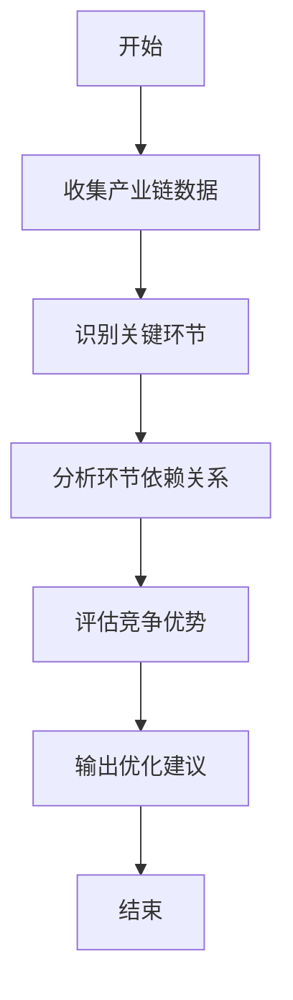
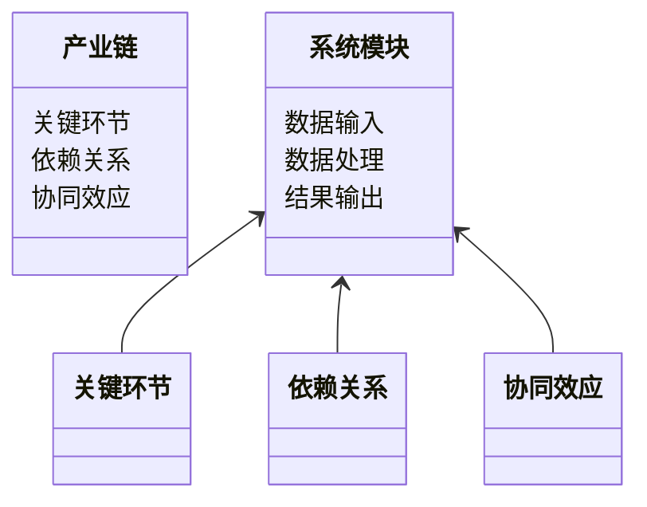
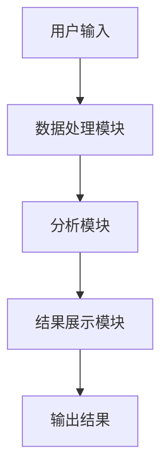

                 


# 费雪的产业链分析方法

## 关键词
产业链分析, 费雪方法, 系统架构, 技术分析, 行业研究

## 摘要
费雪的产业链分析方法是一种系统性地研究和优化产业链结构的方法，通过对产业链关键环节的分析和优化，提升企业竞争力和行业整体效率。本文从背景、核心概念、算法原理、系统架构、项目实战到最佳实践，全面解读费雪产业链分析方法，帮助读者掌握这一 powerful 的工具。

---

## 第一部分: 费雪的产业链分析方法概述

### 第1章: 产业链分析的基本概念

#### 1.1 产业链的基本定义
- **产业链的概念与内涵**: 产业链是指一系列相关产业和环节通过价值传递形成的链条，包括上游、中游和下游环节。
- **产业链的组成部分**: 通常包括原材料供应、生产制造、分销渠道和终端消费等环节。
- **产业链的分类与特点**: 可分为垂直型产业链（如汽车制造）和水平型产业链（如软件开发）。

#### 1.2 费雪分析方法的背景与起源
- **费雪分析方法的提出背景**: 20世纪初，英国经济学家约翰·梅纳德·凯恩斯的学生费雪（ Irving Fisher）提出了产业链分析方法，用于研究经济系统中各环节的相互关系。
- **费雪分析方法的核心思想**: 强调产业链的协同效应和关键环节的优化，通过分析产业链各环节的依赖关系，找到瓶颈并提出解决方案。
- **费雪分析方法的应用领域**: 广泛应用于制造业、信息技术、金融等行业。

---

### 第2章: 费雪产业链分析方法的核心思想

#### 2.1 产业链分析的核心要素
- **产业链的上下游关系**: 上游环节为中下游提供基础资源，下游环节为中上游提供市场反馈。
- **产业链的关键环节**: 中游环节通常是产业链的核心，直接影响整体效率。
- **产业链的协同效应**: 各环节协同工作，优化资源配置，提升整体效率。

#### 2.2 费雪分析方法的核心步骤
- **明确产业链的结构**: 绘制产业链图谱，识别关键环节。
- **分析产业链的关键环节**: 评估各环节的资源消耗、成本和效率。
- **评估产业链的竞争优势**: 通过比较分析，找到提升竞争力的突破口。

---

### 第3章: 产业链分析的意义与价值

#### 3.1 产业链分析对企业战略的意义
- **帮助企业识别竞争优势**: 通过分析产业链，企业可以找到自身的核心竞争力。
- **支持企业制定发展战略**: 优化产业链结构，提升整体竞争力。
- **优化企业资源配置**: 通过分析各环节的资源利用效率，降低浪费。

#### 3.2 费雪分析方法在行业研究中的应用
- **行业趋势分析**: 预测行业未来发展方向。
- **市场竞争分析**: 分析竞争对手的优劣势，制定竞争策略。
- **产业链整合与优化**: 提出整合上下游资源的建议，优化产业链结构。

---

## 第二部分: 费雪产业链分析方法的核心概念与联系

### 第4章: 产业链的结构与关键环节

#### 4.1 产业链的结构分析
- **产业链的垂直结构**: 从原材料到最终产品的垂直链条。
- **产业链的水平结构**: 同一价值链中的水平分工。
- **产业链的网络结构**: 各环节通过网络协同工作的复杂结构。

#### 4.2 产业链的关键环节分析
- **上游环节的重要性**: 提供基础资源，影响成本和供应稳定性。
- **中游环节的核心作用**: 承担生产制造或服务提供，直接影响效率。
- **下游环节的市场影响力**: 通过市场需求反馈，影响整个产业链的运作。

### 第5章: 核心概念与联系

#### 5.1 核心概念原理
- **产业链的协同效应**: 各环节协同工作，提升整体效率。
- **产业链的垂直整合**: 通过整合上下游资源，降低交易成本。
- **产业链的水平整合**: 通过水平分工，提高专业化程度。

#### 5.2 核心概念属性特征对比表格
```markdown
| 概念       | 属性特征           |
|------------|--------------------|
| 产业链      | 结构化、协同性     |
| 关键环节    | 核心性、决定性     |
| 竞争优势    | 可衡量性、可优化性 |
```

#### 5.3 ER实体关系图
```mermaid
erd
  entity 产业链 {
    <<产业链>>
    [环节A]
    [环节B]
    [环节C]
  }
  环节A -[依赖]-> 环节B
  环节B -[依赖]-> 环节C
```

---

## 第三部分: 费雪产业链分析方法的算法原理

### 第6章: 算法原理讲解

#### 6.1 算法流程图


#### 6.2 核心算法实现
```python
def fisher_analysis(产业链数据):
    关键环节 = []
    依赖关系 = {}
    for 环节 in 产业链数据:
        关键环节.append(环节)
        依赖关系[环节] = []
    for 上游环节, 下游环节 in 产业链数据:
        依赖关系[上游环节].append(下游环节)
    return 关键环节, 依赖关系

# 示例
产业链数据 = [
    ('原材料', '生产'),
    ('生产', '分销'),
    ('分销', '消费')
]
关键环节, 依赖关系 = fisher_analysis(产业链数据)
print("关键环节:",关键环节)
print("依赖关系:",依赖关系)
```

#### 6.3 数学模型与公式
- **线性回归模型**: 用于分析各环节的成本与效率关系。
  $$ y = \beta_0 + \beta_1 x + \epsilon $$
- **协同效应计算**: 通过协同系数衡量协同效果。
  $$ 协同系数 = \frac{总协同效应}{总成本} $$

---

## 第四部分: 系统分析与架构设计

### 第7章: 系统功能设计

#### 7.1 领域模型


#### 7.2 系统架构设计


---

## 第五部分: 项目实战

### 第8章: 实际案例分析

#### 8.1 环境安装
- 安装Python和相关库（如numpy、pandas）。
- 配置Jupyter Notebook。

#### 8.2 核心代码实现
```python
import numpy as np
import pandas as pd

def calculate_synergy(产业链数据):
    # 计算协同效应
    return np.mean(产业链数据)

# 示例数据
产业链数据 = pd.DataFrame({
    '环节': ['原材料', '生产', '分销'],
    '成本': [10, 20, 15],
    '效率': [80, 60, 70]
})

协同系数 = calculate_synergy(产业链数据)
print("协同系数:", 协同系数)
```

---

## 第六部分: 最佳实践

### 第9章: 小结与注意事项

#### 9.1 小结
- 费雪的产业链分析方法通过系统分析产业链结构，优化关键环节，提升整体效率。
- 通过实际案例和数学模型，帮助读者深入理解方法的应用。

#### 9.2 注意事项
- 数据收集的准确性和完整性直接影响分析结果。
- 依赖关系分析需要结合具体行业特点。
- 优化建议需考虑实际可行性和经济性。

### 第10章: 拓展阅读

#### 10.1 相关书籍
- 《产业链分析与优化》
- 《经济分析方法与应用》

#### 10.2 在线资源
- 费雪分析方法的学术论文
- 产业链优化的实践案例

---

## 结语
费雪的产业链分析方法是一种 powerful 的工具，能够帮助企业优化产业链结构，提升竞争力。通过本文的详细解读，读者可以掌握这一方法的核心思想和实际应用，为行业研究和企业管理提供 valuable 的指导。

