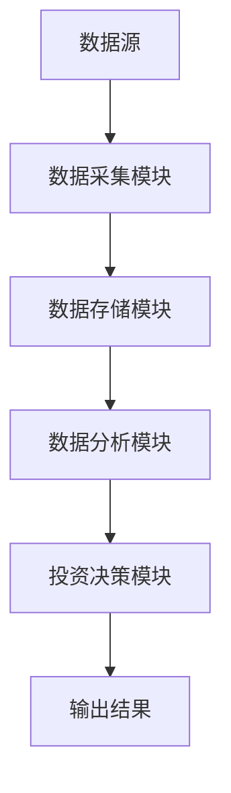
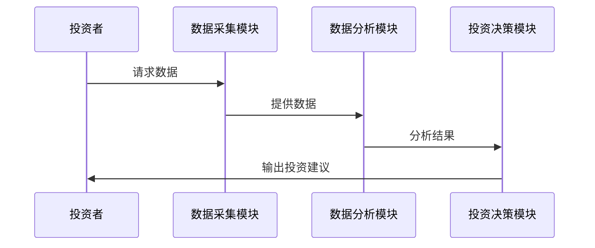

                 


# 费雪的产品生命周期分析在投资中的应用

---

## 关键词：
1. 产品生命周期
2. 费雪理论
3. 投资策略
4. 市场分析
5. 企业估值

---

## 摘要：
费雪的产品生命周期分析是一种经典的市场分析方法，能够帮助企业识别产品在其生命周期中的不同阶段，并据此制定相应的战略。本文将深入探讨如何将这一理论应用于投资领域，从产品的导入期、成长期、成熟期到衰退期，分析每个阶段的特点及其对投资决策的影响。通过结合数学模型和实际案例，本文为投资者提供了一套基于产品生命周期的系统化投资策略，帮助他们在不同市场环境下做出更明智的投资决策。

---

# 第一部分：产品生命周期分析的背景与基础

## 第1章：产品生命周期分析概述

### 1.1 产品生命周期的基本概念
#### 1.1.1 产品生命周期的定义
产品生命周期是指产品从进入市场到最终退出市场的全过程。这个过程通常分为四个阶段：导入期、成长期、成熟期和衰退期。

#### 1.1.2 产品生命周期的核心要素
- **时间维度**：产品在市场中的存在时间。
- **市场需求**：产品在不同阶段的市场接受程度。
- **竞争环境**：市场中竞争对手的数量和实力。
- **企业策略**：企业在不同阶段采取的市场推广、定价和研发投入策略。

#### 1.1.3 产品生命周期与投资的关系
产品生命周期的分析可以帮助投资者预测产品的市场表现，从而评估企业的盈利能力和发展潜力。

### 1.2 费雪的产品生命周期理论
#### 1.2.1 费雪理论的起源与背景
费雪的产品生命周期理论由美国市场分析师喬治·费雪（George Fisher）提出，主要基于对产品市场表现的深入研究。

#### 1.2.2 费雪理论的核心观点
- 产品在不同生命周期阶段的市场表现不同。
- 投资者可以通过分析产品的生命周期阶段，预测其未来的市场表现。

#### 1.2.3 费雪理论在投资中的应用
费雪理论为投资者提供了分析产品市场表现的工具，帮助他们在投资决策中考虑产品的生命周期阶段。

---

## 第2章：产品生命周期的阶段划分与特征

### 2.1 产品生命周期的四个阶段
#### 2.1.1 导入期：产品的市场引入与初期增长
- **定义**：产品首次进入市场，市场需求较低，市场竞争较小。
- **特点**：
  - 销量增长缓慢。
  - 市场认知度低。
  - 企业需要投入大量资源进行市场推广。

#### 2.1.2 成长期：市场需求的快速扩张
- **定义**：产品逐渐被市场接受，销量快速增长。
- **特点**：
  - 市场需求迅速增加。
  - 竞争对手开始进入市场。
  - 企业需要加大生产规模。

#### 2.1.3 成熟期：市场竞争的加剧与利润稳定
- **定义**：产品市场已经饱和，竞争非常激烈。
- **特点**：
  - 市场份额趋于稳定。
  - 利润率逐步下降。
  - 企业需要通过成本控制和创新维持利润。

#### 2.1.4 衰退期：市场需求的逐渐萎缩
- **定义**：产品逐渐被市场淘汰，市场需求急剧下降。
- **特点**：
  - 市场份额急剧下降。
  - 利润率大幅减少甚至为负。
  - 企业需要考虑退出市场或进行产品升级。

### 2.2 每个阶段的投资策略
#### 2.2.1 导入期的投资机会与风险
- **机会**：产品市场潜力大，早期投资可能获得高回报。
- **风险**：市场需求不确定，竞争风险较低，但产品成功概率难以预测。

#### 2.2.2 成长期的高增长潜力
- **机会**：市场需求快速增长，企业盈利能力和股价可能同步上升。
- **风险**：竞争加剧，企业可能面临利润率下降的风险。

#### 2.2.3 成熟期的稳定收益
- **机会**：市场稳定，企业可以通过成本控制和创新维持收益。
- **风险**：利润率逐步下降，企业需要不断创新或转型。

#### 2.2.4 衰退期的风险与退出策略
- **风险**：市场需求萎缩，企业可能面临亏损。
- **策略**：逐步退出市场或通过产品升级延长生命周期。

---

## 第3章：产品生命周期分析在投资中的应用

### 3.1 产品生命周期分析在投资中的重要性
#### 3.1.1 产品生命周期与企业盈利能力的关系
- 产品生命周期的不同阶段直接影响企业的盈利能力和增长潜力。

#### 3.1.2 产品生命周期对股价波动的影响
- 产品生命周期的分析可以帮助投资者预测股价的波动趋势。

#### 3.1.3 产品生命周期在行业分析中的作用
- 通过分析行业内的产品生命周期，投资者可以判断行业的整体发展趋势。

### 3.2 基于产品生命周期的投资策略
#### 3.2.1 寻找处于成长期的企业
- 投资处于成长期的企业，可以分享其快速增长的市场潜力。

#### 3.2.2 避免投资衰退期的行业
- 衰退期的行业风险较高，投资者应尽量避免投资。

#### 3.2.3 利用产品生命周期预测企业未来表现
- 通过分析产品的生命周期阶段，投资者可以预测企业的未来表现。

---

## 第4章：产品生命周期分析的数学模型与算法

### 4.1 产品生命周期指数模型
#### 4.1.1 模型定义
- 产品生命周期指数模型通过量化产品生命周期的不同阶段，评估企业的市场表现。

#### 4.1.2 模型公式
$$
\text{PLI} = \frac{\text{产品生命周期阶段}}{\text{平均生命周期}}
$$

#### 4.1.3 模型应用
- 通过计算产品生命周期指数，投资者可以量化企业的市场表现。

### 4.2 产品生命周期预测算法
#### 4.2.1 算法流程
1. 收集产品市场数据。
2. 分析产品生命周期阶段。
3. 预测未来市场表现。

#### 4.2.2 算法实现
```python
def product_life_cycle_analysis(data):
    import pandas as pd
    import numpy as np
    
    # 数据预处理
    df = pd.DataFrame(data)
    
    # 生命周期阶段划分
    df['阶段'] = df['销量'].apply(lambda x: '导入期' if x < np.mean(df['销量']) else '成长期')
    
    return df
```

---

## 第5章：产品生命周期分析的系统架构设计

### 5.1 系统功能设计
#### 5.1.1 数据采集模块
- 采集产品的市场数据，包括销量、价格、市场份额等。

#### 5.1.2 数据分析模块
- 分析产品生命周期阶段，预测未来市场表现。

#### 5.1.3 投资决策模块
- 根据分析结果，制定投资策略。

### 5.2 系统架构设计
#### 5.2.1 系统架构图


#### 5.2.2 系统交互图


---

## 第6章：项目实战

### 6.1 环境安装
- 安装Python和相关库（如pandas、numpy）。

### 6.2 核心代码实现
```python
import pandas as pd
import numpy as np

def classify_stage(data):
    # 数据预处理
    df = pd.DataFrame(data)
    mean_sales = df['销量'].mean()
    
    # 生命周期阶段划分
    df['阶段'] = df['销量'].apply(lambda x: '导入期' if x < mean_sales else '成长期')
    
    return df

# 示例数据
data = {
    '产品': ['Product A', 'Product B', 'Product C'],
    '销量': [100, 200, 150]
}

result = classify_stage(data)
print(result)
```

### 6.3 案例分析
- 分析某公司的产品数据，预测其生命周期阶段，并制定相应的投资策略。

---

## 第7章：总结与展望

### 7.1 总结
- 产品生命周期分析是投资决策中的重要工具，可以帮助投资者预测市场表现，制定合理的投资策略。

### 7.2 小结
- 通过分析产品的生命周期阶段，投资者可以更好地把握市场的脉动，做出更明智的投资决策。

### 7.3 注意事项
- 产品生命周期分析需要结合实际情况，避免过于机械地应用模型。

### 7.4 拓展阅读
- 建议阅读相关书籍和文献，深入了解产品生命周期分析的理论与实践。

---

# 结语
希望通过本文的分析，读者能够更好地理解费雪的产品生命周期分析在投资中的应用，并能够在实际投资中灵活运用这一方法，做出更明智的投资决策。

