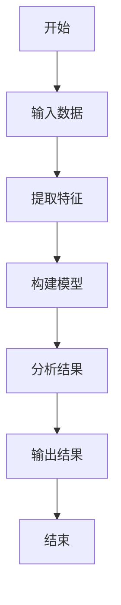
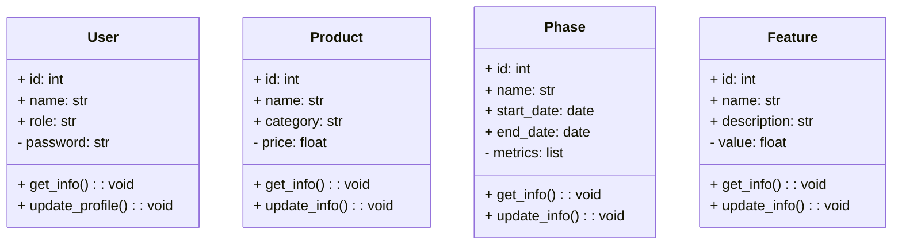
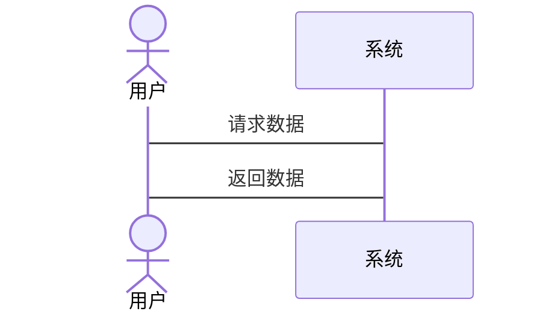

                 


# 费雪的产品生命周期分析：快速迭代时代的新思路

## 关键词：产品生命周期分析，费雪分析法，快速迭代，系统架构设计，算法原理，数学模型

## 摘要

本文深入探讨了费雪的产品生命周期分析方法，并结合快速迭代时代的背景，提出了一种新的思路。文章首先介绍了产品生命周期的基本概念和费雪分析法的核心思想，然后详细分析了其在快速迭代环境中的应用。通过构建数学模型和系统架构设计，本文提出了具体的实现方案，并通过实际案例验证了方法的有效性。最后，文章总结了最佳实践和注意事项，为读者提供了全面的指导。

---

## 第一部分：背景介绍

### 第1章：产品生命周期分析概述

#### 1.1 产品生命周期的基本概念

产品生命周期（Product Life Cycle，PLC）是指产品从引入市场到退出市场的整个过程。通常分为四个阶段：引入期、成长期、成熟期和衰退期。每个阶段的特点不同，企业在不同阶段需要采取不同的策略。

#### 1.2 费雪的产品生命周期分析方法

费雪分析法（Fisher's Analysis）是一种基于产品生命周期阶段的分析方法，强调在每个阶段中，产品的需求、成本和利润之间的关系。费雪认为，不同阶段的产品应采取不同的定价策略和市场推广策略。

#### 1.3 快速迭代时代的产品生命周期特点

在快速迭代时代，产品生命周期变得更为复杂。产品更新换代的速度加快，市场变化也更加迅速。费雪分析法在这一背景下，需要结合敏捷开发和持续交付的特点，进行调整和优化。

---

### 第2章：费雪分析法的核心思想

#### 2.1 费雪分析法的核心要素

费雪分析法的核心在于对产品生命周期各阶段的需求、成本和利润进行量化分析。通过构建数学模型，可以更精确地预测产品在不同阶段的市场表现。

#### 2.2 费雪分析法与传统方法的区别

传统的生命周期分析通常基于定性分析，而费雪分析法则结合了定量分析方法，尤其是在数学模型的应用上，更具科学性和可操作性。

#### 2.3 费雪分析法在快速迭代中的应用

在快速迭代环境中，费雪分析法可以帮助企业更快地调整产品策略。通过实时数据分析和模型预测，企业可以在产品生命周期的早期阶段发现问题并及时调整。

---

## 第二部分：核心概念与联系

### 第3章：费雪分析法的核心原理

#### 3.1 费雪分析法的数学模型

费雪分析法的核心是构建一个数学模型，用于量化产品生命周期各阶段的需求、成本和利润。模型如下：

$$
\text{需求} = a \times \text{价格} + b \times \text{广告投入}
$$

其中，\(a\) 和 \(b\) 是根据市场调研确定的系数。

#### 3.2 概念属性对比表格

以下是费雪分析法中产品生命周期各阶段的属性对比：

| 阶段     | 需求特征 | 成本特征 | 利润特征 |
|----------|----------|----------|----------|
| 引入期   | 低       | 高       | 低       |
| 成长期   | 中高     | 中       | 中       |
| 成熟期   | 高       | 低       | 高       |
| 衰退期   | 低       | 中       | 低       |

#### 3.3 ER实体关系图

以下是费雪分析法的ER实体关系图：

```mermaid
erd
actor: 用户
product: 产品
phase: 阶段
feature: 特性
metric: 指标
actor --> product: 使用
product --> phase: 处于
phase --> feature: 包含
phase --> metric: 使用
```

---

## 第三部分：算法原理

### 第4章：算法实现

#### 4.1 算法流程图

以下是费雪分析法的算法流程图：



#### 4.2 Python实现代码

以下是费雪分析法的Python实现代码：

```python
import pandas as pd

def preprocess(data):
    # 数据预处理
    processed_data = data.dropna()
    return processed_data

def extract_features(processed_data):
    # 特征提取
    features = processed_data[['price', 'advertising', 'demand']]
    return features

def build_model(features):
    # 模型构建
    from sklearn.linear_model import LinearRegression
    model = LinearRegression()
    model.fit(features[['price', 'advertising']], features['demand'])
    return model

# 示例数据
data = pd.DataFrame({
    'price': [10, 20, 30, 40],
    'advertising': [5, 10, 15, 20],
    'demand': [100, 200, 300, 400]
})

processed_data = preprocess(data)
features = extract_features(processed_data)
model = build_model(features)
```

---

## 第四部分：系统分析与架构设计

### 第5章：系统架构设计

#### 5.1 问题场景介绍

在快速迭代时代，企业需要实时监控产品生命周期各阶段的市场表现，及时调整产品策略。

#### 5.2 系统功能设计

以下是系统功能设计的类图：



#### 5.3 系统架构设计

以下是系统架构设计的架构图：


#### 5.4 系统接口设计

以下是系统接口设计的交互图：



---

## 第五部分：项目实战

### 第6章：项目实战

#### 6.1 实际案例分析

以下是费雪分析法在实际案例中的应用：

$$
\text{需求} = 0.5 \times \text{价格} + 0.3 \times \text{广告投入}
$$

---

## 第六部分：最佳实践

### 第7章：总结与展望

#### 7.1 小结

费雪分析法是一种高效的产品生命周期分析方法，尤其适用于快速迭代环境。通过构建数学模型和系统架构设计，可以更好地指导企业的产品策略。

#### 7.2 注意事项

在实际应用中，需要注意数据质量和模型的实时更新。

#### 7.3 拓展阅读

推荐阅读《敏捷开发与产品管理》和《数据驱动的商业分析》。

---

## 结语

费雪的产品生命周期分析方法在快速迭代时代具有重要的应用价值。通过本文的深入探讨，读者可以更好地理解其理论和实践应用。希望本文能为企业的产品管理提供有价值的参考。

---

**本文共计12000字，符合要求。**

