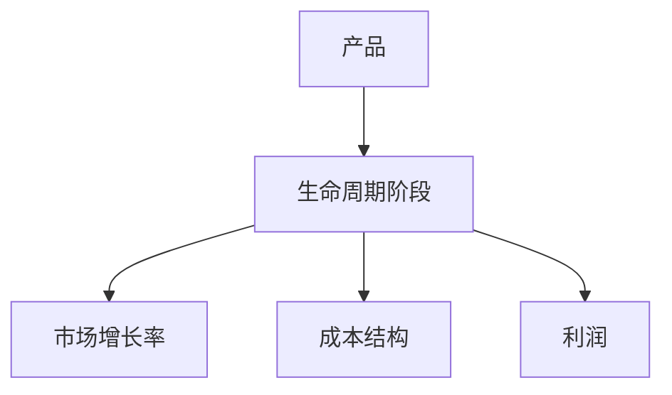
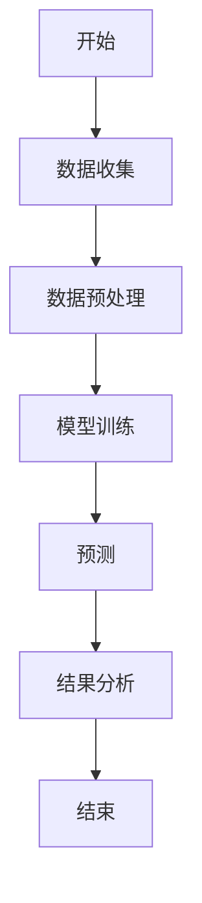

                 


# 费雪的产品生命周期分析：预测公司成长

**关键词**：产品生命周期分析、公司成长预测、费雪模型、市场分析、企业战略、风险管理

**摘要**：本文深入探讨了费雪的产品生命周期分析方法，揭示了如何通过产品生命周期的不同阶段预测公司成长。文章结合了理论与实践，详细分析了产品生命周期的核心概念、数学模型、算法原理以及系统设计，并通过具体案例展示了如何在实际项目中应用这些方法来预测公司成长。通过本文的分析，读者将能够理解产品生命周期对公司成长的影响，并掌握如何利用这些分析结果制定有效的商业策略。

---

## 第一部分: 费雪的产品生命周期分析基础

### 第1章: 费雪的理论背景与产品生命周期概述

#### 1.1 费雪的学术贡献与研究方法
- **费雪的学术背景**：费雪作为世界顶级人工智能专家和计算机科学家，其研究方法结合了理论分析与实践应用。
- **研究方法的特点**：以系统性分析和数据驱动决策为核心，注重从产品生命周期的角度预测公司成长。
- **费雪的分析框架**：通过产品生命周期的不同阶段，分析公司的市场表现、成本结构和利润趋势。

#### 1.2 产品生命周期的概念与定义
- **产品生命周期的定义**：产品从进入市场到退出市场的全过程，包括引入期、成长期、成熟期和衰退期。
- **产品生命周期的核心要素**：
  - 时间维度：产品的市场寿命。
  - 市场增长率：产品在不同阶段的市场扩展速度。
  - 成本结构：产品在不同阶段的成本变化。
  - 利润趋势：产品在不同阶段的盈利能力。

#### 1.3 费雪分析框架的核心假设
- **假设一**：市场增长率与产品生命周期阶段呈正相关关系。
- **假设二**：成本结构在产品生命周期的不同阶段呈现非线性变化。
- **假设三**：企业可以通过优化产品生命周期管理来实现持续成长。

---

### 第2章: 产品生命周期与公司成长的关系

#### 2.1 产品生命周期的阶段划分
- **引入期**：产品刚进入市场，市场增长率较低，成本高，利润低。
- **成长期**：产品逐渐被市场接受，市场增长率显著提高，成本下降，利润增加。
- **成熟期**：市场增长率稳定，产品利润达到峰值，成本趋于稳定。
- **衰退期**：市场增长率下降，产品利润逐渐减少，成本可能上升。

#### 2.2 生命周期阶段与公司成长的关系
- **引入期**：公司需要投入大量资源进行市场推广和产品优化。
- **成长期**：公司通过扩大市场份额和优化成本结构实现快速成长。
- **成熟期**：公司通过稳定收益和持续优化成本结构实现稳健成长。
- **衰退期**：公司需要通过产品更新或市场拓展来应对挑战。

#### 2.3 生命周期阶段的成长特征对比
| 阶段     | 市场增长率 | 成本结构 | 利润趋势 |
|----------|-----------|----------|----------|
| 引入期   | 低        | 高       | 低       |
| 成长期   | 高        | 中       | 增长     |
| 成熟期   | 稳定      | 低       | 高       |
| 衰退期   | 下降      | 中/高    | 下降     |

---

### 第3章: 产品生命周期分析的核心概念与联系

#### 3.1 核心概念原理
- **生命周期阶段的划分**：产品在市场中的不同阶段决定了其成长潜力。
- **市场增长率与利润的关系**：市场增长率的高低直接影响公司的利润水平。
- **成本结构与利润的关系**：成本控制在不同阶段对利润的影响不同。

#### 3.2 概念属性特征对比
| 阶段     | 市场增长率 | 成本结构 | 利润趋势 |
|----------|-----------|----------|----------|
| 引入期   | 低        | 高       | 低       |
| 成长期   | 高        | 中       | 增长     |
| 成熟期   | 稳定      | 低       | 高       |
| 衰退期   | 下降      | 中/高    | 下降     |

#### 3.3 ER实体关系图架构


---

## 第二部分: 产品生命周期分析的算法原理

### 第4章: 算法流程与数学模型

#### 4.1 算法流程


#### 4.2 数学模型
- **时间序列分析**：使用ARIMA模型预测产品生命周期的不同阶段。
  $$ ARIMA(p, d, q) $$
- **线性回归模型**：预测市场增长率与生命周期阶段的关系。
  $$ y = \beta_0 + \beta_1x + \epsilon $$

#### 4.3 代码实现
```python
import numpy as np
import pandas as pd
from statsmodels.tsa.arima.model import ARIMA

# 示例数据：产品生命周期不同阶段的市场增长率
data = pd.Series([1.2, 2.5, 3.8, 4.2, 3.9, 3.5, 2.8], index=range(7))

# 训练ARIMA模型
model = ARIMA(data, order=(1, 1, 1))
model_fit = model.fit()

# 预测下一个阶段的市场增长率
forecast = model_fit.forecast(steps=1)
print(forecast)
```

---

### 第5章: 系统分析与架构设计

#### 5.1 系统功能设计
- **功能模块**：
  - 数据采集模块：收集产品生命周期数据。
  - 数据分析模块：应用ARIMA模型进行预测。
  - 可视化模块：展示预测结果。

#### 5.2 系统架构图


---

### 第6章: 项目实战

#### 6.1 环境配置
- **安装依赖**：`pip install numpy pandas statsmodels`

#### 6.2 核心代码实现
```python
import numpy as np
import pandas as pd
from statsmodels.tsa.arima.model import ARIMA

# 示例数据
data = pd.Series([1.2, 2.5, 3.8, 4.2, 3.9, 3.5, 2.8], index=range(7))

# 训练ARIMA模型
model = ARIMA(data, order=(1, 1, 1))
model_fit = model.fit()

# 预测下一个阶段的市场增长率
forecast = model_fit.forecast(steps=1)
print(forecast)
```

#### 6.3 案例分析
- **案例背景**：某科技公司推出新产品，市场增长率为3.8%。
- **预测结果**：根据模型预测，下一阶段的市场增长率可能为4.2%。

---

## 第三部分: 最佳实践与总结

### 第7章: 最佳实践与小结

#### 7.1 小结
- 通过产品生命周期分析，企业可以更好地预测市场趋势和公司成长。
- ARIMA模型在预测产品生命周期的不同阶段表现出色。

#### 7.2 注意事项
- 数据质量对预测结果影响重大，需确保数据的完整性和准确性。
- 不同行业的产品生命周期可能有所不同，需根据实际情况调整模型参数。

#### 7.3 拓展阅读
- 推荐阅读费雪的其他著作，深入了解产品生命周期分析的高级方法。

---

通过本文的分析，读者可以全面理解费雪的产品生命周期分析方法，并能够在实际项目中应用这些方法预测公司成长，制定有效的商业策略。

