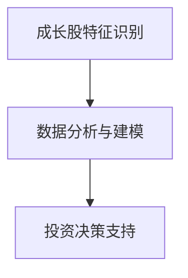
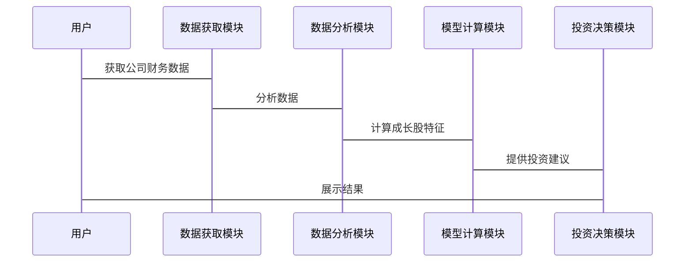

                 


# 费雪的优质成长股特征

## 关键词
- 费雪
- 成长股
- 投资特征
- 财务分析
- 投资策略

## 摘要
本文深入探讨了费雪提出的优质成长股特征，分析了其核心概念、数学模型及系统架构。通过案例分析和代码实现，展示了如何在实际投资中应用这些特征。本文旨在帮助投资者系统地识别和评估优质成长股，制定有效的投资策略。

---

# 第一部分: 费雪的优质成长股特征概述

## 第1章: 费雪投资理念与成长股背景

### 1.1 费雪的生平与投资理念
#### 1.1.1 费雪的生平简介
菲利普·费雪（Philip Fisher）是20世纪著名的投资专家，以提出“成长股”概念闻名。他强调长期投资和对公司基本面的深入分析，主张寻找那些收入和利润持续增长的公司。

#### 1.1.2 费雪的投资哲学与方法
费雪认为，成功的投资依赖于对公司的深入了解，尤其是其盈利能力、市场地位和竞争优势。他提倡买入优质成长股并长期持有。

#### 1.1.3 费雪与成长股投资的关联
费雪的工作为现代成长股投资奠定了基础，他的方法强调企业成长潜力和内在价值，而非短期市场波动。

### 1.2 成长股的定义与背景
#### 1.2.1 成长股的定义与特征
成长股是指那些收入和利润持续增长的公司股票，通常属于高增长行业，具有较高的市场占有率和竞争优势。

#### 1.2.2 成长股投资的历史发展
从费雪的时代到现在，成长股投资策略不断发展，但核心理念保持不变。

#### 1.2.3 成长股投资的现状与趋势
当前，成长股投资受到科技和创新企业的推动，成为许多投资者的首选。

---

## 第2章: 费雪的成长股特征分析

### 2.1 费雪成长股的核心特征
#### 2.1.1 收入持续增长
收入增长是成长股的核心特征，通常表现为收入年增长率高于行业平均水平。

#### 2.1.2 利润率稳步提升
利润率的提高表明公司管理效率和盈利能力增强。

#### 2.1.3 高ROE（净资产收益率）
高ROE表明公司有效利用资产创造利润，是成长股的重要特征。

#### 2.1.4 强大的竞争优势
竞争优势包括专利、品牌、技术壁垒等，确保公司在行业中的领先地位。

### 2.2 成长股特征对比分析
#### 2.2.1 不同类型成长股的特征对比
通过表格对比不同成长股类型的特征，例如科技成长股与消费成长股的区别。

#### 2.2.2 成长股与价值股的特征差异
成长股注重未来增长，价值股注重当前低估，两者在估值方法和投资策略上不同。

#### 2.2.3 成长股与周期股的特征差异
成长股具有持续增长潜力，而周期股受经济周期影响较大，波动性更强。

---

## 第3章: 费雪成长股特征的数学模型与分析

### 3.1 成长股特征的量化模型
#### 3.1.1 收入增长模型
通过收入增长率公式量化收入增长：
$$ 收入增长率 = \frac{收入_{n} - 收入_{n-1}}{收入_{n-1}} $$

#### 3.1.2 利润率增长模型
通过利润率增长率公式量化利润率增长：
$$ 利润率增长率 = \frac{利润_{n} - 利润_{n-1}}{利润_{n-1}} $$

#### 3.1.3 ROE增长模型
通过ROE公式量化公司盈利能力：
$$ ROE = \frac{净利润}{股东权益} $$

### 3.2 成长股特征的数学公式
#### 3.2.1 收入增长公式
$$ 收入增长 = \frac{收入_n - 收入_{n-1}}{收入_{n-1}} $$

#### 3.2.2 利润率增长公式
$$ 利润率增长 = \frac{利润_n - 利润_{n-1}}{利润_{n-1}} $$

#### 3.2.3 ROE增长公式
$$ ROE = \frac{净利润}{股东权益} $$

### 3.3 成长股特征的分析与应用
#### 3.3.1 成长股特征的分析方法
使用财务指标分析公司的收入、利润和ROE趋势，评估其成长潜力。

#### 3.3.2 成长股特征的应用场景
在投资决策中，结合公司基本面和市场趋势，选择具有持续增长潜力的公司。

#### 3.3.3 成长股特征的风险与机会
高增长带来高风险，需警惕行业周期和竞争压力。

---

## 第4章: 费雪成长股特征的系统架构设计

### 4.1 系统功能设计
#### 4.1.1 成长股特征识别模块
通过财务数据和市场表现识别符合费雪特征的公司。

#### 4.1.2 数据分析与建模模块
利用数学模型分析公司成长潜力，评估投资价值。

#### 4.1.3 投资决策支持模块
提供基于分析结果的投资建议，帮助投资者做出决策。

### 4.2 系统架构设计
#### 4.2.1 系统架构图（Mermaid）


### 4.3 系统接口设计
定义接口，实现数据获取、模型计算和结果展示。

### 4.4 系统交互流程（Mermaid）


---

## 第5章: 项目实战

### 5.1 环境安装
安装必要的软件和库，如Python、Pandas、Matplotlib等。

### 5.2 核心代码实现
#### 5.2.1 数据获取模块
使用API获取公司财务数据。

```python
import pandas as pd

def get_financial_data(company):
    # 获取数据并返回数据框
    pass
```

#### 5.2.2 数据分析模块
计算收入增长率和ROE。

```python
def calculate_growth Rates(data):
    growth_rate = (data['收入'][-1] - data['收入'][-2]) / data['收入'][-2]
    return growth_rate
```

#### 5.2.3 投资决策模块
评估公司是否符合成长股特征。

```python
def is_growthon(company_data):
    growth_rate = calculate_growth Rates(company_data)
    roe = company_data['ROE'][-1]
    return growth_rate > 0.1 and roe > 0.2
```

### 5.3 案例分析
分析某公司数据，判断其是否为优质成长股。

### 5.4 项目总结
总结项目实施过程，指出优缺点和改进建议。

---

## 第6章: 最佳实践与小结

### 6.1 最佳实践
选择成长股时，关注财务指标和行业趋势，分散投资降低风险。

### 6.2 小结
本文系统介绍了费雪的优质成长股特征，通过数学模型和系统架构设计，展示了如何在实际投资中应用这些特征。

### 6.3 注意事项
投资需谨慎，建议在专业指导下进行。

### 6.4 拓展阅读
推荐相关书籍和资源，供读者深入学习。

---

通过以上目录，读者可以系统地学习费雪的优质成长股特征，并将其应用于实际投资中，做出明智的投资决策。

