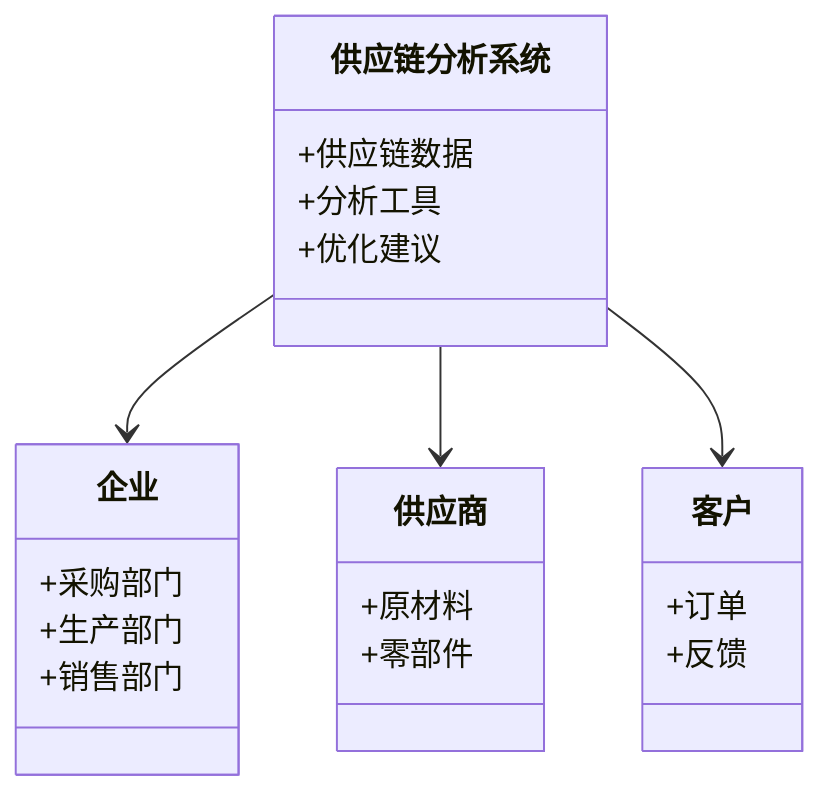
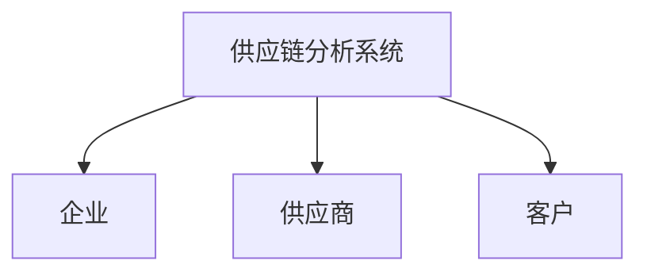
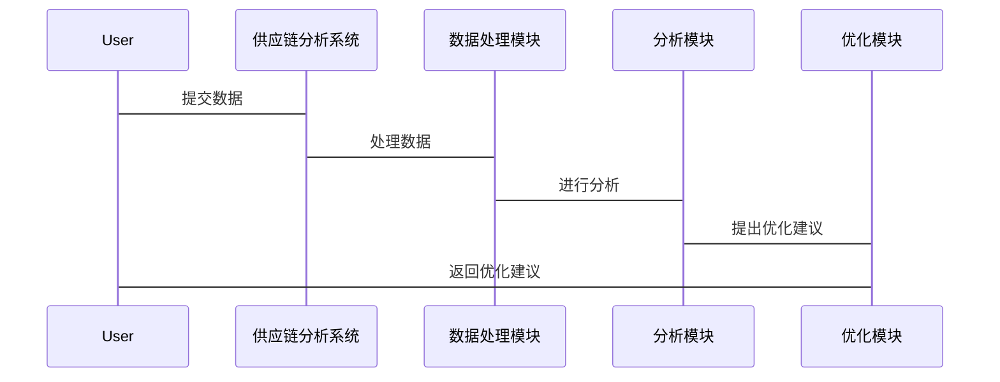

                 


# 费雪的供应链分析在投资中的应用

> 关键词：供应链分析，费雪分析法，投资分析，数学模型，系统架构设计

> 摘要：本文深入探讨了费雪的供应链分析方法在投资决策中的应用，结合理论分析和实际案例，详细介绍了供应链分析的核心概念、数学模型、系统架构设计以及项目实战。通过本文的学习，读者能够全面理解费雪分析法的原理和应用，掌握其在投资分析中的实际操作方法。

---

## 第一章: 供应链分析概述

### 1.1 供应链分析的定义与重要性

#### 1.1.1 供应链的基本概念
供应链是指从原材料采购到产品交付给最终用户的整个过程中的所有参与者和流程。它包括供应商、制造商、分销商、零售商以及消费者。供应链的高效运作是企业成功的关键，因为它直接影响成本、交货时间和产品质量。

#### 1.1.2 供应链在投资中的作用
在投资分析中，供应链分析可以帮助投资者评估企业的运营效率、成本控制能力以及应对市场变化的能力。通过分析供应链的各个环节，投资者可以识别潜在的风险和机会，从而做出更明智的投资决策。

#### 1.1.3 费雪分析法的核心思想
费雪分析法是一种基于供应链分析的投资方法，其核心思想是通过优化供应链的各个环节来提高企业的整体竞争力。这种方法强调从供应商选择、生产流程优化到物流管理的全面分析。

### 1.2 费雪分析法的背景与起源

#### 1.2.1 费雪投资理论的起源
费雪投资理论起源于20世纪，其核心思想是通过分析企业的基本面来评估其投资价值。费雪认为，企业的供应链是其核心竞争力的重要组成部分，因此在投资分析中必须给予高度重视。

#### 1.2.2 供应链分析在投资中的应用背景
随着全球化和信息化的发展，供应链管理成为企业竞争的关键领域。投资者开始意识到，一个高效、稳定的供应链能够为企业带来显著的成本优势和市场响应能力。

#### 1.2.3 费雪分析法的演变与发展
费雪分析法最初主要用于制造业，后来逐渐扩展到零售、物流等多个行业。随着技术的进步，费雪分析法也不断引入新的工具和方法，例如大数据分析和人工智能技术。

### 1.3 费雪供应链分析的核心要素

#### 1.3.1 供应链的关键环节
供应链的关键环节包括原材料采购、生产过程、库存管理、物流配送和客户服务。每个环节都可能影响企业的整体效率和成本。

#### 1.3.2 供应链分析的指标体系
常用的供应链分析指标包括交货时间、库存周转率、采购成本、物流费用等。这些指标可以帮助投资者全面评估企业的供应链绩效。

#### 1.3.3 费雪分析法的逻辑框架
费雪分析法的逻辑框架包括以下几个步骤：
1. 确定供应链的关键节点
2. 收集和分析供应链数据
3. 识别潜在的问题和机会
4. 提出优化建议并实施

---

## 第二章: 费雪分析法的理论基础

### 2.1 投资分析的基本原理

#### 2.1.1 投资分析的核心概念
投资分析的核心概念包括资产回报率（ROE）、资产周转率、净利润率等。这些指标可以帮助投资者评估企业的盈利能力。

#### 2.1.2 投资分析的常见方法
常见的投资分析方法包括基本面分析、技术分析和情景分析。费雪分析法是一种基于基本面分析的方法，特别关注企业的供应链管理。

#### 2.1.3 费雪分析法的独特性
费雪分析法的独特性在于其将供应链分析纳入投资决策过程，强调从供应链的角度优化企业的运营效率。

### 2.2 供应链分析的数学模型

#### 2.2.1 供应链分析的基本公式
供应链分析的基本公式包括：
- 总成本 = 采购成本 + 生产成本 + 物流成本 + 库存成本
- 交货时间 = 生产时间 + 物流时间

#### 2.2.2 费雪分析法的数学模型
费雪分析法的数学模型可以表示为：
$$
\text{投资价值} = \text{供应链效率} \times \text{资产回报率} \times \text{市场潜力}
$$

#### 2.2.3 案例分析：某制造企业的供应链优化
假设某制造企业通过优化供应链减少了10%的采购成本，同时提高了20%的生产效率。根据上述公式，其投资价值将显著提高。

### 2.3 费雪分析法与传统投资分析的对比

#### 2.3.1 传统投资分析方法的优缺点
传统投资分析方法的优点是简单易懂，缺点是忽视了企业的内部运营效率。

#### 2.3.2 费雪分析法的创新点
费雪分析法的创新点在于其将供应链分析纳入投资决策过程，帮助企业识别和优化内部运营效率。

#### 2.3.3 两种方法的结合与应用
将传统投资分析方法与费雪分析法相结合，可以在宏观和微观两个层面上全面评估企业的投资价值。

---

## 第三章: 费雪供应链分析的核心步骤

### 3.1 确定供应链的关键节点

#### 3.1.1 供应链节点的识别方法
供应链节点的识别方法包括：
1. 确定企业的核心业务流程
2. 识别关键供应商和客户
3. 分析内部部门的协作关系

#### 3.1.2 关键节点的选择标准
关键节点的选择标准包括：
- 对企业整体效率影响大的环节
- 易发生瓶颈的环节
- 易受外部因素影响的环节

#### 3.1.3 案例分析：某制造企业的供应链节点识别
某制造企业通过分析生产流程，识别出原材料采购和物流配送是其供应链中的关键节点。

### 3.2 供应链数据的收集与处理

#### 3.2.1 数据收集的渠道与方法
数据收集的渠道包括：
- 企业内部数据
- 行业报告
- 市场调研

#### 3.2.2 数据清洗与预处理
数据清洗与预处理包括：
- 去除重复数据
- 填补缺失数据
- 标准化数据

#### 3.2.3 数据分析工具的使用
常用的数据分析工具包括Excel、Python、R等。

### 3.3 供应链分析的数学建模

#### 3.3.1 数学模型的构建
数学模型的构建包括：
1. 确定变量
2. 建立方程
3. 验证模型

#### 3.3.2 模型的验证与优化
模型的验证与优化包括：
- 用实际数据验证模型的准确性
- 根据验证结果调整模型参数

#### 3.3.3 案例分析：某零售企业的供应链优化
某零售企业通过建立数学模型，优化了其供应链中的库存管理和物流配送，显著降低了成本。

---

## 第四章: 费雪分析法的系统架构设计

### 4.1 问题场景介绍

#### 4.1.1 问题背景
某企业希望通过优化供应链来提高其投资价值。

#### 4.1.2 问题描述
企业的供应链存在采购成本高、库存积压严重的问题。

#### 4.1.3 问题解决
通过费雪分析法，帮助企业识别和优化供应链中的关键环节。

### 4.2 系统功能设计

#### 4.2.1 领域模型类图


#### 4.2.2 系统架构图


#### 4.2.3 系统接口设计
系统接口设计包括：
- 数据输入接口
- 数据输出接口
- 用户界面接口

#### 4.2.4 系统交互流程图


---

## 第五章: 项目实战

### 5.1 环境配置

#### 5.1.1 安装Python
```bash
python --version
pip install numpy
pip install pandas
pip install matplotlib
```

#### 5.1.2 安装数据分析工具
```bash
pip install scikit-learn
pip install seaborn
```

### 5.2 核心代码实现

#### 5.2.1 数据爬取与处理
```python
import requests
from bs4 import BeautifulSoup

url = 'https://example.com/supplier_data'
response = requests.get(url)
soup = BeautifulSoup(response.text, 'html.parser')
data = []
for row in soup.find_all('tr'):
    cols = row.find_all('td')
    data.append([col.text for col in cols])
print(data)
```

#### 5.2.2 数据分析与建模
```python
import pandas as pd
import numpy as np

df = pd.DataFrame(data)
X = df.drop('target', axis=1)
y = df['target']
from sklearn.model_selection import train_test_split
X_train, X_test, y_train, y_test = train_test_split(X, y, test_size=0.2)
from sklearn.linear_model import LinearRegression
model = LinearRegression()
model.fit(X_train, y_train)
print(model.score(X_test, y_test))
```

#### 5.2.3 结果可视化
```python
import matplotlib.pyplot as plt

plt.scatter(X_test, y_test, color='blue')
plt.plot(X_test, model.predict(X_test), color='red')
plt.xlabel('X')
plt.ylabel('y')
plt.show()
```

### 5.3 案例分析与解读

#### 5.3.1 案例分析
以某制造企业的供应链优化为例，通过上述代码实现数据分析和建模，帮助企业识别供应链中的瓶颈环节，并提出优化建议。

#### 5.3.2 结果解读
通过分析结果，可以识别出采购成本是供应链中的主要成本来源，并提出优化建议，例如选择更可靠的供应商或优化采购流程。

---

## 结论

通过本文的学习，读者可以全面了解费雪供应链分析在投资中的应用，掌握其核心概念、数学模型和系统架构设计。费雪分析法的独特性在于其将供应链分析纳入投资决策过程，帮助企业优化内部运营效率，提高投资价值。未来，随着技术的进步，费雪分析法将更加智能化和数据化，为企业创造更大的价值。

---

**注意事项：**
1. 数据分析时，确保数据的准确性和完整性。
2. 优化建议的实施需要结合企业的实际情况。
3. 定期监控和评估供应链的绩效，及时调整分析模型。

---

**拓展阅读：**
1. 《供应链管理：原理与应用》
2. 《投资学基础》
3. 《数据分析实战》

通过本文的学习和实践，读者可以将费雪供应链分析方法应用于实际投资决策中，提升企业的竞争力和投资价值。

