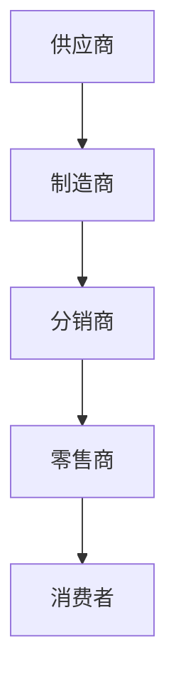
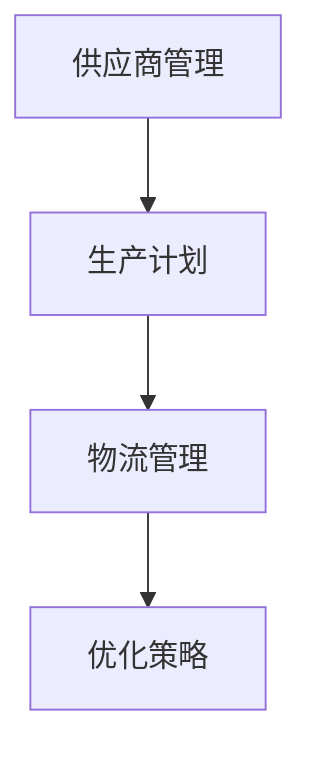

                 


# 费雪的供应链分析：了解公司在产业链中的地位

---

## 关键词：
供应链分析, 费雪分析法, 企业定位, 供应链效率, 供应链成本

---

## 摘要：
供应链分析是企业在竞争激烈的市场环境中取得优势的关键工具。本文将深入探讨费雪的供应链分析方法，分析公司在产业链中的定位与竞争优势，揭示如何通过优化供应链结构提升企业效率和降低成本。文章从供应链的基本概念出发，结合数学模型和实际案例，详细阐述费雪分析法的原理、应用和实践价值。

---

## 第一部分: 供应链分析的核心概念

### 第1章: 供应链分析的核心概念

#### 1.1 供应链的基本定义与范围
供应链是指从原材料采购到产品交付给最终用户的整个过程中的所有相关企业和环节的网络。它包括供应商、制造商、分销商和消费者等多个环节。供应链的范围不仅限于企业的内部生产过程，还包括与外部合作伙伴的协作。

**核心概念对比表：**

| 概念 | 定义 | 特性 |
|------|------|------|
| 供应商 | 提供原材料或服务的企业 | 提供支持，影响生产成本 |
| 制造商 | 生产产品的主体 | 决定生产效率和产品质量 |
| 分销商 | 负责产品销售和配送的渠道 | 影响市场覆盖和客户满意度 |

#### 1.2 费雪的供应链分析方法
费雪的供应链分析方法是一种系统性的分析工具，旨在通过优化供应链的各个环节来提升企业的竞争力。其核心在于识别关键环节，分析其对整体效率和成本的影响，并提出优化策略。

**费雪分析法的原理：**
- **系统性分析**：将供应链视为一个整体系统，关注各环节之间的联系和协同。
- **关键环节优化**：通过分析找出对整体效率影响最大的环节进行优化。
- **数据驱动决策**：利用数据和模型进行预测和优化，而非仅依赖经验判断。

#### 1.3 供应链分析的重要性
供应链分析对于企业制定战略决策至关重要。通过分析供应链的效率和成本，企业可以优化资源配置，降低成本，提升产品交付速度和质量，从而增强市场竞争力。

---

## 第二部分: 供应链的结构与关键环节

### 第2章: 供应链的结构与关键环节

#### 2.1 供应链的整体结构
供应链的结构通常包括以下几个部分：
1. **供应商**：提供原材料或零部件的企业。
2. **制造商**：负责将原材料转化为最终产品的工厂。
3. **分销商**：将产品分发到各个销售渠道的企业。
4. **零售商**：直接面向消费者的销售终端。
5. **消费者**：最终产品或服务的使用方。

**供应链结构图：**



#### 2.2 供应链的关键环节分析
供应链的关键环节包括供应商管理、生产过程控制和分销渠道优化。

**供应商管理：**
- 建立长期合作关系，确保原材料供应的稳定性。
- 通过议价能力降低采购成本。

**生产过程控制：**
- 优化生产流程，减少浪费。
- 引入自动化技术提高生产效率。

**分销渠道优化：**
- 选择合适的分销渠道，缩短配送时间。
- 利用数据分析优化库存管理。

#### 2.3 供应链的效率与成本平衡
供应链效率的提升通常伴随着成本的降低，但这两者之间存在一定的平衡关系。企业需要在效率和成本之间找到最佳平衡点，以实现整体供应链的优化。

**供应链效率与成本平衡模型：**


---

## 第三部分: 公司在供应链中的定位与竞争优势

### 第3章: 公司在供应链中的定位与竞争优势

#### 3.1 公司在供应链中的定位
公司在供应链中的定位决定了其在整个供应链中的角色和影响力。以下是几种常见的定位方式：

1. **供应商定位**：公司作为原材料或零部件的供应商，直接影响制造商的生产成本。
2. **制造商定位**：公司作为产品的生产者，负责将原材料转化为最终产品。
3. **分销商定位**：公司作为产品的分发渠道，负责将产品送达零售商或最终消费者。

**公司定位与角色对比图：**


#### 3.2 供应链中的竞争优势分析
在供应链中，公司的竞争优势主要体现在以下几个方面：

1. **成本优势**：通过优化采购和生产流程，降低整体成本。
2. **质量优势**：提供高质量的产品，增强市场竞争力。
3. **服务优势**：提供优质的售后服务，提升客户满意度。

**竞争优势分析表格：**

| 优势 | 描述 | 示例 |
|------|------|------|
| 成本优势 | 通过优化供应链降低成本 | 通过议价能力降低采购成本 |
| 质量优势 | 提供高质量的产品 | 通过严格的质量控制确保产品品质 |
| 服务优势 | 提供优质的售后服务 | 提供快速的物流和客户支持 |

#### 3.3 公司核心竞争力的构建
公司核心竞争力的构建需要从以下几个方面入手：

1. **优化供应链结构**：通过分析供应链的关键环节，优化资源配置。
2. **引入先进技术**：利用自动化和信息化技术提升生产效率。
3. **建立长期合作关系**：与供应商和分销商建立稳定的合作关系。

---

## 第四部分: 供应链分析的数学模型与方法

### 第4章: 供应链分析的数学模型与方法

#### 4.1 供应链分析的基本模型
供应链分析的基本模型包括成本模型、效率模型和风险模型。

**成本模型：**
$$ \text{总成本} = \text{采购成本} + \text{生产成本} + \text{物流成本} $$

**效率模型：**
$$ \text{供应链效率} = \frac{\text{产品交付速度}}{\text{生产周期}} $$

**风险模型：**
$$ \text{供应链风险} = \text{供应中断概率} \times \text{潜在损失} $$

#### 4.2 费雪分析法的数学公式
费雪分析法的核心公式用于评估供应链的整体效率。

**费雪效率指数：**
$$ E = \frac{\sum_{i=1}^{n} \text{环节效率}_i}{n} $$

**环节效率计算：**
$$ \text{环节效率}_i = \frac{\text{环节产出}}{\text{环节投入}} $$

#### 4.3 供应链分析的案例计算
以某制造企业为例，分析其供应链效率和成本优化。

**案例分析：**
- **采购成本**：$100,000
- **生产成本**：$200,000
- **物流成本**：$50,000

**总成本**：
$$ \text{总成本} = 100,000 + 200,000 + 50,000 = 350,000 $$

**环节效率计算：**
- **采购环节效率**：$$ \frac{100,000}{100,000} = 1 $$
- **生产环节效率**：$$ \frac{200,000}{150,000} = 1.333 $$
- **物流环节效率**：$$ \frac{50,000}{40,000} = 1.25 $$

**整体效率指数**：
$$ E = \frac{1 + 1.333 + 1.25}{3} = 1.211 $$

---

## 第五部分: 供应链系统的架构与实现

### 第5章: 供应链系统的架构与实现

#### 5.1 供应链系统的整体架构
供应链系统的整体架构包括以下几个部分：

1. **数据采集层**：负责收集供应链各环节的数据。
2. **数据处理层**：对数据进行清洗、转换和存储。
3. **分析层**：利用数据分析工具对数据进行深度分析。
4. **决策层**：根据分析结果制定优化策略。

**供应链系统架构图：**


#### 5.2 供应链系统的功能模块
供应链系统的主要功能模块包括：

1. **供应商管理模块**：负责供应商的评估和管理。
2. **生产计划模块**：制定生产计划并监控执行情况。
3. **物流管理模块**：优化物流路径和配送时间。

**功能模块图：**



#### 5.3 供应链系统的实现
通过引入信息化技术，企业可以实现供应链的智能化管理。以下是实现供应链系统的主要步骤：

1. **数据采集**：利用物联网技术采集供应链各环节的数据。
2. **数据分析**：利用大数据分析工具对数据进行深度分析。
3. **优化决策**：根据分析结果制定优化策略。

**供应链系统实现流程图：**


---

## 第六部分: 项目实战与最佳实践

### 第6章: 项目实战与最佳实践

#### 6.1 项目环境安装
为了实现供应链系统的优化，企业需要安装以下软件和工具：

1. **数据库**：MySQL
2. **数据分析工具**：Python（Pandas, NumPy）
3. **可视化工具**：Matplotlib, Seaborn

#### 6.2 系统核心实现
以下是供应链系统的核心实现代码：

```python
import pandas as pd
import numpy as np

# 数据采集
data = pd.read_csv('supply_chain_data.csv')

# 数据处理
data_cleaned = data.dropna()

# 数据分析
cost_efficiency = data_cleaned['cost'] / data_cleaned['efficiency']
cost_efficiency_mean = cost_efficiency.mean()

# 优化策略
if cost_efficiency_mean > 0.8:
    print("优化策略：降低采购成本")
else:
    print("优化策略：提高生产效率")
```

#### 6.3 实际案例分析
以某制造企业为例，分析其供应链效率和成本优化。

**案例分析：**
- **采购成本**：$100,000
- **生产成本**：$200,000
- **物流成本**：$50,000

**优化策略：**
$$ \text{成本优化潜力} = \frac{\text{总成本}}{\text{优化目标}} $$

---

## 第七部分: 总结与展望

### 第7章: 总结与展望

#### 7.1 最佳实践 tips
- 定期评估供应链效率，及时发现问题并进行优化。
- 引入先进技术，如物联网和大数据分析，提升供应链的智能化水平。
- 建立与合作伙伴的长期合作关系，确保供应链的稳定性。

#### 7.2 小结
供应链分析是企业在竞争激烈的市场环境中取得优势的关键工具。通过优化供应链的各个环节，企业可以降低成本、提升效率，并增强市场竞争力。

#### 7.3 注意事项
- 在实施供应链优化时，需要充分考虑各环节的协同效应。
- 定期对供应链系统进行维护和更新，确保其持续优化。

#### 7.4 拓展阅读
- 《供应链管理：策略与实践》
- 《费雪分析法在企业中的应用》

---

通过以上步骤，我们全面分析了费雪的供应链分析方法，并探讨了公司在产业链中的定位与竞争优势。希望本文能够为读者在供应链分析领域提供有价值的见解和实践指导。

