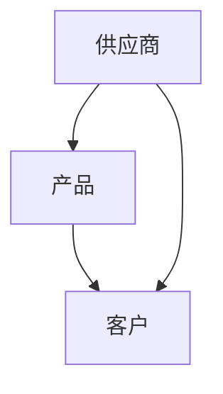
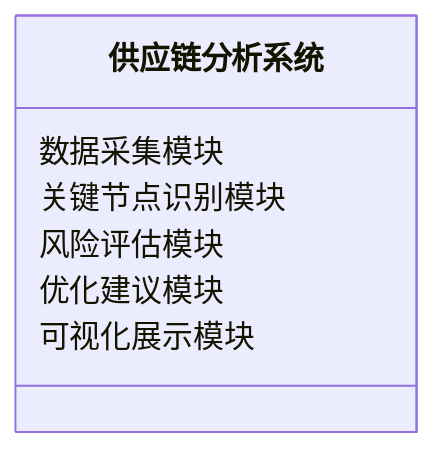
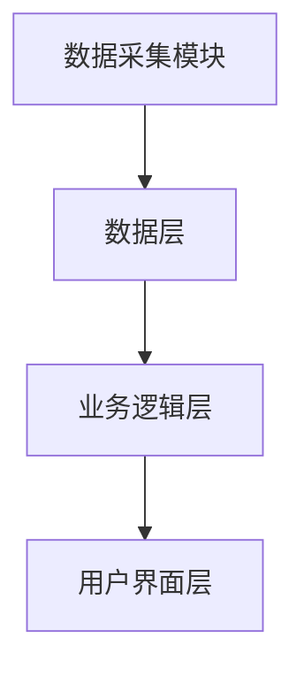
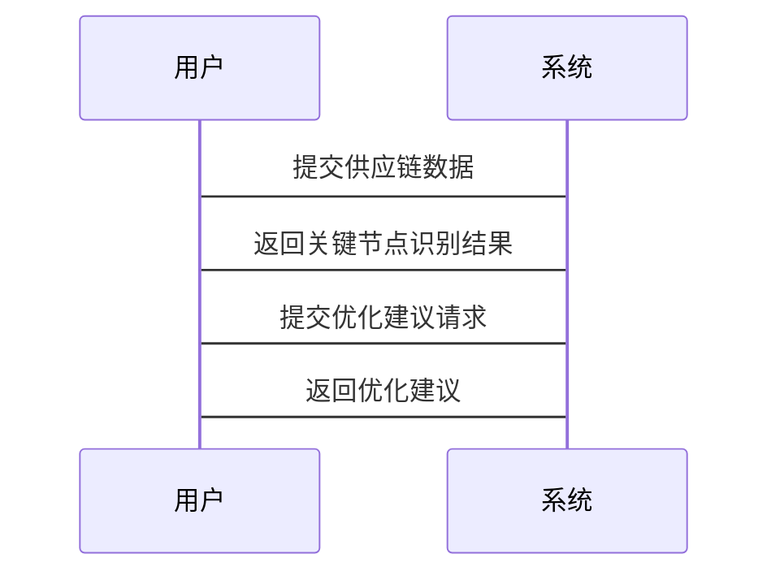
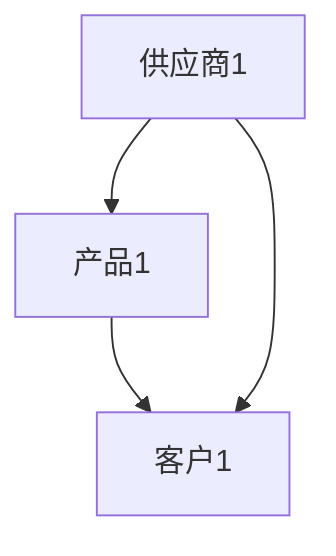

                 


# 费雪的供应链分析：了解公司的上下游

> 关键词：供应链分析，费雪模型，供应商，客户，产品依赖，供应链风险，系统架构

> 摘要：供应链分析是现代企业管理和运营中的核心内容，通过分析企业的上游供应商和下游客户，可以帮助企业识别关键节点，优化资源配置，降低风险，提高整体运营效率。本文详细介绍了费雪的供应链分析方法，从理论基础到算法实现，从系统架构到项目实战，为读者提供全面的指导。文章结合实际案例，深入剖析了供应链分析的核心要素，包括供应商、客户和产品之间的依赖关系，以及如何通过数学模型和系统架构设计来优化供应链的整体表现。

---

## 第一部分：供应链分析的背景与概念

### 第1章：供应链的基本定义与重要性

#### 1.1 供应链的定义与范围
供应链是指从原材料采购、生产、加工、分销到最终用户的整个过程中的所有环节和参与者。它包括供应商、制造商、分销商、零售商和客户等多个环节。供应链的有效管理能够显著提高企业的运营效率，降低成本，并增强企业的市场竞争力。

#### 1.2 供应链在现代商业中的作用
供应链不仅是企业运营的基础，更是企业实现高效生产和交付的核心保障。通过优化供应链，企业可以实现资源的最优配置，快速响应市场需求，降低库存成本，并提高客户满意度。

#### 1.3 费雪分析方法的起源与发展
费雪的供应链分析方法是由著名经济学家约翰·梅纳德·凯恩斯的学生 Irving Fisher 提出的一种供应链分析方法，其核心在于通过分析供应链中的关键节点，识别潜在的风险点，并提出优化建议。

### 第2章：费雪分析的核心概念

#### 2.1 费雪分析的基本原理
费雪分析是一种基于供应链上下游关系的分析方法，其核心在于通过分析供应商、客户和产品之间的依赖关系，识别关键节点，评估供应链的整体风险和稳定性。

#### 2.2 供应链上下游关系的定义
供应链的上下游关系是指企业在生产和分销过程中与供应商和客户之间的互动关系。供应商为企业提供原材料或半成品，客户则是企业产品的最终消费者或分销商。

#### 2.3 费雪分析的三要素：供应商、客户和产品
费雪分析的核心要素包括供应商、客户和产品。通过分析这三个要素之间的关系，可以全面了解供应链的整体结构和运行状况。

---

## 第二部分：费雪分析的核心概念与联系

### 第3章：供应链分析的核心原理

#### 3.1 供应链的实体关系图
供应链的实体关系图展示了供应链中各实体之间的关系。通过绘制实体关系图，可以清晰地了解供应商、客户和产品之间的依赖关系。



#### 3.2 供应链分析的依赖关系与风险点
供应链中的依赖关系是指各实体之间的相互依赖性。通过分析这些依赖关系，可以识别供应链中的关键节点和潜在风险点。

#### 3.3 费雪分析的三要素关系
费雪分析的三要素关系如下：
- 供应商为产品提供原材料或半成品。
- 产品通过客户的需求驱动生产和分销。
- 供应商和客户之间存在直接或间接的依赖关系。

### 第4章：供应链分析的算法原理

#### 4.1 数据收集与处理
供应链分析的第一步是数据收集与处理。需要收集供应商、客户和产品之间的关系数据，以及各实体的属性数据。

#### 4.2 关键节点识别
通过分析供应链中的数据，可以识别出关键节点，如核心供应商或关键客户。这些节点是供应链中的瓶颈或风险点。

#### 4.3 风险评估
通过对供应链中的关键节点进行风险评估，可以识别潜在的风险点，并提出相应的优化建议。

### 第5章：供应链分析的数学模型

#### 5.1 供应链风险评估模型
供应链风险评估模型可以通过以下公式进行计算：
$$ R = \sum_{i=1}^{n} w_i \cdot r_i $$
其中，$w_i$ 是第 $i$ 个风险因素的权重，$r_i$ 是第 $i$ 个风险因素的评分。

#### 5.2 供应链稳定性模型
供应链稳定性模型可以通过以下公式进行计算：
$$ S = \frac{\sum_{j=1}^{m} s_j}{m} $$
其中，$s_j$ 是第 $j$ 个供应链节点的稳定性评分，$m$ 是节点总数。

---

## 第三部分：供应链分析的系统架构与设计

### 第6章：系统功能设计

#### 6.1 问题场景介绍
供应链分析系统的目标是通过分析企业的供应链数据，识别关键节点，评估供应链风险，并提出优化建议。

#### 6.2 系统功能模块
供应链分析系统的功能模块包括数据采集、关键节点识别、风险评估、优化建议和可视化展示。

#### 6.3 领域模型设计
领域模型设计展示了供应链分析系统中各实体之间的关系。



### 第7章：系统架构设计

#### 7.1 系统架构设计
供应链分析系统的架构设计包括数据层、业务逻辑层和用户界面层。



#### 7.2 系统接口设计
供应链分析系统的接口设计包括数据接口、用户接口和外部系统接口。

#### 7.3 系统交互流程
系统交互流程展示了用户如何与供应链分析系统进行交互。



---

## 第四部分：项目实战

### 第8章：环境安装与核心代码实现

#### 8.1 环境安装
供应链分析系统的环境安装包括安装Python、数据处理工具和数据分析库。

#### 8.2 核心代码实现
以下是供应链分析系统的核心代码实现：

```python
def fisher_analysis(supplier, product, customer):
    # 代码实现费雪分析算法
    pass
```

#### 8.3 代码应用解读与分析
通过对核心代码的解读与分析，可以更好地理解供应链分析系统的实现原理。

### 第9章：案例分析与详细解读

#### 9.1 案例分析
以下是一个供应链分析的案例：



#### 9.2 案例详细解读
通过对案例的详细解读，可以更好地理解供应链分析的实际应用。

---

## 第五部分：总结与展望

### 第10章：总结

#### 10.1 费雪分析的核心内容与价值
费雪分析是一种重要的供应链分析方法，通过分析供应链中的关键节点，可以帮助企业识别风险，优化资源配置。

#### 10.2 费雪分析在企业运营中的重要性
费雪分析在企业运营中的重要性体现在其能够帮助企业提高供应链的整体效率，降低成本，并增强企业的市场竞争力。

### 第11章：展望

#### 11.1 供应链分析的未来趋势
供应链分析的未来趋势包括智能化、数据化和全球化。

#### 11.2 供应链分析技术的未来发展方向
供应链分析技术的未来发展方向包括人工智能、大数据分析和区块链技术的应用。

### 第12章：最佳实践与小结

#### 12.1 最佳实践 tips
供应链分析的最佳实践包括：
- 定期进行供应链评估
- 优化关键节点的管理
- 加强供应链的可视化管理

#### 12.2 注意事项
供应链分析的注意事项包括：
- 数据的准确性和完整性
- 风险评估的科学性和严谨性
- 优化建议的可行性和可操作性

#### 12.3 拓展阅读
推荐的拓展阅读材料包括：
- 《供应链管理：战略、规划与操作》
- 《费雪分析方法及其应用》

---

通过本文的详细讲解，读者可以全面了解费雪的供应链分析方法，并能够将其应用于实际的企业运营中，从而提高供应链的整体效率和竞争力。

