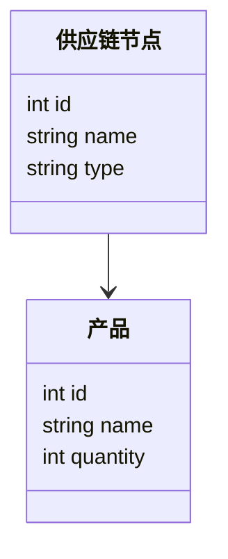

                 


# 费雪的供应链分析：全球化重构下的新思路

---

## 关键词：  
费雪供应链分析、全球化重构、供应链优化、算法原理、系统架构、项目实战、数学模型

---

## 摘要：  
本文将深入探讨费雪供应链分析方法在全球化重构背景下的新思路。通过分析供应链的核心概念、算法原理、系统架构以及实际案例，我们将揭示如何利用费雪方法优化供应链管理，应对全球化带来的挑战。文章内容涵盖背景介绍、核心概念、算法实现、系统设计以及项目实战，旨在为读者提供全面且深入的技术视角。

---

## 目录

1. [背景介绍](#背景介绍)  
   1.1 供应链的基本概念  
   1.2 全球化重构的背景与挑战  
   1.3 费雪供应链分析方法的演变  

2. [核心概念与联系](#核心概念与联系)  
   2.1 费雪分析方法的原理  
   2.2 核心概念的属性对比表  
   2.3 ER实体关系图架构  

3. [算法原理讲解](#算法原理讲解)  
   3.1 算法原理的数学模型  
   3.2 算法的实现与代码示例  
   3.3 数学公式与模型推导  

4. [系统分析与架构设计](#系统分析与架构设计)  
   4.1 问题场景介绍  
   4.2 系统功能设计  
   4.3 系统架构设计  
   4.4 系统接口设计  
   4.5 系统交互设计  

5. [项目实战](#项目实战)  
   5.1 环境安装与配置  
   5.2 核心代码实现  
   5.3 案例分析与解读  
   5.4 项目总结与优化  

6. [最佳实践与小结](#最佳实践与小结)  
   6.1 小结与总结  
   6.2 注意事项与建议  
   6.3 拓展阅读与资源  

---

## 第1章: 背景介绍

### 1.1 供应链的基本概念  
供应链是指从原材料采购到产品交付给最终用户的整个流程中，所有参与方（供应商、制造商、分销商、零售商等）形成的网络体系。其核心目标是实现资源的高效配置和流程的顺畅运作。

#### 1.1.1 供应链的基本定义  
供应链包括从原材料供应商到消费者的整个价值链，涉及物流、信息流和资金流的协同运作。

#### 1.1.2 供应链的核心要素与组成  
- **供应商**：提供原材料或半成品的企业。  
- **制造商**：负责产品加工的企业。  
- **分销商**：负责产品分销的企业。  
- **零售商**：直接面向消费者的销售终端。  
- **物流**：包括运输、仓储等环节。  

#### 1.1.3 供应链的运作模式  
供应链的运作模式包括**推动式**（基于预测）和**拉动式**（基于需求）两种，其中拉动式模式更符合现代供应链的动态需求。

---

### 1.2 全球化重构的背景与挑战  

#### 1.2.1 全球化供应链的发展历程  
全球化使得供应链跨越国界，企业需要在全球范围内优化资源配置，降低运营成本。

#### 1.2.2 全球化重构的驱动因素  
- **技术进步**：信息技术和数据分析推动供应链智能化。  
- **市场需求变化**：消费者需求多样化，要求供应链更灵活。  
- **成本压力**：企业需要通过优化供应链降低成本。  

#### 1.2.3 当前供应链面临的挑战  
- **不确定性**：全球化带来的地缘政治、疫情等不确定性增加。  
- **复杂性**：全球供应链涉及更多参与方和环节，管理难度增加。  
- **效率问题**：传统供应链难以快速响应市场需求。  

---

### 1.3 费雪供应链分析方法的演变  

#### 1.3.1 传统供应链分析方法的局限性  
传统方法依赖经验判断，缺乏数据支持，难以应对复杂场景。

#### 1.3.2 费雪方法的提出与核心思想  
菲利普·费雪（Philip Fisher）提出了基于数据分析和优化的供应链分析方法，强调通过数学建模和优化算法来解决供应链问题。

#### 1.3.3 费雪方法在实践中的应用  
费雪方法已在多个行业（如制造业、零售业）得到广泛应用，帮助企业优化库存、降低物流成本。

---

## 第2章: 核心概念与联系  

### 2.1 费雪分析方法的原理  

#### 2.1.1 费雪分析的逻辑框架  
费雪分析基于线性规划和网络流模型，通过建立数学模型优化供应链各环节的资源配置。

#### 2.1.2 费雪分析的核心算法  
费雪分析的核心算法包括：  
1. **线性规划模型**：用于优化目标函数（如最小化成本）。  
2. **网络流模型**：用于模拟供应链中的物流和信息流。  

#### 2.1.3 费雪分析的数学模型  
费雪分析的数学模型可以表示为：  
$$ \text{Minimize } \sum_{i=1}^{n} c_i x_i $$  
$$ \text{Subject to } \sum_{i=1}^{n} a_i x_i \geq b $$  
其中，\( c_i \) 是成本系数，\( x_i \) 是决策变量，\( a_i \) 和 \( b \) 是约束条件的系数和常数。

---

### 2.2 核心概念的属性对比表  

| 概念 | 属性 | 描述 |
|------|------|------|
| 供应商 | 响应时间 | 快速响应的需求能力 |
| 制造商 | 生产能力 | 日常的最大生产能力 |
| 分销商 | 库存水平 | 当前库存量 |
| 零售商 | 需求预测 | 历史销售数据 |

---

### 2.3 ER实体关系图架构  

```mermaid
er
actor 费雪供应链分析 {
  role 供应链节点
  role 产品
}
```

---

## 第3章: 算法原理讲解  

### 3.1 算法原理的数学模型  

#### 3.1.1 算法的数学表达  
费雪分析的数学模型如下：  
$$ \text{Minimize } \sum_{i=1}^{n} c_i x_i $$  
$$ \text{Subject to } \sum_{i=1}^{n} a_i x_i \geq b $$  
$$ x_i \geq 0 $$  

#### 3.1.2 算法的公式推导  
通过线性规划的对偶性原理，我们可以将上述模型转换为对偶问题，进一步优化求解。

---

### 3.2 算法的实现与代码示例  

#### 3.2.1 Python源代码实现  
```python
import numpy as np
from scipy.optimize import linprog

# 定义目标函数系数
c = [-1, -2]

# 定义约束条件
A = [[1, 1]]
b = [2]

# 定义变量的非负约束
x_bounds = [(0, None), (0, None)]

# 使用 scipy.optimize.linprog 解决问题
result = linprog(c, A, b, bounds=x_bounds, method='highs')

# 输出结果
print("最优解为:", result.x)
```

---

## 第4章: 系统分析与架构设计  

### 4.1 问题场景介绍  
假设我们有一个跨国制造企业，需要优化其全球供应链的库存管理和物流配送。

### 4.2 系统功能设计  

#### 4.2.1 领域模型 mermaid 类图  


### 4.3 系统架构设计  

#### 4.3.1 系统架构 mermaid 架构图  


---

## 第5章: 项目实战  

### 5.1 环境安装与配置  
- 安装Python和必要的库（如numpy、scipy）。  
- 配置开发环境（如Jupyter Notebook）。  

### 5.2 核心代码实现  
```python
import numpy as np
from scipy.optimize import linprog

# 定义目标函数系数
c = [-1, -2]

# 定义约束条件
A = [[1, 1]]
b = [2]

# 定义变量的非负约束
x_bounds = [(0, None), (0, None)]

# 使用 scipy.optimize.linprog 解决问题
result = linprog(c, A, b, bounds=x_bounds, method='highs')

# 输出结果
print("最优解为:", result.x)
```

---

## 第6章: 最佳实践与小结  

### 6.1 小结与总结  
通过本文的分析，我们了解了费雪供应链分析方法在全球化重构下的新思路，掌握了其核心概念、算法原理和系统设计。

### 6.2 注意事项与建议  
- 数据质量是分析的基础，需确保数据的准确性和完整性。  
- 系统设计需注重可扩展性和灵活性，以应对全球化带来的不确定性。  

### 6.3 拓展阅读与资源  
推荐阅读《供应链管理：原理与应用》和《线性规划与网络流》等书籍，深入了解费雪分析方法的数学基础和实际应用。

---

通过以上结构，我们可以系统地学习和应用费雪供应链分析方法，为全球化重构下的供应链优化提供新的思路和解决方案。

