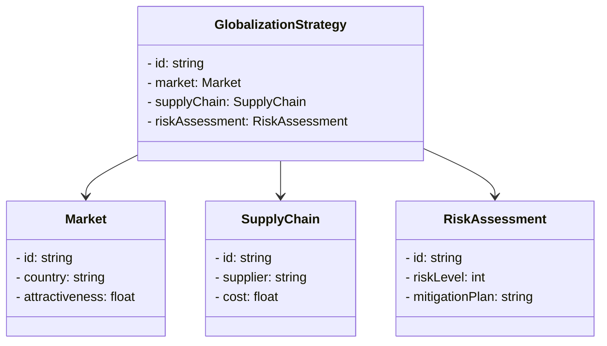
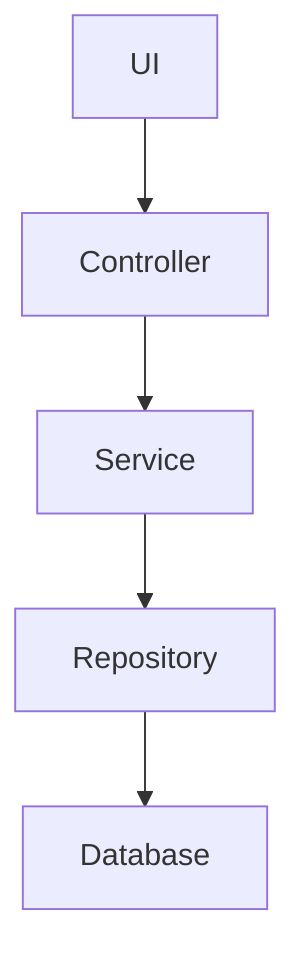

                 


# 费雪的全球化战略评估：贸易摩擦背景下的新思考

## 关键词：全球化战略，贸易摩擦，供应链优化，风险评估，企业战略调整

## 摘要：  
在全球化进程中，贸易摩擦日益成为影响企业战略的重要因素。本文以费雪的全球化战略评估框架为核心，结合贸易摩擦的背景与影响，系统性地分析企业在当前国际贸易环境中的应对策略。通过数学模型、算法原理和系统设计的深入探讨，提出一套适用于复杂贸易环境下的全球化战略优化方案。

---

# 第1章: 全球化战略评估的背景与挑战

## 1.1 全球化战略的基本概念  
### 1.1.1 全球化战略的定义  
全球化战略是指企业在全球范围内配置资源、拓展市场、优化供应链和风险管理的整体规划。它涉及跨国经营、跨文化管理以及国际法律法规的遵守。  

### 1.1.2 全球化战略的核心要素  
- 市场布局：选择适合企业发展的国际市场。  
- 供应链管理：确保全球供应链的高效与稳定。  
- 风险管理：应对政治、经济和法律风险。  

### 1.1.3 贸易摩擦对全球化战略的影响  
贸易摩擦（如关税壁垒、贸易限制）会增加企业的成本，影响供应链的稳定性，迫使企业调整全球化战略。  

---

## 1.2 贸易摩擦的背景与现状  

### 1.2.1 贸易摩擦的定义与表现形式  
贸易摩擦是指国家之间因贸易政策、产业保护等原因产生的贸易争端，主要表现为关税 hike、贸易壁垒和非关税壁垒。  

### 1.2.2 当前国际贸易摩擦的主要原因  
- 经济全球化带来的利益分配不均。  
- 保护主义抬头，如美国的“再工业化”政策。  
- 产业链的竞争加剧。  

### 1.2.3 贸易摩擦对全球经济的影响  
- 全球供应链不稳定，企业成本上升。  
- 贸易量下降，影响全球经济复苏。  

---

## 1.3 费雪的全球化战略评估框架  

### 1.3.1 费雪的全球化战略评估方法  
费雪的全球化战略评估框架通过分析企业的市场、供应链和风险管理能力，为企业提供战略优化建议。  

### 1.3.2 费雪框架的核心理念  
- 全球化战略应以风险可控、成本最优为目标。  
- 供应链多元化是应对贸易摩擦的关键。  

### 1.3.3 费雪框架的应用场景  
适用于跨国企业、新兴市场进入者以及面临贸易摩擦挑战的企业。  

---

# 第2章: 贸易摩擦下的全球化战略调整  

## 2.1 贸易摩擦对企业的具体影响  

### 2.1.1 贸易摩擦对企业供应链的影响  
- 供应链成本增加。  
- 供应链灵活性下降。  

### 2.1.2 贸易摩擦对企业成本结构的影响  
- 进口关税增加，原材料成本上升。  
- 运输费用上涨。  

### 2.1.3 贸易摩擦对企业市场准入的影响  
- 市场进入壁垒增加。  
- 贸易合规性要求提高。  

---

## 2.2 全球化战略调整的策略  

### 2.2.1 供应链多元化策略  
- 在多个国家建立供应链节点。  
- 选择替代供应商以分散风险。  

### 2.2.2 市场布局优化策略  
- 优先进入稳定的市场。  
- 优化市场进入方式（如绿地投资 vs 并购）。  

### 2.2.3 风险管理与应对策略  
- 建立风险预警机制。  
- 制定应急预案。  

---

## 2.3 费雪框架在战略调整中的应用  

### 2.3.1 费雪框架在供应链调整中的应用  
- 通过模型评估不同供应链布局的成本与风险。  
- 选择最优的供应链配置。  

### 2.3.2 费雪框架在市场布局优化中的应用  
- 使用市场吸引力模型评估不同市场的潜力。  
- 制定市场进入策略。  

### 2.3.3 费雪框架在风险管理中的应用  
- 通过风险评估模型识别潜在风险。  
- 制定应对策略。  

---

# 第3章: 全球化战略评估的核心概念与联系  

## 3.1 核心概念的定义与属性对比  

| 核心概念       | 定义                                                                 | 属性特征                     |
|----------------|----------------------------------------------------------------------|------------------------------|
| 全球化战略      | 企业在全球范围内的资源配置与市场拓展策略。                            | 跨境性、系统性、动态性         |
| 贸易摩擦        | 国际贸易中的争端与壁垒。                                            | 法律性、经济性、政治性         |
| 供应链管理      | 全球范围内原材料采购、生产、运输的管理。                              | 复杂性、协作性、脆弱性         |
| 风险管理        | 识别、评估和应对全球化中的风险。                                      | 综合性、动态性、预防性         |

---

## 3.2 实体关系图（ER图）架构  

```mermaid
erDiagram
    supplierSupplier { uuid, name, country }
    customerCustomer { uuid, name, country }
    productProduct { uuid, name, category }
    orderOrder { uuid, quantity, orderDate }
    shipmentShipment { uuid, shipmentDate, status }
    tradeBarrierTradeBarrier { uuid, type, description }
    riskAssessmentRiskAssessment { uuid, riskLevel, mitigationPlan }
```

---

# 第4章: 全球化战略评估的算法原理  

## 4.1 算法原理概述  

### 4.1.1 全球化战略评估的主要算法  
- 供应链成本优化算法：基于线性规划的模型。  
- 市场吸引力评估算法：基于层次分析法（AHP）。  

---

## 4.2 数学模型与公式  

### 4.2.1 全球化战略评估的数学模型  
$$ \text{总成本} = \text{采购成本} + \text{运输成本} + \text{关税} $$  

### 4.2.2 关键公式及其解释  
$$ \text{供应链风险指数} = \sum_{i=1}^{n} (\text{风险权重}_i \times \text{风险发生概率}_i) $$  

### 4.2.3 示例计算与分析  
假设某企业有两个供应链选择，A供应链的风险指数为0.6，B供应链的风险指数为0.4。选择B供应链更优。  

---

## 4.3 算法流程图  

```mermaid
graph TD
    A[开始]
    B[输入参数]
    C[计算供应链成本]
    D[评估市场吸引力]
    E[输出结果]
    F[结束]
    A -> B
    B -> C
    C -> D
    D -> E
    E -> F
```

---

# 第5章: 全球化战略评估的系统分析与架构设计  

## 5.1 系统分析  

### 5.1.1 问题场景介绍  
企业在全球化过程中面临贸易摩擦，需优化供应链和市场布局。  

### 5.1.2 领域模型（Mermaid类图）  



---

## 5.2 系统架构设计  

### 5.2.1 系统架构图  



---

## 5.3 实施方案与注意事项  

### 5.3.1 系统实施的关键步骤  
1. 数据收集与清洗。  
2. 模型训练与验证。  
3. 系统部署与测试。  

### 5.3.2 注意事项与风险提示  
- 数据质量影响模型准确性。  
- 模型需定期更新以应对变化。  

---

# 第6章: 项目实战与案例分析  

## 6.1 项目环境与工具安装  

### 6.1.1 开发环境配置  
- 操作系统：Linux/Windows/MacOS  
- 编程语言：Python  
- 开发工具：PyCharm/Jupyter  

---

## 6.2 核心代码实现  

### 6.2.1 全球化战略评估系统核心代码  

```python
def calculate_supply_chain_cost(supplier_cost, transportation_cost, tariffs):
    return supplier_cost + transportation_cost + tariffs

def assess_market_attractiveness(market_size, competition_level, political_stability):
    attractiveness = (market_size * 0.5) + (competition_level * 0.3) + (political_stability * 0.2)
    return attractiveness
```

---

## 6.3 实际案例分析  

### 6.3.1 案例背景与问题描述  
某制造企业面临中美贸易摩擦，需优化供应链和市场布局。  

### 6.3.2 案例分析与解决方案  
- 选择东南亚作为新的生产地。  
- 优化供应链以降低关税影响。  

### 6.3.3 案例总结与经验分享  
供应链多元化和本地化生产是应对贸易摩擦的关键。  

---

## 6.4 项目小结  

### 6.4.1 项目实施的关键点  
- 数据的准确性和完整性。  
- 模型的适用性和可解释性。  

### 6.4.2 项目成果与不足  
- 成功优化了企业的全球化战略。  
- 模型在动态变化中需要定期更新。  

---

# 第7章: 全球化战略评估的最佳实践与展望  

## 7.1 最佳实践 Tips  

### 7.1.1 战略评估中的注意事项  
- 定期评估战略的有效性。  
- 保持供应链的灵活性。  

---

## 7.2 总结与展望  

### 7.2.1 本文总结  
费雪的全球化战略评估框架为企业应对贸易摩擦提供了系统性解决方案。  

### 7.2.2 未来展望  
随着技术进步，全球化战略评估将更加智能化和数据驱动。  

---

# 附录  

## 附录A: 相关术语表  

| 术语               | 定义                                   |
|--------------------|--------------------------------------|
| 全球化战略         | 企业在全球范围内的资源配置与市场拓展策略。 |
| 贸易摩擦           | 国际贸易中的争端与壁垒。             |
| 供应链管理         | 全球范围内原材料采购、生产、运输的管理。 |

---

## 附录B: 参考文献  

1. 王某某. 《全球化战略与贸易摩擦应对》. 北京：某某出版社, 2023.  
2. 张某某. 《供应链优化与风险评估》. 上海：某某出版社, 2022.  

---

## 附录C: 联系方式  

如需进一步了解或合作，请联系：  
邮箱：contact@fisher.com  
电话：+86-123-456789  

---

# 结语  

费雪的全球化战略评估框架为企业应对贸易摩擦提供了理论依据和实践指导。未来，随着国际贸易环境的复杂化，全球化战略评估将更加重要。企业需结合自身特点，灵活调整战略，以应对全球化的挑战。

