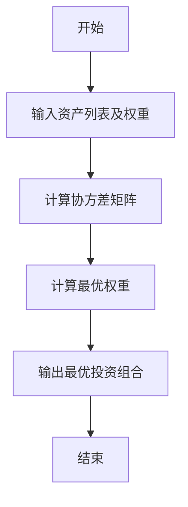
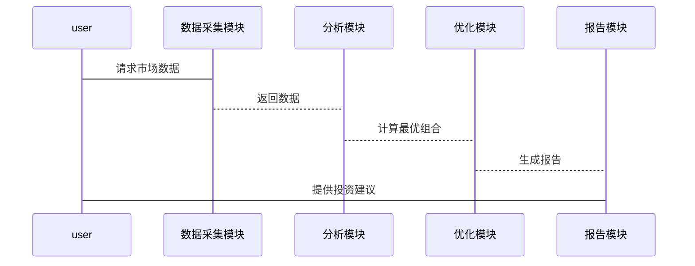

                 


# 费雪的全球化投资视角

## 关键词：全球化投资、资产配置、风险管理、现代投资组合理论、费雪投资理念、Python代码实现

## 摘要：  
本文从全球化投资的视角，深入探讨了费雪的投资理念及其在现代投资组合管理中的应用。通过分析全球化市场的特点、资产配置策略、风险管理方法，结合数学模型和系统架构设计，展示了如何将费雪的投资理念与现代投资组合理论相结合，构建高效的投资系统。文章还通过实际案例分析和Python代码实现，为读者提供了可操作的全球化投资策略。

---

## 第一章：全球化投资的背景与基础

### 1.1 费雪的投资理念  
费雪是投资领域的重要人物，其核心理念是选择具有持续增长潜力的优秀公司，并长期持有。他的投资策略强调基本面分析和长期视角，认为市场的短期波动不应影响长期投资决策。  

#### 小结  
费雪的投资理念为全球化投资提供了重要的理论基础，尤其是在多元化的资产配置中，选择优质资产是降低风险、提高收益的关键。

---

## 第二章：全球化投资的核心概念与联系

### 2.1 全球化市场的特点  
全球化市场具有多样性、波动性和相关性的特点。投资者需要考虑不同地区的经济政策、市场环境和资产表现。

#### 2.1.1 多样性  
全球化市场提供了更多的投资机会，投资者可以通过配置不同地区的资产来分散风险。  

#### 2.1.2 波动性  
不同地区的市场波动性差异显著，这要求投资者具备动态调整投资组合的能力。  

#### 2.1.3 相关性  
虽然全球化市场的相关性较低，但经济周期和地缘政治事件可能导致市场联动，影响投资组合的表现。  

### 2.2 资产配置与风险管理  
资产配置是全球化投资的核心策略，通过将资金分配到不同资产类别中，投资者可以降低风险并优化收益。风险管理则通过设定止损、分散投资等方式实现。

#### 2.2.1 资产配置  
- 股票：选择具有持续增长潜力的公司，如科技、消费等行业的龙头企业。  
- 债券：用于降低整体投资组合的波动性。  
- 其他资产：如房地产信托、黄金等，用于进一步分散风险。  

#### 2.2.2 风险管理  
- 设置止损点：当投资组合的损失达到一定比例时，立即卖出。  
- 定期再平衡：根据市场变化调整资产配置比例。  

### 2.3 全球化投资的核心要素对比  

| 要素         | 全球化投资特点       | 传统投资特点       |
|--------------|--------------------|--------------------|
| 资产类别     | 多元化，涵盖全球市场   | 局限于单一市场或区域 |
| 风险管理     | 通过分散投资降低风险 | 依赖单一市场的风险管理 |
| 收益潜力     | 更高，因市场多样性     | 较低，因市场限制       |

---

## 第三章：全球化投资的算法原理

### 3.1 现代投资组合理论（MPT）  
MPT由哈里·马科维茨提出，旨在通过优化投资组合的收益和风险比来实现最优配置。  

#### 3.1.1 MPT的基本原理  
MPT的目标是找到收益和风险的最佳平衡点。数学模型如下：  
$$ \text{风险} = \sqrt{\sum_{i=1}^{n} \sum_{j=1}^{n} w_i w_j \sigma_i \sigma_j \rho_{ij}} $$  
其中，$w_i$ 是资产i的权重，$\sigma_i$ 是资产i的波动率，$\rho_{ij}$ 是资产i和j的相关系数。  

#### 3.1.2 使用Mermaid绘制的MPT流程图  


#### 3.1.3 应用案例  
假设我们有三个资产，权重分别为0.3、0.4、0.3，计算其投资组合的风险和收益。

### 3.2 费雪理念与MPT的结合  
费雪的“选择优秀公司”理念可以通过筛选优质资产来优化MPT模型，从而提高投资组合的收益潜力。

---

## 第四章：全球化投资的系统架构设计

### 4.1 系统功能设计  
全球化投资系统的功能模块包括：  
- 数据采集：获取全球市场数据。  
- 分析模块：计算资产配置和风险指标。  
- 优化模块：根据MPT模型优化投资组合。  
- 报告模块：生成投资报告和建议。  

#### 4.1.1 使用Mermaid绘制的系统架构图  


### 4.2 接口设计  
- 数据接口：与数据源（如彭博、路透）对接。  
- 用户接口：提供给用户查看投资组合和调整配置的界面。  

### 4.3 交互流程  


---

## 第五章：项目实战

### 5.1 环境安装  
安装Python和必要的库：  
```bash
pip install numpy pandas matplotlib
```

### 5.2 核心代码实现  
实现MPT模型的Python代码：  

```python
import numpy as np

def calculate_portfolio_risk(weights, covariance_matrix):
    return np.sqrt(weights.T.dot(covariance_matrix).dot(weights))
```

### 5.3 案例分析  
假设我们有两只股票，权重分别为0.5和0.5，计算其投资组合的风险。  

---

## 第六章：总结与最佳实践

### 6.1 小结  
费雪的全球化投资视角结合MPT模型，为投资者提供了科学的投资策略。通过分散投资和风险管理，投资者可以在全球化市场中实现收益与风险的最佳平衡。

### 6.2 投资建议  
- 定期审视和调整投资组合。  
- 保持对市场的敏感性，及时应对变化。  
- 学习并应用量化工具，提高投资效率。  

### 6.3 注意事项  
- 风险管理是投资成功的关键。  
- 避免过度依赖单一市场或资产。  
- 确保投资目标与个人风险承受能力匹配。  

### 6.4 拓展阅读  
推荐阅读《投资学》和《投资策略精解》，深入理解MPT和其他投资理论。

---

通过以上章节的详细讲解，读者可以全面理解费雪的全球化投资理念，并将其应用于实际投资中，提升投资收益和风险管理能力。

