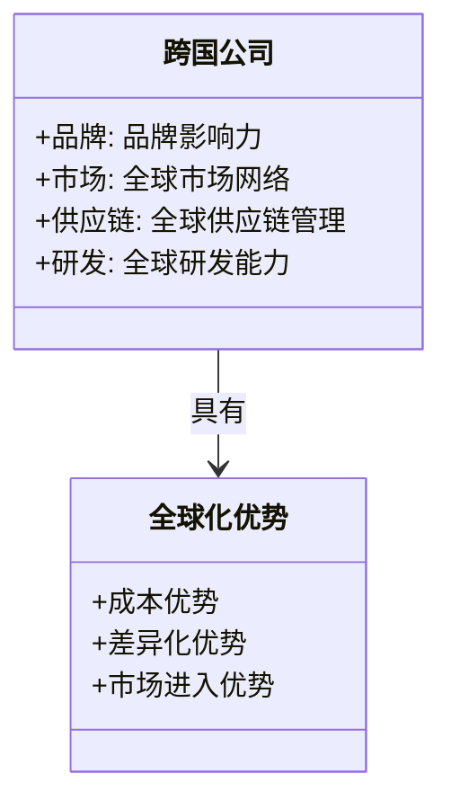

                 

---

## 第一部分: 全球化概述

### 第1章: 全球化的概念与历史演变

#### 1.1 全球化的定义与特征
- **全球化**是指经济、文化、政治等领域的跨国界整合过程，表现为国际贸易、资本流动、技术转移和文化交流的全球化。其主要特征包括：
  - **跨国性**：跨越国界的经济活动。
  - **多样性**：不同国家和地区的文化、制度差异。
  - **复杂性**：涉及多个利益相关者的互动。

与跨国公司的关系：全球化为跨国公司提供了拓展市场、优化资源配置的平台，而跨国公司则是全球化的重要推动者。

#### 1.2 全球化的历史演变
- **早期全球化**：始于殖民扩张时期，主要表现为殖民地的商品贸易。
- **工业革命**：推动了规模化生产，促进了跨国贸易和资本流动。
- **当代全球化**：20世纪后，信息技术和交通物流的进步加速了全球化进程。

#### 1.3 全球化的现状与趋势
- 当前全球化面临逆流挑战，如贸易保护主义抬头，但技术进步和市场整合的趋势仍在延续。
- 未来全球化将更加注重可持续发展和数字化转型。

---

## 第二部分: 跨国公司的优势

### 第2章: 跨国公司的定义与特点

#### 2.1 跨国公司的定义
- 跨国公司是拥有全球性业务的公司，其业务跨越多个国家，具有全球化的组织结构和运营模式。

#### 2.2 跨国公司的优势
- **市场扩展**：通过全球化布局，进入更多市场，扩大客户群。
- **资源配置**：在全球范围内优化资源配置，降低生产成本。
- **技术与管理**：通过跨国合作和知识共享，提升技术水平和管理能力。

---

### 第3章: 跨国公司的竞争优势分析

#### 3.1 成本优势
- **全球采购**：跨国公司通过全球采购降低原材料成本。
- **规模经济**：大规模生产降低单位成本。
- **供应链管理**：高效的全球供应链优化成本结构。

#### 3.2 差异化优势
- **品牌影响力**：强大的全球品牌提升市场竞争力。
- **产品创新**：全球化研发网络推动产品差异化。
- **用户体验**：本地化服务提升客户满意度。

#### 3.3 市场进入优势
- **全球网络**：跨国公司利用全球销售网络快速进入新市场。
- **并购与合作**：通过并购快速扩大市场份额。
- **市场信息**：全球化的市场调研能力提供决策支持。

---

### 第4章: 跨国公司的全球化战略

#### 4.1 全球化战略的制定
- **市场分析**：识别目标市场的需求和竞争状况。
- **进入策略**：选择直接投资、合资合作或特许经营等方式进入市场。
- **本地化与全球化平衡**：在保持品牌一致性的同时，进行本地化调整。

#### 4.2 风险管理
- **政治风险**：跨国公司需应对不同国家的政策变化和法律风险。
- **汇率风险**：通过金融衍生工具对冲汇率波动带来的影响。
- **文化风险**：通过跨文化管理减少因文化差异导致的冲突。

---

## 第五部分: 全球化视角下的系统架构

### 第5章: 系统功能设计

#### 5.1 领域模型设计

---

### 第6章: 系统架构设计

#### 6.1 架构设计

---

## 第七部分: 项目实战与案例分析

### 第7章: 案例分析

#### 7.1 案例背景
以某跨国公司为例，分析其在全球化过程中的市场进入策略、供应链管理和风险管理。

#### 7.2 项目核心实现
- **市场进入策略**：通过并购进入新兴市场。
- **供应链管理**：建立全球物流网络，降低运输成本。
- **风险管理**：制定应对汇率波动的策略。

---

## 第八部分: 结论与建议

### 第8章: 结论与建议

#### 8.1 全球化的优势总结
- 跨国公司通过全球化布局实现成本控制、市场扩展和品牌提升。

#### 8.2 对企业的建议
- **制定全球化战略**：明确市场进入策略和本地化调整。
- **优化供应链管理**：构建高效的全球供应链网络。
- **加强风险管理**：建立应对政治和经济风险的机制。

---

## 关键词回顾
- 全球化、跨国公司、竞争优势、市场战略、费雪视角

---

通过以上目录结构和内容安排，我们从全球化的基本概念、跨国公司的优势、系统架构设计、案例分析等多个角度，全面探讨了跨国公司的全球化视角和竞争优势。希望这篇文章能为您提供有价值的见解和启发。

