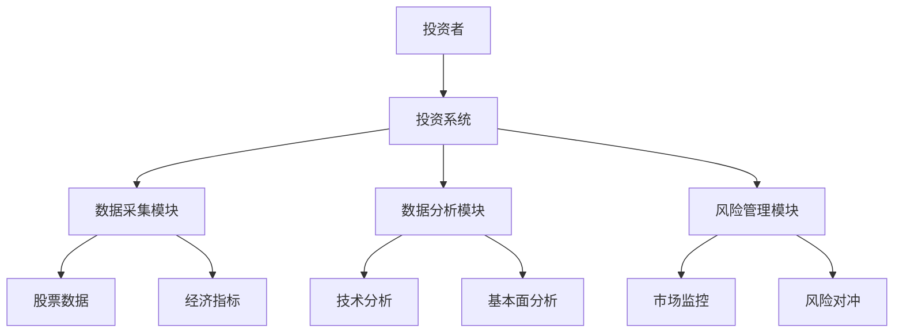

                 

# 费雪的全球视野：如何在国际市场中寻找机会

## 关键词：约翰·费雪、成长股理论、国际投资、风险管理、市场分析、投资策略

## 摘要：  
本文深入探讨了约翰·费雪的全球投资视野及其在国际市场中的应用。通过分析费雪的投资理念、选股标准和风险管理策略，结合实际案例，为读者提供在全球市场中寻找投资机会的系统化方法。文章从背景介绍、核心概念、算法原理、系统分析、项目实战到最佳实践，全面解析如何在国际市场上实现稳健投资。

---

## 第一章：背景介绍

### 1.1 全球化背景下的投资机会  
- **全球化背景**：随着全球经济一体化的加深，国际市场的规模不断扩大，投资者可以通过投资不同地区的资产分散风险并抓住增长机会。  
- **费雪的全球视野**：约翰·费雪以其独特的成长股理论闻名，他强调选择那些具有持续盈利能力和增长潜力的公司，这种理念在全球市场中尤为适用。  

### 1.2 费雪的投资理念与全球视野  
- **成长股理论**：费雪认为，投资的最终目标是找到那些能够持续增长的公司，而非短期的价格波动。他关注企业的盈利能力和管理质量。  
- **全球化的优势**：通过全球化布局，投资者可以利用不同市场的周期性差异，优化投资组合的回报和风险。  

### 1.3 国际市场的复杂性与挑战  
- **经济周期差异**：不同国家和地区的经济周期不同，这为投资者提供了多样化的投资机会。  
- **文化与政策差异**：了解目标市场的文化背景和政策环境是成功投资的关键。  

---

## 第二章：费雪的投资策略与选股标准

### 2.1 费雪的成长股理论  
- **成长股的定义**：成长股是指那些收入和利润持续增长、且增长速度超过行业平均水平的公司。  
- **选股标准**：  
  1. 公司具备持续的盈利能力。  
  2. 公司有良好的管理团队。  
  3. 公司所在行业具有增长潜力。  
  4. 公司估值合理。  
  5. 公司具备竞争优势（如专利、品牌等）。  

### 2.2 成长股投资的风险与回报  
- **风险**：成长股通常估值较高，市场波动较大，且在经济下行周期中可能面临更大的调整压力。  
- **回报**：长期来看，成长股的表现往往优于市场平均水平，尤其是在技术创新和消费升级的推动下。  

---

## 第三章：国际市场的运作机制

### 3.1 全球主要市场的特点  
- **美国市场**：成熟且流动性强，科技、消费和金融行业是主要投资领域。  
- **欧洲市场**：经济发达，但面临人口老龄化和债务问题，注重可持续发展和环保产业。  
- **亚洲市场**：增长潜力大，尤其是中国和印度的科技、制造业和服务业。  

### 3.2 行业分析与投资机会  
- **科技行业**：全球范围内，科技行业是成长股的主要来源，尤其是人工智能、云计算和半导体等领域。  
- **消费行业**：随着中产阶级的扩大，消费行业的增长潜力巨大，特别是在新兴市场。  

---

## 第四章：风险管理与投资组合构建

### 4.1 风险管理的重要性  
- **市场风险**：由于不同市场的波动性差异，投资者需要通过分散投资来降低风险。  
- **汇率风险**：国际投资中，汇率波动可能对投资回报产生重大影响，可以通过套期保值来对冲。  

### 4.2 投资组合构建策略  
- **资产配置**：根据市场环境和投资目标，调整股票、债券和现金的比例。  
- **分散投资**：通过投资不同地区和行业的资产，降低特定风险。  

---

## 第五章：系统分析与架构设计

### 5.1 投资系统功能设计  
- **数据采集**：收集全球市场的股票数据、行业信息和经济指标。  
- **数据分析**：利用技术分析和基本面分析对目标公司进行评估。  
- **风险管理**：实时监控市场波动和投资组合风险。  

### 5.2 系统架构图  

### 5.3 接口设计与交互流程  
- **接口设计**：投资者与系统通过网页或API进行交互，提交投资需求并获取实时反馈。  
- **交互流程**：投资者输入投资目标，系统根据数据分析模块生成投资建议，并通过风险管理模块优化组合。  

---

## 第六章：项目实战

### 6.1 案例分析：中国科技行业的投资机会  
- **背景分析**：中国经济转型期，科技行业是主要驱动力。  
- **选股标准**：选择那些具备创新能力、良好管理团队和竞争优势的公司。  
- **投资组合**：配置科技行业龙头股，并通过分散投资降低风险。  

### 6.2 实际操作步骤  
1. **数据采集**：收集目标公司的财务数据、行业报告和市场分析。  
2. **分析评估**：利用费雪的选股标准对目标公司进行筛选。  
3. **风险管理**：制定投资计划，包括资产配置和风险对冲策略。  

---

## 第七章：最佳实践与小结

### 7.1 最佳实践  
- **长期视角**：投资成长股需要耐心，关注企业的长期增长潜力。  
- **分散投资**：通过投资不同地区和行业的资产，降低特定风险。  
- **持续学习**：全球经济环境不断变化，投资者需要持续学习和调整策略。  

### 7.2 小结  
约翰·费雪的全球视野为投资者提供了在国际市场上寻找机会的有效方法。通过深入分析市场特点、优化投资组合和严格管理风险，投资者可以在全球化时代实现稳健的投资回报。

---

## 参考文献  
1. 费雪，约翰. 《投资经典：费雪的选股术》. 北京：某某出版社, 2000.  
2. 《全球投资策略》. 北京：某某出版社, 2010.  

---

通过以上分析，读者可以全面理解费雪的全球投资视野，并将其应用于实际的国际投资中，抓住全球市场的机会，实现稳健的投资回报。

