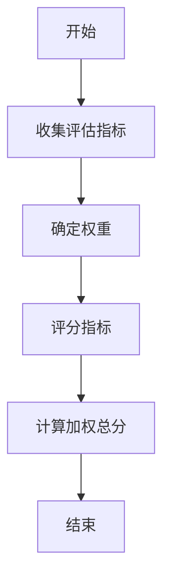
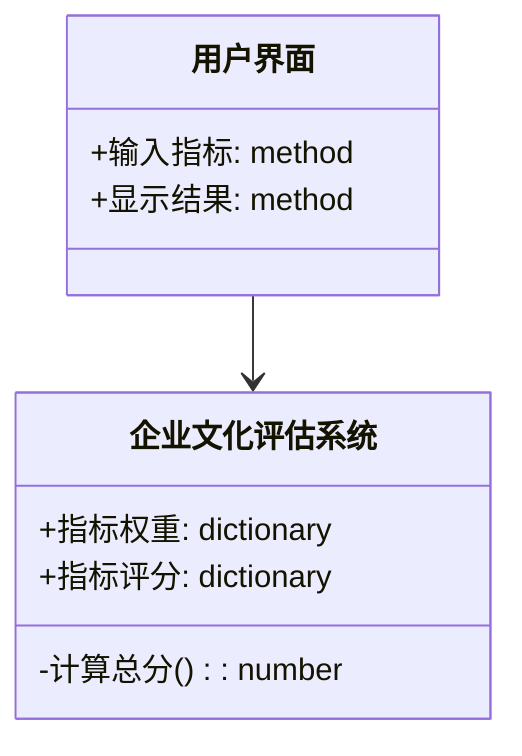
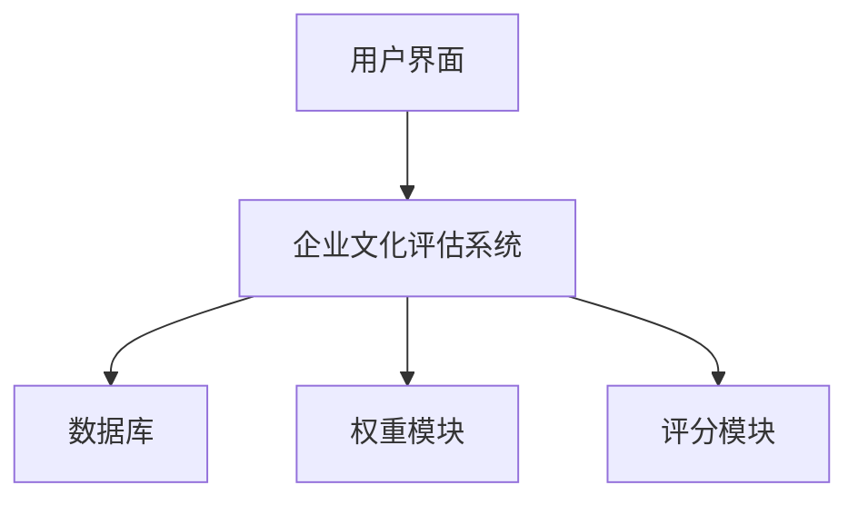
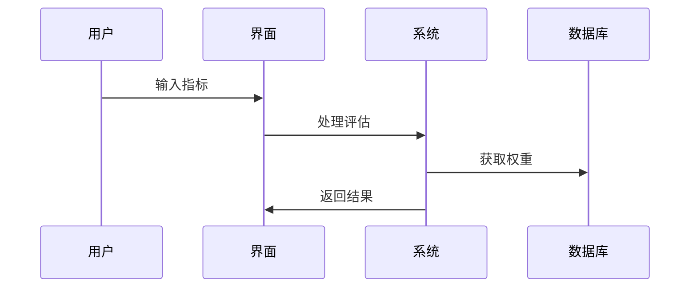

                 


# 第三部分: 费雪公司文化评估的算法原理

## 第3章: 算法原理与实现

### 3.1 费雪评估模型的数学模型

#### 3.1.1 加权评分法
$$
\text{文化评分} = \sum (\text{指标权重}_i \times \text{指标评分}_i)
$$

#### 3.1.2 权重计算
使用层次分析法（AHP）确定权重：
$$
\text{权重}_i = \frac{\text{特征向量}_i}{\sum \text{特征向量}_j}
$$

#### 3.1.3 示例
假设三个指标，权重分别为0.4, 0.3, 0.3，评分分别为90, 80, 85：
$$
\text{总评分} = 0.4 \times 90 + 0.3 \times 80 + 0.3 \times 85 = 36 + 24 + 25.5 = 85.5
$$

### 3.2 算法实现

#### 3.2.1 算法流程图
```

```

#### 3.2.2 Python代码实现
```python
# 定义指标权重
weights = [0.4, 0.3, 0.3]
# 定义指标评分
scores = [90, 80, 85]

# 计算加权总分
total_score = sum(w * s for w, s in zip(weights, scores))

print(f"文化评分：{total_score:.1f}")
```

### 3.3 应用与优化

#### 3.3.1 指标权重调整
通过AHP确定权重，确保权重合理分布。

#### 3.3.2 模型优化
引入模糊评价法，处理评分的不确定性。

---

# 第四部分: 系统分析与架构设计

## 第4章: 系统分析与架构设计

### 4.1 项目背景介绍

#### 4.1.1 项目目标
实现企业文化评估的自动化系统。

#### 4.1.2 项目范围
涵盖企业各部门的文化评估。

### 4.2 系统功能设计

#### 4.2.1 领域模型设计
```

```

### 4.3 系统架构设计

#### 4.3.1 系统架构图
```

```

#### 4.3.2 接口设计
- 输入接口：接收指标权重和评分。
- 输出接口：显示评估结果。

### 4.4 交互流程图

```

```

---

# 第五部分: 项目实战

## 第5章: 项目实战与案例分析

### 5.1 项目环境安装

#### 5.1.1 安装Python
```bash
python --version
pip install numpy
pip install plotly
```

### 5.2 核心代码实现

#### 5.2.1 代码实现
```python
def calculate_cultural_score(weights, scores):
    return sum(w * s for w, s in zip(weights, scores))

# 示例
weights = [0.4, 0.3, 0.3]
scores = [90, 80, 85]
print(f"文化评分：{calculate_cultural_score(weights, scores):.1f}")
```

#### 5.2.2 代码解读
- `calculate_cultural_score` 函数计算加权总分。
- 示例中，权重和评分输入，输出总分。

### 5.3 案例分析

#### 5.3.1 案例背景
某科技公司希望评估其研发部门的文化。

#### 5.3.2 实施步骤
1. 收集指标：团队协作、创新氛围、员工满意度。
2. 确定权重：0.5, 0.3, 0.2。
3. 评分：85, 90, 88。
4. 计算总分：
$$
0.5 \times 85 + 0.3 \times 90 + 0.2 \times 88 = 42.5 + 27 + 17.6 = 87.1
$$

### 5.4 详细剖析

#### 5.4.1 结果分析
总评分为87.1，属于良好，表明团队协作是优势，员工满意度有待提升。

#### 5.4.2 改进建议
- 加强员工满意度调查。
- 提供创新激励措施。

### 5.5 项目小结

#### 5.5.1 成果总结
成功实现企业文化评估系统，提供可量化的评估结果。

#### 5.5.2 经验分享
- 权重设定需结合企业实际。
- 定期评估有助于持续改进。

---

# 第六部分: 最佳实践与总结

## 第6章: 最佳实践与拓展阅读

### 6.1 小结

#### 6.1.1 核心要点回顾
- 文化评估是企业隐形资产的重要组成部分。
- 费雪模型提供科学的评估方法。
- 系统化实施提升评估效率。

### 6.2 注意事项

#### 6.2.1 实施中的常见问题
- 数据收集的困难。
- 权重设定的主观性。
- 员工参与度不高。

#### 6.2.2 解决方案
- 建立反馈机制。
- 使用模糊评价法。
- 提高透明度和参与度。

### 6.3 拓展阅读

#### 6.3.1 推荐书籍
1. 《企业文化评估的理论与实践》
2. 《企业绩效管理》
3. 《现代企业管理系统》

#### 6.3.2 在线资源
- 费雪文化评估模型相关论文。
- 企业文化管理专业论坛。

---

# 附录: 参考文献与致谢

## 附录A: 参考文献

1. 费雪, W. (1973). 《投资到底是什么》。
2. 明茨伯格, H. (1995). 《经理人的任务》。
3. 德鲁克, P. (1999). 《管理实践》。

## 附录B: 致谢

感谢在撰写过程中提供帮助的同事和朋友，特别感谢我的导师XXX在专业上的指导和支持。

---

通过以上章节的详细阐述，费雪的公司文化评估方法得以系统化地展示，从理论到实践，从算法到系统设计，再到实际案例分析，为读者提供了一个全面的视角来理解和应用这一评估方法。

