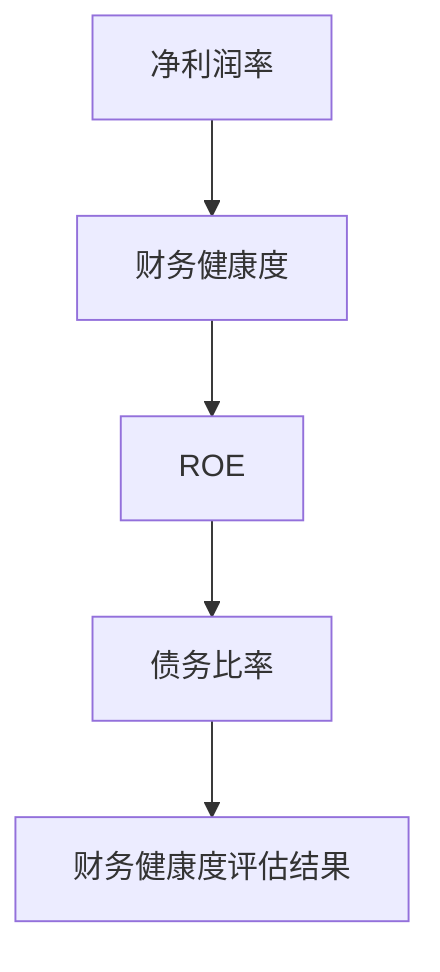
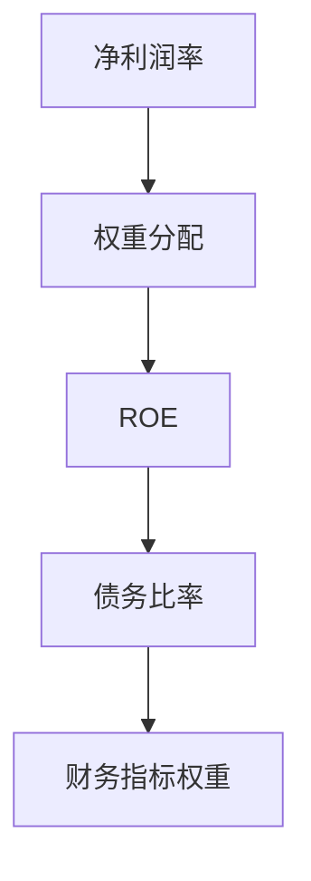
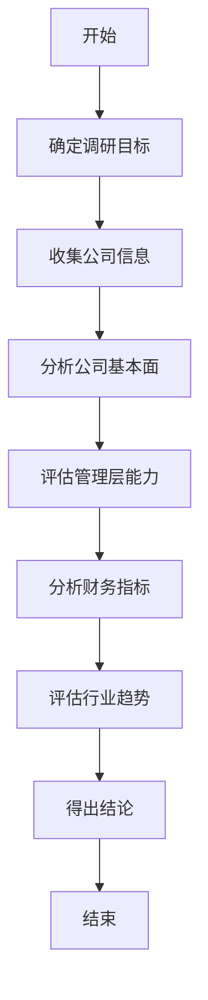
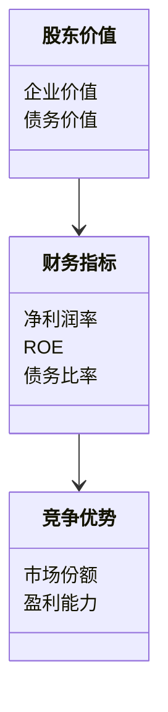
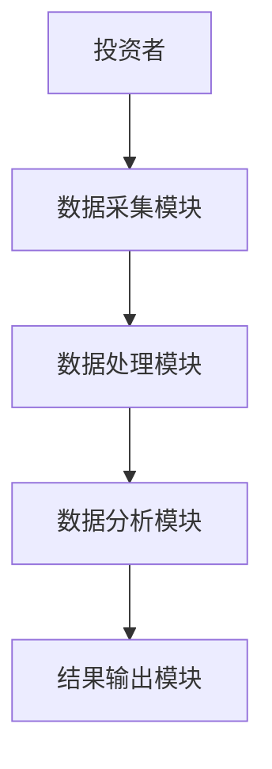
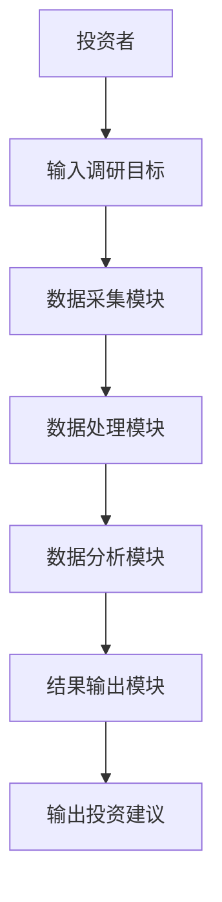

                 


# 费雪的公司调研技巧

> 关键词：费雪, 公司调研, 投资哲学, 财务分析, 管理层评估, 行业分析, 股东价值

> 摘要：本文详细介绍了费雪的公司调研技巧，包括他的投资哲学、调研方法、数学模型以及实际案例分析。通过这些内容，读者可以全面了解费雪的调研思路，并将其应用于实际投资中。

---

# 第1章: 费雪的背景与投资哲学

## 1.1 费雪的生平与投资理念

### 1.1.1 费雪的生平简介
菲利普·费雪（Philip Fisher）是20世纪著名的投资专家，被誉为“成长型投资之父”。他出生于1907年，去世于2004年，是一位典型的长期投资者。费雪的投资理念以“成长股”为核心，强调通过深入研究公司基本面，寻找具有持续增长潜力的企业。

### 1.1.2 费雪的投资哲学核心
费雪的投资哲学可以概括为以下几个方面：
1. **长期投资**：费雪主张长期持有优质股票，而不是频繁交易。
2. **价值发现**：他强调通过深入研究发现被市场低估的企业。
3. **股东价值**：费雪认为，企业的价值不仅仅体现在财务报表上，还体现在其未来增长潜力上。

### 1.1.3 费雪调研方法的形成背景
费雪的调研方法形成于20世纪50年代，当时正值美国经济的高速增长期。他的方法主要基于对企业基本面的深入分析，尤其是对管理层能力和财务状况的关注。

---

## 1.2 费雪投资方法的核心要素

### 1.2.1 长期投资与价值发现
费雪认为，投资的目的是寻找那些能够持续创造价值的企业。他强调，投资者应该关注企业的长期增长潜力，而不是短期市场波动。

### 1.2.2 股东价值分析法
股东价值分析法是费雪的核心理念之一。他认为，企业的价值取决于其未来能够为股东创造的财富。这种方法要求投资者不仅要分析企业的财务状况，还要评估其管理层的能力和战略规划。

### 1.2.3 费雪的选股标准
费雪提出了以下选股标准：
1. **持续增长的收入和利润**：企业应该有稳定的收入和利润增长。
2. **强大的管理层**：管理层应该具有良好的声誉和决策能力。
3. **健康的财务状况**：企业应该有健康的资产负债表和现金流。

---

## 1.3 费雪调研方法的独特性

### 1.3.1 费雪调研方法的创新点
费雪的调研方法在当时具有以下创新点：
1. **注重企业基本面**：他强调对企业基本面的深入分析。
2. **长期视角**：他关注企业的长期增长潜力。
3. **系统化分析**：他将调研过程系统化，提出了具体的分析步骤。

### 1.3.2 费雪方法与其他投资方法的对比
与巴菲特的价值投资不同，费雪更注重企业的成长性和管理层能力。与技术分析相比，费雪的方法更注重基本面分析。

### 1.3.3 费雪方法的适用场景
费雪的方法适用于那些希望长期投资优质成长股的投资者。这种方法特别适合分析那些具有持续增长潜力的企业。

---

# 第2章: 费雪的公司调研方法

## 2.1 费雪调研的核心步骤

### 2.1.1 确定调研目标
在进行公司调研之前，投资者需要明确自己的调研目标。例如，是寻找成长股，还是寻找价值股。

### 2.1.2 收集公司信息
投资者需要收集企业的财务报表、行业报告、管理层访谈等信息。

### 2.1.3 分析公司基本面
通过对企业的财务状况、行业地位、管理层能力等方面进行分析，评估企业的投资价值。

---

## 2.2 费雪的管理层评估法

### 2.2.1 管理层能力评估维度
1. **决策能力**：管理层是否能够做出正确的决策。
2. **创新能力**：管理层是否能够推动企业的创新。
3. **历史表现**：管理层在过去的表现如何。

### 2.2.2 管理层决策风格分析
费雪认为，管理层的决策风格是影响企业未来发展的关键因素。他强调，投资者应该选择那些具有稳健决策风格的管理层。

### 2.2.3 管理层历史表现考察
通过分析管理层的历史表现，投资者可以评估其能力和稳定性。

---

## 2.3 费雪的财务分析法

### 2.3.1 财务报表分析框架
费雪的财务分析框架包括以下步骤：
1. **利润表分析**：评估企业的盈利能力。
2. **资产负债表分析**：评估企业的财务健康状况。
3. **现金流分析**：评估企业的现金流状况。

### 2.3.2 关键财务指标解读
以下是几个关键财务指标：
1. **净利润率**：净利润/收入。
2. **ROE（净资产收益率）**：净利润/股东权益。
3. **债务比率**：总负债/股东权益。

### 2.3.3 财务健康度评估模型
费雪提出了一个财务健康度评估模型，如下图所示：



---

## 2.4 费雪的行业分析法

### 2.4.1 行业生命周期分析
费雪认为，行业的发展阶段对企业的投资价值有很大影响。他将行业生命周期分为以下几个阶段：
1. **导入期**：行业刚刚起步。
2. **成长期**：行业快速增长。
3. **成熟期**：行业增长放缓。
4. **衰退期**：行业逐渐衰退。

### 2.4.2 行业竞争结构评估
费雪认为，行业竞争结构是影响企业投资价值的重要因素。他强调，投资者应该选择那些具有竞争优势的企业。

### 2.4.3 行业趋势预测方法
通过分析行业趋势，投资者可以预测行业的未来发展方向。

---

# 第3章: 费雪调研方法的数学模型与算法原理

## 3.1 费雪调研方法的数学模型

### 3.1.1 股东价值分析的数学公式
股东价值可以通过以下公式计算：
$$
\text{股东价值} = \text{企业价值} - \text{债务价值}
$$

### 3.1.2 财务指标权重分配模型
费雪提出了一个财务指标权重分配模型，如下图所示：



### 3.1.3 竞争优势评估的数学表达
竞争优势可以通过以下公式进行评估：
$$
\text{竞争优势} = \text{市场份额} \times \text{盈利能力}
$$

---

## 3.2 算法原理与流程图

### 3.2.1 费雪调研算法的流程图


---

## 3.3 代码实现与案例分析

### 3.3.1 财务指标计算代码示例
```python
def calculate_financial_ratios(revenue, net_income, total_assets, current_liabilities):
    # 净利润率
    net_profit_margin = net_income / revenue
    # ROE
    roe = net_income / (total_assets - current_liabilities)
    return net_profit_margin, roe
```

---

## 3.4 实际案例分析

### 3.4.1 案例背景介绍
假设我们正在分析一家科技公司，该公司过去几年的收入和利润都在快速增长，且管理层表现出色。

### 3.4.2 数据分析与计算
通过上述代码，我们可以计算出该公司的净利润率和ROE。

### 3.4.3 结果解读
如果该公司的净利润率和ROE都高于行业平均水平，那么可以认为这是一家值得投资的企业。

---

# 第4章: 费雪调研方法的系统分析与架构设计方案

## 4.1 问题场景介绍
在实际投资中，投资者需要面对复杂的市场环境和众多的企业信息。费雪的调研方法为我们提供了一个系统的分析框架。

---

## 4.2 系统功能设计

### 4.2.1 领域模型


---

## 4.3 系统架构设计

### 4.3.1 架构图


---

## 4.4 系统交互设计

### 4.4.1 交互流程图


---

# 第5章: 费雪调研方法的项目实战

## 5.1 环境安装与配置
为了进行费雪调研方法的分析，投资者需要安装以下工具：
1. 数据分析工具：Python、Excel等。
2. 财务分析软件：如Morningstar等。

---

## 5.2 核心实现源代码

### 5.2.1 财务指标计算代码
```python
def calculate_financial_ratios(revenue, net_income, total_assets, current_liabilities):
    # 净利润率
    net_profit_margin = net_income / revenue
    # ROE
    roe = net_income / (total_assets - current_liabilities)
    return net_profit_margin, roe
```

---

## 5.3 代码应用解读与分析
通过上述代码，投资者可以计算出企业的财务指标，从而评估其投资价值。

---

## 5.4 实际案例分析

### 5.4.1 案例背景
假设我们正在分析一家科技公司，该公司过去几年的收入和利润都在快速增长。

### 5.4.2 数据分析与计算
通过上述代码，我们可以计算出该公司的净利润率和ROE。

### 5.4.3 结果解读
如果该公司的净利润率和ROE都高于行业平均水平，那么可以认为这是一家值得投资的企业。

---

## 5.5 项目小结
通过实际案例分析，我们可以看到费雪调研方法的有效性。投资者可以通过这种方法，系统地分析企业的投资价值。

---

# 第6章: 费雪调研方法的最佳实践与注意事项

## 6.1 最佳实践 tips
1. **长期投资**：投资者应该选择长期持有的优质企业。
2. **深入研究**：在投资前，投资者需要进行深入的公司调研。
3. **关注管理层**：管理层的能力和决策风格是影响企业未来发展的关键因素。

## 6.2 小结
费雪的调研方法为我们提供了一个系统化的投资分析框架。通过深入研究企业的基本面，我们可以找到那些具有长期增长潜力的优质企业。

---

## 6.3 注意事项
1. **市场风险**：投资者需要关注市场的整体风险。
2. **行业变化**：行业趋势的变化可能会影响企业的投资价值。
3. **数据准确性**：投资者需要确保数据的准确性和完整性。

---

## 6.4 拓展阅读
1. 《投资到底是什么》
2. 《价值投资实战》
3. 《费雪投资哲学》

---

# 第7章: 总结与展望

## 7.1 总结
费雪的公司调研技巧为我们提供了一个系统化的投资分析框架。通过深入研究企业的基本面，我们可以找到那些具有长期增长潜力的优质企业。

## 7.2 展望
随着市场的不断发展，费雪的调研方法需要不断更新和完善。投资者应该结合实际情况，灵活运用这些方法。

---

# 结语

费雪的公司调研技巧是一种科学的投资方法，它要求投资者具备扎实的分析能力和长期的投资视角。通过深入研究企业的基本面，投资者可以做出更加明智的投资决策。希望本文能够帮助读者更好地理解和应用费雪的调研方法。

