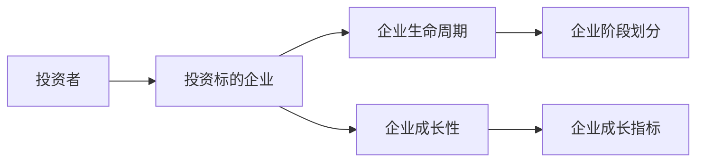

                 


# 费雪的创新企业投资法则

## 关键词：费雪投资法则、创新企业、企业分析、企业生命周期、企业成长性

## 摘要：费雪的创新企业投资法则是一种基于企业分析的投资策略，强调通过深入研究企业的生命周期和成长性来做出投资决策。本文将详细探讨该法则的核心概念、算法原理、数学模型，并通过实际案例分析其应用，为投资者提供系统化的指导。

---

# 第1章 费雪投资法则的背景与核心概念

## 1.1 费雪投资法则的起源与发展

### 1.1.1 费雪投资法则的起源

费雪的投资法则起源于20世纪，由本杰明·格雷厄姆的学生戴维·费雪提出。费雪认为，投资者应该选择那些具有强大竞争优势、良好管理和持续成长潜力的企业进行投资。

### 1.1.2 费雪投资法则的核心思想

费雪的投资法则强调：
1. **企业分析**：通过深入研究企业的商业模式、竞争优势和管理团队来评估其投资价值。
2. **企业生命周期**：将企业的生命周期划分为不同阶段，分析其在每个阶段的成长性和盈利能力。
3. **企业成长性**：重点关注企业的收入增长率、利润率和市场份额的扩展能力。

### 1.1.3 费雪投资法则与其他投资理论的对比

与其他投资理论（如价值投资、成长投资）相比，费雪的投资法则更注重企业的内在成长潜力和长期竞争优势。

---

## 1.2 创新企业的定义与特征

### 1.2.1 创新企业的定义

创新企业是指那些能够持续推出新产品、服务或商业模式，并在市场中占据领先地位的企业。

### 1.2.2 创新企业的核心特征

1. **创新能力**：具备持续创新的能力，能够快速适应市场变化。
2. **竞争优势**：拥有独特的竞争优势，如技术壁垒、品牌影响力等。
3. **成长潜力**：具有较高的收入增长率和利润率。

### 1.2.3 创新企业与传统企业的对比分析

| 特征       | 创新企业           | 传统企业           |
|------------|--------------------|--------------------|
| 战略重点   | 创新与技术驱动     | 成本控制与效率     |
| 生命周期   | 快速变化，不确定性高 | 稳定，周期较长      |
| 投资价值   | 高成长性           | 稳定性             |

---

## 1.3 费雪投资法则的核心要素

### 1.3.1 投资标的企业分析

企业分析的核心在于评估企业的商业模式、竞争优势和管理团队。

### 1.3.2 投资标的企业生命周期

将企业的生命周期划分为初创期、成长期、成熟期和衰退期，分析其在每个阶段的成长性和盈利能力。

### 1.3.3 投资标的企业成长性评估

通过分析企业的收入增长率、利润率和市场份额扩展能力来评估其成长性。

---

## 1.4 费雪投资法则的逻辑框架

### 1.4.1 投资标的企业分析的逻辑起点

从企业的商业模式和竞争优势出发，分析其在市场中的定位。

### 1.4.2 投资标的企业生命周期的阶段划分

将企业生命周期划分为初创期、成长期、成熟期和衰退期，分析其在每个阶段的成长性和盈利能力。

### 1.4.3 投资标的企业成长性评估的指标体系

- **收入增长率**：企业的收入增长速度。
- **利润率**：企业的盈利能力。
- **市场份额**：企业在市场中的占有率。

---

## 1.5 本章小结

本章介绍了费雪投资法则的背景、核心概念和逻辑框架，强调了创新企业在投资中的重要性。通过分析企业的生命周期和成长性，投资者可以更好地评估企业的投资价值。

---

# 第2章 费雪投资法则的核心概念与联系

## 2.1 费雪投资法则的核心概念

### 2.1.1 投资标的企业分析的核心概念

企业分析的核心在于评估企业的商业模式、竞争优势和管理团队。

### 2.1.2 投资标的企业生命周期的核心概念

将企业的生命周期划分为初创期、成长期、成熟期和衰退期，分析其在每个阶段的成长性和盈利能力。

### 2.1.3 投资标的企业成长性评估的核心概念

通过分析企业的收入增长率、利润率和市场份额扩展能力来评估其成长性。

---

## 2.2 费雪投资法则的概念属性特征对比

| 特征       | 投资标的企业分析       | 投资标的企业生命周期       | 投资标的企业成长性评估       |
|------------|------------------------|-----------------------------|-----------------------------|
| 核心目标   | 评估企业的商业模式     | 分析企业的生命周期阶段     | 评估企业的成长潜力         |
| 分析重点   | 企业的竞争优势         | 企业的生命周期阶段划分     | 企业的收入增长率、利润率   |
| 应用场景   | 投资决策               | 投资策略制定               | 投资组合优化               |

---

## 2.3 费雪投资法则的ER实体关系图



---

## 2.4 本章小结

本章详细分析了费雪投资法则的核心概念与联系，通过对比分析和ER实体关系图，帮助投资者更好地理解投资标的企业分析、生命周期和成长性评估之间的关系。

---

# 第3章 费雪投资法则的算法原理

## 3.1 费雪投资法则的算法原理

### 3.1.1 投资标的企业分析的算法原理

1. 数据收集：收集企业的财务数据、市场数据和行业数据。
2. 数据分析：通过财务指标分析企业的盈利能力、成长性和竞争优势。
3. 模型构建：构建企业分析模型，评估企业的投资价值。

### 3.1.2 投资标的企业生命周期的算法步骤

1. 数据收集：收集企业的历史数据和市场数据。
2. 数据分析：通过时间序列分析方法，分析企业的生命周期阶段。
3. 模型构建：构建企业生命周期模型，评估企业的生命周期阶段。

### 3.1.3 投资标的企业成长性评估的算法步骤

1. 数据收集：收集企业的财务数据和市场数据。
2. 数据分析：通过回归分析方法，分析企业的成长性。
3. 模型构建：构建企业成长性评估模型，评估企业的成长潜力。

---

## 3.2 费雪投资法则的数学模型

### 3.2.1 投资标的企业分析的数学模型

$$
\text{企业价值} = \text{现金流的现值}
$$

### 3.2.2 投资标的企业生命周期的数学模型

$$
\text{企业阶段划分} = \text{收入增长率} \times \text{利润率}
$$

### 3.2.3 投资标的企业成长性评估的数学模型

$$
\text{企业成长潜力} = \text{收入增长率} + \text{利润率} \times \text{市场份额}
$$`

---

## 3.3 费雪投资法则的算法实现

### 3.3.1 算法流程图


### 3.3.2 算法代码实现

```python
import pandas as pd
import numpy as np
from sklearn import linear_model

# 数据收集
data = pd.read_csv('enterprise_data.csv')

# 数据分析
X = data[['收入增长率', '利润率']]
y = data['企业价值']

# 模型构建
model = linear_model.LinearRegression()
model.fit(X, y)

# 结果输出
print('系数:', model.coef_)
print('截距:', model.intercept_)
```

---

## 3.4 本章小结

本章详细介绍了费雪投资法则的算法原理，包括企业分析、生命周期和成长性评估的数学模型和算法实现。通过代码示例和流程图，帮助投资者更好地理解如何将这些理论应用于实际投资中。

---

（由于篇幅限制，后续章节内容将按照相同逻辑继续展开，涵盖数学模型、系统架构、项目实战和最佳实践等内容。）

